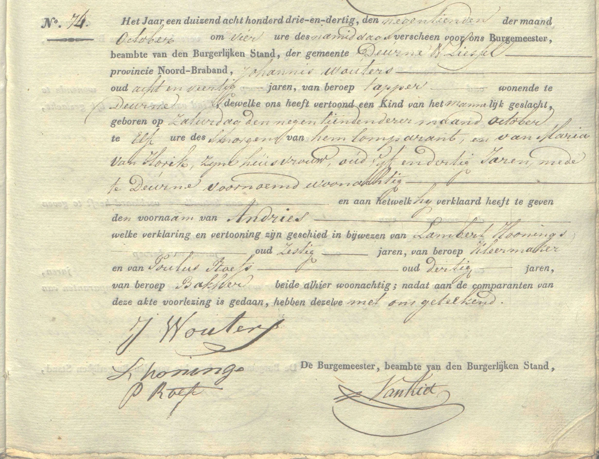
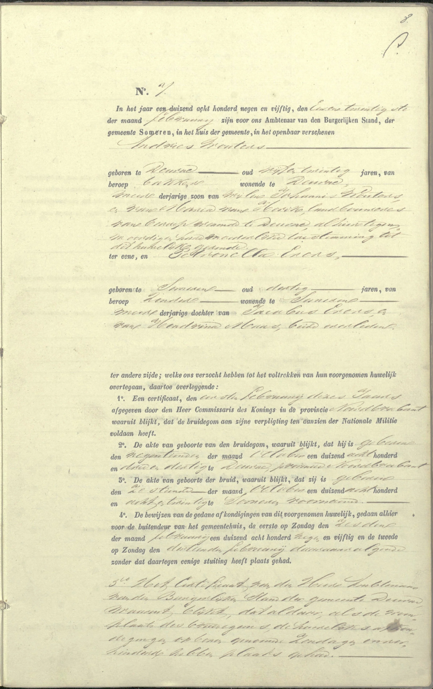
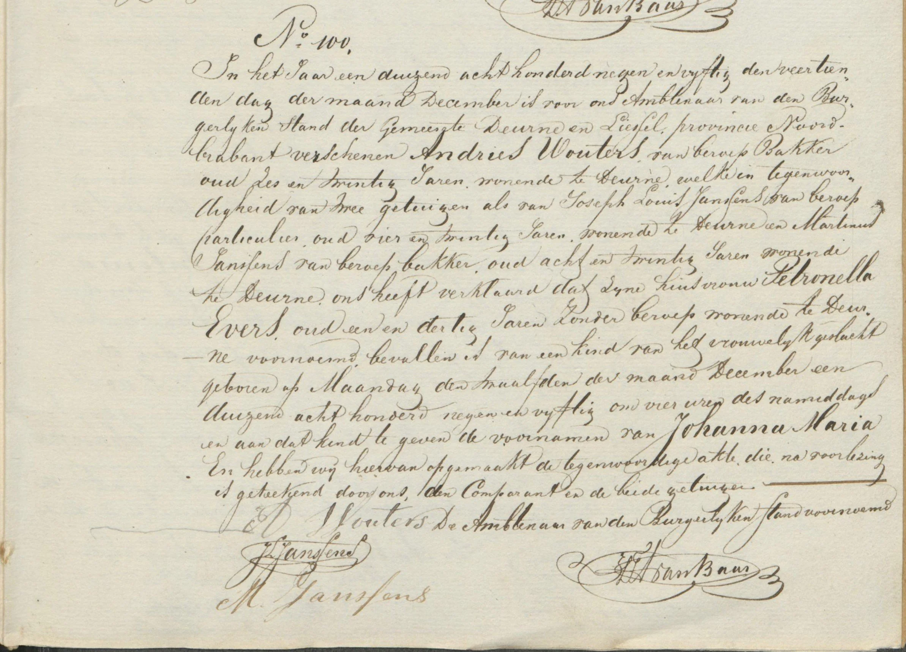
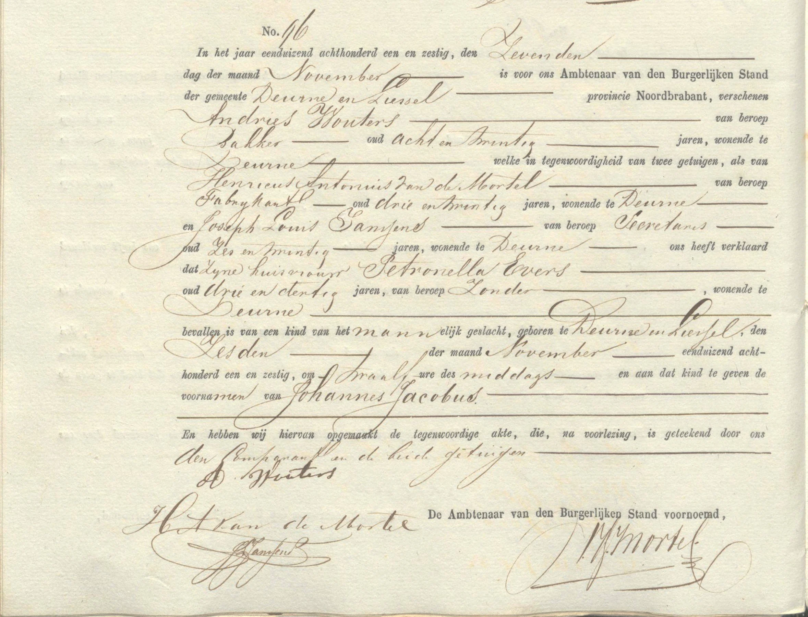
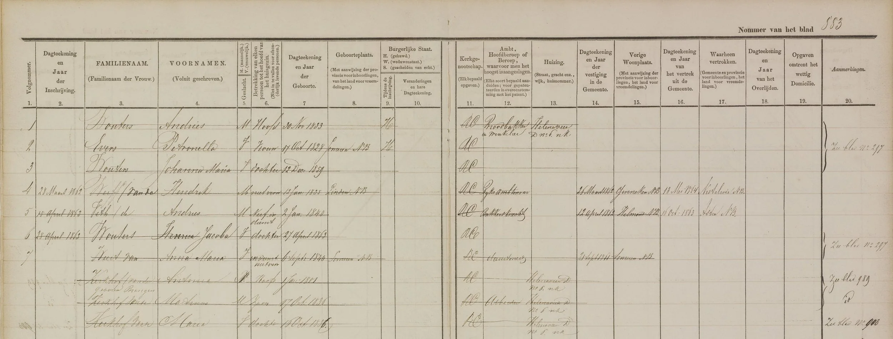

# andries_wouters_docs

> Bron: helenaveenvantoen.nl

### Andries Wouters en Petronella Evers

Geboorteakte Petronella Evers - *16 oktober 1828 te Someren

Geboorteakte Andries Wouters - *19 oktober 1833 te Deurne en Liessel

Huwelijksakte Andries Wouters x Petronella Evers - 21 februari 1859 - Blad 1

Huwelijksakte Andries Wouters x Petronella Evers - 21 februari 1859 - Blad 2

Geboorteakte Johanna Maria Wouters - *12 december 1859 te Deurne en Liessel

Geboorteakte Johannes Jacobus Wouters - *6 november 1861 te Deurne en Liessel

Overlijdensakte Johannes Jacobus Wouters - +10 november 1861 te Deurne en Liessel

Bevolkingsregister Deurne - Inschrijving op nr. D6 nk.
