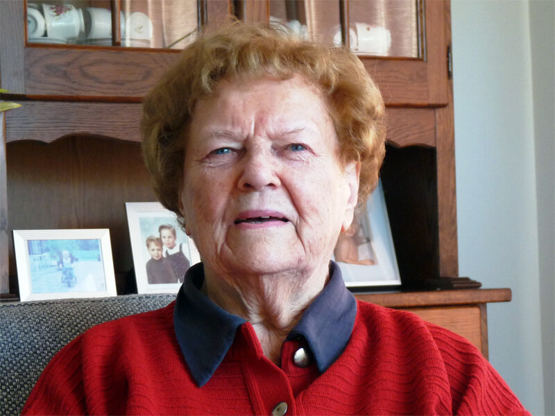

# annie-van-esseveldt-anker

> Bron: helenaveenvantoen.nl

# Annie Van Esseveldt-Anker

## Annie Van Esseveldt-Anker

Annie Van Esseveldt-Anker heeft als kind de oorlog meegemaakt in het gebied dat in Helenaveen 'Boven' genoemd wordt. Annie's vader kwam uit Gouda, haar moeder uit Schoonhoven. Halverwege de jaren twintig kwamen zij als kaasboeren naar Helenaveen. De boerderij die ze betrokken bestaat niet meer; deze stond op het jaagpad dat nu de Kaasweg heet. De familie had rond de twintig koeien voor de kaasproductie.

### De eerste jaren

De eerste jaren van de Tweede Wereldoorlog gingen grotendeels langs de familie heen. Er kwamen vliegtuigen over, nu en dan stortte er één neer en dat was het dan. Annie herinnert zich wel een spannend moment: “We hebben een keer huiszoeking gehad, want ze [de geallieerden] gooiden ook pamfletten, die mocht je ook niet hebben. Bij ons achter in het land daar gooiden ze er een hoop neer en mijn broer en ik gingen die rapen, wie het meeste had.”

De kinderen bewaarden deze pamfletten, maar op een kwade dag kwamen er Duitse soldaten langs voor een huiszoeking: “de evacuees en wij moesten allemaal tegen de muur gaan staan en de soldaat stond ervoor met het geweer en een ander ging met vader het huis doorzoeken naar een radio en pamfletten. Radio hadden we niet en de pamfletten, daar had mijn moeder ’s morgens de kachel mee aangemaakt. Daar hadden we geluk mee.”

### September 1944

Eind september van het jaar 1944 kwam de oorlog ineens vol binnen in de familie van Annie. Eerst werden de koeien weggehaald door de Duitsers. Bij Annie thuis hadden ze evacuees uit Griendtsveen; zij mochten één koe houden voor de melk. Daarna volgde oorlogsgeweld: drie Duitse soldaten die aardappels kwamen halen stonden tegen het raamkozijn een sigaretje te roken. Amerikanen of Engelsen leidden hieruit af dat de boerderij vol Duitsers zat en beschoten het met granaten. De familie vluchtte naar de buren, naar het pand dat nu 'het kaashuisje' genoemd wordt. Dit kaashuisje was volledig onderkelderd; daar zaten ze veilig.

### Razzia en evacuatie

In de ochtend van 8 oktober 1944 vond in Helenaveen de bekende razzia plaats. Alle 'bruikbare mannen' werden door de Duitsers meegenomen, zo ook de vader en twee broers van Annie. Zij werden tewerkgesteld in Duitsland, eerst in een suikerfabriek en later in de hoogovenfabriek in Watenstedt, waar veel Helenaveense mannen het leven gelaten hebben.

Niet lang daarna werden de resterende familieleden geëvacueerd. Annie vertelt daarover: “Ge maakt het mee, maar eigenlijk ook niet zo, ge waart niet zo bang ge wist niet wat er gebeurde. Toen we moesten evacueren […] moesten we drie aan drie lopen, als ze begonnen te schieten was dan niet het hele huishouden weg.” Tussen de rijen zat veiligheidshalve ook nog een afstand van 100 meter.

Ze werden opgepikt door een Amerikaan met een auto en naar de Zeilberg gebracht. Eerst werd de familie Anker ondergebracht in de kleuterschool, maar toen het gevaar van bombardementen te groot werd verhuisden ze naar een familie in Sint Jozef. In het huis waar de familie onderdak kreeg hadden de Amerikanen een kamer gevorderd. Buiten stond een radio-auto die berichten uitzond.

Toen haar broertje difterie kreeg werd hij teruggebracht naar de Zeilberg, waar hij bij de nonnen verzorgd werd. Annie's moeder wilde daar vanuit Sint Jozef per se elke dag heen, al wist ze dat ze niet bij haar zoontje mocht: “Je mocht er toch niet bij, alleen door het raam mocht je even kijken en dan konde weer gaan.”

### Terugkeer

Na de terugkeer naar huis was er van 'het gewone leven weer oppakken' nog lang geen sprake. Annie's vader bleek de tewerkstelling niet overleefd te hebben en de twee broers waren nog niet teruggekeerd uit Duitsland. Het huis van de familie Anker was zozeer beschadigd door de voltreffer dat ze eerst een tijdje bij een oom gewoond hebben. Over de tijd in Duitsland werd door deze mannen niets verteld. Annie: “je moest het van een ander horen, maar niet van ouw eigenste.”
