# ansichtkaarten

> Bron: helenaveenvantoen.nl

### Ansichtkaarten

Een zeldzame ansichtkaart met Pastorie Kerk en klooster. Het klooster nog in de oude staat, voordat er een verdieping werd opgezet.OP de voorgrond pastoor Kerssemakers.

Hôtel, café, logement en stalling Van Oers. Harrie van Oers staat in de deuropening.

De Helenavaart in zuidoostelijke richting, op de achtergrond boortoren en villa (1906).Rechts tussen de bomen zie je de spits van de RK Kerk.De kaart werd verzonden naar O. Gettwert in Graz, Oostenrijk door Heinrich Blatter.

Helenaveen - Vaart

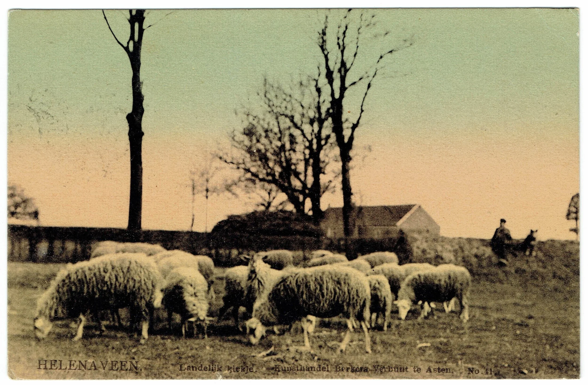

Helenaveen - Landelijk kiekjeWie weet waar deze foto is genomen?

Boortoren vóór de villa. De brug naar de Geldersestraat is nog een pontonbrug (met dank aan Cees Hoogendoorn)

RK Pastorie en Kerk (met dank aan Cees Hoogendoorn)

‘n Prachtige foto: de bocht voorbij de Protestantse Kerk, richting Griendtsveen. Het vlotbruggetje wordt weggeduwd om het zeilschip door te laten.

Links de turfstrooiselfabriek, op de achtergrond de vlotbrug in de huidige Soemeersingel

RK Klooster met links de kapel van de zusters en rechts de kleuterschool (foto). Rechts achter het klooster lag de RK meisjesschool.

De openbare school op de plaats van de huidige Gouden Helm

Groeten uit Helenaveen - Brug met directeurswoning

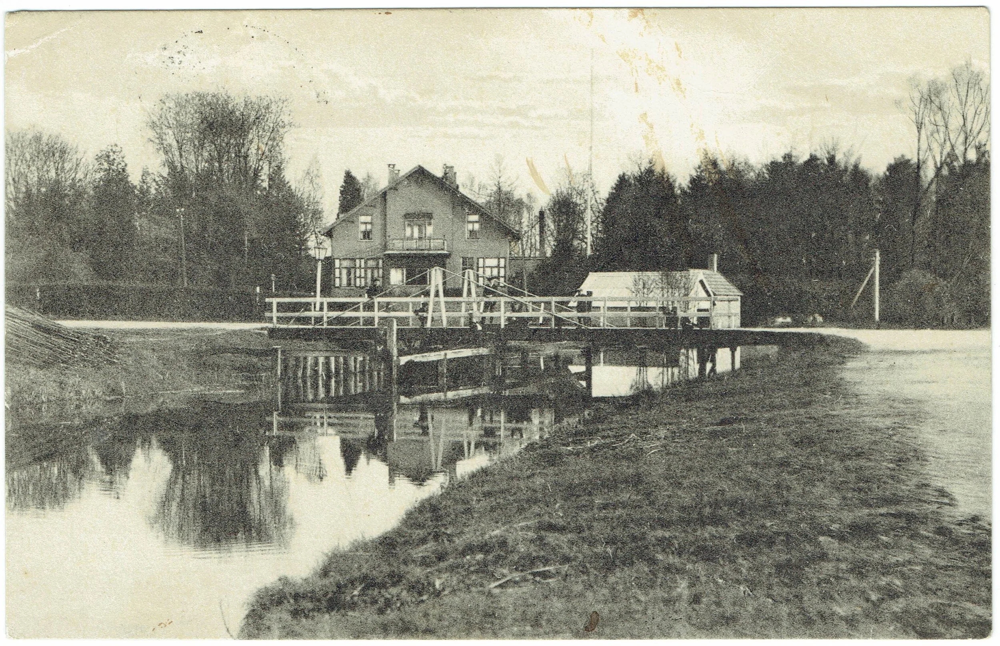

Rechts van de villa “het zwembad van Bos”.

Jeugdherberg ’T Peleke’, HelenaveenAnsicht met drukfoutje in de naam. De foto is van ongeveer 1935.

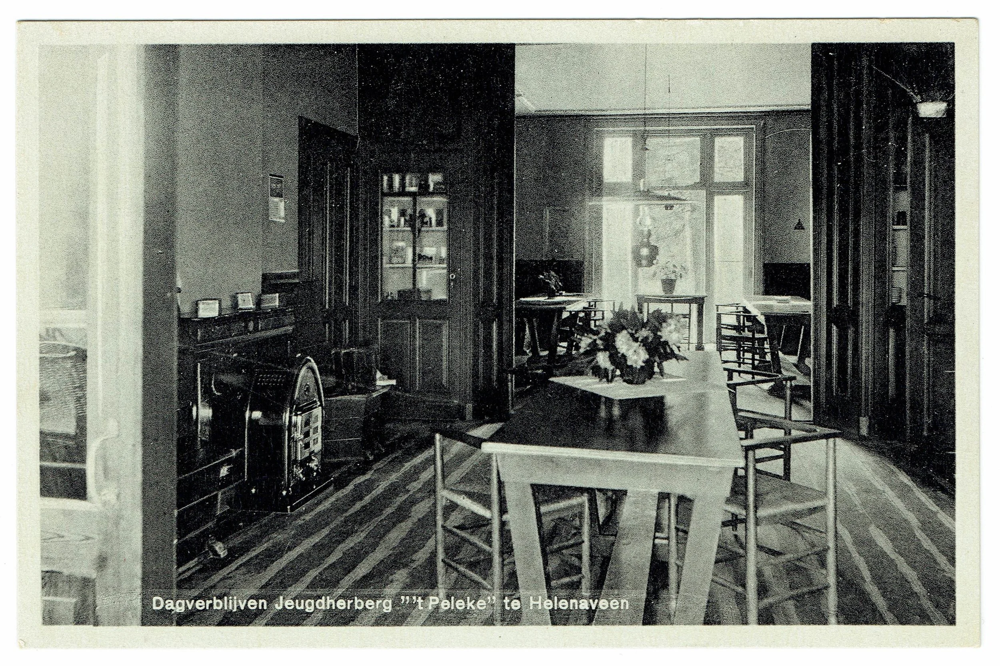

Jeugdherberg - Interieur

Jeugdherberg - Interieur

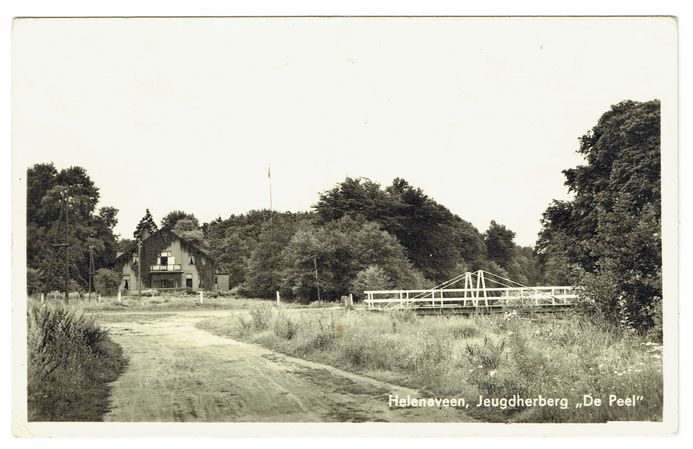

Jeugdherberg met rechts de “Witte Brug”

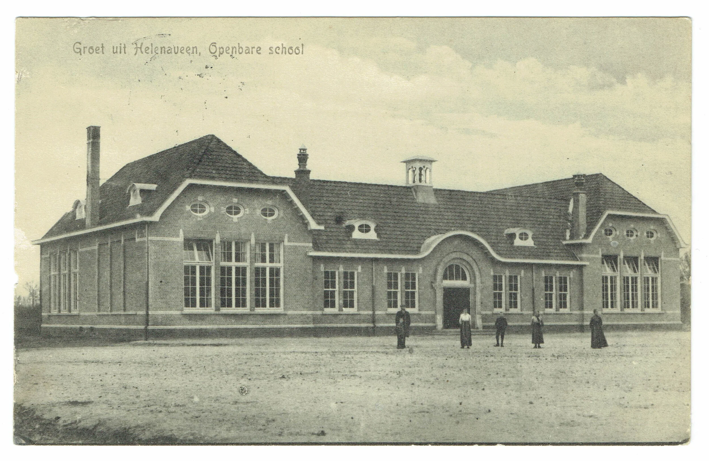

De openbare school (1914), met de originele dakkapellen

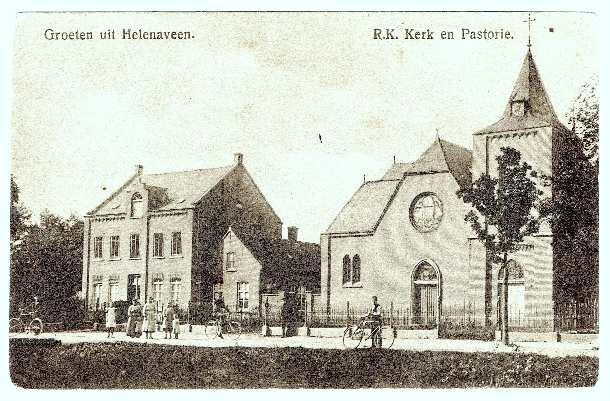

RK Kerk en pastorie

Kerk en klooster (plm 1915)

NH Kerk en pastorie

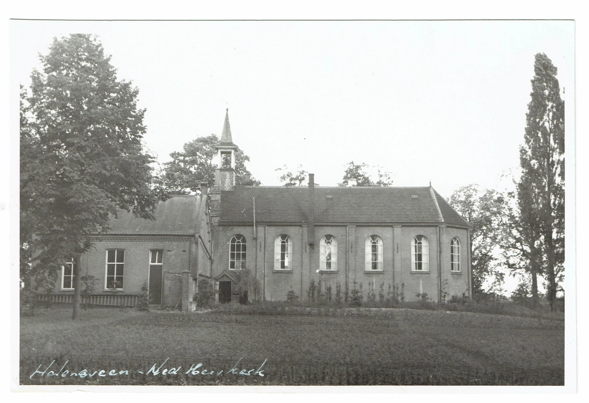

Links zondagsschool, rechts N.H. Kerk.

Schepen bij de Kleine Kom. Rechts op de achtergrond de tuinderij van Spaan en later Veldhuijzen (voormalige Westlandsche Proeftuin).

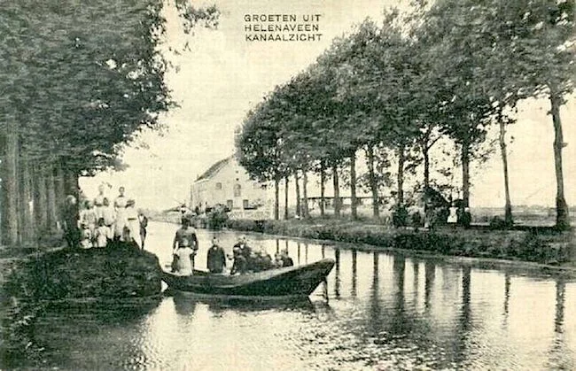

Fabriekswijk

Het bruggetje bij Klerks (vóór de oude kerk). Waarschijnlijk zijn afgebeeld: Jan Klerks (de aannemer) en Albert Klerks (de bakker).

Op de voorgrond: de Kleine Kom. Uiterst links de toenmalige pastorie. Wie poseren voor deze foto?

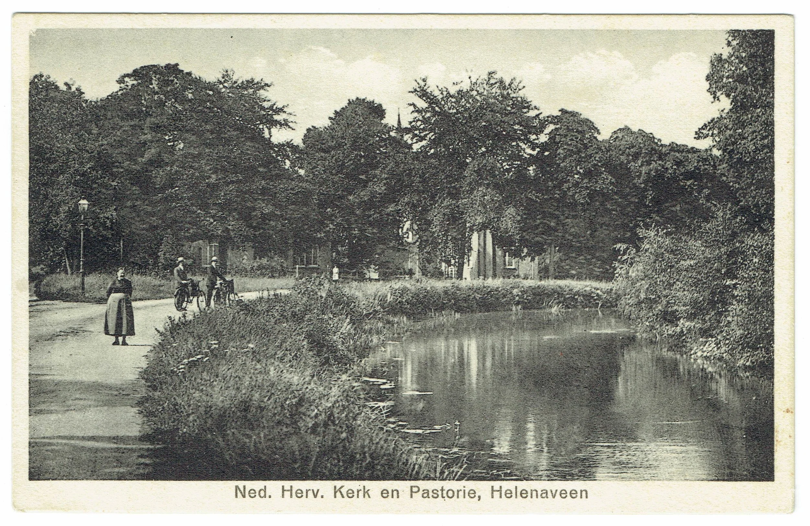

De bomen staan vol in het blad zodat NH Kerk en Pastorie nauwelijks te zien zijn. De bocht in de Helenavaart is natuurlijk prachtig.Links poseert Lena van Esseveldt.

Mobilisatie: de Peel-Raamstelling in 1939. Soldaten staan op wacht voor de huidige Peelparel (links) en de Gouden Helm (rechts).Achter het hek op de achtergrond ligt de huidige brug in de Helenavaart.

De was wordt gedaan op het houten bruggetje aan de huidige Rector Nuijtsstraat. Links het dak van de maatschappij-smederij, later opslagruimte. De turfaken liggen bij de voormalige turfstrooiselfabriek.

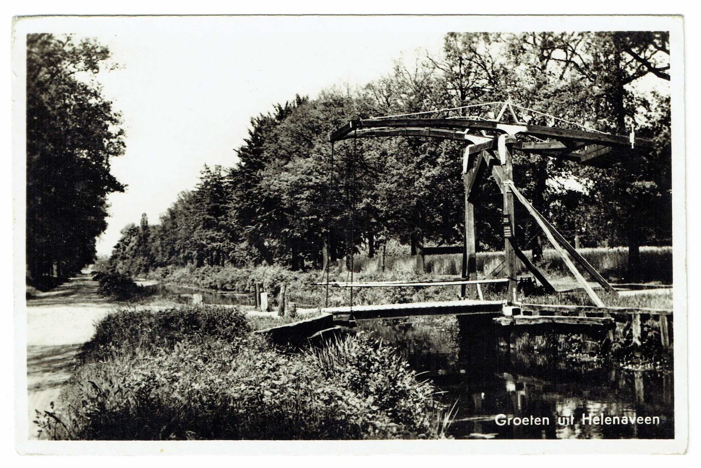

De prachtige houten Koningsbrug in de weg van Helenaveen naar Grashoek. Gebouwd in 1932, door Nederlandse militairen opgeblazen in 1940.

De Wilhelmina-Hoeve uit 1908. Hannes van Mullekom (op de voorgrond) was de eerste pachter.

Helenastraat vanaf de brug naar de Geldersestraat. Rechts het huis van Frans Arts, voorheen melkfabriek en postkantoor. Op de achtergrond staat een van de kazematten van de Peel-Raamstelling.

Karpervijver. Let op het bruggetje.

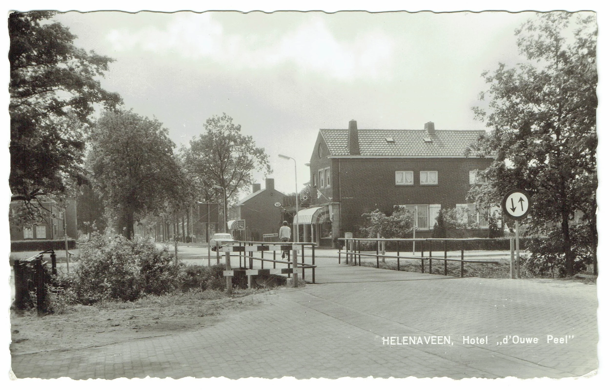

Hotel, Café, Restaurant “In d’Ouwe Peel”. Links is nog net de oude Baileybrug te zien. Op de fiets: mevr. Bets Cox-Wijnands.

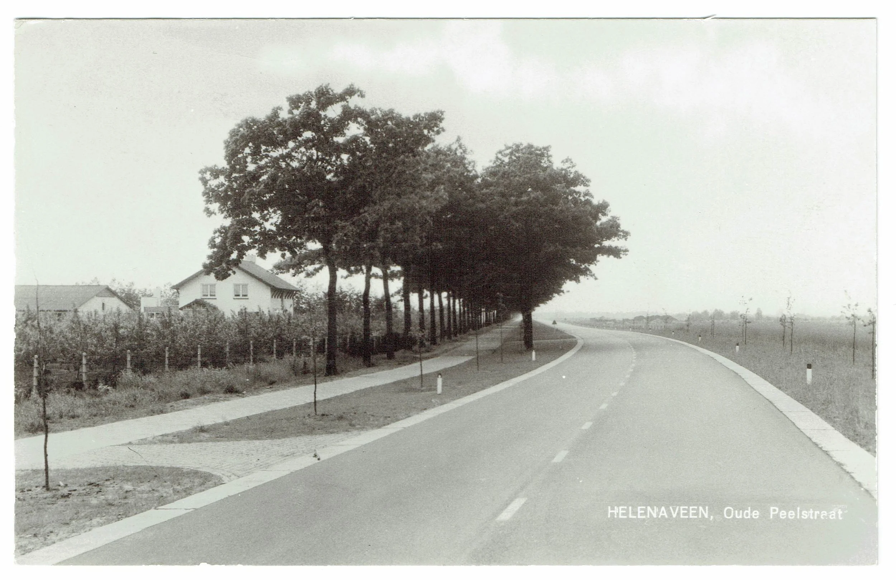

Oude Peelstraat. Links: fruitteeltbedrijf “Erica” van de familie Erkelens.

De Kom, gefotografeerd vanaf de Carpbrug. Rechts woonde destijds Koos de Vries, later Van Esselveldt en Mat Krekels. Links op de achtergrond staat de tuinbouwloods.

Soemeersingel
