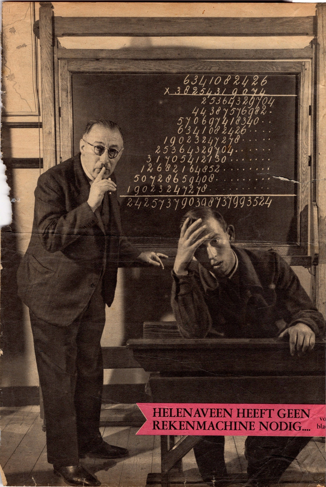
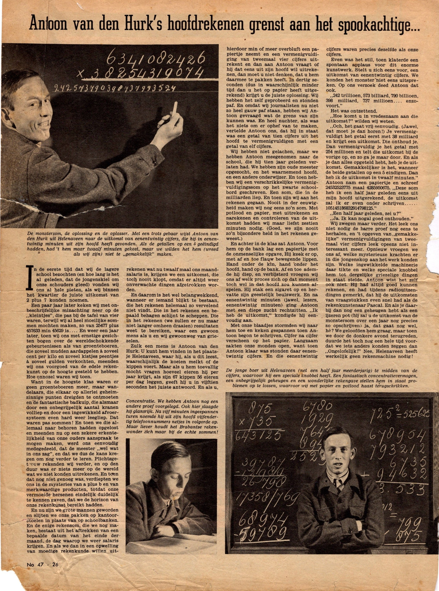

# anton-van-den-hurk

> Bron: helenaveenvantoen.nl

Anton van den Hurk uit Helenaveen was een tijd een beroemde Nederlander. Hij was fenomenaal in het uit het hoofd uitrekenen van grote rekensommen .Dit tijdschriftartikel stamt uit het begin van de 1950-er jaren. De bron is waarschijnlijk De Katholieke Illustratie of Panorama.Het knipsel komt uit de verzameling van Martien Rutten (1932-2022).

Anton met Meester Theelen

