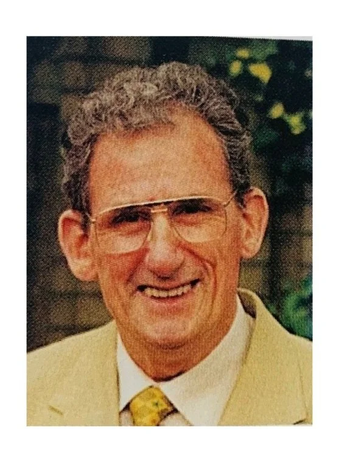
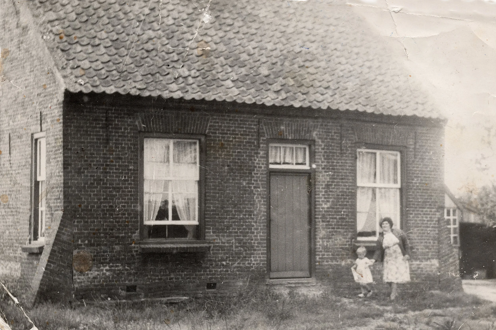
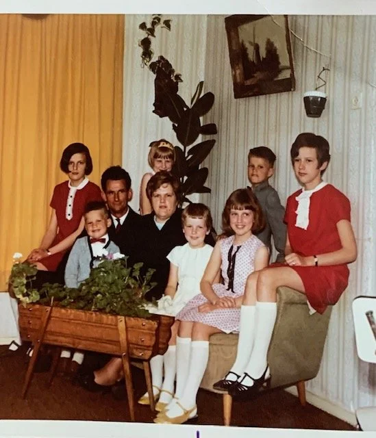
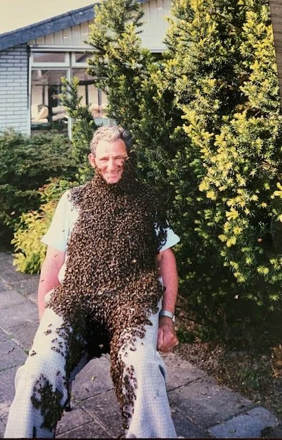
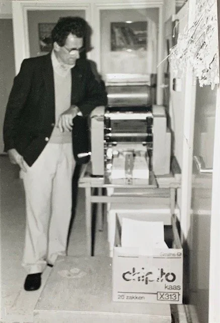

# bertrutten

> Bron: helenaveenvantoen.nl

### Bert Rutten

Lambertus Hendrik (Bert) Rutten. Hij werd geboren op 6 december 1925 en is overleden op 4 augustus 1998; hij was toen 72 jaar oud. Hij is begraven op 8 augustus 1998 in Helenaveen. Hij was getrouwd met Nel Peeters. Zij is geboren op 18 december 1926 in Deurne en is overleden op 11 december 2017 in Asten. Zij was toen 90 jaar oud. Zij is begraven op 16 december 2017 in Helenaveen.

Bert was een kind van Hendrik Rutten ( 1892-1953 ) en Hendrika ( Drika ) van Schijndel ( 1895-1987 ). Zijn voorouders (opa en oma) waren Andries Rutten ( 1872 – 1935 ) en Petronella van Oijen ( 1869 – 1909 ). Zij woonden op Struiken in Maasbree. Hendrik Rutten en Drika van Schijndel trouwden in Sint–Oedenrode op 24 november 1920. Zij hadden elkaar leren kennen in Oirschot. Hij was daar gelegerd op de kazerne. Ze gingen wonen in Helenaveen op H156 aan de huidige Fruitweg 4, in een woning van de Maatschappij Helenaveen. Hij werkte destijds als veenwerker. Daar stichtten ze een gezin. Uit dit huwelijk werden 5 kinderen geboren: Peter Rutten, geboren 07-09-1921, overleden 26-11-1921; Piet Rutten, geboren 14-07-1923, overleden 12-07-1994; Bert Rutten, geboren 06-12-1925, overleden 04-08-1998; Andries Rutten, geboren 29-06-1928, overleden 01-02-1945; Martien Rutten, geboren 06-11-1932, overleden 06-11-2022. Rond 1930 gingen ze wonen op H66 in Helenaveen; hier hadden ze een kleine tuinderij die net voor de Wilhelminahoeve lag. Hendrik is daar gaan tuinen nadat hij werkzaam was als voerman en toger bij de Maatschappij Helenaveen. In de tuinderij teelden zij bonen, augurken en erwten.

Bert groeide daar op, samen met zijn broers, totdat hij net als vele inwoners van Helenaveen in de oorlog werd weggevoerd. De razzia in Helenaveen vond plaats op zondag 8 oktober 1944. Bert en zijn broer Andries werden ook gedeporteerd; zij werden tewerkgesteld in Lager 6 van kamp Watenstedt in Salzgitter, waar zij dwangarbeid verrichtten. Andries overleed in Lager 6 op 01-02-1945; hij is herbegraven op het Nederlands ereveld te Hannover-Seelhorst op 18-12-1953. Van oktober 1944 tot half april 1945 hebben Bert en anderen onder zeer moeilijke omstandigheden gezwoegd tot de bevrijding kwam. Hij was ondervoed en kon niks meer. Later brachten de Amerikaanse bevrijders Bert naar Frankrijk, waar ze in Soissons een kazerne hadden die helemaal was ingericht als ziekenhuis; daar herstelde hij en in de loop van juni 1945 keerde hij terug naar zijn geliefde Helenaveen.

Op 1 juli 1946 werd Bert opgeroepen voor militaire dienst. Zijn diensttijd was in de Ernst Casimir Kazerne in Roermond, eerste compagnie 3-11-RI. Na drie maanden dienst moest hij vertrekken naar Nederlands-Indië. Hij vertrok op 15 oktober 1946, vanaf Rotterdam met de boot Kota Baroe; aankomst Indië Zuid Celebes-Makassar op 17 november 1946.

Bert keerde terug naar Nederland op 17-12-1949 met de boot de Groote Beer en kwam in Nederland aan op 07-01-1950. In 1953 stierf zijn vader. In zijn diensttijd had hij veel vrienden gemaakt, waaronder Chris Peeters uit Meijel. Samen trokken zij veel op en zo leerde Bert de zus van Chris kennen: Nel Peeters geboren op 18-12-1926. Na een aantal jaren trouwden ze op 03-05-1954 in de gemeente Meijel en op 05-05-1954 vond het kerkelijk huwelijk plaats in de H. Nicolaaskerk te Meijel. Ze gingen inwonen bij Bert thuis, op Boven 31 in Helenaveen. Moeder en broer Martien verhuisden snel daarna naar Boven 65 in Helenaveen.

Ze hadden de eerste jaren kippen en een tuinderij. Ze kregen samen 7 kinderen, 5 meisjes en 2 jongens. Jacqueline 09-03-1955, Harriet 26-02-56, Angèle 19-09-1957, Marion 07-10-1958, Erik 26-09-1959, José 27-03-1961 en Luciën 08-09-1963. Ze werden allemaal daar geboren. Het huis was op Boven 31, erg ongeriefelijk, slecht en te klein. Later werd dit huis onbewoonbaar verklaard. Een stille getuige waar deze woning stond is 'het stroomhuiske' van het GEB. Bert en zijn gezin hadden het de eerste jaren niet makkelijk; hun tuinderij was te klein voor een behoorlijke kostwinning. In de tuinbouw werd de kassenteelt steeds belangrijker. Bert hield van zijn werk, maar besloot te gaan werken op de fabriek, "Vlisco" in Helmond. Bert was een echt natuurmens en als hij vrij was ging hij samen met zijn kinderen iedere zondag naar het natuurgebied Mariaveen. Jarenlang kon je Bert en zijn gezin langs wegen inlandse eikels zien rapen; kilo's werden verzameld en je kon ze inleveren bij Staatsbosbeheer. Bert en Nel besloten om een nieuwbouwwoning te gaan bouwen. Ze verhuisden in de zomer van 1965 samen met hun gezin naar de Pastoor Kerssemakersstraat 1 in Helenaveen. Ze noemden hun huis "De Zonnestraal"

De kinderen werden wat groter en veel tuinders wisten dat ze konden aankloppen bij de familie Rutten voor hulp in hun tuinderij. Er werden door de kinderen aardappelen geraapt bij Krekels, aardbeien geplukt bij Wijnen, morellen geplukt bij Van der Zwaan, bessen geplukt bij Verkoelen, gestekt bij Van Well en augurken gesorteerd in de tuinbouwloods tot diep in de nacht.Langzaam ging het wat beter en zo krabbelde het gezin op. De kinderen groeiden op en al snel gingen de oudsten werken. In de jaren ’70 ging Bert werken bij Wegenbouw Heijmans in Rosmalen.

Hij was in zijn vrije tijd imker in hart en nieren. In 1950 kreeg hij zijn eerste volkje (van Hatjes Driek). Bert volgde in 1952 de beginnerscursus bijenhouden, die hij in 1953 vervolgde met de cursus voor gevorderden. Beide cursussen rondde hij met succes af; als beloning daarvoor kreeg hij (van het Rijk) twee bijenkasten met toebehoren. In 1953 kwam hij in het bestuur van de Bijenvereniging Helenaveen. In 1975 kwam de fusie van de bonden Liessel, Neerkant en Helenaveen tot stand en in 1976 kozen de gefuseerde bonden een nieuwe naam: Bijenhoudersvereniging “De Peelzoemers”. Voor zijn verdiensten kreeg hij de gouden draagspeld van de Bond van Bijenhouders opgespeld.

In de jaren 50-60 had hij zijn bijenhal gevestigd achter het klooster van de zusters in Helenaveen. Na enkele jaren verhuisde hij met zijn bijen naar zijn broer Martien Rutten aan de Koolweg 40. Ook had een tijdje verscheidene bijenkasten staan in de Noordoostpolder (Flevoland); hier waren grote velden met koolzaad. Het vroegbloeiende koolzaad zorgde ervoor dat zijn bijen na een lange winter aan de benodigde energie konden komen. Veel tuinders van Helenaveen en omstreken zagen Bert graag komen met zijn bijenkasten. Hij zei altijd "geen bijen, geen augurken". Veel mensen belden hem als ze een bijenzwerm zagen hangen. Hij liet zich graag fotograferen met zijn beroemde bijenbaard. Toen zijn broer Martien naar Panningen vertrok, verhuisde Bert met zijn bijenhal naar de Pastoor Kerssemakersstraat. Zijn tuin was een ware bloemenzee. Hij slingerde honing in zijn schuur en in de verre omtrek wist iedereen dat bij Bert Rutten overheerlijke honing te koop was.

Ook was hij 25 jaar lid van het St. Nicolaascomité Helenaveen. Hiervoor kreeg hij uit handen van Burgemeester A. van Genabeek het fotoboek "Water en Vuur" als waardering voor zijn jarenlange inzet. Nadat hij wat meer tijd had zag je hem vaak fietsen en wandelen door Helenaveen en omgeving.

Jarenlang drukte hij het Weekbericht voor Helenaveen op een kamertje op de Pastoor Kerssemakersstraat. Hij stond jarenlang klaar om tafeltje dekje-maaltijden rond te brengen bij de bejaarden in de omgeving. Ook hield hij van vissen en was vaak te vinden bij de Karpervijver en aan de waterkant bij de Soemeersingel, tegenover Hein van de Wal, en aan de Koolweg bij Jan van Woezik. Veel inwoners van Helenaveen maakten daar een praatje met hem.

Al zijn herinneringen en belevenissen schreef hij dagelijks op in zijn dagboeken, die nog steeds bewaard zijn.

April 2024Jacqueline van Buggenum-Rutten
