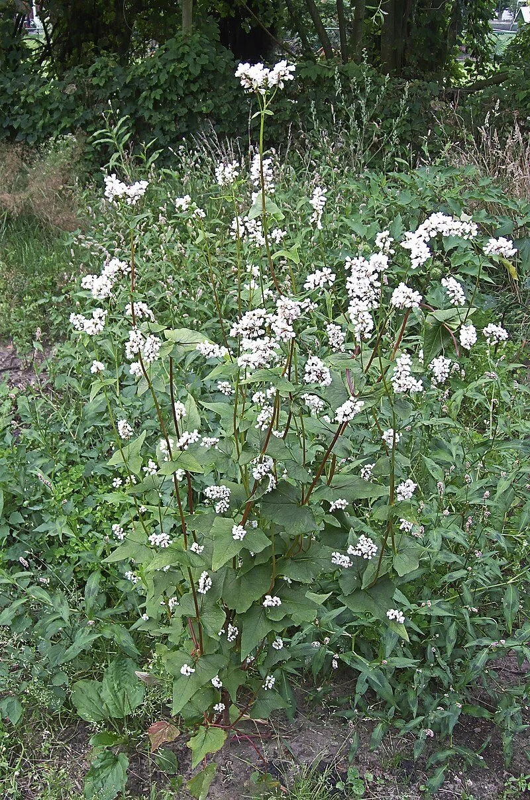
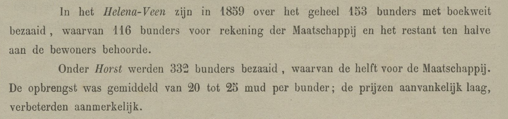
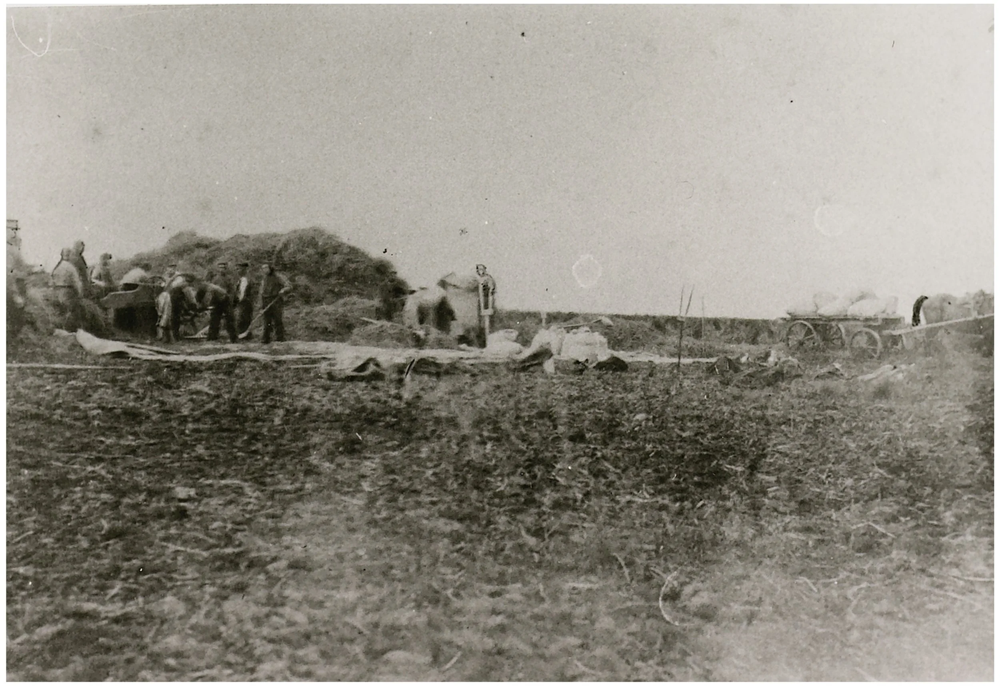
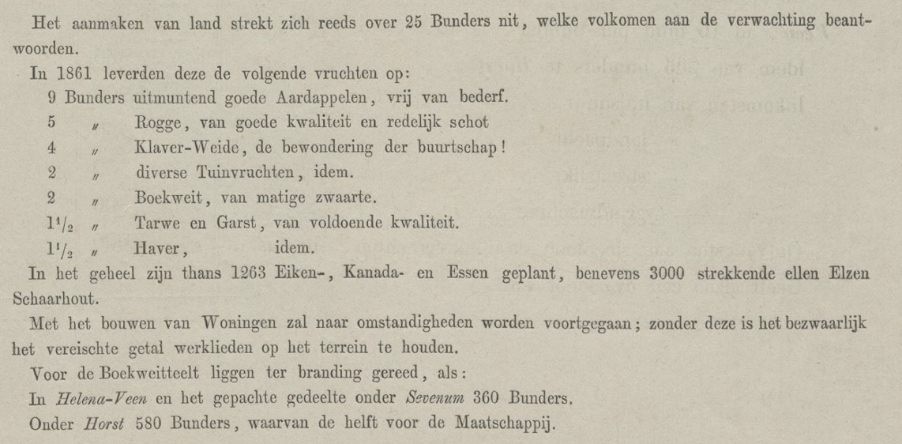

# boekweitteelt

> Bron: helenaveenvantoen.nl

## Boekweit

In de beginjaren van de Maatschappij Helenaveen waren er aanvankelijk nog maar weinig inkomsten. Het aanleggen van het kanaal en het droogmaken van het veen (begreppen) kostte veel arbeid en kapitaal.

Een van de manieren om toch snel geld te genereren was de grootschalige teelt van boekweit. Boekweit was in die tijd nog een belangrijke voedselbron, bijna zelfs volksvoedsel.In de armere delen van Nederland bestond het menu hoofdzakelijk uit rogge en boekweit. Boekweit is geen graan, maar een plant uit de duizendknoopfamilie die geteeld wordt voor zijn zaden, waar boekweitmeel van gemaakt wordt.

Boekweit groeit gemakkelijk op arme zandgrond, maar ook op veen, dat daartoe afgebrand werd. Dit noemde men boekweitbrandcultuur.Voordat men er boekweit kon verbouwen moest het hoogveen worden ontwaterd. Daartoe werden lange greppels gegraven. Nadat het veen voldoende gedroogd was, wat twee tot drie jaar kon duren, werd de bovenste 30 cm met een veenhouw losser gemaakt. Indien nodig werd dit een jaar later nog eens herhaald. Het veen mocht niet te ver indrogen omdat men in de periode van april tot juni de bovenste verdroogde veenlaag in brand stak om tot as te laten vergaan. Hiervoor werden vanuit een ijzeren vuurkorf stukjes gloeiende turf over de kluiten uitgestrooid.

De veenas die overbleef was een goede meststof voor de boekweit die voor eind juni in de nogmaals losgemaakte grond werd gezaaid. De planten bloeiden in augustus en in september kon de oogst van de rijpe zaden plaatshebben. Na maximaal tien jaar raakte het op deze wijze gebruikte veen uitgeput en moesten er nieuwe gronden ontgonnen worden.Dit boekweitbranden gaf zoveel rookontwikkeling dat de Helenaveense veenbranden bij westenwind zelfs tot in Keulen voor klachten zorgden.

Jaarverslag 1859

Oogsten en op het veld dorsen van boekweit in Het Helenaveen.

Boekweit had zijn bestaan te danken aan de omstandigheid dat het op schrale grond nog een redelijke opbrengst gaf, ondanks de nadelen die aan het gewas kleefden. Het was een weersgevoelig en daarmee onzeker gewas. Nachtvorst kon de oogst compleet vernietigen. Verder was de oogst en het bewaren van boekweit bewerkelijker dan van rogge en haver. Het oogsten was moeilijk omdat de zaden ongelijk rijpen. Als het laatste zaad rijp was, viel het eerste al gemakkelijk van de plant. Het maaien en verzamelen moest daarom liefst gebeuren in de heel vroege ochtenduren als het gewas nog bedauwd en vochtig was. Daarom werd de boekweit ook meestal op het veld al gedorst op een groot dorskleed.

Dit is ook te zien op bovenstaande foto van de boekweitteelt in Het Helenaveen, waarop duidelijk het dorskleed zichtbaar is, maar ook een wanmolen om de zaden te reinigen.

GV/JvW maart 2024Bronnen: Archief Mij Helenaveen , Wikipedia
