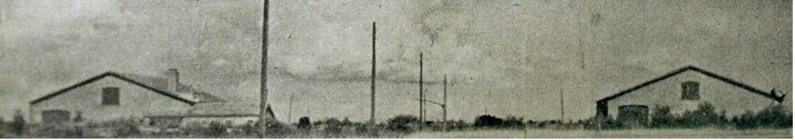
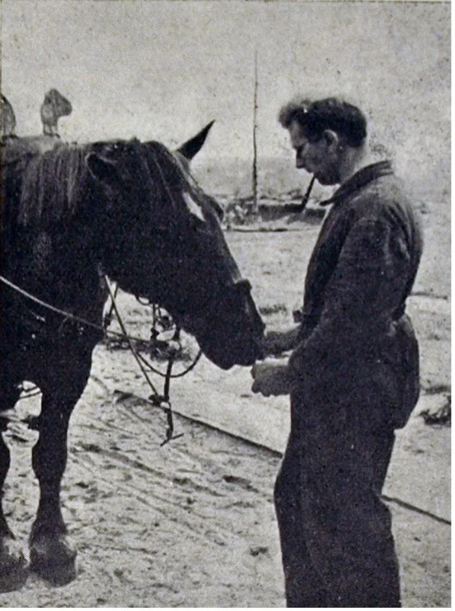

# broeder-leonard

> Bron: helenaveenvantoen.nl

BROEDER LEONARD SLACHTOFFER ‘KERKRAZZIA’

Door Hans van de Laarschot

Someren 20 september 1944 bevrijd, Asten 22 september, Deurne 24 september. De opmars in oostelijke richting van de geallieerden als nevenonderdeel van de op 17 september gestarte operatie Market Garden verliep voorspoedig. De inwoners van het Deurnese Helenaveen moesten echter nog lang op hun bevrijders wachten. Na 24 september trokken de geallieerden om strategische reden niet verder richting oosten. Gevolg was dat het nog niet door hen bereikte Helenaveen bezet bleef. De Duitsers betrokken stellingen achter het Kanaal van Deurne, de Helenavaart en de Noordervaart. Weer lag Helenaveen in de frontlinie. Het was voor de meeste inwoners de eerste echte kennismaking met het oorlogsgeweld sinds de Duitse inval op 10 mei 1940. Op eigen initiatief of op bevel van de Duitse commandant evacueren ze naar het kamp van de paters van het Heilig Hart Jezus in de Mariapeel. Een aantal gaat naar de Grashoek.

Ouders en kinderen uit Helenaveen arriveren met hun nodige huisraad op 28 september 1944 in het kamp van de paters in de Mariapeel. Fotograaf: meester Theelen.

Weten ze daar wel dat het oorlog is?

De paters en broeders hadden eerst onderdak in het parochiehuis van Zeeland in de noordelijke Peel. Begin 1944 moesten ze dat verlaten op last van de Duitsers, omdat die er introkken. Van de Zeelanders kregen ze te horen: “Daar in Helenaveen weten de mensen niet eens, dat er oorlog is. Maar als de vrede wordt gesloten, komen wij ’t jullie wel even vertellen.” Zo eenvoudig ging het niet. Vanaf september 1944 komt de oorlog gruwelijk Helenaveen binnen. Op 23 september betrekken de Duitsers stellingen in Helenaveen. Bij het huis van de dominee plaatsen ze zwaar geschut. Twee dagen later trekken honderden Duitse soldaten langs de Helenavaart naar Griendtsveen. De meesten te voet, anderen op de fiets en een dikzak op de motor. Een tot dan ongezien oorlogsgebeuren. Drie geweldige knallen veroorzaken op 27 september in het kamp een paniekstemming. Moeders duiken met hun kinderen luid gillend onder de tafels. Een geïmproviseerd cabaretprogramma in de eetzaal verdrijft de grootste angst, zodat men durft te gaan slapen.

Toen vanuit het dorp tijdens die nacht geschoten was op de uitkijktoren die bij het huis van veldwachter Joosten stond, liet de Duitse commandant het dorp ontruimen. Veel gezinnen vinden onderdak in het kamp van de paters in de Mariapeel. Op 28 september 1944 trekken ze daar naar toe. Uit de omgeving waren hen al bewoners voorgegaan toen de Duitsers dicht bij hun woningen stelling namen.

Het kamp in Mariaveen.

Huizen grondig doorzocht

Eén evacué vond het nodig om daags na de evacuatie naar het Mariaveen nog even naar het dorp terug te gaan. Op een briefje op de deur van het huis van hoofdmeester Theelen leest hij ‘Dit huis is grondig doorzocht’. De deuren en ruiten zijn bruut ingetrapt en kapot geslagen. Op de vloer liggen kapotte weckflessen, het vloerzeil is kapotgesneden en de schilderijen zijn verscheurd. Alle kippen zijn verdwenen. Zo is het ook in de andere huizen van Helenaveen. Een schrale troost als men weet, dat de commandant eigenlijk alle huizen wilde afbranden. Hij zag hiervan af, omdat ze te ver uit elkaar staan.

Broeder Leonard voert het paard voor vertrek naar de Peel.

Zorgen om broeder Lenonard

Onder de geestelijken bevindt zich broeder Leonard. De broeder is in 1907 in Lisse geboren als Hendrikus Simon van Ruiten. Hij gaat er meteen op uit om te kijken of bij bakker Klerks nog brood ligt voor de honderden evacuees. Door zijn overall en overjas is hij niet herkenbaar als een geestelijke.

De paters zijn blij dat ze de Helenaveners kunnen helpen, maar zelf maken ze zich grote zorgen om broeder Leonard. Die is nog steeds niet teruggekeerd. Vrijdag 29 september krijgen ze het bericht dat de broeder is gegijzeld door de Duitsers; opgesloten met zeven andere mannen in de Grashoek op een boerderij van een NSB-er. Een voorbode van de enkele weken later door de Duitsers uitgevoerde kerkrazzia, die Helenaveen het zwaarst van alle dorpen zal treffen. Pogingen om broeder Leonard vrij te krijgen helpen niet. Pater Leo richt zich met een schriftelijk verzoek tot de bataljonscommandant om over de gijzeling te praten en of hij de broeder mag bezoeken. “Nein”. Van Schelven en Cees Crommentuijn lukt het om door de Duitse linie te glippen en de Britten in het bevrijde deel van Deurne te informeren over de situatie in Helenaveen, het kamp en de gijzeling. De Tommies kunnen echter niets doen om de gijzeling te beëindigen. Van Schelven was destijds de directeur van de Maatschappij Helenaveen, het vervenings- en ontginningsbedrijf waaruit Helenaveen ontstaan was. Hij woonde in Utrecht, maar was naar Helenaveen gekomen om de inwoners bij te staan. Op zondag 1 oktober gaan de twee naar de Duitse commandant. Die weigert hen details over de gijzeling te vertellen. Duidelijk geeft hij hen te verstaan dat de gegijzelden in Grashoek blijven en zelfs, dat één van hen de kogel krijgt als opnieuw sabotage gepleegd wordt.

Zum Burgemeister

De evacuees vertrouwden directeur Van Schelven en zijn dankbaar voor zijn inzet voor hen in het kamp. Omdat de echte burgemeester van Deurne niets voor hen kan betekenen, benoemen ze Van Schelven tot loco-burgemeester. Op een turfhoop kwam een omgekeerde kruiwagen als wegwijzer naar zijn persoonlijke kamer in het kamp met als opschrift Zum Burgemeister.

‘Burgemeester’ Van Schelven in het klasje van het kamp in de Peel.

Stiekem naar de Zwarte Plak voor eten

De Helenaveners zorgen zelf voor een groot deel van hun eten. In tegenstelling tot de Duitsers kennen ze het Peelmoeras goed. Veen, modder en kanaaltjes houden hen niet tegen om ongezien bij de Zwarte Plak te komen. Drie kwartier duurt de sluiptocht naar de oostkant van de Mariapeel. Twee tot drie keer per week gaat het met tassen en zakken daar naartoe om koren, gist, zout, olie, eieren en fruit te halen. Een boer uit Sevenum brengt het daar voor hen. Een oud paard trekt zijn kar, want dat mag gerust gevorderd worden door de Duitsers. Op het kamp bakt een groep van de ingrediënten brood, dat daarna vanuit het klaslokaal onder alle evacuees gedistribueerd wordt.

Evacuees lezen een bekendmaking van ‘burgemeester’ Van Schelven.

Geen broeder onder de gijzelaars

Vrijdag 6 oktober trekt pater Leo naar de Grashoek om te pogen broeder Leonard vrij te krijgen. De commandant kan hij niet spreken, want die is kort ervoor met zijn motor vertrokken. Hij moet het doen met de luitenant. Beleefd staat deze de pater te woord, maar kan niets zelf beslissen en is van mening dat tot de gegijzelden geen geestelijke hoort. Na wat heen en weer getelefoneer, blijkt dat broeder Leonard wel aanwezig is. Zelf had hij de Duitsers niet gemeld dat hij een kloosterbroeder is en door de overall die hij aanhad was hij ook niet als zodanig opgemerkt. Dit brengt echter geen positieve wending. De broeder komt niet vrij en pater Leo mag hem ook niet zien. Wat mag, is hem tijdens de komende dagen een pakje brengen.

Kerkrazzia

Dat pakje zal broeder Leonard niet bereiken. Zondag 8 oktober wordt voor de paters en de Helenaveners de meest tragische dag van de oorlog. In de kapel van het kamp verloopt de Heilige Mis van 6 uur ’s morgens rustig. Druk is het in de mis van 7 uur. Van beide kampen zijn er mensen in de kapel. Plotseling een luid geschreeuw. De Duitsers omsingelen de beide kampen. Alle mannen zonder uitzondering moeten zich apart opstellen. De kapel en alle lokalen stromen leeg – de mensen hevig ontsteld. ”Alle Männer sollen arbeiten! So nicht, so wird geschossen!” Pater Claudius en broeder Gabriël hebben zich ook bij de mannen gevoegd, maar dat willen de Duitsers niet. Ze krijgen te horen: “Wir brauchen Sie nicht. Die Kirche wollen wir nicht zerstӧren.” Van Schelven brengt zijn autoriteit van burgemeester in, maar krijgt geen kans. Ook hij moet mee, net als de jongens ouder dan 16 jaar. Henk Evers is die achtste oktober jarig, hij wordt 16. Wat een aangename dag in familiekring had moeten zijn, wordt een trieste dag steeds verder weg van huis en familie. Duitsland in om te werken voor de Nazi’s. De vrouwen en meisjes van Helenaveen blijven verslagen achter. Ze vragen zich af of ze hun man, vader, opa of vriend nog ooit terug zullen zien. Vele maanden later zal duidelijk worden dat het voor tientallen een tocht naar de dood is geworden.

In de weken erna doorzoeken de Duitsers de omgeving om achtergebleven en ondergedoken mannen alsnog op te pakken en op transport naar Duitsland te zetten. Op zondag 15 oktober zetten ze het kamp in Mariaveen weer af en doorzoeken alle gebouwen. De dag erna horen de bewoners mitrailleurs ratelen in de directe omgeving.

Ook broeder Leonard onderweg naar zijn noodlot

Terug naar 8 oktober 1944. Onderweg vertelden de Duitsers gewiekst dat ze naar Maasbree gingen om loopgraven te graven. Maar in Helden werd hen duidelijk dat dat niet zo was. Daar nam de SS hen over en ging het naar de treinen in Venlo. Voordat de gedeporteerde mannen en jongens aan de treinreis diep Duitsland in begonnen, haalden de Duitsers de ouderen boven 60 jaar eruit. Zij mochten terug naar huis. Toen ze ’s avonds in het kamp terugkeerden vertelden ze dat ook broeder Leonard meegevoerd was. Pas op 7 november horen de paters en Helenaveners iets van de broeder. Zelf zijn ze dan al bijna twee weken geëvacueerd naar Sevenum. Vanwege de aanval die de Duitsers op 27 oktober begonnen, kregen ze het bevel om die dag het kamp in Mariaveen te verlaten. In Sevenum bereikt hen een kort, overgesmokkeld briefje van broeder Leonard. Hij werkt in een suikerfabriek in Watenstedt, een klein plaatsje in de buurt van Braunschweig in Nedersaksen. Hij moet het daar niet al te best hebben, want hij schrijft: “We leven nog, maar weet, dat alles welkom is, als het u mogelijk is.” Een week later gaat een Sevenums meisje naar Duitsland. Ze geven haar een brief én een dikke overjas voor de broeder mee. De hoop blijft leven, dat ze broeder Leonard na de bevrijding in de Peel terug zullen zien. Dat blijkt ijdele hoop. De Helenaveners die de hel van Watenstedt hebben overleefd en pas na de capitulatie van Hitler-Duitsland in mei 1945 terugkeren in hun dorp, brengen de boodschap dat de broeder op 3 februari 1945 van uitputting in elkaar is gezakt en gestorven. Van de suikerfabriek was hij terechtgekomen in de oorlogsindustrie, in een fabriek om dodelijke en vernietigende granaten voor Hitlers Nazileger te maken. Het werk is zo zwaar en de omstandigheden zo slecht, dat broeder Leonard aan dysenterie en hartfalen bezwijkt. Van de 143 gedeporteerde mannen en jongens uit Helenaveen zullen 26 dit lot ondergaan. Helenaveen is het enige Brabantse dorp waar de Duitsers de kerkrazzia uitvoerden. De andere dorpen lagen alle in midden- en noord-Limburg. Zowel qua gedeporteerden als dodelijke slachtoffers zijn de aantallen - en het verdriet - voor Helenaveen het grootste.

‘Laatste’ rustplaats

De eerste rustplaats van broeder Leonard was de begraafplaats Jammertal in Salzgitter-Watenstedt. Op 27 oktober 1953 kwam zijn stoffelijk overschot van Englenstadt terug bij zijn congregatie in Nederland. Een dag later is hij op het kloosterkerkhof in Nuland herbegraven. Dit was echter niet zijn laatste rustplaats. Nu rust hij sinds 29 mei 2008 in het verzamelgraf op het ‘Paterperceel’ op begraafplaats Zuylen in Breda. Broeder Leonard is niet vergeten, zijn naam staat op het oorlogsmonument in Helenaveen.

Bronnen:

- Pater Damiaan. Missietijdschrift voor de Jeugd. Jrg. 35, november 1953 en december 1953.

- www.oorlogsslachtoffers.nl

- www.oorlogsgravenstichting.nl

- www.tracesofwar.com
