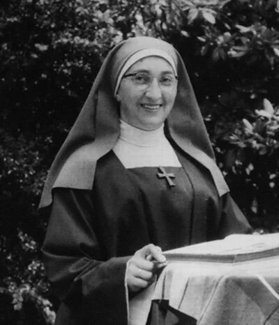

# de-geschiedenis-van-helenaveen-door-zr

> Bron: helenaveenvantoen.nl

Overste Zr. Hendrina

Onderstaande tekst is een verslag, geschreven en bijeengezocht door Zuster Hendrina in Kamp Mariaveen in 1945 en 1946. Hoogstwaarschijnlijk heeft pastoor Timmers dit verslag op 1 januari 1949 uitgetypt.

Bijeengezocht door de Eerwaarde Overste Moeder Hendrina, Kamp, Mariaveen

Opgesteld in 1945 en 1946.

### Bronnen

Onderstaande 3 boeken geleend van het Gemeentehuis:1. Tijdschrift voor economische geografie, 29e jrg. No. 6 van 15 juni 1938.2. Prospectus van de op te richten maatschappij van 1857.3. De vraag: Wat zal er worden van N.Brab.-Limburgse Peel van 1876.

Er zijn drie mannen ondervraagd, die het langst Helenaveen bewoonden en alles persoonlijk meemaakten n.l. : Jantje Derks, oudste inwoner van Helenaveen, van Deurne: Hendrik Oosterveen en Hein Toonen.

Wat de kerk (Kath. en Protestanten) en school betreft: overgenomen uit het archief van het klooster.

### De Peel

De Peel is een hoge grondslag of rug, die van het zuiden naar het noorden langs de grenzen van Noord-Brabant en Limburg, over 2 a 3 uren breedte zich tussen Roermond en Grave uitstrekt. Het hoogste gedeelte van deze Peel ligt onder Deurne -+ 30 ellen boven A.P.

Helenaveen bevat een zeer goed en oud veen, dat zich tussen de bestaande bergkommen, van aloude tijden af, schijnt gevormd te hebben van 3 tot 6 ellen dikte. Diep in de grond zit steenkool. Exploitatie is te duurzaam, om er mee te beginnen. Later zal hier wel een steenkolen mijnstreek worden. De ondergrond van het veen bestaat grotendeels uit fijn zand met leem vermengd, dat voor de cultuur zeer geschikt is, hetgeen blijkt uit de vruchtbare velden, die van gelijke aard, in de nabijheid, in cultuur gebracht en tot hoge prijzen verkocht worden.

Het was een woeste en onbekende streek, omdat ze ongenaakbaar was, maar ze was voor de productie, zeer belangrijk. Helenaveen was de meeste belangrijkste der peelgronden. Dit bleek uit een algemene boring en waterpassing van de vening op last van de regering in 1853.

Kolonisatiegebieden in de Peel kunnen in twee groepen verdelen n.l.,:1. Die welke op afgegraven veen ontstaan zijn en2. Die welke op ontgonnen heide tot stand zijn gekomen.

De groot-ontginningen Helenaveen behoort tot de beste groep, zij is de oudste ontginning van betekenis, vandaar de naam “Oude Peel” en kon daarom andere ontginningen tot voorbeeld dienen, zoals de dalgrondcultuur van Griendtsveen en de opkomende Gemeentelijke ontginningen te Deurne.

### 1853 - Ontstaan

In 1853 kochten de gebroeders Jan en Nicolaas van de Griendt, de pioniers der vervening en ontginning, in de Peel 610 Ha. Hoogveen van de Gemeente Deurne.

1. Jan van de Griendt, opzichter van de Waterstaat en brander, wonende te s’Hertogenbosch.2. Nicolaas van de Griendt, steenbakker, later koopman, wonende te s’Hertogenbosch.3. (George Carp, wonende te Breda).

Waarom verkocht de Gemeente Deurne deze grond?.

1. Helenaveen was veraf gelegen2. Helenaveen was erg drassig.3. Deurne had geldgebrek.

Deurne verkocht dit stuk grond aan de Gebr.v.d.Griendt op voorwaarden:

1. De afwatering van het veen mocht geen schade toebrengen aan de gronden onder Deurne, Liessel en Asten.2. De Gebr. V.d. Griendt moesten minstens 30 Deurnesche menschen in dienst hebben. (Vrees voor duurzame vestiging van vreemdelingen).3. De heren v.d. Griendt beloofden, dat Deurne nimmer enige last van Helenaveen zou hebben en dat de Maatschappij in alle behoeften van het gehucht zou voorzien.

(De laatste jaren wordt in Helenaveen veel geklaagd over slecht drinkwater en zeer slechte weg. “Eigen weg” van de Maatschappij).Deurne beroept zich steeds op dit punt en zal de weg verbeteren indien het de bomen, er langs, krijgt.

Hoofddoel: Vervening van het terrein.

Eerst een kanaal graven:1e. Om de streek te ontwateren.2e. Voor het vervoer van de turf.

Noordervaart wordt uitgangspunt.Het nieuwe gegraven kanaal wordt genoemd: Helenavaart, naar de vrouw van Jan v.d. Griendt, Helena Panis. Helenaveen heet ook naar haar. Eind 1853 is de Helenavaart al bijna voltooid. Twee jaar daarna is de vervening in volle gang. Het onpeilbaar diepe soemeer viel droog: Het hoofdkanaal werd elk jaar verlengd en zijkanalen-wijken (Wieken) gegraven volgens een nieuw drietand systeem.

1e. dan weinig bruggen nodig (voor) langs hoofdkanaal.2e. ruimte over voor woningen langs hoofdkanaal. Wordt streekdorp. (geen komdorp)

Huizenbouw:

Voor de directie en ambtenaren werden stenen huizen gebouwd.Voor de arbeiders: rieten woningen, die met leem en kalk bestreken waren en die slechts een raam en een deur hadden. Later werden stenen huizen gezet, maar goedkope.

Geneesheer:De ondernemers lieten 2 keer per week een geneesheer op het terrein komen. Later vrije geneeskundige hulp, maar daarvoor werd 2% van het loon afgetrokken.

### 1858 MAATSCHAPPIJ

1858. Maatschappij opgericht, omdat het bedrijf veel kapitaal nodig had. n.l. een miljoen gulden. 2000 aandelen a ƒ 500,= = ƒ 1.000.000=. De aangekochte veenderijen bedroegen voortaan 900 bunders (Ha) eigendom. In 1858 hadden ze 300Ha veengrond bijgekocht van de Gemeente Horst (Griendtsveen). Griendtsveen is pas later ontgonnen.

Naamloze Vennootschap.

Comparanten:Jan van de Griendt, te s’Hertogenbosch.Nicolaas van de Griendt, te s’Hertogenbosch.George Carp te Breda.

Het bestuur bestond uit:1. een directeur, die tevens lid en voorzitter is.2. vier gewone leden.3. Vier commissarissen.Ieder lid moet 4 aandelen bezitten op zijn naam.

Deze aandelen blijven in de kas der Maatschappij als onderpand voor het beheer der bestuurders. De Directeur moet 20 aandelen in eigendom hebben, waarvan bewaring in de kas van de Maatschappij. Salaris minstens ƒ 2000,=.

Commissarissen: Toezicht over de administratie, moet minstens 2 aandelen bezitten.

DIRECTIE.-1. Jan van de Griendt: eerste directeur. Gerardus, diens oudste zoon, plaatsvervanger.2. G. Bosch.3. Dekkers.4. J.C. v. Bloemgeurij.5. A. Bosch.6. C.J. Lambrechtsen.7. F.K. Ozinga.8. Ir. B.D. van Schelven.

### GEESTELIJKE VERZORGING

De menschen, hier werkzaam, werden vanaf 1853 verzorgd door Meijel, doch dit liet de bediening varen, omdat de menschen op zon –en –feestdagen zo slecht naar de kerk kwamen. (ruim een uur afstand)

In 1858 nam men zijn toevlucht tot een zekere Pater Durman een door en door ijverige Minderbroeder, die als Rector fungeerde in een soort van kluis, genaamd “Koningslust”; op 1,5 uur afstand van Helenaveen, onder de gemeente Helden gelegen.In 1857 kwam een stenen huis vrij, door het vertrek van een onderbaas. Dit huis, waaraan een ruim achterhuis gebouwd was, bestemd voor stalling, werd opengehouden en gereed gemaakt om als Pastorie met hulpkerk te kunnen dienen. Dit huis heeft later Adr. v.d. Werf bewoond. Het is afgebrand bij het uitbreken van de oorlog op 10 mei 1940. Weer werd op die plaats een nieuw huis opgetrokken voor Adr. v.d. Werf (Vader van Jan v.d. Werf jr.).

Johannes Dekkers (Vader van de Eerw. Moeder Ferdinando z.g.) in Helenaveen als Zaakgelastigde v.d. Maatschappij aangesteld, was gehuwd met Gerardina v.d. Heuvel uit Veghel in 1857. Deze vrouw had tot broeder de Weleerwaarde Heer Gijbertus van den Heuvel, Directeur van het Groot Seminarie te Haren, waarbij het Bisschoppelijk paleis, Huize Gerra, lag en Mgr. Zwijssen woonde. Genoemd echtpaar en Mhr. V.d. Heuvel kregen van Mgr. Zwijssen voor Helenaveen een permanent geestelijke. In 1857 werd tot Rector van Helenaveen benoemd: de Weleerw. Heer Martinus Nuijts. De Eerste H. Mis had plaats: half October 1857, in het achterhuis van de pastorie- toen noodkerk-. Rector Nuijts overleed reeds in 1859. Voor de protestantse inwoners (15 a 20) liet de Maatschappij toe, dat de Domine van Deurne nu en dan in Helenaveen kwam, nagenoeg iedere zondag. Deze gaf onderrichting in een kamer bij de heer Dekkers. In 1850 werd dit onderricht gegeven in de school.

In 1859 kreeg Helenaveen zijn eerste onderwijzer: Clemens de Haere. Deze is in 1881 ontslagen, zonder pensioen, naar verdienste.

1859 – 1881 Clemens de Haere onderwijzer.1881 – 1922 J.v.d. Kerkhof (naar Amerika)1922 tot heden: L. Theelen, Hoofd der school.

In 1863 kregen de protestanten (23 in getal) een eigen predikant. In 1868 nieuwe protestanten kerk en een schoon nieuw huis voor de dominee. Toen waren er hier 30 Protestanten. Deze kerk is groot genoeg voor 600 a 700 menschen. De Maatschappij gaf niets dan het terrein. De kerk is gebouwd van collecten, loterij en bijdragen van de protestanten. De Protestanten werden voor de Katholieken gesteld. De heer Schillings verklaarde in 1883, dat dit geschied was, terwille van hun afnemers, steenbakkers, meestal protestanten. Dit hield op toen fabrieksturf bijzaak werd en turfstrooisel hoofdzaak. De protestanten behoefden toen niet meer ontzien te worden.

Herders der Katholieke Parochie.

1. Josephus Nuijts, 1857 – 1859. Rector, geb. Te Bergeijk 2 jaar2. Theodorus v.d. Einden, 1859 – 1873. Rector, geb. Te Gemert. 13 jaar3. Franciscus v.d. Heijden, 1873 – 1878. Rector, geb. Te Waalwijk. 5 jaar4. Petrus van Beek, 1878 – 1880. Rector, geb. Ten Zevenbergse Hoek 2 jaar.5. Wilhelmus Bijnen, 1880 – 1896. Rector, geb. Te Helmond, 16 jaar. 6. Walterus Kersemakers, 1896 – 1916. Pastoor, geb. Te Gestel, 20 jaar.7. Augustinus v. Haaren, 1916 – 1946. Pastoor, geb. Te Hooge Mierde, 30 jaar.8. Petrus Strijbosch, 1946 – 1948. Pastoor, 2 jaar. 9. Timmers, 1948 – Pastoor

### Middelen van bestaan

De veenderij kon, om technische redenen, slechts in het voorjaar uitgeoefend worden. Daarom was het noodzakelijk gedurende de overige tijd van het jaar, andere bronnen van inkomsten te scheppen voor de turfstekers. Daarom heeft hier van het begin af, ontginning plaats gehad naast vervening. De ontginning was dus een noodzakelijk kwaad, n.l. om een vaste kern van arbeiders te behouden. De Directeur van Helenaveen heeft eens een plan gehad, een suikerfabriek op te richten in Helenaveen, omdat de werkzaamheden daarin, vallen van October-Maart.

Nu werd er ontgonnen van October tot Maart.

1. Vervening was hoofdzaak.2. Ontginning bijzaak.3. De turfboten, die altijd van het noorden leeg terug kwamen brachten mee uit s’Hertogenbosch straatvuil e.d. als retourvracht. Dit straatvuil werd op het afgegraven veen gebracht en dan ontgonnen. Compost noemt men het straatslijk.4. Boekweit was het eerste product dat hier geteeld werd. Methode veenbrandcultuur. Als het veen omgehakt en gedroogd was, werd het in brand gestoken. De as hiervan was mest voor de boekweit.

1866. Hoogtepunt van de boekweitteelt. 730 Ha bezaaid met boekweit. In de omliggende gemeenten werd dit voorbeeld van Helenaveen gevolgd op zeer ruime schaal. Na 1870 begint de boekweitteelt te verminderen, omdat de gronden van de Maatschappij uitgeput raken. Na 1870 komt een ander middel van bestaan naar voren n.l. de tabaksteelt. De Maatschappij liet in Gelderland tabaksplanters werven, die deze cultuur hier kwamen uitoefenen, vandaar de naam: Gelderse straat. Op het kerkhof kan men zien dat velen geboortig waren uit Gelderland. De opbrengst en de kwaliteit van de tabak waren goed. Toch begon de tabaksteelt na 1870 te verminderen en te verdwijnen, omdat de buitenlandse en Indische tabak ingevoerd werd, die beter was.

5. Nu begon de Maatschappij met Landbouw, de enige mogelijkheid van werkverschaffing. De opbrengsten per Ha. Bleken aanmerkelijk hoger te zijn, dan die in overig Noord-Brabant. Tarwe, rogge, klaver en vlas. In 1882 waren 170 Ha. Ontgonnen. Tot 1906 stond toen echter de ontginning nagenoeg stil vanwege de opkomende-

6. FABRICAGE VAN TURFSTROOISEL

Twee fabrieken werden in Helenaveen opgericht, die tot de eersten van ons land behoorden. Deze industrie was van grote betekenis, dat blijkt uit de stijgende bevolking van 1882-1900. 1882: 502 inwoners, 1901 : 950 inwoners. Voor de ontginning was dit ongunstig. De bonksellaag werd vroeger op de dalgrond gebracht en was nuttig voor turfstrooisel, zelfs werd de bonksel uit reeds ontgonnen gronden weer uitgegraven. Nadat de beschikbare grondstof voor turfstrooisel verbruikt was, kwam een nieuw middel van bestaan naar voren, dat op het ogenblik het voornaamste is.

7. DE TUINBOUW

In 1887 was in het Westland het eerste kleine proeftuintje. De Maatschappij gaf aan haar arbeiders stukjes land in pacht ter verbouwing van aardappelen en groente voor eigen consumptie. In 1904 werd 101 Ha. Verpacht. Hiervan waren er al 36 Ha. Verbouwd voor tuinbouwgewassen voor de handel. 8 Ha. Was weiland. Overige was: Aardappelen, klaver, rogge en erwten. Toen in 1912 de laatste gestaakt was, stond nog de helft der gezinnen in dienst van de Maatschappij. Door de concurrentie van steenkolen en briketten, was de turfgraverij niet langer rendabel. Daarna wordt langzamerhand tuinbouw meer algemeen. In de oorlog weer turfhandel. Bevolking is talrijk. Kapitaalkracht is gering, omdat de actiefste zich als zelfstandig veeboer ging vestigen in Grashoek. De Maatschappij vraagt hoge pachten voor de bedrijven. Na 1900 wordt er met medewerking van de Maatschappij in Venlo een veiling opgericht. De producten konden per spoor daar naar toe. In Griendtsveen stopte vroeger de trein. Dat station heet nog station Helenaveen, omdat het station ligt op Helenaveense grond. De bodem van Helenaveen bleek zeer geschikt voor tuinbouw, vooral die delen, die met bonkaarde en compost bewerkt waren.

8. In 1910 ongeveer werden de landbouwbedrijven omgezet in veeboerderijen. Er kwam een kleine cooperatieve zuivelfabriek, die echter weer verdween. Ze was te duurwerkend omdat ze zo klein was.

9. In 1928 ongeveer werd op de boerderijen ingevoerd de kaasmakerij. Daarom werden deze boerderijen verpacht aan Zuid-Hollandse en Utrechtsche kaasboeren. Vandaar familie’s afkomstig uit Holland. De Maatschappij stond op het punt om failliet te gaan, daarom werd de kaasmakerij geprobeerd. Gedurende de winter werd door de meesten ’n koe gehouden, in de lente weer verkocht.

10. Pluimveehouderij is vanaf ca. 1910 als nevenbedrijf uitgeoefend, voor velen is het de voornaamste bron van inkomsten. Meestal bedoeld als winterverdienste. 1910: 2400 kippen, 1926: 6000 kippen, 1934: 10.000 kippen. In 1932 werden ruim 1,5 miljoen eieren verzonden met opbrengst ƒ46.000,=.

Bijna alle inwoners van Helenaveen zijn pachters van de Maatschappij, die geen grond willen verkopen. Gemiddelde pachtprijs voor boeren en kaasboeren ƒ 48,50 per Ha., bedrijfsgrootte: gem. 24 Ha.

De grond op het Zinkske is nog eigendom van de Gemeente Deurne. Sommigen hebben daar een stuk grond kunnen kopen van de Gemeente tegen ƒ 200,= per Ha., terwijl de jaarlijkse pacht in Helenaveen ƒ 100,= was per Ha. Zo zijn na 1924 zeven gezinshoofden komen wonen met eigen grond en eigen huis. Het kerkbestuur heeft ook een stuk grond gekocht voor kerkhof, daarom ligt het kerkhof zo ver van de kerk, vroeger was het kerkhof, waar de zustertuin is. De lijken zijn toen opgegraven daar, en de zustertuin werd ermee vergroot.

Vervening bloeit weer op in de oorlog, daarom toeneming van de bevolking. In 1917 1000 inwoners op 3 Ha. In 1910 werd weer 600 Ha. Gekocht van Deurne. Deze werden nu afgegraven. In 1918 wee 620 Ha. Gekocht van Sevenum op voorwaarde, dat de Maatschappij een kanaal zou graven naar Sevenum. Intussen is er een weg- in plaats van een kanaal aangelegd, als werkverschaffing.

ONENIGHEID MET DE GEMEENTE DEURNE

Toen de Gemeente Deurne zag, dat de vervening zoveel opbracht in Helenaveen, ging zij zelf ook de overige Peel afgraven. Moest daarvoor een kanaal hebben langs door de Peel. Vroeg aan de Directeur gebruik te mogen maken van de Helenavaart. Als men naar Meijel wandelt kan men die twee kanalen vlak langs elkaar zien liggen. Vroeger heeft de Directeur van de Mij. Getracht afscheiding van Deurne te bewerken. Heeft ook aangevraagd Liessel, Neerkant, Heitrak en Helenaveen. Geweigerd. Op het ogenblik.

Grootste groep is tuinders. 7 Boerengezinnen, 5 Kaasboeren, enkele veenarbeiders in dienst van de Mij. 14 Ha. Is eigen land op het Zinkske, 298 Ha. Verpacht land, 117 Ha. Grasland niet verpacht, vee ingeschaard. 5 Ha. Bouwland niet verpacht van de Mij. Van de verpachte grond: 160 Ha. Grasland, 70 Ha. Tuinbouw, 65 Ha. Bouwland.

### PRODUCTEN VAN DE TUINBOUW

Aardbeien, sla, spek en stambonen, augurken, tuinbonen, selderij, wortelen, erwten. Als de tuinbouwproducten naar Duitsland vervoerd worden, dan verdienen de tuinders zeer goed, maar als de grens gesloten is, dan zijn het arme jaren.

### “Koningfonds”

Dit fonds groot ƒ 31.000,= was een poging van Z.M. Koning Willem III om in de 80-er jaren, toen de ontginning geheel op de achtergrons geraakte, ten gevolge van de turfstrooiselfabricage, de landbouw en de veeteelt nieuw leven in te blazen en de welvaart der bewoners te verhogen.

De Directeur maakte de instelling van dit “Fonds Willem III ” in 1888 aan de bevolking bekend en beloofde, dat hierdoor eigen grond zou verkregen wordenen de economische positie der inwoners veel verbeterd zou worden. Enkele woningen werden daarvan gebouwd, die daarom de naam dragen van Willem III of van de leden van de Koninklijke familie.

Tegenwoordig worden uit dat fonds renteloze voorschotten gegeven aan ee 25 tal van de armste gezinnen voor het aanschaffen van een koe, kunstmest enz.

Koningin Moeder Emma was de beschermvrouw van de Peel. Ook het organiseren van cursussen is de taak van dit fonds en ontvangt hiervoor steun. Bij het oprichten van de wijkverpleging en het bouwen en inrichten van een kliniek daarvoor heeft de Directeur van Schelven daaruit gesteund, in Jan. 1944.

### Kerk en school en klooster

1857. 15 October werd de eerste H.Mis opgedragen door de Zeereerw. Heer J.M. Nuijts, op de plaats waar thans de Wed. v.d. Werf woont H.137. In het voorhuis woonde de Rector, het achterhuis was ingericht tot kerk.1882. 2 Juli werd een nieuwe kerk met pastorie gebouwd.1891. 1 Maart werd Helenaveen een zelfstandige parochie.1944. November werd door de terugtrekkende Duitsche troepen, kerk, pastorie, klooster en meisjesschool in brand gestoken en verwoest.

In 1884 had de Zeereerwaarde Heer W.C.A. Bijnen een klooster en school gebouwd. 3 November werd met de school begonnen. 1896, een nieuwe bewaarschool werd gebouwd, die in 1897 werd betrokken. In de loop van 1907 werden nieuwe schoollokalen gebouwd, die door het oorlogsgeweld van 1944 zijn verwoest. Maart 1945 kwamen de zusters weer in Helenaveen terug, nadat ze ruim een half jaar in het moederhuis te Veghel waren geëvacueerd geweest. Met heel veel moed en zo graag gingen de pioniersters weer terug naar de Peel.

Einde Maart 1945 ontving het kerkbestuur bericht van het moederhuis dat op 1 April 1946 de zusters uit Helenaveen zouden moeten vertrekken. Requesten werden ingediend, weigering als antwoord. Bisschop, Burgemeester, Dokter, ieder werd gevraagd om hulp. Pater Directeur van de Eerw. Paters Damianen, deze Paters der H.Harten uit St. Oedenrode, hadden vanaf einde 1944 de zielzorg waargenomen, zij waren met hun studenten geëvacueerd in het middelste kamp van Mariaveen, Hannes Joosten, Gerard Maessen, zijn nog persoonlijk naar Veghel gaan pleiten bij het hoofdbestuur. Daarna heeft Kees Crommentuijn nog eens geschreven over de toekomstige uitbreiding van Helenaveen. Eindelijk op 25 Juli kwam de tijding dat Helenaveen de zusters mocht behouden.

Op 1 Juli 1946 zou de wijkverpleegster worden teruggeroepen: aangezien alle zusters wijkverpleegsters zouden worden vervangen door leken. Aangezien Helenaveen 16 km. Van de dichtsbijzijnde dokter ligt mag Zr. Scholastica blijven. Begin 1946 kwam Pastoor van Haaren terug en vestigde zich op het Zinkske, in de woning van Corneel van Teefelen. In 1946 nam Pastoot van Haaren ontslag, 5 jan. volgde de installatie van Pastoor Strijbosch.Op 20 Februari werd de Zeereerw. Heer A. Timmers zijn opvolger. Aug. 1950 werd de nieuwe kerk met pastorie aanbesteed en 6 November daarna werd de eerste steen gelegd.

Op 9 October verhuisden de zusters uit het kamp Mariaveen naar de ambtswoning van het hoofd der Openbare school, vlakbij de noodkerk. Mhr. Theelen had deze afgestaan, omdat de gemeente voor hem en zijn vrouw een Oostenrijkse woning had laten bouwen. Twee lokalen van de Openbare school werden ingericht voor de R.K.Meisjesschool.

### Bevolking

Het volgende is verteld door de oudste inwoners van Helenaveen, die dit alles zelf meegemaakt hebben:1. Jantje Derks, vader van Jan Derks, 90 jaar, oudste inwoner van de gemeente, nu 94 jaar.2. Hendrik Oosterveen.3. Hein Toonen, spookgeschiedenis.4. Coob Crommentuijn, zoon van de tuinman van de eerste Directeur van de Mij. 5. Griet Veldhuizen, vrouw van Crommentuijn.

In 1853 zag deze streek er nog woest uit: Veel water en moeras en heide. Daarom heeft de natuur de tijd gehad voor veenvorming. Boomstruiken en planten zijn in de grond vergaan tot veen, zoals duidelijk te zien is bij het turfgraven. Boomstammen, takken en bladeren zijn in de turf nog terug te vinden. Hoe verder ze vergaan zijn, hoe vaster het veen en hoe beter de kwaliteit. Er is zelfs zeer vaste en harde en zwarte turf, die evenveel verwarmt als steenkool. De bovenste lagen echter zijn los en lichtbruin, deze worden gebruikt voor aanmaakturf.

Het eerste stenen huis van Helenaveen is dat van Dorus Naus. Daarin woonde de eerste Directeur. De turfgravers woonden in houten keten. De Heren van de Griendt moesten turfgravers elders vandaan halen, want hier woonde niemand.

### POEPEN

Er kwamen “turfgravers” van het vak uit Duitsland: moffen. Deze noemde men Poepen. Waarom: Zij kwamen hier alleen in het turfgraversseizoen, Maart t.m. Juni. Petrus en Paulus. Houten keten stonden langs de Wijk (spreek uit wiek), zij kregen van de Mij, de hele huisraad.

De tuinman van de Directeur was de vader van Coob Crommentuijn, deze moest altijd dekens naar de poepen brengen, maar hij kwam er niet graag in huis, want het krioelde van vlooien in die houten keten. Hij legde de dekens op eerbiedige afstand en maakte zo vlug mogelijk rechtsomkeer, om de vlooien te ontvluchten. In de kerk zaten die turfgravers gewoonlijk afzonderlijk-achter. Ieder kocht voor zichzelf een stuk spek en bewaarde dat, omdat het moeilijk was, die stukken uit elkaar te kennen en om te voorkomen, dat een ander er met zijn spek vandoor ging, stak men een goed te herkennen houtje erin, aan het houtje kon men zijn eigen spek herkennen.

Er werd een reuze grote ketel erwten- of bonensoep gekookt en ieder deed daarin voor zichzelf een stuk spek met een houtje erin. Later viste ieder zijn eigen stuk spek weer op en samen aten ze de soeppan leeg.

Ook werd er kolossaal veel koek gebakken. Begin Juli trokken de Poepen weer naar hun Heimat terug.

### OLIEKONTEN

Ongeveer 1890 kwamen de oliekonten hier: ze zijn de opvolgers van de Poepen. De oliekonten kwamen uit Drenten, omdat ze hier meer verdienden. In Drenten verdiende ze ƒ 0,60 per dag en hier elf cent per stok of m3. Per dag konde ze ongeveer 9 of 10 stok graven, dit was 10 x ƒ 0,11= -+ ƒ 1,= per dag. De oliekonten kwamen hier ook van Maart tot en met Juni en gingen dan weer weg. Deze zorgden niet voor zichzelf: ze woonden in bij een keetbaas. Ze noemden ze thuisliggers. Ze kregen ook huisraad van de Mij. En sliepen op de zolder op een strozak.

Ze kochten hun eigen brood en spek. De vrouw van de Keetbaas zorgde ’s-Avonds voor gekookte aardappelen en zo’n aardappelmaaltijd kostte dan ƒ 0,10. Zelf namen ze dan hun eigen spek en brood erbij, ook met hout of spijker erin. Het onderdak kostte ƒ 0,60 per week. Ze gebruikte veel olie bij het eten bereiden, vandaar de naam: “Oliekonten”. Jantje Derks en Hendrik Oosterveen, beiden leven nog, hebben dit alles verteld, zoals boven is vermeld.

Ongeveer 70 huishoudens uit Drenten waren er. Er was weinig verkeer met de buitenwereld. V

Ader van Goch (Vader van Jefke van Goch, chauffeur in Deurne) kwam hier wekelijks met kar en ponny om winkelwaar en ellewaar te verkopen. Er kwam ook vaak een reiziger uit Helmond met ellegoed langs de deur. Deze noemde men “Schortebont”. Intussen was er een villa gebouwd voor de Directeur van de Mij. Deze Villa stond bij de scheepswerf. (Er moesten aken zijn voor turfvervoer)

Toen later de Directeur niet meer in Helenaveen bleef wonen, stond de Villa leeg en maakte men er een jeugdherberg van. De villa heeft jaren dienst gedaan als jeugdherberg. Een vader en moeder kwamen uit Eindhoven kwamen in de zomermaanden hier om voor de trekkers te zorgen.

Het was een neutrale jeugdherberg. Toen de oorlog uitbrak heeft ze geen dienst meer gedaan daarvoor. Vanaf 1940 is ze in de zomermaanden gebruikt door N.S.B. vrouwen en haar kinderen. Dat waren gezinnen, waarvan de Vaders naar het Oostfront waren. Verschillende gezinnen zaten er tegelijk in, wat nogal eens ruzie uitlokte. (te bemerken aan de kleuters, die onze bewaarschool bezochten, n.l. die N.S.B. kleuters)

Als Poepen en Oliekonten al veel turf uitgegraven hebben, Haalt de Mij. Tabaksplanters hier uit de Betuwe. Menus van Stokkum, van den Hurk, van Woezik, Bovenkamp, Buijs, van Welie. Deze werkten voor de Mij. Voor ƒ 6,= per week. Later werkten ze voor zichzelf. De bovengenoemde zijn vaklui van huis uit. De andere familie’s o.a. Arts, Janssen enz. Zijn eerst turfgravers geweest. Boven-richting Griendtsveen- woonde Gust Janssen, een Belg. In de Grashoek woonden meer Belgen, vandaar “Belgenhoek”. Bovengenoemde Gust Janssen had café,aterdags-avonds was het geld beuren en dan ging men (de Oliekonten), recht naar Gust Janssen, naar de kroeg.

De Marechaussees uit de Halt-Griendtsveen moesten er ook toezicht houden op die café.

In de Grashoek was geen kerk: de menschen daarvan kwamen hier naar de kerk. De Grashoeksen waren echte vechtersbazen. Vijf menschen zijn kort na elkaar daar vermoord. Een was de buik opengesneden en toen liep hij zo naar huis, terwijl hij zijn ingewanden in zijn hand moest houden. Hier was het volk niet zo. Hier was politie: de vader van Jan Arts, Oosterveen is zeven jaar nachtwaker geweest. Hij had een snor als de Keizer van Duitsland.

Woningbouw niet veeleisend. Bernard van der Linden, zoon van Oud Snalselende Friedus ging trouwen zonder huis. Terwijl ze gingen trouwen bouwden de buren hun huis n.l. een zoden huiske. Meisjes en jongens werden ondergebrachtin aparte keten. Eens wilde twee jongens op een zolder klimmen waar meisjes waren. Een kruiwagen werd tegen de muur gezet, de jongens daarop. Maar……. De kruiwagen en de jongens werden door de politie gepakt en……. Door de Mij ogenblikkelijk weggestuurd. De Directie hield tucht onder het volk. Toen de Koningin gekroond werd, moest er gesierd worden. Alle naaisters moesten een halve dag gaan helpen bij de Directeur op de Villa. Een naaister ging niet helpen en voor straf moest het hele huishouden ogenblikkelijk Helenaveen verlaten.

Kermis werd gevierd op de Zondag die het dichtst bij koninginnedag viel.

Ze hielden dan goed kermis en netjes, twee dagen flink dansen. Ook kwam er een snoepkraampje. Alle meisjes boven 18 jaar mochten dansen en om 7 uur hield men op en moesten de meisjes naar huis. Pastoor Kersemakers ging zelf naar de danstent en naar de kermis kijken, of ze zich netjes gedroegen. Veel menschen verkochten hun aardappelen, om goed kermis te kunnen houden. Op andere tijden moesten ze ook heel hard werken, ze moesten drogen turf kruien en op het schip laden.

Elf jaar oud deed men de eerste H. Communie. De jongens kregen dan een lange broek aan, een hoge hoed en een horloge. Soms van vader. Dan was je ineens een grote mensch, want daags daarna moesten ze van school af en gaan werken op hat land of bij de tuinders voor een kwartje per dag.

### Staking in 1917

De menschen waren helemaal afhankelijk van de Mij. En verdienden niet genoeg. Er werd een staking afgekondigd. Het bestuur van de Arbeidsbond of Werkliedenbond zou steunen en zond een spreker voor de arbeiders hier. Pastoor van Haren gaf ook al raad om geen koren te maaien voor de Mij. De spreker uit Helmond kwam naar de Mij. Men kocht hem om en de staking liep op niets uit. De Mij. Verpachtte de stukken grond en zo werd het werk toch gedaan.

### Spookgeschiedenis

De menschen, die ’s winters hier bleven, zaten geisoleerd. Afgelegen slechte weg, ze gingen dan bij elkaar buurten en dan praten over spoken. Vrouw Bladder woonde in het huis van Naus, als men daar ’s avonds voorbij ging, zat zij achter de heg en men kon dan soms niet voorbij. Als je dan heel vriendelijk tegen haar was, kon je pas verder gaan. Marie Coppens, dochter van Jan Coppens, ze was nog een schoolmeisje, maar ze was al behekst door de moeder van Jantje Derks. ’s Nachts liep ze de hei in. Hein Toonen, die deze hele spookgeschiedenis verteld heeft, kwam met haar uit school. Ze waren samen aan het stoeien. Hein liep haar achterna en greep haar bij de vlecht. Marie liep weg en Hein hield haar hele vlecht in de hand. Vrouw Crommentuijn (Griet Veldhuizen) heeft vaak gezien, dat zij op de speelplaats en onder het spelen thuis toverde. Ze ging zitten, sloeg enkele keren op haar knie en als bij toverslag, kwamen er plotseling massa’s muizen of vlinders of kikkers uit haar zak. Toen Pastoor Bijnen ziek was, verbleef hier een Pater Capucijn uit Helmond. Deze Pater nam Marie Coppens eens mee naar de kerk. Daarna was Marie niet meer behekst. Deze Pater was zeer groot en zwaar. Hij kreeg hier en daar bij de menschen een mik, stak die dan in zijn hoofdkap en liep zo, met de mik op de rug naar huis.

Jan Coppens vertelde: Hij was bij Veldhuizen aan het werken, vrouw Crommentuin heeft dit verteld: Zij was een dochter van Veldhuizen. Jan liep weg van zijn werk en ging, met een rondloper mee, bij van Oers in het café borreltjes drinken. Pastoor Kersemakers zei:” Waarom doe je dat Jan?” Omdat de andere menschen niets presteren, ook de Pastoor niet. Kom mee Jan. Hij kreeg een borrel van de Pastoor. Die vroeg hoe heeft het gesmaakt?. “Weet ik niet, als ik er nog een krijg, weet ik het. Hij is te gauw leeg”. Jan zat wel eens te lang in het café. Zijn vrouw ging hem dan halen en als Jan niet heel rap kwam pakte zijn vrouw zijn klompen onder de arm en liep daarmee weg.

Jan zat eens bij de Zusters aan de kroesels (kruisbessen). Pastoor kwam er langs en zei:”Dat zie ik daar nou net Jan! “Daar ben ik blij om, dan hoef ik het niet te biechten”.

Familie Jan Coppens woont nog te Deurne. Een kleinzoon van Jan Coppens woont nog op het Zinkske bij Cornelis van der Zwaan. Pastoor vroeg of Jan 3 haantjes mee zou brengen. Daags erna bracht Jan 3 haantjes op de Pastorie. Cornelis, de Koster zei:” Pastoor is niet thuis, kom om elf uur maar terug”. Jan kwam om elf uur in de keuken en Cornelis van Teefelen ging de Pastoor roepen. Jan zag de gebraden haantjes op de kachel, pakte ze er alle drie uit en liep er mee weg. Pastoor zocht hem en Jan zat achter de struik de haantjes op te peuzelen. “Dat is niet mooi Jan”, zei de Pastoor”Ja maar, die heb ik niet verkocht, ik heb ze gegeven om te braden. Pastoor Kersemakers was zeer gezien en bemind bij de menschen. Altijd had zijn Eerw. Wat op zak voor de kinderen, appels of snoep. Hij gooide die achteruit te grabbel, ook groene appels en zei dan:”!. Zeg maar dat ze een stuk brengen tussen de oren en de staart.” Pastoor kon goed zingen, maar niet goed preken. Gaf altijd katechismus uitleg. Zei zo onder de preek:” Ik zie daar weer een nieuwe hoed, ’t was beter dat ge Uw schuld betaalde!”

Zijn Eerw. Ging zelf bij van Oers de boeken nakijken wie er schuld had. Vrouw van Oers was een grote weldoenster van de Peel, zij pofte voor ieder en leende geld uit.

### Armoe

Het was ook vaak wel erg voor de menschen, want ze waren arm. Er is vroeger veel honger geleden. Door de week kregen ze roggebrood belegd met wat grof zout, dat ze zelf fijn maakten, geen boter. ’s Zondags aten ze roggebrood belegd met een snee mik tussen twee sneden roggebrood; Geen boter.

Grote armoe van 1913-1914.

’s Middags hielden ze aardappelen over om ze ’s avonds te bakken, maar als ze dan ’s avonds moeder wou gaan halen, dan waren de aardappelen verdwenen. Later waren er ook vette jaren en dan gebeurde het ook wel, dat sommigen, die de weelde niet gewoon waren, ook alles direct weer opmaakten. D.w.z. opkochten in de winkel tot het geld weer op was.

1914, niets verdiend.1915. Naar Duitsland uitvoer.1914-1918. goed verdiend.1920-1928. Ook goed verdiend.1925. was een zeer vet jaar.1940-1944. ook goed verdiend, oorlog, Duitsland afnemer.

### Beschaving

Stonden de eerste inwoners niet op een hoge trap van ontwikkeling, toen die turfgravers waren vertrokken, vestigde zich hier een bevolking, die van andere provincies gekomen waren, n.l. van Holland en Gelderland. Deze bevolkingsgroepen was ontwikkeld en beschaafd zodat hier, in tegenstelling met Neerkant en Zeilberg, geen stijve, lompe boerenbevolking woont, maar, nette zindelijke beschaafde menschen, die beleefd en vlot zijn in de omgang. Ook zijn de gezinnen zeer zindelijk en de schoolkinderen zijn vriendelijk en zien er keurig uit. Ook gaan de emnschen goed gekleed. De huisjes zijn tegenovergesteld en zien er van buiten armoedig uit. Dat vinden de menschen zelf heel erg, maar ze kunnen er niets aan doen, want de Mij. Laat alles zoals het is. Directeur Ozinga c.a. 1940 heeft veel gedaan voor de verbetering van de woningbouw, maar zijne Ed. Werd afgezet als Directeur, omdat onder zijn bestuur te veel uitgegeven was. Nu is Ozinga Directeur van de Mij. Mariaveen (Sevenum).

### Oorlog en evacuatie

Dat Helenaveen in een gevechtslinie lag, was te begrijpen, omdat het aachter en tussen kanalen ligt en het was ook te zien aan de vele bunkers en kazematten, die hier gebouwd waren en hier nu nog staan. Maar niemand had voorzien, dat Helenaveen een oorlogsveld zou worden. Integendeel. Verschillende onderduikers waren in ons dorp ondergebracht in de veronderstelling, dat ze hier zeker veilig zouden zijn. Tot September 1944 bleef het hier rustig en toen men op 19 September vernam dat vele Brabantse dorpen bevrijd waren, was men zelfs bang, geen Engelsman of Schot, geen Canadees of Amerikaan te zien te krijgen. Op 24 September kwamen de vluchtelingen uit Griendtsveen hier onderdak zoeken.’t Was opeens druk in ons stille rustige en vredige dorpje. Het krioelde van vluchtelingen en Duitse militairen, die allemaal onrustig heen en weer liepen, vanwege het onafgebroken granaatvuur. Immers, achter het Deurnese kanaal en Liessel en Neerkant lagen de Tommys, die op de moffen vuurden, tussen ons. De meisjesschool was lazaret en de polikliniek was ook al in gebruik door Duitsche militaire dokters. Dag en nacht werden hier gewonden (Duitsers) binnengebracht en verbonden. De gewonden waren kalm en gelaten en werden werkelijk liefderijk en geduldig door de dokters verpleegd.

Op 28 September begon de ellende. Heel Helenaveen moest evacueren, uit straf, omdat Helenaveense burgers, ’s nachts geschoten hadden op de Duitse uitkijktoren, die in het bos achter de Protestantse kerk stond. Om 3 uur ’s nachts mocht niemand zich meer in Helenaveen bevinden, want dan zouden de Duitsers alle bruggen laten springen in en om Helenaveen. De Zusters alleen mochten in hun klooster blijven om de Duitse gewonden te helpen en voor de Duitse militairen gereed te staan dag en nacht. De Zusters weigerde dit en zijn met de menschen meegegaan. Temeer omdat zij daags te voren, te middernacht, overvallen waren door een troep brutale, jonge militairen, die het hele klooster doorzochten en alles met woest geweld opeisten: wijn, brood, spek, eieren, melk, vlees, boter enz. Voor het 2 uur was, waren er al vele Helenaveense jongens en mannen gevangen genomen als gijzelaars. De overigen ontweken toen zo veel mogelijk de Duitsers en allen vluchten naar de Grashoek. Ook de Griendtsveense menschen, met Pastoor en Zusters trokken ze met ons mee.

Daar hebben we 8 weken in de vuurlinie gelegen, waren onafgebroken blootgesteld aan de Engelse granaten. Helenaveen zat vol Duitse militairen, die intussen alle huizen plunderden en met grote vrachtwagens alle huisraad en proviand en alle vee enz. Enz. Naar Duitsland brachten. De menschen van Helenaveen en Griendtsveen, die in de werkkampen van Mariaveen zaten bij de Paters van de H.H. Harten, mochten blijven.

8 October was de ongeluksdag, ’s morgens vroeg, ’t was op Zondag, onder de eerste H. Mis, werd opeens alles afgezet en afgezocht door de Duitsers, de –in en uit- gangen van de kerk en alle huizen en wegen. Alle mannen en jongens werden gevangen genomen en meegevoerd in een grote karavaan, sommigen in nachtkleding en zonder eten of drinken mee te nemen. Deze mannen moesten z.g. in Maasbree gaan werken voor enkele dagen, maar werden direct op transport gesteld en naar Duitsland gevoerd. Ook de mannen, die nog in de kampen zaten.

Ze hebben in Duitsland hard moeten werken en veel honger geledenen ellende doorstaan. Pas in Mei en Juni 1945 zijn deze mannen teruggekomen: ondervoed, ziek en mager. 23 zijn achtergebleven van ellende en honger omgekomen. Waaronder ook een broeder van de Paters van de H.H. Harten.

Ook hebben verschillende jongens een ziekte opgelopen, vooral T.B.C. Deze hebben van de “Hark” Zaandam nieuwe tenjes gekregen, acht in getal om in te liggen. De Hark-Hulpactie heeft veel aan Helenaveen gegeven. Zaandam heeft Deurne geadopteerd en Helenaveen heeft zeer veel goede gaven daarvan ontvangen. O.a. de kliniek benodigdheden, stoelen, huisraad, enz. Enz. Vele Helenaveense vluchtelingen zijn ook in Helenaveen en Kronenberg ondergebracht en daar gastvrij ontvangen. Ondertussen waren er alleen Duitsers in Helenaveen, niemand mocht terug, niet eens om te kijken. Dit konden de Duitsers gemakkelijk beletten, omdat men altijd over een brug moest en daar stonden altijd soldaten op wacht. Ongeveer 20 November is in Helenaveen een grote brand geweest, men kon dat zienvanuit Sevenum en Grashoek. Vanuit de verte staarde wij naar vuur en brandhemel. Wie van ons zal nu afbranden?????.

Op 21 November ’s morgens vroeg reden wij per fiets over modderige onbegaanbare binnenwegen, tussen ontelbare tommy’s naar Helenaveen. Bij speciale vergunning van de Engelse bevelhebber mochten wij er door, na goed gewaarschuwd te zijn voor de vele onzichtbare, maar gevaarlijke mijnen. Kerk, Pastorie, Klooster, Meisjesschool en daarbij gelegen café van van Horen lagen in de as. Alles afgebrand en leeggebrand, slechts stukken muren waren overgebleven. Alle huizen en de kerk zijn we gaan bezichtigen, d.w.z. de ruines daarvan. ’t Was een troosteloos gezicht, niets was gespaard: niets over.

De menschen van Helenaveen mochten nog niet terug naar hun huizen, vanwege het mijnengevaar. Pas omstreeks Kerstmis mocht men terug en toen lagen er nog veel mijnen. Enkele jongens zijn nog op de mijnen gelopen en zo bleven er nog oorlogsslachtoffers vallen.

Als men knallen hoorden, liep men vol schrik naar buiten. “Wie zou nou weer het slachtoffer zijn?”. Dat bleef zo tot ongeveer Mei. De Zusters, die naar Veghel geevacueerd waren, kwamen terug op 26 Maart 1945. Zij gingen wonen in het huis van Frans Arts-Wijnen, tegenover de tuin van Villa H.9. In de openbare jongensschoolwerd ook school gedaan voor de meisjes. De oude openbare jongensschool werd ingericht tot noodkerk; van het overgebleven stuk Pastorie werd een noodpastorie gebouwd.

In Januari 1946 verhuisden de Zusters naar Rijkskamp 1. Mariaveen, dat was ingericht voor klooster en school tegelijk. Ook was er een Kapelaan verbonden en een pater Capucijn, die voor de Zusters dagelijks de H.Mis las. De jongens komen dan 3 keer per week, na de school, naar het kamp voor katechismus en bijbel onderricht. Zo zitten wij nu in October 1948 nog hier in het Kamp en wachten op een nieuw klooster.

HOE LANG NOG?????????????.

Noodklooster in Mariaveen
