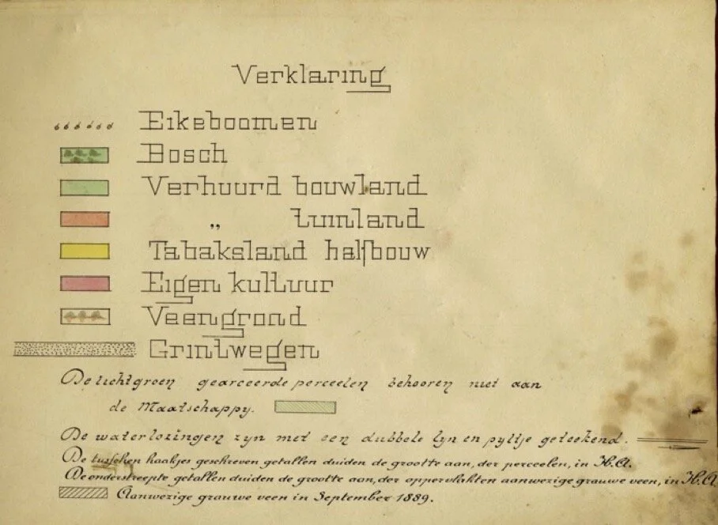
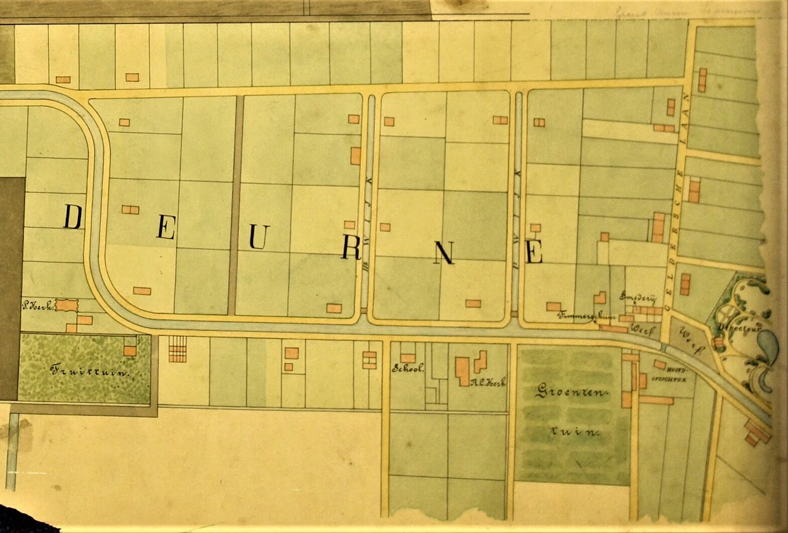
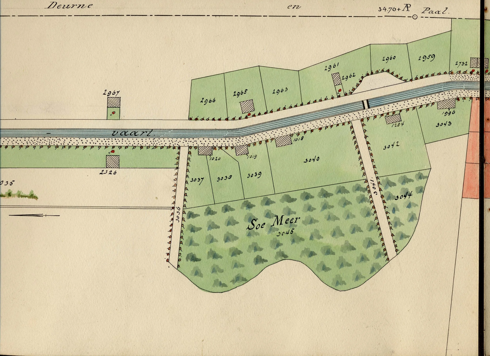
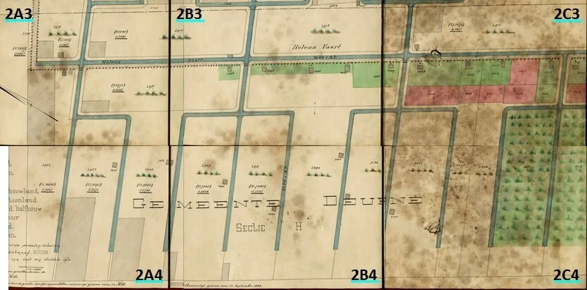

# de-kaar-van-deel-1

> Bron: helenaveenvantoen.nl

Helenaveen heeft vanaf haar ontstaan in 1854 veel gedaanten gehad. Op tal van kaarten is de veenkolonie temidden van het Peelmoeras afgebeeld. Regelmatig zullen we op deze website een kaartblad plaatsen en belichten. We vertellen (nog) niet alles. We hopen, dat Helenaveners, oud-Helenaveners en geïnteresseerden in ons dorp met ons gaan meevertellen over over wat er op de kaarten te zien is. De hamvraag is dan ook bij elke kaart: Wat kun jij nog vertellen over de kaart? Je verhaal(tje) kun je sturen naar info@helenaveenvantoen.nl.

### DE KAART VAN 1889

In 1889 liet de N.V. Maatschappij Helenaveen een gedetailleerde kleurenkaart van haar eigendommen maken. De kaart bestaat uit vier detailkaarten, die dan weer verdeeld zijn in vier vakken. Die zijn op linnen geplakt met tussen de vakken een marge voor de vouwlijn. De kaart bevindt zich in het archief van de Maatschappij, dat beheerd wordt door het Regionaal Historisch Centrum Eindhoven (RHCe).

De kaart geeft een mooi beeld van met name het dorp Helenaveen aan het eind van de 19de eeuw. De legenda verduidelijkt de verschillende details. De getallen in de afzonderlijke percelen zijn de dan geldende kadastrale nummers van die percelen, gebouwen, wegen, e.d. In het jaarverslag van de Maatschappij over 1889 wordt niet zoals in andere jaarverslagen het aantal inwoners vermeld. In 1890 geeft het jaarverslag 762 inwoners.

Legenda van de kaart van Helenaveen uit 1889

HET OUDE CENTRUM VAN HELENAVEEN (kaartvak 4B4)

Kaart eigendommen Mij Helenaveen 1889, kaartvak 4B4.

Kaartvak 4B4 toont ons het oude centrum van Helenaveen met als levensader de Helenavaart met aan weerszijden een grindweg. Aan dit gedeelte van de vaart ontstond begin 1854 de eerste bewoning.

Midden 1853 begon aan de Noordervaart in Meijel het graven van de vaart. Voor de overnachting van de kanaalgravers werden op het werkketen van hout en stro gebouwd. Als het werk vorderde, werden de keten afgebroken en verderop weer opgebouwd. In de eerste maanden van 1854 zijn de gravers gevorderd tot de plek waar door Jan van de Griendt het dorp is gedacht. Dan wordt ook voor de eerste keer de naam Helena-veen opgeschreven. De keten zijn de reden voor de bijnaam van Helenaveen: het strooien dorp. Jarenlang staan er in het dorp meer keten dan stenen huizen of boerderijen. Op de kaart van 1889 zien we geen woonketen meer. De Helenaveners van toen wonen allen in stenen huizen.

Het eerste stenen gebouw is op de kaart te vinden links op het perceel met nummer 2531; links boven bij de brug over de Helenavaart naar de Geldersestraat, waarvan nog net het begin te zien is. Dat eerste stenen gebouw is de directieboerderij, waar Jan Deckers tot zijn overlijden († 22-10-1872) met zijn gezin woonde. Deckers was in het Helena-veen vanaf het eerste uur de zaakwaarnemer van Jan van de Griendt, die het werk aanstuurde vanuit ’s-Hertogenbosch. Naast de directieboerderij is kort voor 1889 het kantoor van de Maatschappij gebouwd (perceel 2880) aan de huidige Helenastraat.

De directieboerderij ligt aan de huidige Kervelweg (nummer 2890). Tegenover de directieboerderij is in de hoek Helenastraat-Kervelweg een deel te zien van de groentetuin, die toen eigendom was van de familie Van de Griendt. Zij was enkele jaren eerder uit de Maatschappij gestapt om een nieuw, eigen veenbedrijf te beginnen aan de spoorlijn, waaruit Griendtsveen is ontstaan. Als een ‘wakend oog’ behielden de Van de Griendts de tuin in het oude centrum van Helenaveen waar ze verder niets meer te vertellen hadden. De legenda geeft die vreemde eigendomssituatie ook aan: “De lichtgroen gearceerde perceelen behooren niet aan de Maatschappij”.

Aan de Kervelweg zijn enkele tabaksvelden (geel) ingekleurd, alhoewel die teelt in 1889 al even voorbij was. De grindweg (nummer 2260) is de huidige Spitskoolweg. Kervelweg en Spitskoolweg komen evenals de huidige Moesweg (nummer 2267) uit op de Aardbeiweg (nummer 2891). Alle wegen zijn bewust door de Maatschappij beplant met eiken. Aan de Helenastraat tussen Spitskoolweg en Moesweg heeft de Maatschappij eind jaren 50 van de 19de eeuw het rijtje huizen (bij nummer 2549) gebouwd.

Als we bij het kantoor van de Maatschappij de brug overgaan naar de andere kant van de Helenavaart komen we uit bij het terrein van de scheepswerf (nummer 2745). Op het perceel ernaast staat het huis (nummer 847), dat twee jaar later gesloopt zal worden en waar de directeurswoning verrijst. Iets verder drie huisjes (de nummers 2749, 2750 en 2751). Zij liggen aan de huidige Fruitweg. Verderop richting Grashoek zien we tussen twee zijwegen van de Fruitweg een deel van de Koningshof liggen (nummers 2863, 2864, 2865 en 2866). De kleur op de legenda geeft aan dat daar eigen teelt door de Maatschappij plaatsvond. Vervolgen we de Fruitweg, dan komen we bij het punt waar nu de brug in de Helenastraat ligt (bij 31.60+ A.P.). Dat kleine stukje grindweg leidt naar de grens tussen Noord-Brabant en Limburg, tussen Helenaveen (Deurne) en Helden. Langs die grens ligt op Brabantse Maatschappijgrond de grindweg, die we nu kennen als de Grashoekseweg. [HetHelenaveenvanToen|HvdL|20210509]

RONDOM DE GELDERSCHE LAAN (kaartvak 4B3)

Kaart eigendommen Mij Helenaveen 1889, kaartvak 4B3.

Dit kaartvak sluit met de onderkant aan aan de bovenkant van het vorige (4B4). Rechtsonder zien we de rose kleur en de laatste letters van de Koningshof, waarvan het grootste gedeelte op kaartvak 4B4 staat. Het geheel omvat de zuidoost-hoek van Helenaveen met rechts en boven de grens met Limburg. De Maatschappij heeft die grenslijn beplant met eiken, net zoals aan beide zijden van elke grindweg.

De gele kleur van de tabaksvelden overheerst. Dat is niet verwonderlijk, want we zijn hier bij de grote tabaksschuren links en rechts van de huidige Geldersestraat, die toen Geldersche Laan werd genoemd. Op de kaart is dat de grindweg links van het midden en van onder naar de provinciegrens. Als we onderaan in de Gelsdersestraat starten, zien we rechts de eerste tabaksschuur (nrs. 2543-44-41), die daar nu niet meer te vinden is. Aan de linkerkant staat de volgende (nrs.-2345- 2850-2347), die enige tijd de naam Waldeck-Hoeve aan de zijgevel heeft gehad en nu de huisnummers 3 en 5 kent. Schuin daar tegenover komen we de volgende tabaksschuur tegen (perceelsnr. 2286), nu huisnummers 4 en 6. Voorbij de huidige Heldenseweg (nr. 2861) zien we links in de hoek met de huidige Koolweg drie gebouwen, op het perceel (nr. 2844) waar Jules de Corte jaren heeft gewoond. De laatste tabaksschuur (perceelsnrs. 2852-2853) staat daar schuin rechts tegenover de Koolweg, met nu de huisnummers 10 en 12. De bomen op het erf van de tabaksschuren en huizen zijn notenbomen, onderdeel van de schenking van koning Willem III. Vervolgen we het laatste stukje van de Geldersestraat, dan kunnen we rechtsaf over de grindweg, die nu nog een onverhard grenspad is. De eerste grindweg naar rechts is dan de huidige Heldenseweg. Op de percelen 2855-2856 staat nu het boerenbedrijf aan Heldenseweg 5. De grindweg langs de percelen 2855 tot en met 2860 is nu geen weg meer.

Gaan we nog even terug naar het begin van de Geldersestraat, dan zien we rechts nog een driehoekje van de voormalige scheepswerf van de Maatschappij. En ook links hoort tot de werf. Het linkse van de vier gebouwtjes (nrs. 2536-37-38-39), die we kennen als De Kazerne, is de smederij. Het grotere gebouw, dat deels daaronder (onder nr. 2535) op de kaart staat is de timmerschuur. Links daarvan de grindweg aan de Helenavaart, die nu naar Jan Deckers is genoemd, alhoewel op het straatnaambord Jan Deckerstraat staat. Die komt uit bij de huidige Kruisbesweg, die als smalle grindweg langs de 1ste Wijk nog net deels links op de kaart staat. Die grindweg heeft maar aan één zijde eiken. De wijkkant was vrij voor de toogpaarden om de turfaken ongehinderd te kunnen trekken. [HetHelenaveenvanToen|HvdL|20210523]

DE HELENAVAART VAN DE EERSTE WIJK NAAR DE BOCHTEN BIJ DE PROTESTANTSE KERK (kaartvak 4A3)

Kaart eigendommen Mij Helenaveen 1889, kaartvak 4A3.

Dit kaartvak sluit aan de rechterkant aan bij het kaartvak 4B3 met de tabaksschuren en –velden rond de Geldersche Laan. We zien de voortzetting van de Helenavaart vanaf de grindweg langs de 1ste Wijk rechtsonder naast perceel 1902; nog net in het hoekje een stukje te zien. Tussen de percelen 1901 en 2832 konden de turfaken vanuit de Helenavaart de 2de Wijk in tot aan de huidige Koolweg. Aan de grindwegen langs de 2de Wijk heeft de Maatschappij vijf huizen gebouwd. In vergelijking met nu is daar veel veranderd. Bij de Helenavaart en de 2de Wijk ligt in 1889 geen brug. Nu ligt daar centraal in het dorp de brug, die de Oude Peelstraat verbindt met de Sevenumseweg. Die weg is aangelegd over de percelen 1901-1900-2838-2827-Koolweg-2940. Waar het bruggetje over de 2de Wijk gaat van de huidige Jan Deckersstraat naar de overzijde van de wijk staat nu in het water het kunstwerk ‘Verleden Veen’.

Parallel aan de 2de Wijk loopt een grindweg van de Helenavaart naar de Koolweg waar op de percelen 2828 en 2829 nu huisnummer Soemeersingel 4 is gevestigd. Even verderop maakt de Helenavaart een bocht en gaat richting Koolweg en provinciegrens. Bij die bocht is de protestantse kerk met pastorie en bijgebouw te zien. De groene arcering van de kerkpercelen laat zien, dat die niet meer in bezit waren van de Mij Helenaveen. Eigenaar was de Hervormde Gemeente Helenaveen geworden. Ter hoogte van de Koolweg draait de vaart naar links. Daar komt de huidige Spruitweg uit bij de Koolweg. Het ommetje dat toen mogelijk was via de grindwegen tussen 2de Wijk-Koolweg-Helenavaart kan nu niet meer gemaakt worden, omdat de wegen grotendeels weg zijn.

Groen, rood en paars zijn de kleuren van de percelen op dit kaartvak. De groene en rode percelen geven de door de Maatschappij aan de Helenaveners verhuurde bouw- en tuinlanden weer. Op de paarse, onverhuurde velden, zoals het rijtje met de nummers 2940 tot en met 2946 (voor de helft) tussen de Koolweg en de provinciegrens, boerde de Maatschappij zelf. [HetHelenaveenvanToen|HvdL|20210603]

### RONDOM KATHOLIEKE KERK EN KROEG (kaartvak 4A4)

Kaart eigendommen Mij Helenaveen 1889, kaartvak 4A4.

Dit kaartvak sluit rechts aan bij kaartvak 4B4 en aan de bovenkant bij 4A3. Jammergenoeg is de kaart iets beschadigd, wat het juiste beeld wat vertroebelt. Rechtsboven in de hoek van de huidige Oude Peelstraat (nr 2366) – Helenastraat zien we de Rooms-Katholieke kerk, die bij de bevrijding van Helenaveen in november 1944 zwaar vernield is. (Zie voor foto’s KERK EN SCHOOL en MULTIMEDIA > ANSICHTKAARTEN.) Tussen kerk en Oude Peelstraat staat de school. Nu vinden we daar het plantsoen met de herdenkingsmonumenten, het carillon en de huidige kerk. Rechts van de kerk aan de overzijde van de grindweg (nr. 2529), de huidige Hovenierstraat, is nog net een tipje van de groentetuin van Van de Griendt te zien (zie kaartvak 4B4). Het gebouw tegenover de school op de percelen 2900 en 2901 is het alom bekende Hotel Van Oers met kroeg. Daar, aan het begin van de huidige Soemeersingel, vinden we nu Hotel Eetcafé In d’Ouwe Peel. Volgen we vandaar de Soemeersingel, dan passeren we enkele woningen en percelen bouw- en tuinland van de bewoners en de Maatschappij Helenaveen (nr. 2906) en komen we uit bij de Fruittuin van de Maatschappij. Die ligt in de bocht bij de protestantse kerk. Het overgrote deel van de gronden op dit kaartvak is nog onvergraven veen (nrs. 2927, 2928 en 2893). De voor het vervoer van de turven gegraven wijk, de huidige Schoolwiek, doorsnijdt daar het Helena-veen. Op de gestreepte vakken zit in 1889 nog grauwveen, de grondstof voor het turfstrooisel. De weg boven perceel 2893 is het huidige Tuinderspad en de weg onder dat perceel is nu de Aardbeiweg. [HetHelenaveenvanToen|HvdL|20210618]

DE VIER KAARTVAKKEN AANEENGELEGD

### EVEN TUSSENDOOR DE KAART VAN HET IN SEVENUM GEPACHTE GRAUWVEEN IN 1889

Fragment van de Sevenum-grauwveenkaart uit 1889. Archief Mij Helenaveen.

Vanaf het begin van haar activiteiten had de Maatschappij niet genoeg aan haar concessiegebied Helena-Veen in Deurne. In de aangrenzende Limburgse gemeenten pachtte ze Peel voor turfwinning en veenboekweit (via de boekweitbrandcultuur). Het internationale succces van het turfstrooisel vergrootte de veenhonger van de Maatschappij nog meer. Van de gemeente Sevenum kon ze in 1889 honderden hectaren Peel pachten om daarvan het grauwveen af te graven als grondstof voor haar turfstrooiselfabriek. Van dat deel van het huidige Mariaveen heeft de Maatschappij een kaart laten maken met daarop ook het dorp Helenaveen. Ter vergelijking met de vorige kaartvakken staat hierboven een fragment van de Sevenum-grauwveenkaart met Helenaveen. De Helenavaart, de Ie en IIe wijk, de grindwegen, de Geldersche Laan, de gebouwen, de Fruittuin, de Groententuin; ze staan er mooi op. Let ook eens op de kunstige inrichting van de tuin van de directeur bij de werf. Een ‘voordeel’ van deze kaart is, dat ze niet vol staat met kadasternummers. En ook hierop komen we de functie diverse gebouwen tegen: kerk, school, werf, timmerschuur, smederij, hoofdopzichter en directeur. N.B. De gehele Sevenum-grauwveenkaart uit 1889 komt binnenkort op de website. [HetHelenaveenvanToen|HvdL|20210702]

### Van Fabriekswijk tot Douglasweg (kaartvak 3C3)

Kaart eigendommen Mij Helenaveen 1889, kaartvak 3C3.

Dit kaartvak sluit rechts aan bij kaartvak 4A3 met de protestantse kerk. De streepjeslijn boven is de grens met Limburg. Vanaf de bocht bij de kerk gaan we verder op de grindweg langs de Helenavaart. Al snel komen we bij het huis met kadastraal nummer 2237 een wijk tegen, die we via een brug kunnen oversteken. Die wijk kennen we nu kennen als de Fabriekswijk door de aanwezigheid van de turfstrooiselfabriek. Door het grote succes van turfstrooisel was ook de Maatschappij al snel in de jaren 80 van de 19de eeuw overgegaan op dit product. Het grauwveen, de grondstof voor het turfstrooisel, was in grote hoeveelheden aanwezig. Onder loopt de dwarswijk van de Fabriekswijk het Helena-veen in met aan het einde een vergroting waar de turfaken kunnen aanmeren om volgeladen te worden.

Enigszins planmatig zijn aan weerszijden van de Helenavaart door de Maatschappij de huurwoningen voor haar arbeiders gebouwd. Elk gezin kan op het bijbehorende (groene) perceel - ook huur - groenten telen. Bij de boerderij (nr. 1038) bij de onverharde weg (nr. 2379), die we nu kennen als de Douglasweg, heeft de Maatschappij zelf percelen (geel) in gebruik (gehad) voor de teelt van tabak. De grote schuur bij het huis zal, net als de tabaksschuren aan de Geldersestraat, gebouwd zijn als droogschuur voor de tabak. [HetHelenaveenvanToen|HvdL|20210718]

### Rond het Soemeer (kaartvak 3B3)

Kaart eigendommen Mij Helenaveen 1889, kaartvak 3B3.

Dit kaartvak sluit rechts aan bij het kaartvak 3C3. Boven loopt de provinciegrens en de grens tussen de gemeenten Deurne en Sevenum. De plaats van de grenspaal, de Broemeerpaal, is met een rondje en ‘Paal’ aangegeven boven perceel 2959. Vanaf de huidige Douglasweg gaan we verder langs de Helenavaart richting Griendtsveen. De Helenavaart maakt enkele knikken vanwege het Soemeer aan de Brabantse kant en het Broemeer daartegenover aan de Limburgse kant. Soemeer en Broemeer zijn meerstallen, natuurlijke waterplassen in een levend hoogveenmoeras. De Maatschappij Helenaveen heeft het Soemeer al snel drooggelegd, het veen deels afgegraven en de stroken aan de vaart ontgonnen voor de bouw van een aantal arbeiderswoningen. De omtrek van het verdwenen Soemeer is op de kaart duidelijk te herkennen. De percelen zijn anders van vorm dan de percelen die we tot nu toe gezien hebben. Ook dit heeft te maken met de aanwezigheid van de meren. Bekijk op internet eens een actuele luchtfoto van dit gebied. Dan zie je nog grotendeels de perceelgrenzen van toen.

Iets voor het nog bestaande zandpad door het Soemeer met nummer 3041 ligt over de vaart een brug. Die ligt ongeveer op de plaats van de huidige brug bij het Kerkrazziamonumentje ‘Sporen die bleven’ bij de toegangsweg naar Kamp Mariaveen. In 1889 lag dat bruggetje bij een los- en laadplaats aan de vaart bij de percelen 2960 en 2961 en huis 2962. Gaan we vandaar over het zandpad, de huidige Koolweg, richting Griendtsveen, dan verlaten we de ontginning en komen in het veen uit bij het huis met kadasternummer 2967. Dat is nu het huis van de familie Van Woezik. Precies daar tegenover aan de overkant van de vaart stond in 1889 het huis met nummer 2326 op de plaats waar in 1912 de Oranje-Hoeve door de Maatschappij is gebouwd. Tussen Soemeer en Oranje-Hoeve loopt een zandpad met nummer 3036 het Helena-Veen in. Ter hoogte van de scheiding in het Soemeer tussen onafgegraven veen en ontgonnen grond loopt in noordelijke richting (noordpijl) de Soeloop vanuit het meer. [HetHelenaveenvanToen|HvdL|20210801]

### TUSSEN FABRIEKSWIJKEN EN 4e WIJK (KAARTBLAD 3)

Kaart eigendommen Mij Helenaveen 1889, kaartvakken 3.

We vervolgen onze tocht door het Helena-Veen via het gehele kaartblad 3. Helaas zijn de onderste kaartvakken niet volledig als scan beschikbaar, maar dat zullen we nog wel herstellen. De kaartvakken 3C3 en 3B3 zijn hiervoor al beschreven. De Fabriekswijk bij de turfstrooiselfabriek op kaartvak 3C3 loopt op kaartvak 3C4 verder het Helena-Veen in. De hoofdwijk heeft vier zijwijken. Aan de ene kant snijdt de Schoolwijk door de veenpercelen 2925-2927 en 2928. Die heeft ook weer een zijwijk tussen de percelen 2925 en 2928 en dat is de Fruitwijk. Aan de andere kant van de hoofdwijk gaan drie zijwijken door de veenvoorraad van de Maatschappij (perceel nr. 3149); van boven naar beneden de 1e Fabriekswijk, de 2e Fabriekswijk en de 3e Fabriekswijk. De 2e en de 3e komen uit in het in september 1889 daar nog aanwezige grauwveen (gearceerd), de grondstof voor verwerking in de turfstrooiselfabriek. Rondom de 1e is dat grauwveen in 1889 al geheel weggegraven. In het veen onder het voormalige Soemeer is ook nog een groot perceel met grauwveen aanwezig (perceel nr. 3034 op kaartvak 3B4).

De Helenavaart gaat verder op kaartvak 3A3. Daarlangs enkele arbeiderswoningen en ontgonnen perceeltjes. Op de plaats van de woningen met de nummers 1037 en 2324 rechtsboven op kaartvak 3A3 is in 1908 de Wilhelmina-Hoeve gebouwd door de Maatschappij. Voor het afvoeren van de gegraven turven heeft de Maatschappij op dit deel van haar concessiegebied wijken gegraven volgens het drietandsysteem. Enkel de middelste wijk kwam uit in de Helenavaart. De twee andere parallel lopende wijken bogen net voor de ontgonnen gronden af naar links en naar rechts om in de middelste wijk uit te komen. Zo werden de huiserven minder doorsneden en waren in de grintweg langs de Helenavaart minder bruggen nodig. Deze wijken kregen een doorlopende nummering. De meest rechtse op de kaartvakken 3A3 en 3A4 is de 1e Brabantse Wijk, de volgende – de wijk die in de Helenavaart uitkomt - is de 2e Brabantse Wijk en de volgende van de eerste drietand is de 3e Brabantse Wijk. De eerstvolgende ‘wiek’ van de volgende drietand, die maar gedeeltelijk te zien is op kaartblad 3, kreeg als aanduiding de 4e Brabantse Wijk. Links boven is een klein stukje te zien van de 5e , die in de Helenavaart uitmondt. De afstand tussen de wijken is gelijk. [HetHelenaveenvanToen|HvdL|20210919]

### VAN DE 5e BRABANTSE WIJK NAAR HET EIND VAN HET CONCESSIEGEBIED (KAARTBLAD 2)

We vervolgen onze tocht langs de Helenavaart. Op het vorige blad (3) waren we aangekomen bij de eerste 4 wijken van het door de Maatschappij toegepaste drietandsysteem. Op kaart 2 is dit nog mooier te zien met de 5e tot en met de 14e Brabantse Wijk. We hebben hier het einde van het concessiegebied van de Maatschappij Helenaveen bereikt. Vanaf de Noordervaart tot hier (2A3) is de Helenavaart in eerste instantie gegraven. Via het bruggetje over de 14e Brabantse Wijk is het laatste huis van Helenaveen te bereiken, nu Soemeersingel 149.

Toen de Maatschappij gebruik wilde maken van de spoorlijn Deurne-Venlo (geopend op 1 oktober 1866) is de vaart verlengd tot Halte Helenaveen aan het spoor. Dat ging niet in rechte lijn vanaf de concessiegrens over Deurnese grond. Vanwege de vertroebelde verhouding met de gemeente Deurne koos de Maatschappij er voor om de vaart te verlengen in het Limburgse veen. Door de aansluiting tussen beide delen ontstond de welbekende bajonetbocht. Op kaartvak 2A3 zien we die aansluiting (de stippellijnen) de provinciegrens overgaan. Het Brabantse stukje ligt net binnen het concessiegebied waar Deurne ‘niets’ meer te zeggen had sinds ze dat verkocht had aan de gebroeders Van de Griendt in 1853.

Aan de Limburgse kant zien we nog de aanzet van de wijken die de Maatschappij daar had gegraven in het van de gemeente Horst gepachte Peelveen. Op kaartvak 2C3 gaat vanaf de Helenavaart de 2e Horster Wijk de grens over om daar af te takken naar rechts de 1e en links (op 2B3) de 3e Horster Wijk. Op kaartvak 2B3 zien we dat zelfde patroon voor vanaf de Helenavaart de 5e en na de provinciegrens de 4e en 6e Horster Wijk. Parallel aan de bajonetbocht in de vaart gaat op kaartvak 2A3 de 8e Horsterwijk de Driehonderd Bunders in de Mariapeel in om daar nu maar eenmaal te vertakken met de 7e. De 9e is later gegraven. [HetHelenaveenvanToen|HvdL|20211022]
