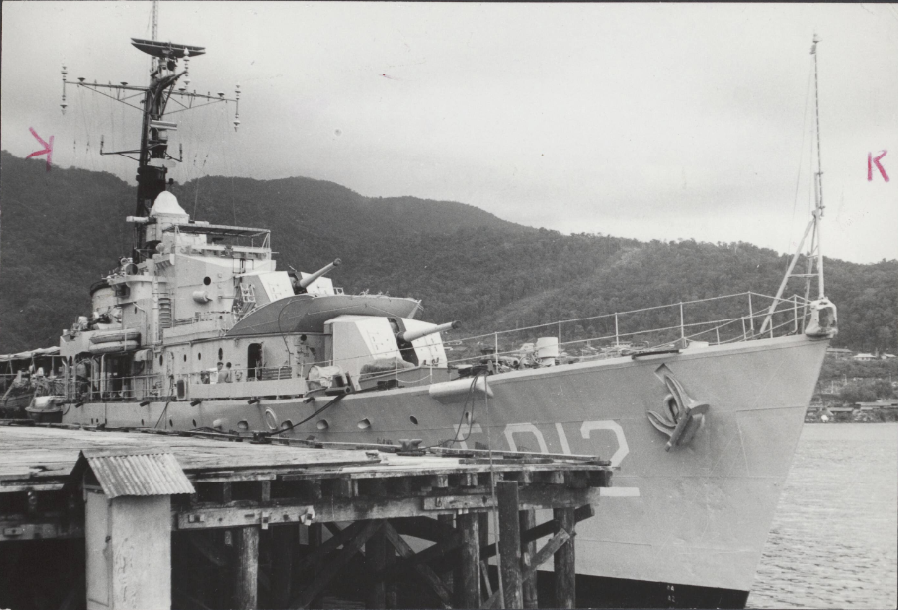
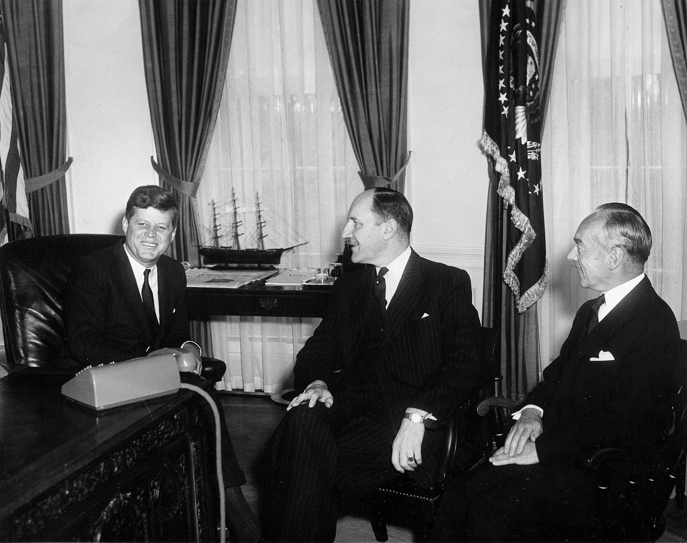
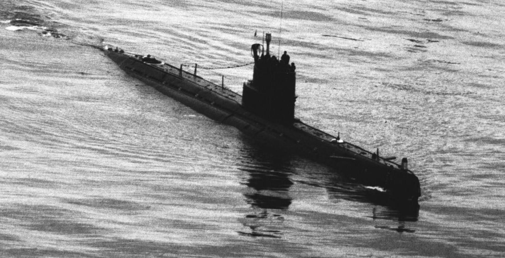
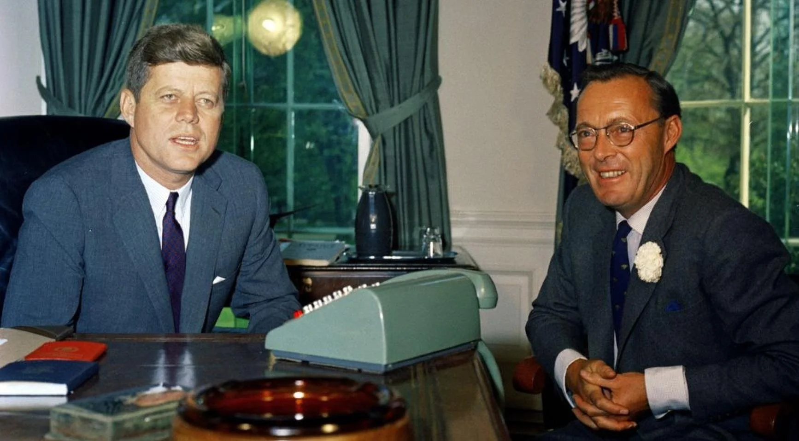

# dick-van-esseveldt-in-het-brandpunt-van-de-wereldgeschiedenis

> Bron: helenaveenvantoen.nl

In het brandpunt van de wereldgeschiedenis

Herinneringen van Dick van Esseveldt uit Helenaveen

Dick van Esseveldt

In de zomer van 1962 was Nieuw-Guinea voor de meeste Nederlanders een verre plek, ergens aan de andere kant van de wereld. Maar achter de krantenberichten over diplomatie en onderhandelingen zat gewoon een harde werkelijkheid: jonge Nederlandse militairen die elk moment in een oorlog terecht konden komen.

Eén van hen was ik: Dick van Esseveldt uit Helenaveen, kok aan boord van Hr.Ms. Kortenaer (een torpedobootjager)

De kortenaer.

Ik was een gewone jongen uit de Peel. Ik zat bij de Koninklijke Marine en werkte op een oorlogsschip als kok. Maar op zo’n schip heeft iedereen ook een taak als het alarm afgaat. Dan maakt het niet meer uit wat je normaal doet, dan telt alleen je gevechtspost.

Die van mij lag diep in het schip, in een ruimte boven de schroefas. Daar zat de lift waarmee de dieptebommen uit het ruim naar boven werden gebracht. Als er een onderzeeër werd gemeld, moesten die dingen snel klaarstaan.

De spanning in die tijd was groot.

Sukarno had gezegd dat Nieuw-Guinea bij Indonesië moest komen. Indonesië kreeg steeds meer hulp van de Sovjet-Unie. Er kwamen straaljagers, bommenwerpers en ook onderzeeërs uit die hoek. En dat maakte het allemaal behoorlijk serieus, hoewel wij daar eigenlijk nauwelijks besef van hadden.

We hadden niet door hoe groot dat allemaal was. Pas later snap je hoe dicht we eigenlijk langs een groter conflict zijn gegaan. Want eerlijk is eerlijk: het leek best wel op de iets latere Cubacrisis. Oost en West tegenover elkaar, Russische wapens erbij, en één verkeerde stap had genoeg kunnen zijn.

Het had zo mis kunnen gaan. Een sonarcontact dat verkeerd werd begrepen. Een torpedo die wordt afgevuurd. Dieptebommen die wel of niet gebruikt worden. Het had zomaar heel anders kunnen aflopen, met misschien duizenden doden.

In Den Haag hield minister van Buitenlandse Zaken Joseph Luns vast aan het Nederlandse standpunt. Hij vond dat Nederland niet zomaar weg moest en dat de Papoea’s recht hadden op hun eigen toekomst.

Minister Luns en de Nederlandse ambassadeur bij President Kennedy

Aan de andere kant zat de Amerikaanse president John F. Kennedy, die vooral keek naar de Koude Oorlog. Hij wilde geen nieuw conflict dat Indonesië richting de Sovjet-Unie zou duwen.

En terwijl dat allemaal speelde, voeren wij gewoon op zee rond Nieuw-Guinea. Op een dag kwam het bericht dat er mogelijk een onderzeeër in de buurt was.Iedereen moest op zijn post.

Russische onderzeeër bij Indonesië

Ik dus ook. Naar beneden, naar mijn plek bij de munitielift.

Daar begon het wel te knagen. Want ik wist hoe torpedo’s werkten. Die zoeken het geluid van een schip op, het slaan van de schroef. En precies daar zat ik dus. Beneden, vlak bij de schroefas, besefte ik ineens: als er iets komt, dan is dit de slechtste plek om te zitten. Ik dacht aan thuis, aan Helenaveen, aan mijn familie. En daar, heb ik een belofte gedaan. “Heer, als ik hier levend uitkom, dan doe ik openbare belijdenis van mijn geloof.” De tijd kroop voorbij. Uren misschien.Het schip bleef manoeuvreren. Dieptebommen stonden klaar. Iedereen zat te wachten wat er zou gebeuren. Maar er gebeurde gelukkig niks, geen torpedo, geen aanval.

Ondertussen werd er op het hoogste niveau hard gewerkt aan een oplossing. Onder druk van Kennedy werd gezocht naar een uitweg. Ook prins Bernhard speelde achter de schermen een rol. Via zijn contacten in het buitenland probeerde hij mee te helpen om de zaak niet te laten escaleren. Hij zag het ook: dit kon zomaar verkeerd aflopen.

Prins Bernhard, bij President Kennedy om over Nieuw Guinea te praten

Uiteindelijk kwam er een akkoord.Nederland droeg Nieuw-Guinea via de Verenigde Naties over aan Indonesië. Voor Luns was dat een bittere pil. Voor Kennedy was het vooral een manier om de Koude Oorlog niet verder te laten escaleren. De bemoeienis van Prins Bernhard kwam pas jaren later aan het licht. Misschien heeft hij wel een nieuwe wereldoorlog voorkomen.

Voor ons op zee betekende het vooral: we hoefden niet te vechten.Voor mij betekende het nog iets anders.Toen we weer aan wal kwamen in Nieuw-Guinea, heb ik meteen bij een nederlandse dominee en een papoea kerkeraad mijn openbare belijdenis gedaan.

Nu jaren later vertel ik er niet over als heldenverhaal of zo. Meer gewoon over wat ik daar voelde: de spanning, de angst en die belofte die ik toen gedaan heb.

Als ik nu terugdenk, gaat het me niet eens zozeer om de grote politiek. Natuurlijk waren Luns, Kennedy en prins Bernhard belangrijk voor hoe het is afgelopen. Maar ik denk vooral aan de jongens met wie ik daar zat, aan de spanning aan boord, en aan hoe dicht het soms langs elkaar scheert: vrede en oorlog.

Ik was geen held, ik deed gewoon mijn werk, net als de rest.Maar ik heb wel het gevoel dat ik als jongen uit Helenaveen midden in de wereldgeschiedenis gestaan heb.

De wereld is de Nieuw-Guineacrisis grotendeels vergeten.Maar voor mij is het altijd een tijd gebleven die me is bijgebleven.En die belofte die ik toen deed, ben ik ook nooit vergeten.

Nog wat achtergrond informatie:

https://www.youtube.com/watch?v=ZUXntYpBT0Uhttps://anderetijden.nl/aflevering/564/De-slag-bij-Vlakke-Hoek(Dick nam met de Kortenaer ook deel aan de slag bij vlakke Hoek)

De aanwezigheid van Russische onderzeeërs bij Nederlands-Nieuw-Guinea speelde in augustus 1962, tijdens het conflict over de status van het gebied. Sovjet-Unie stuurde destijds materieel om Indonesië te steunen in hun strijd tegen Nederland.

De historische feiten op een rij:

De dreiging: In de zomer van 1962 lagen er drie tot mogelijk zes Sovjet-onderzeeërs gereed rondom Nieuw-Guinea. Elke onderzeeër had ongeveer zeventig Russische bemanningsleden aan boord.

Het doel: De duikboten lagen in stelling om Nederlandse marineschepen, zoals het fregat Evertsen, aan te vallen. De Sovjet-Unie deed dit in opdracht van Moskou om een grootschalige Indonesische invasie van het eiland mogelijk te maken en te dekken.

Escalatie voorkomen: Het kwam uiteindelijk niet tot een directe confrontatie tussen Nederlandse en Russische strijdkrachten. Onder zware diplomatieke druk van de Verenigde Staten werd in augustus 1962 het Akkoord van New York gesloten, waarna Nederland het gebied overdroeg aan de Verenigde Naties en Indonesië.

Publiek debat: De inzet van de Russische onderzeeërs was destijds een streng geheim. Pas tientallen jaren later kwam het bestaan van deze operatie via historisch onderzoek en archieven naar buiten.

https://www.historischnieuwsblad.nl/russische-duikboten-voor-nieuw-guinea/

https://www.nlveteraneninstituut.nl/nieuws/nieuw-guinea-wat-gebeurde-er-in-augustus-1962/

jvw 15 juni 2027
