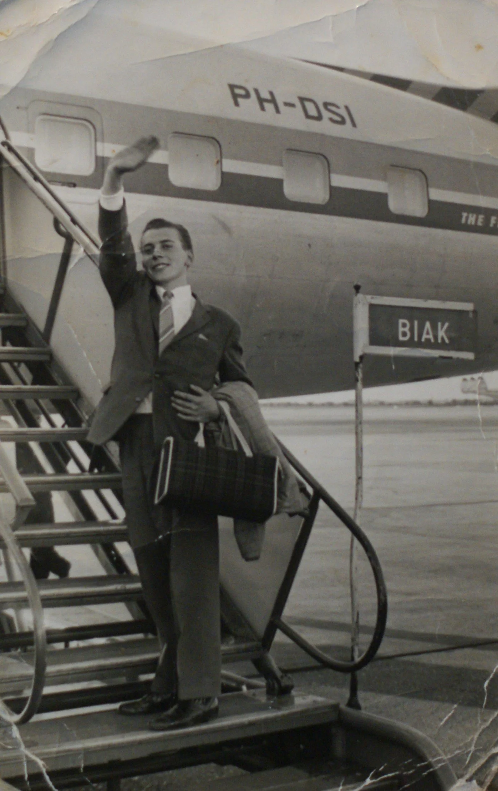
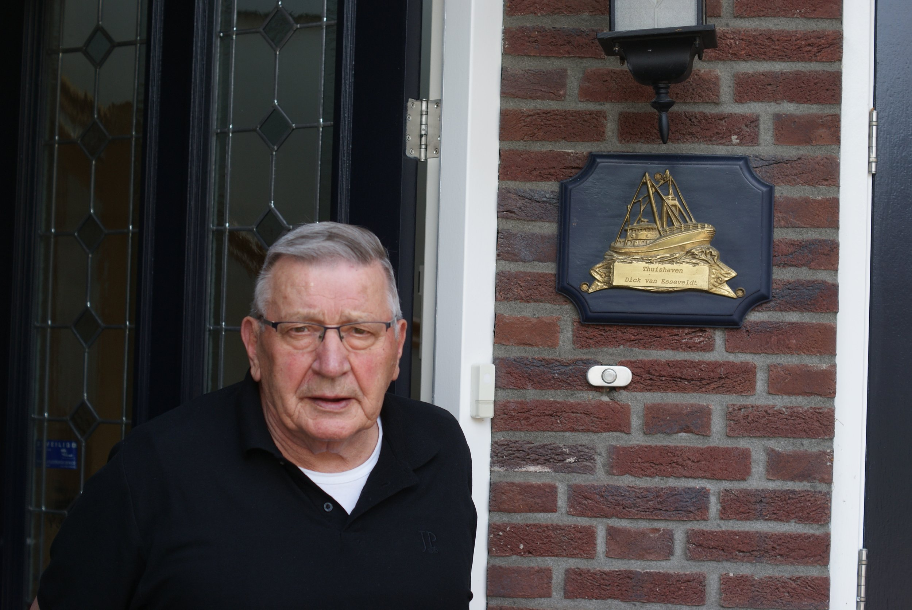
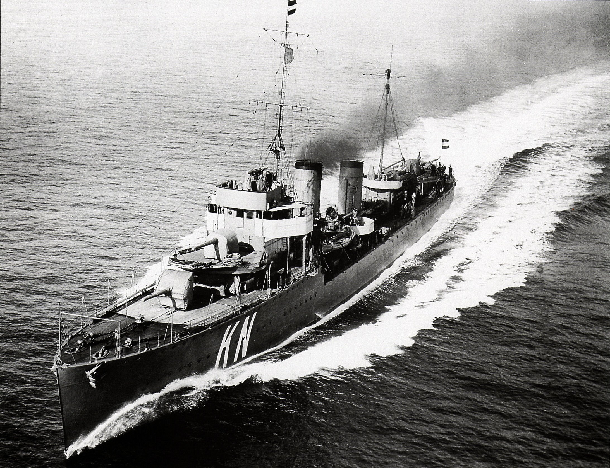

# een-avomlid-vertelt

> Bron: helenaveenvantoen.nl

Onderstaand artikel is verschenen in het blad van de AVOM, de Algemene Vereniging voor oud- en actief dienend personeel van de Koninklijke Marine.September 2024, nr. 3.

“Sinds mijn pensioen drijf ik op herinneringen!”

EEN AVOM-LID VERTELT: DICK VAN ESSEVELDT

Door Pieter Duijf

Voor deze aflevering fietsen we vanaf Venlo dwars door de Limburgse Peel naar Helenaveen, een plaatsje met rond de 900 inwoners dat net over de provinciegrens in Noord-Brabant ligt. Het is een afstand van ongeveer 23 kilometer. Het rustieke dorpje behoort tot de gemeente Deurne en is vernoemd naar Helena Panis, de echtgenote van Jan van de Griendt, één van de stichters in 1853 van de veenkolonie.

De Maatschappij Helenaveen liet destijds een particulier kanaal, de Helenavaart, graven. De zwarte turf kon zodoende worden afgevoerd naar de Noordervaart. Later werd ook turfstrooisel vervaardigd. Er bevond zich zelfs een drijvende turfstrooiselfabriek. Het turfstrooisel werd uitgevoerd naar geheel Europa en diende ter vervanging van stro in de Londense en Parijse paardenstallen voor leger en tram.

Wie door de Peel kuiert, rijdt of wandelt, doet dit bij wijze van spreken door de verhalen van de schrijvers Toon Kortooms en Anton Coolen. In de verte hoor je de poëtische liedjes van Rowwen Hèze uit het nabijgelegen Horst-America in Noord-Limburg. Helenaveen is min of meer een protestantse enclave in een overwegend katholieke omgeving. Helenaveen werd vroeger ook wel het Strooijen Dorp genoemd. Het plaatsje kende toentertijd veel armoe. De turfarbeiders hadden een uiterst karig inkomen. Op een klein stukje grond verbouwden ze uit nood hun eigen groenten en soms wat fruit. De natuurlijke omgeving van Helenaveen kent tegenwoordig een beschermde status.

We bellen aan bij Dick van Esseveldt (84). Naast de voordeur hangt zijn naambordje met de beeltenis van een schip en met het veelzeggende opschrift ‘Thuisbasis Dick van Esseveldt’. Zijn familie komt oorspronkelijk uit de Betuwe. Veel andere achternamen zijn terug te leiden naar Drenthe en Overijssel. “De marine zit nog altijd in mijn hart.” oppert Dick. In 1957 trad hij in dienst bij de Nederlandse Zeestrijdkrachten. Nog niet zo lang geleden kreeg hij een kopie van zijn conduiteboekje, het aantekenschrift met beoordelingen en eventuele veroordelingen gedaan tijdens de actieve diensttijd. “Normaal krijg je dit niet meer in te zien, maar ik was zogenaamd mijn memoires aan het schrijven voor mijn kleinkinderen.”

Dick zag op 28 oktober 1940 het levenslicht. De oorlog was een half jaar eerder in volle hevigheid losgebarsten. Als peuter en kleuter groeide hij gedurende de Duitse bezetting op. “Het was het laatste jaar van de oorlog toen we ’s nachts over de hei moesten evacueren naar Sevenum. Dat was voor ons gezin erg spannend. Na de oorlog kwamen we terug in een leeggeroofd Helenaveen. We kregen kleren van de HARK (= Hulpactie Rode Kruis). Dus alle jongens van mijn leeftijd hadden dezelfde trainingsbroeken aan. Ook kregen we oorwarmers met zo’n stalen band. Heel Helenaveen was alles kwijt, maar we hielpen elkaar. Na mijn schooltijd kon je een vak gaan leren of gaan werken. Ik wilde gaan werken en kwam in dienst bij een koudegrondtuinder. Met kost en inwoning verdiende ik 30 gulden in de maand. Dat geld konden ze thuis met 10 kinderen goed gebruiken. Na een jaar bij die tuinder kon ik bij een bakker beginnen, ook met kost en inwoning. Mijn loon bedroeg 12 gulden in de week, maar dat geld zag ik nooit. Dat werd van de rekening afgetrokken.”

Nadat Dick zijn 16e verjaardag had gevierd, lonkte de marine. “Ik toog op een dag naar Eindhoven voor een eerste selectie. Daarna ging ik voor de keuring naar Voorschoten. Vanuit Den Haag ging ik met het blauwe trammetje daarnaartoe. We waren met ongeveer 100 jongens op de keuring. Na een week bleven er nog maar 30 man over. Ik moest ’s maandags terugkomen, want ik had platvoeten. Toen de dokter vroeg of ik bij de Marine wilde, zei ik meteen ‘ja’. ‘Dan kun je nu naar Hilversum om je aan te melden en dan kijk ik over een jaar wel hoe het met je gaat.’”

Zo trots als een pauw reisde Dick op 14 maart 1957 vervolgens naar Hilversum en meldde zich daar bij het Marine Opleidingskamp (MOKH). “Op maandagavond zat ik al op de naaizolder mijn kleren te nummeren met een kettingsteek. Dat heb ik overleefd. De militaire vorming bestond uit marcheren, roeien op ‘De Nooitgedacht’ en schieten op de Hilversumse heide. Op 2 september 1957 werd ik geplaatst op ‘De Zeven Provinciën’ voor mijn koksopleiding. Met deze kruiser gingen we met de Amerikanen en de Engelsen oefenen in het Poolgebied. We voeren samen met een Amerikaans vliegkampschip de USS Forrestal. Dat was voor mij als gewone plattelandsjongen uit Helenaveen een hele belevenis. Nadat ik mijn opleiding had afgerond werd ik geplaatst in de kombuis in Hilversum. Daar heb ik veel geleerd van majoor-kok Versteeg.”

Op 25 augustus 1958 wachtte de ‘Karel Doorman’. “Die lag nog in dok bij Wilton-Feijenoord. Na de scheepskombuis kwam ik terecht in de officierskombuis. Ik heb vele reizen met de ‘Doorman’ gemaakt naar Amerika, waar we de Grumman trekkers hebben getest, een tweemotorig voertuig dat later ook werd gekocht. In Willemstad heb ik mijn zus Corrie nog ontmoet. Zij ging emigreren. Daar lag de ‘Sibajak’, een vracht/passagiersschip, bij de Pontjesbrug. Mijn zus mocht daar gelukkig drie uur van boord, anders had ik haar niet kunnen treffen. Zoals ik al zei heb ik vele reizen met de ‘Doorman’ gemaakt. Bestemmingen waren onder andere de Amerikaanse basis op Cuba, Jacksonville, Aruba en daarna naar Hamburg. Daar werden we vorstelijk ontvangen. We waren het eerste vliegkampschip dat na de oorlog daar aanlegde.”

In december 1959 sloeg het noodlot toe. “Op 15 december overkwam me een ernstig ongeluk in de scheepskombuis. Ik was er alleen en wilde de rode bieten controleren. Die zaten in een ketel van 600 liter. Deze ketel stond onder druk. Ik wilde de knevel zachtjes opendraaien, maar ik schoot uit. Ineens stond ik midden in het kokende bietensap. Ik moest er dwars doorheen lopen om bij een andere grote ketel van 600 liter te komen. Die stond vol met aardappels klaar in koud water voor de volgende dag. Hier dook ik in voor de pijn. Toen de andere koks binnenkwamen, begrepen zij niet wat ik in die ketel deed. ‘Ga een dokter halen. Ik zit hier niet voor mijn lol,’ riep ik. In de ziekenauto werd ik vervolgens naar het ziekenhuis in Overveen gebracht.”

Na zijn herstelperiode werd Dick op 24 oktober 1960 geplaatst op de ‘Hadda’ voor de visserij-inspectie op de Zeeuwse wateren. “Ik heb daar een geweldige tijd meegemaakt.”

Daarna kwam hij op de lijst voor uitzending. “Op 28 juli 1961 ging het per DC 7 naar Nieuw-Guinea. De hele familie bracht me naar Schiphol om afscheid te nemen. Plotseling hoorden we ‘Here is your captain speaking. We moeten even terug vanwege een kapotte band.’ Mijn familie was al naar huis toen dat werd omgeroepen. Maar na een uur was de klus al geklaard. We vlogen over Ankrits. Daar zijn we geland om te tanken. Urenlang zijn we over ijsbergen gevlogen. Uiteindelijk kwamen we aan in Tokyo. Van Tokyo ging het naar Biak. Daar kwamen we na 36 uur in het vliegtuig te hebben gezeten aan. Bij aankomst van ons schip de ‘Kortenaer’ zei ik tegen mijn maat: ‘We komen op een wachtschip. Deze boot zal niet meer varen.’ Maar toen zei de onderofficier van de wacht: ‘Kok, om 10 uur gaan we varen.’ Ik vroeg waar mijn bed was. Dat bleek de bakstafel in het achterverblijf te zijn. Nou, daar zaten ze tot 10 uur ‘s avonds te kaarten, maar ’s ochtends om 6 uur moest alweer de tafel gedekt worden. In Biak heb ik van een marinier een stretcher gekocht, zodat ik op het helikopterdek kon slapen. Ik was moderne schepen gewend, maar deze ‘Kortenaer’ was rijp voor de sloop. De kombuis was omgebouwd van kolen naar olie, maar we hadden een geweldige bemanning. We wisten dat we het samen moesten doen. Onze chef-kok was geweldig. We deden ons uiterste best voor hem en voor de bemanning. Na drie weken begon de oorlogswacht. Overdag eten koken in de kombuis en verder waren we met zes man ingedeeld bij een kanon. Een vluchter, een bakser en een tempeerder. Ik moest de hulzen en de granaten aangeven. De actie was altijd ’s nachts in het pikkedonker. Overdag moesten we eten koken en oefenen. We hebben eens zes weken aan een stuk door gepatrouilleerd. Dan kwam de vijand ’s nachts, maar voer ook weer terug om ons moreel kapot te krijgen. We werden bevoorraad door een koopvaardijschip, dat verscholen lag in een baai. Het werd menens bij Vlakke Hoek. In de nacht van 15 op 16 januari 1962 hebben we aan boord van de ‘Kortenaer’ deelgenomen aan een nachtelijke actie aan de zuidkust van Nederlands Nieuw-Guinea waarbij een Indonesische infiltratiepoging, uitgevoerd met behulp van torpedoboten, door gevechtsoptreden werd verijdeld. De vlammen die opstegen waren wel dertig meter hoog. We hebben veel Indo’s uit het water gehaald, maar veel van hen waren al dood.”

Na de slag werd de bemanning gehuldigd in Hollandia door commandant Reeser. “Daarna moesten we olie laden bij Sorong. Er was een onderzeeër gesignaleerd. Die moesten we opsporen en vernietigen. Maar daar had je twee moderne jagers voor nodig om daar een kans tegen te maken. Bij een onderzeebootalarm moest ik naar het halfdek. Dat was twee compartimenten naar beneden om daar de luiken te sluiten. Bij melding moest ik ook de dieptebommen in de lift zetten en naar boven sturen. Ik hoorde de schroef draaien en wist dan dat de torpedo’s op de troef afgingen. Het was twee dagen zigzag varen om de onderzeeër te ontlopen. Ik was daar geen held in. Ik had schrik. Ik vroeg en bad tot Onze Lieve Heer of ik hier uit mocht komen en dat ik dan de Belijdenis zou doen. Toen alles achter de rug was hebben we met drie man de Belijdenis gedaan. Ziekenverpleger Maay, een hofmeester en ik. Gelukkig was het allemaal snel afgelopen. Minister Luns moest bakzeil halen. We kregen geen steun van Amerika. We zouden het nooit hebben gered. Er lagen drie Russische onderzeeërs en er waren verschillende Toepolev bommenwerpers gestationeerd in Indonesië. En dan heb ik het nog niet over de Russische troepen die er lagen. Al met al vond ik het een zeer gespannen tijd. Wij als bemanning hielden elkaar op de been. Ook na onze diensttijd bleef onze vriendschappelijke band. We konden met elkaar over die tijd spreken, want thuis snapte men het toch niet wat we allemaal hadden doorgemaakt. Toen alles achter de rug was en was overgedragen aan de UNO zijn we via een stop bij India via het Suez Kanaal en een stop bij Palermo naar huis naar Den Helder gevaren en tenslotte in februari afgezwaaid. Ik moest van mijn vader thuis bij hem in het bedrijf komen werken op de vrachtwagen. Pap kon zelf niet meer werken. Dat heb ik tot mijn pensioen gedaan. Sinds mijn pensioen drijf ik op herinneringen! Ik heb samen met mijn vrouw een fijn gezin met drie kinderen mogen opbouwen. Ik wil graag mijn kameraden Harrie Raaijmakers, Harrie Stuljens en Lirus van der Laan bedanken. Jongens die ik zeker niet mag vergeten en die alleen nog in mijn gedachten voortleven zijn Mossing, Leo Verhofstad, Willem Anker, Marius Haring, Bert Thijssen en Leo Leysinga. Mogen zij rusten in vrede. En jongens, die ik vergeten ben. Sorry. Jullie waren allemaal geweldig…”

GV - 24 juli 2026
