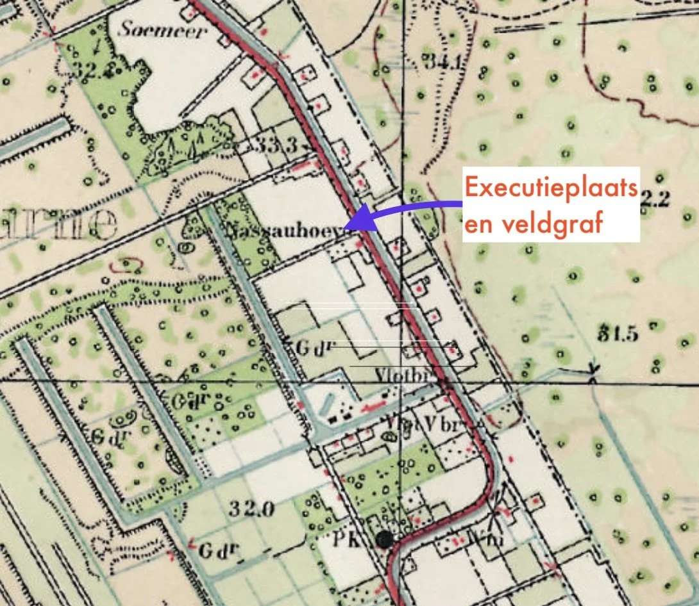
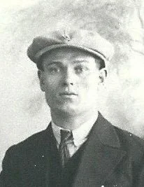
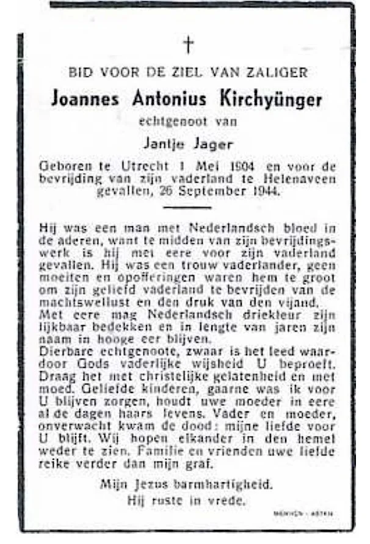
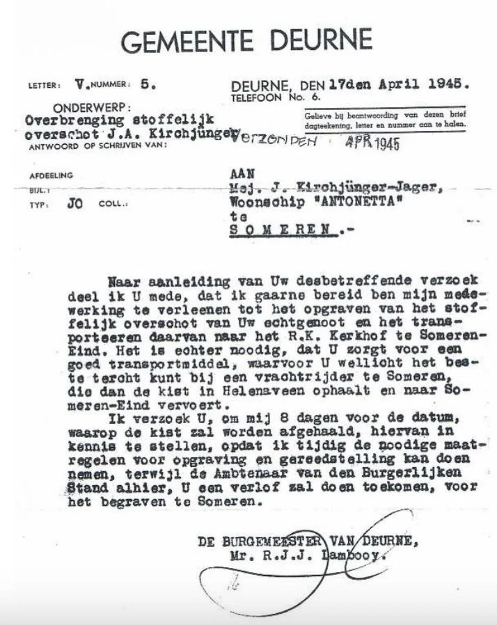

# executie-verzetsman-bij-de-nassou-hoeve

> Bron: helenaveenvantoen.nl

### Verzetsman geëxecuteerd en begraven in het laantje naast de Nassau hoeve

Johannes Antonius Kirchyünger was schipper op de “Antonetta” en voer vaak over de Zuid-Willemsvaart waardoor hij geregeld aanlegde bij Sluis 12. In Someren-Lierop was een onderduikerskamp waar vaak geallieerde piloten werden gebracht, deze piloten wilden maar één ding, zo spoedig mogelijk terug naar Engeland. Daarvoor was een landelijk netwerk opgezet door de ondergrondse om deze mannen langs verborgen wegen naar België te brengen, vanwaar ze dan weer verder naar Frankrijk en Spanje konden komen. Kirchyünger kwam hierdoor in contact met Jozef van der Heijden (leider van de ondergrondse onderduikersbeweging in Someren) en nam geregeld geallieerden op zijn boot mee naar België, hoewel door de Duitsers streng gecontroleerd werd was er op een schip altijd wel een plekje waar je enkele mensen kon verbergen. Daarnaast was Kirchyünger ook in het bezit van zendapparatuur waarmee hij verbinding kon maken met Engeland.

verzetsman Johannes Antonius Kirchyünger was 40 jaar toen hij op 25 september 1944 in Helenaveen geëxecuteerd werd

In september 1944 lieten de Duitsers alle bruggen over de Zuid-Willemsvaart springen waardoor de scheepvaart gestremd was en de ‘Antonetta’, samen met nog enkele andere schepen, tussen sluis 12 en sluis 13 aan de oostzijde van het kanaal stil lagen. Someren werd op 20 september 1944 door de Engelsen bevrijd maar aan de overzijde van de vaart lagen nog steeds Duitse troepen en op 22 september drongen enkele Duitsers, waarschijnlijk SD’ers (Sicherheitsdienst), de boot binnen en doorzochten alle ruimtes. Deze Duitsers kwamen uit bij de zendinstallatie en Kirchyünger moest verklaren hoe hij daaraan kwam en wat hij daarmee deed. Hij hield echter zijn kaken stijf op elkaar, waarop het schip tot zinken werd gebracht en de schipper werd meegenomen naar Helenaveen dat toen nog vast in handen was van de Duitsers. Wat daar allemaal gebeurde is niet bekend maar op 25 september werd hij door de Duitsers geëxecuteerd en dood achtergelaten. Hij is daar door de buurt in een provisorisch graf begraven, op het land van Mij. Helenaveen aan het Laantje van Teeffelen naast de “Nassau Hoeve” . Tijdens de identificatie van de stoffelijke resten op 11-08-1948 werd echter geconstateerd dat zijn schedel totaal verbrijzeld was.

Bovenstaande tekst is overgenomen van de site van Stichting Oorlogsslachtoffers https://www.oorlogsslachtoffers.nl en een artikel in de Vonder van 2019 nr 4 door Remy Lammers

jvw oktober 2024
