# famanker_kaas

> Bron: helenaveenvantoen.nl

### Familie Anker - Kaasmakers in Helenaveen

Op bezoek bij: Pieter en Alie Anker. Pieter is in Helenaveen geboren in 1947. Alie is geboren in het Groene Hart, maar opgegroeid in Harderwijk.De opa van Pieter, Jacob, kwam uit Gouda (Broekweg) en heeft zich gevestigd op de Emmahoeve in 1932. Hij was de vierde bewoner van de Emmahoeve (gebouwd in 1910). Jacob kwam op advies van zijn broer Klaas naar de Peel. Klaas woonde twee huizen verder op de Kaasweg.De Emmahoeve werd geheel onderkelderd, in eerste instantie voor de opslag van aardappelen.De eerste pachters van de boerderij deden het niet erg goed. De Ankers boerden wél goed op de Emmahoeve; in het begin waren er ongeveer twintig melkkoeien en dat liep op naar op het laatst dertig. Ze waren ook vooruitstrevend, zo hadden ze als eerste een tractor (een Massey Ferguson op benzine) en een moderne melkstal met automatische afname.

Kaasmakerij

De ouders van Pieter zijn: Klaas Anker (* 31-12-1917 te Gouda, † 14-7-1990 te Helenaveen) en Cornelia Goverdina Meijers (* 19-1-1918 te Kamerik, † 2000). Zij zijn in maart 1941 in Kamerik getrouwd. Waarschijnlijk hebben ze in dat zelfde jaar de boerderij overgenomen.De grootouders (Jacob en Jannigje Martijntje Rooseboom) zijn later naar het dorp verhuisd.

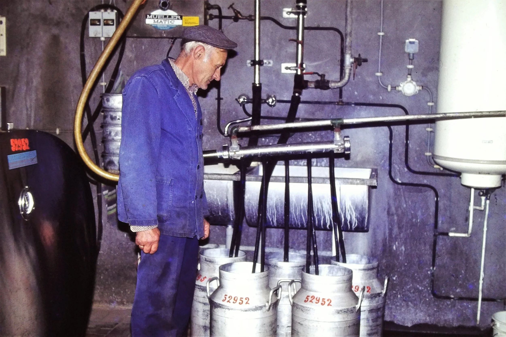

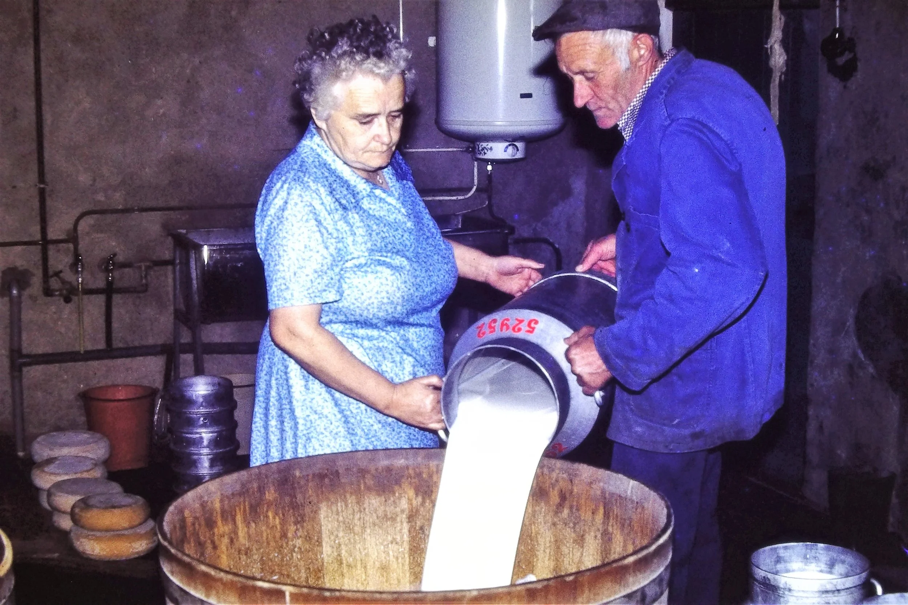

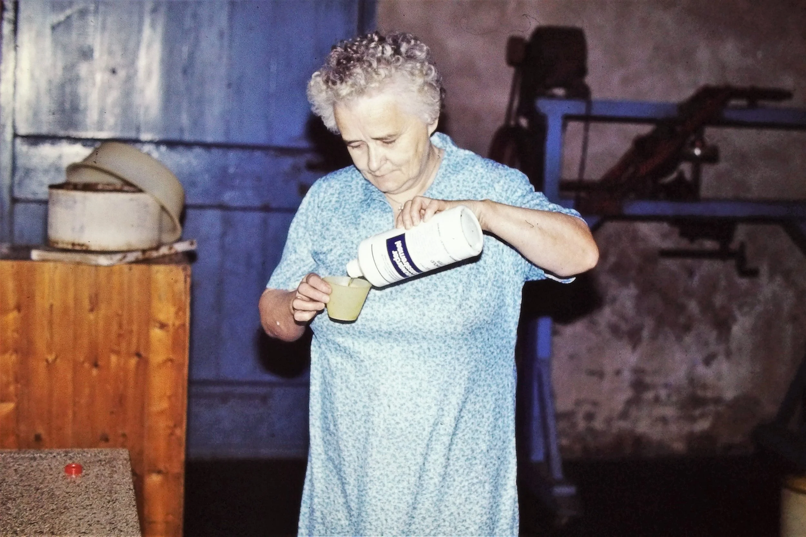

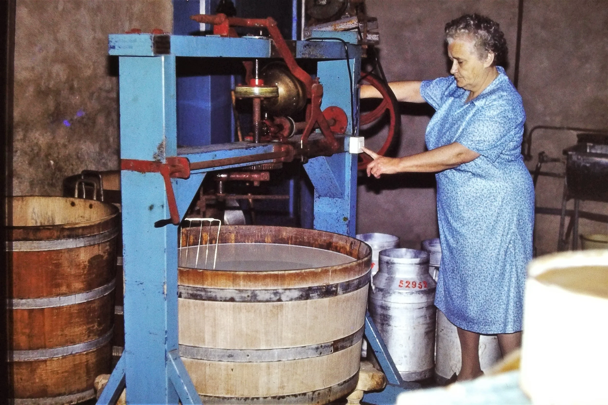

De moeder van Pieter is begonnen met kaas maken en ze heeft het volgehouden tot 1980. Belangrijk om te weten is dat het hele proces in handen was van de boerin: elke dag (ook op zondag) was ze bezig met kaasmaken van half 8 tot 10 uur in de morgen.Dagelijks werden 5 bussen à 30 liter melk verwerkt. Uit die 150 liter melk werd 15 kg kaas gemaakt: 4 kazen met een doorsnede van 30-40 cm. Als er erg veel vraag was, werd soms twee keer per dag kaas gemaakt. De rest van de melk ging naar de melkfabriek (Liessel, daarna Deurne).

Vrijwel alle kaas werd aan huis verkocht. In de beginjaren bracht Jan Arts (de vrachtrijder) nog wel kaas naar Gouda of Woerden.

Bij de familie Anker werd de kaas niet voorzien van een “plastic korst”. Het was dus ’n héél natuurzuiver product. In de tijd dat het zgn. Moermandieet tegen kanker populair was, zorgde dit voor veel extra klandizie. De familie Anker maakte Goudse kaas. Goudse kaas moet een vetgehalte hebben van minimaal 40% (40+).Er werden twee kaaskuipen gebruikt. De melk werd direct van de koe (nog warm) voor de kaas gebruikt.Toevoeging: stremsel (product uit de lebmaag van een nuchter kalf) en zuursel (voor de bacteriële werking). Na deze toevoegingen bleef de melk 20 minuten staan en scheidt zich kaas af die met een roterend kaasmes in stukjes gesneden wordt (elektrisch aangedreven).

Daarna werd de wei afgeschept, kokend water toegevoegd (voor een compactere kaasmassa) en dan weer 10 minuten gesneden met de machine.

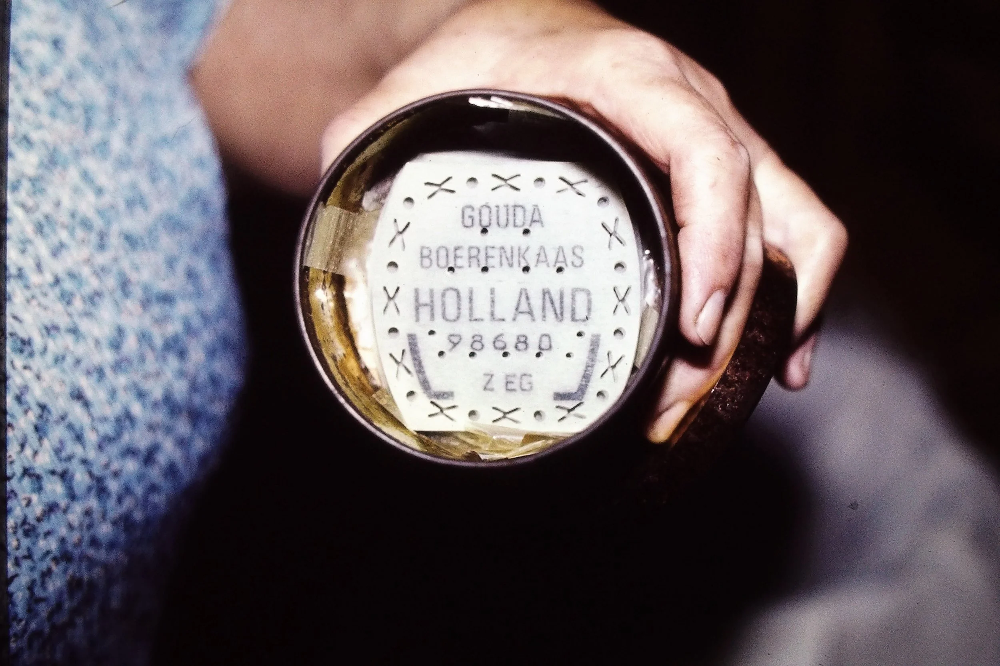

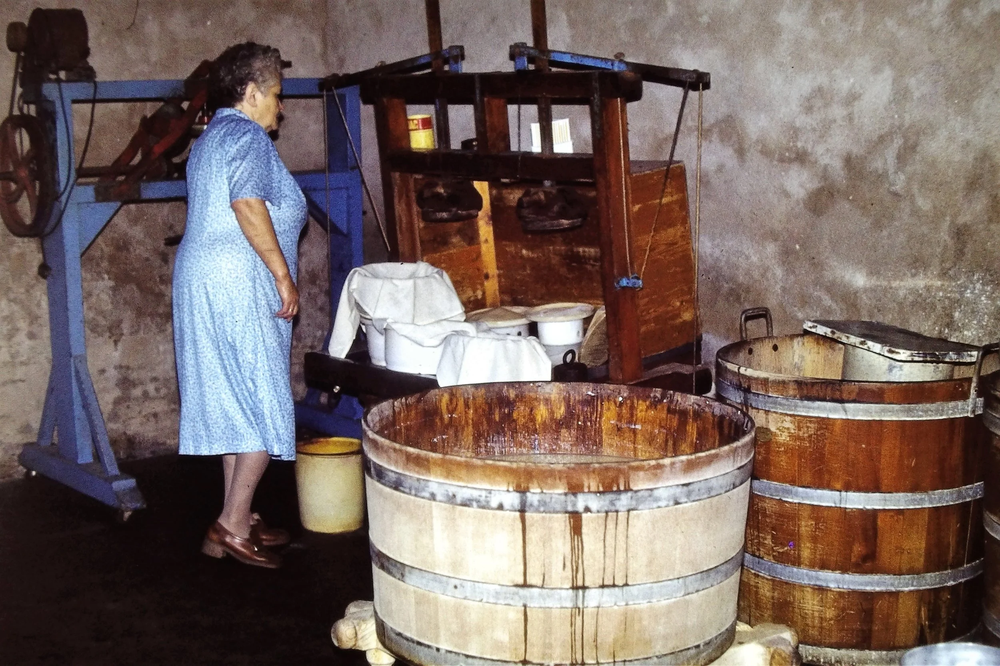

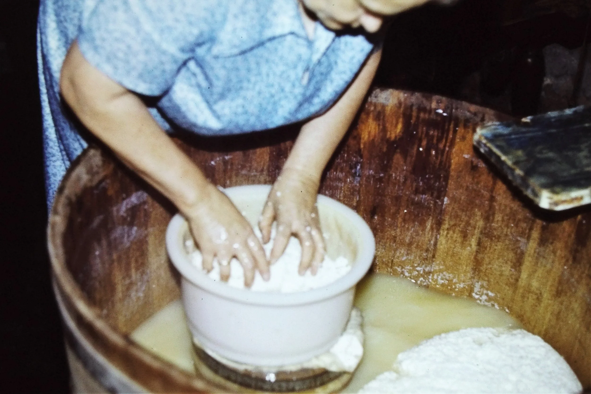

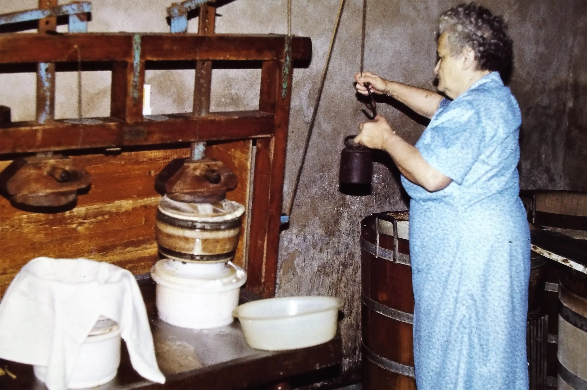

De kaaswrongel werd met de hand in kaaskuipjes met doek gedaan; de deksel was een plank. Later werd in plaats van doek een kunststof net gebruikt.Persen ging per 4 kuipjes (2 x 2 op elkaar gestapeld). Tijd voor persen: 30 minuten. De kazen werden aan twee zijden geperst. De laatste (3e keer) werd zonder externe kracht geperst: de kaas deed het zelf en kreeg daarbij zijn definitieve vorm.

De afgeschepte wei werd gevoerd aan de kalveren en varkens. Pieter is, toen hij het bedrijf overnam, snel gestopt met varkens. “Ik had niks met varkens”, vat hij het samen.

Na het persen worden de kazen gepekeld in een pekelbad. Het zoutgehalte werd gecontroleerd met een ei. Dat ei moest met de punt ter grootte van een gulden boven het pekelwater uitsteken, dan was het zoutgehalte goed. De gepekelde kazen werden wekelijks geborsteld om het zout te verwijderen. Jonge kaas moest 6 weken rijpen en de oude kaas ongeveer een jaar.

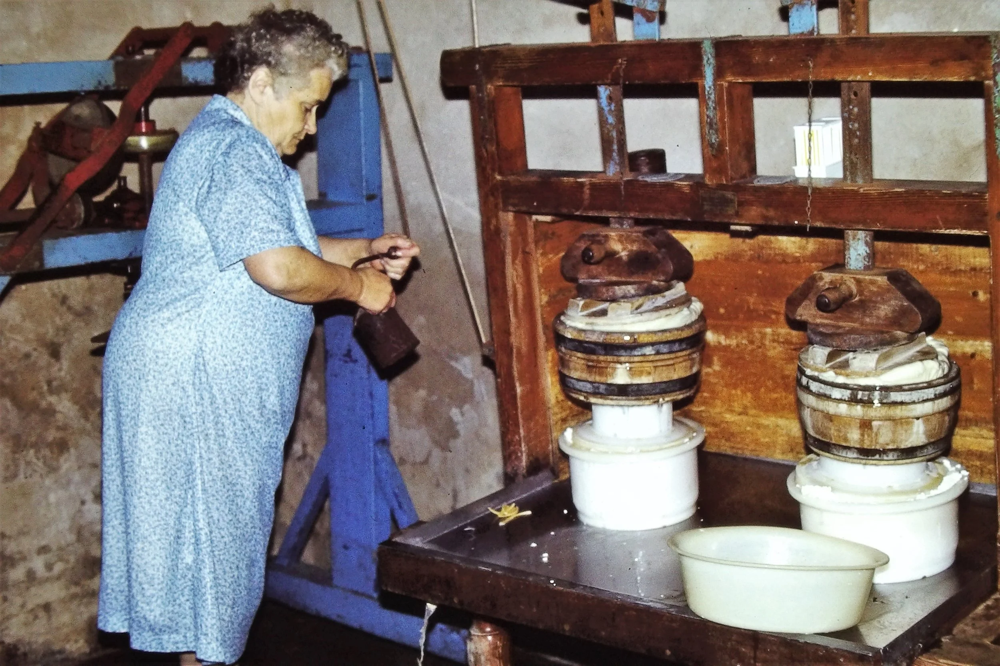

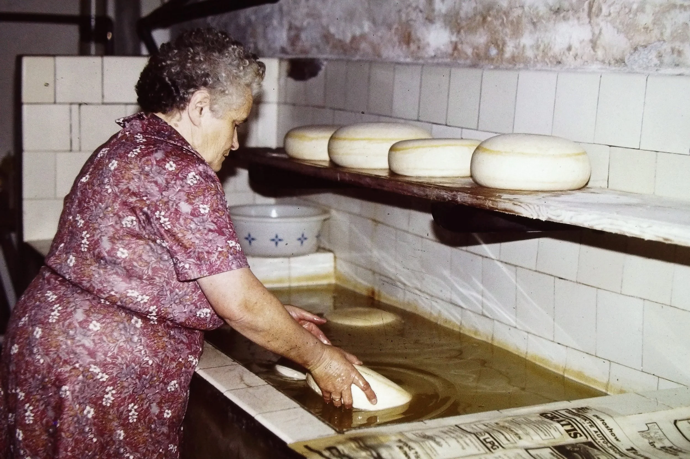

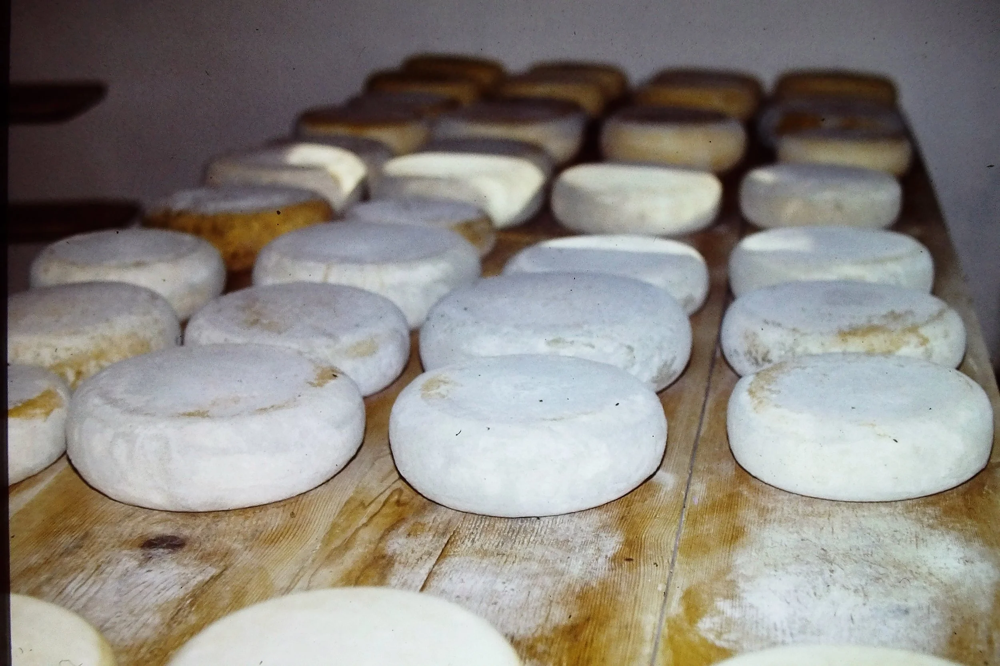

Om de poten van de tafels waarop de kazen lagen werden (met touwtjes) kranten in parapluvorm bevestigd om te voorkomen dat muizen via de poten bij de kaas konden komen.

De kaas werd ook extern gecontroleerd. Was hij goed dan werd hij voorzien van een gestempelde D. Bij de familie Anker werd dat gedaan door ene Wijnands (waarschijnlijk Toon).

De kaasmakerij was interessant als bedrijfsactiviteit in de melkveehouderij en bracht veel op. Slotconclusie van Pieter: inmiddels is op de Kaasweg alle “kaas weg”.

Gerard Veldhuizen en Jan van Woezik – 25 februari 2022
