# familieklerks

> Bron: helenaveenvantoen.nl

### De VéGé-winkel van Albert en Miet Klerks, opening in het voorjaar van 1957

(met dank aan Wilhelmien Koopmans-Klerks)

VéGé staat voor VErkoop GEmeenschap, een landelijke organisatie voor zelfstandige kruideniers in 1938 opgericht door de grossier Theo Albada Jelgersma uit Breda.Het vrijwillige filiaalbedrijf kende in 1961 bijna 29.000 kruideniers in 10 landen.

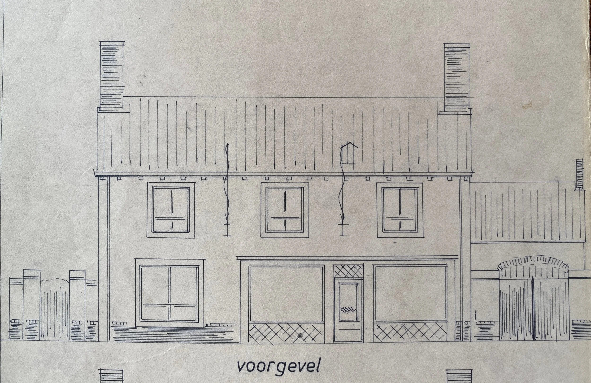

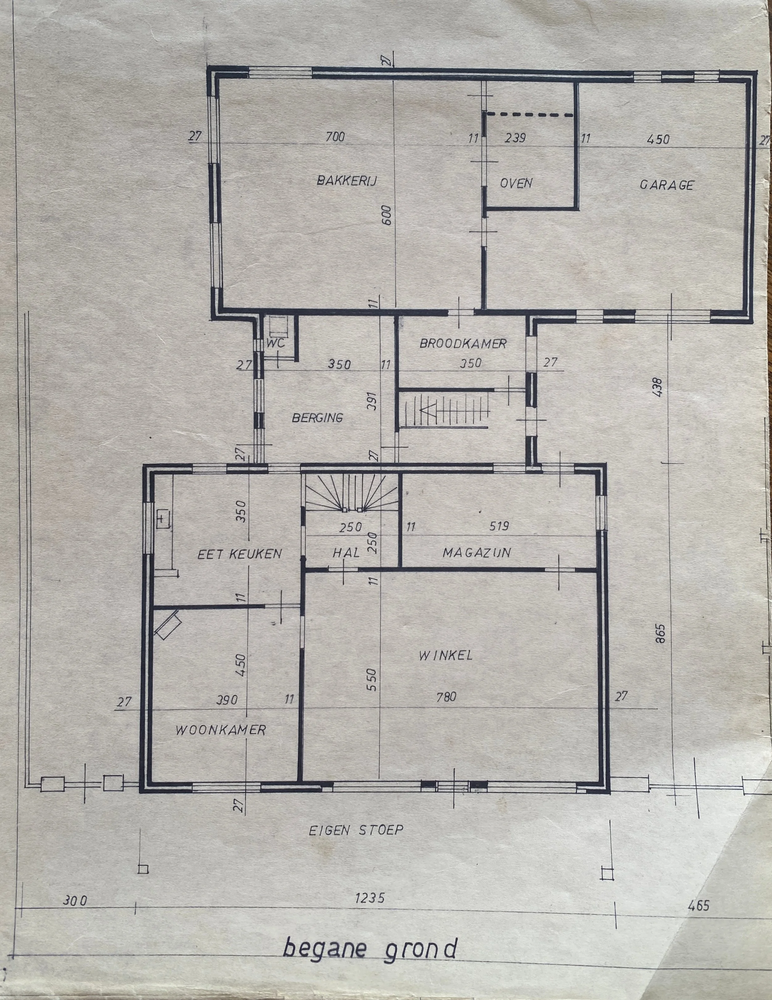

Plattegrond begane grond

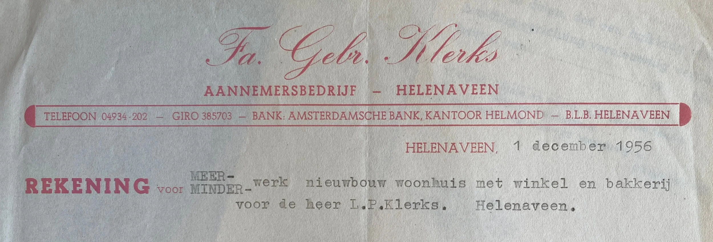

De nieuwe bakkerij / winkel / woonhuis werd gebouwd door het Aannemersbedrijf van de Gebroeders Klerks (Jan en Piet)

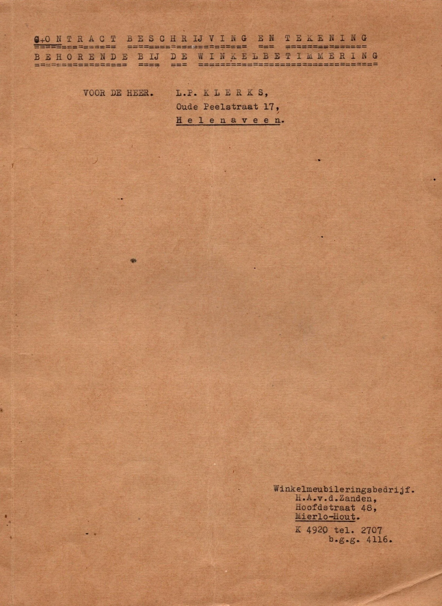

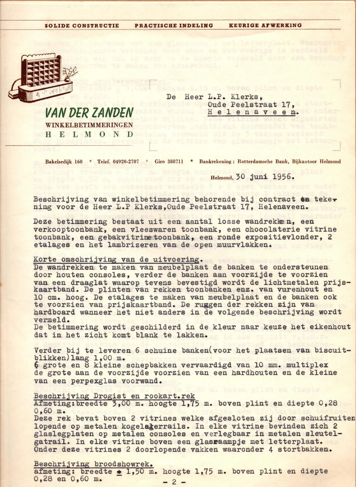

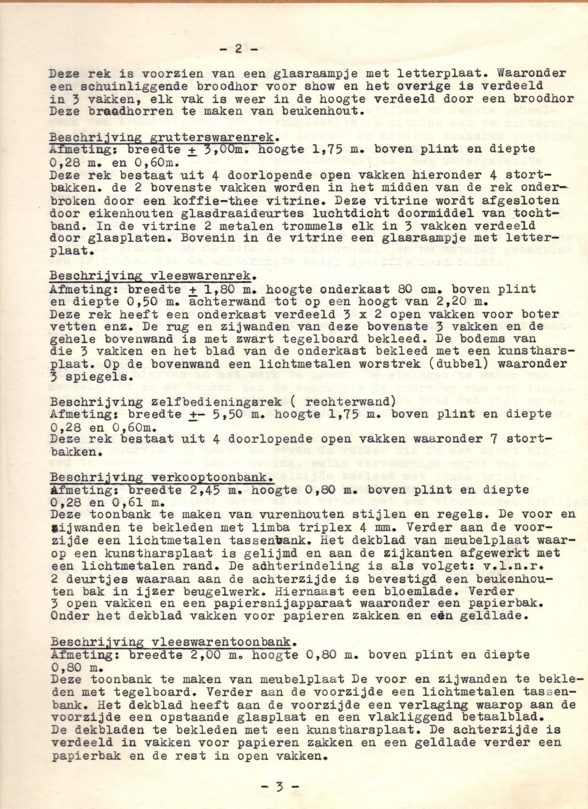

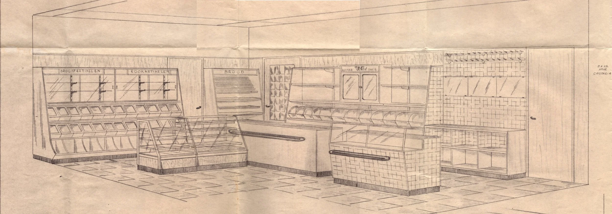

Interieurtekening voor de nieuwe winkel - Ontwerp door H.A. v.d. Zanden, Mierlo-Hout

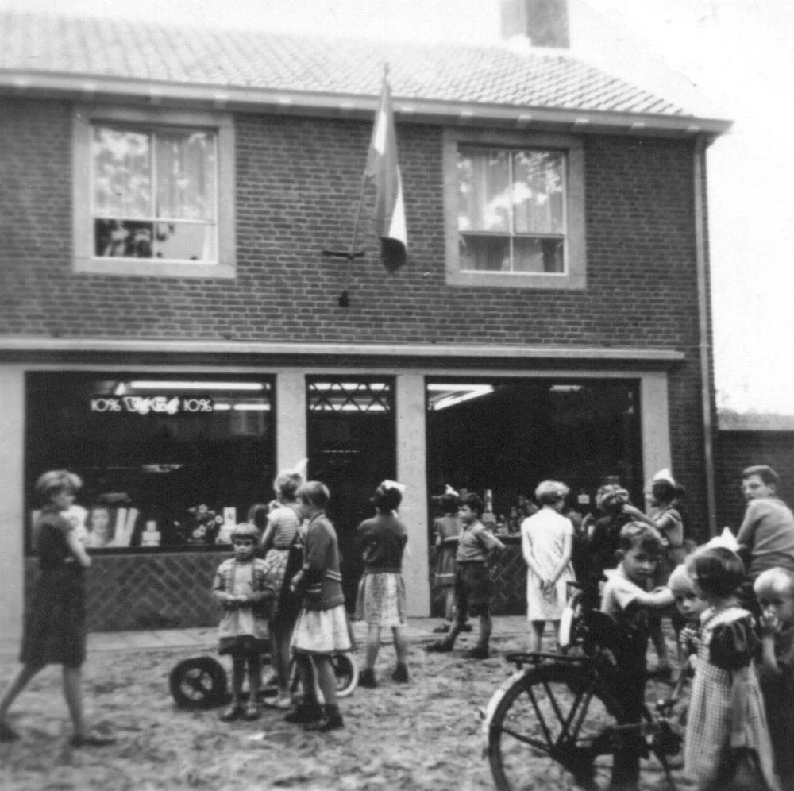

Opening van de nieuwe winkel in het voorjaar van 1957

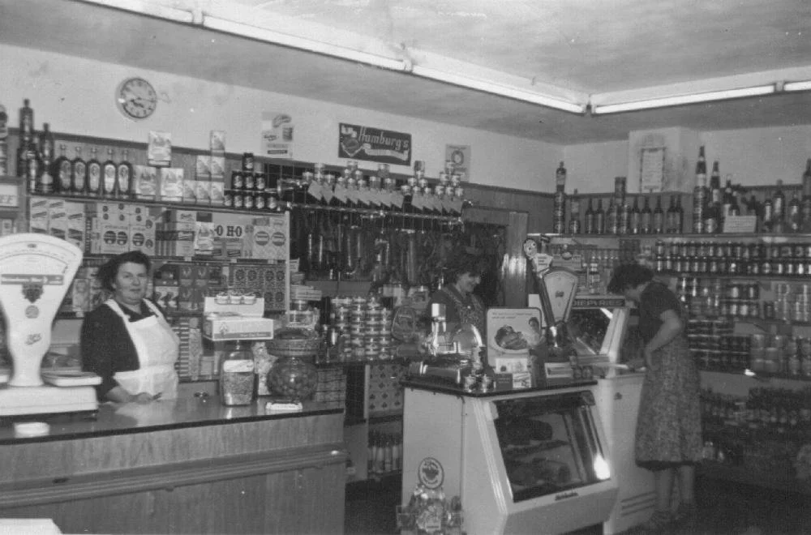

Miet Klerks-Daniëls in de winkel

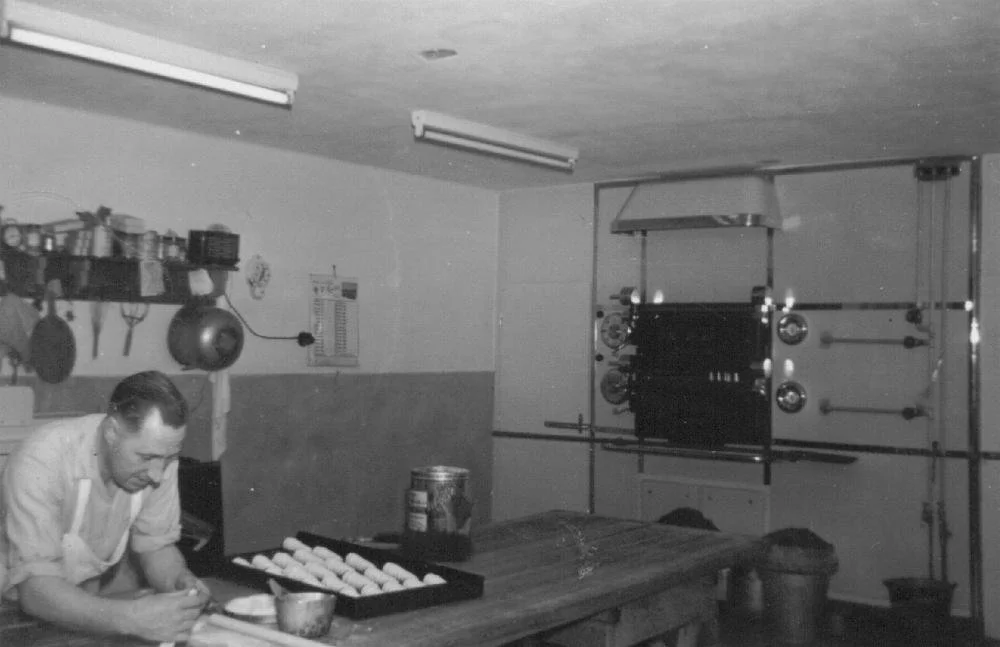

Bakker Albert Klerks aan het werk

Leerboek voor de banketbakker

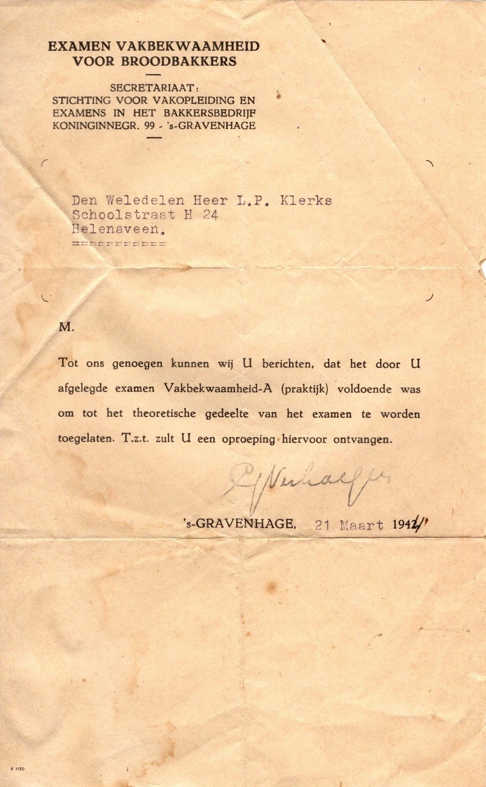

Het praktische examen is behaald. Albert wordt toegelaten tot het theoretische examen.

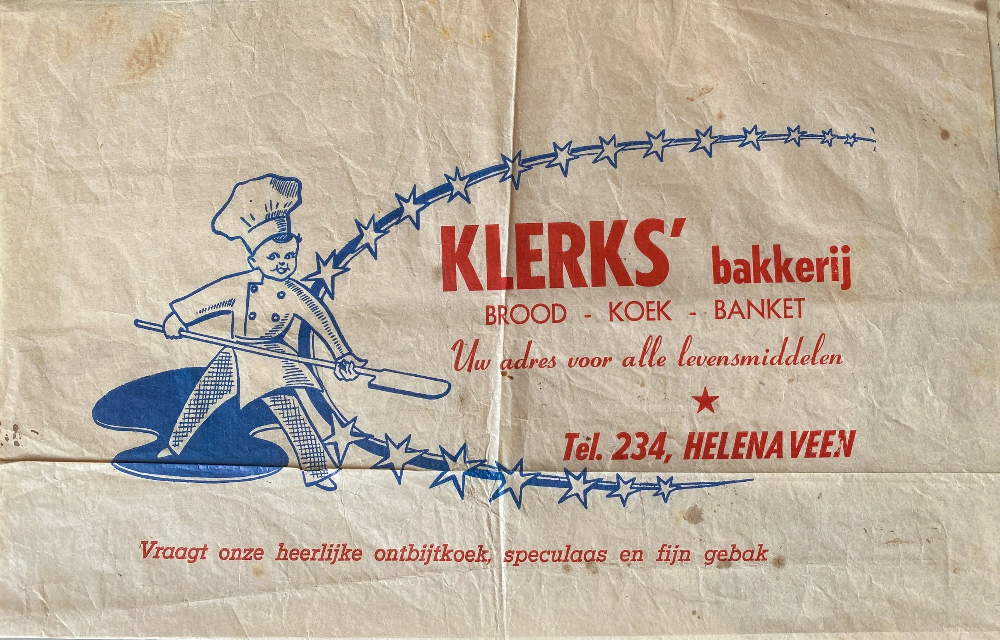

Broodpapier uit de tijd vóór de plastic zakken
