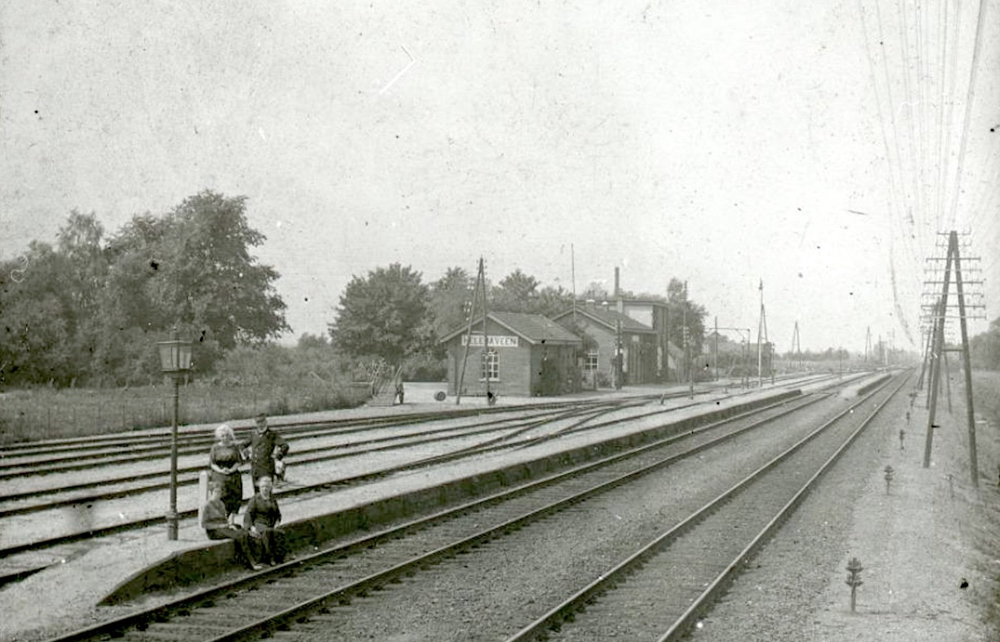
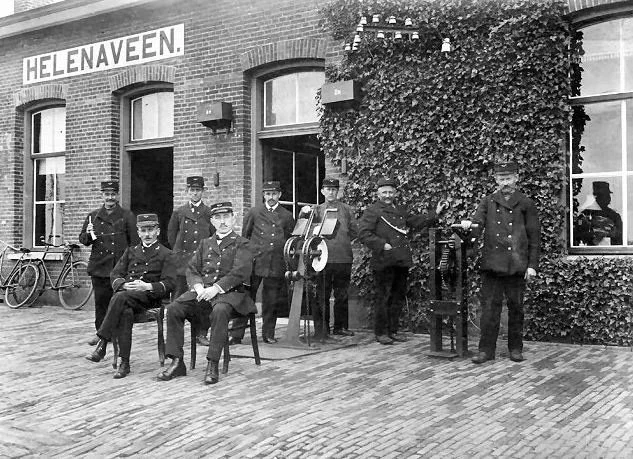
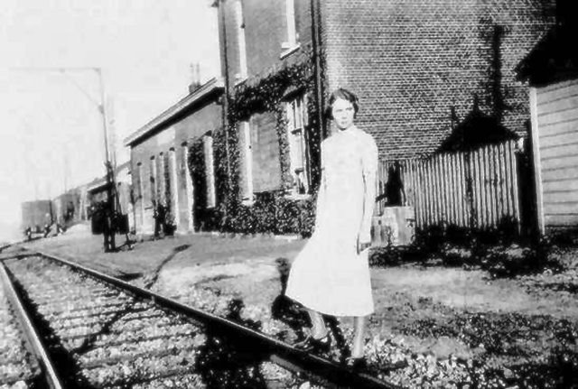
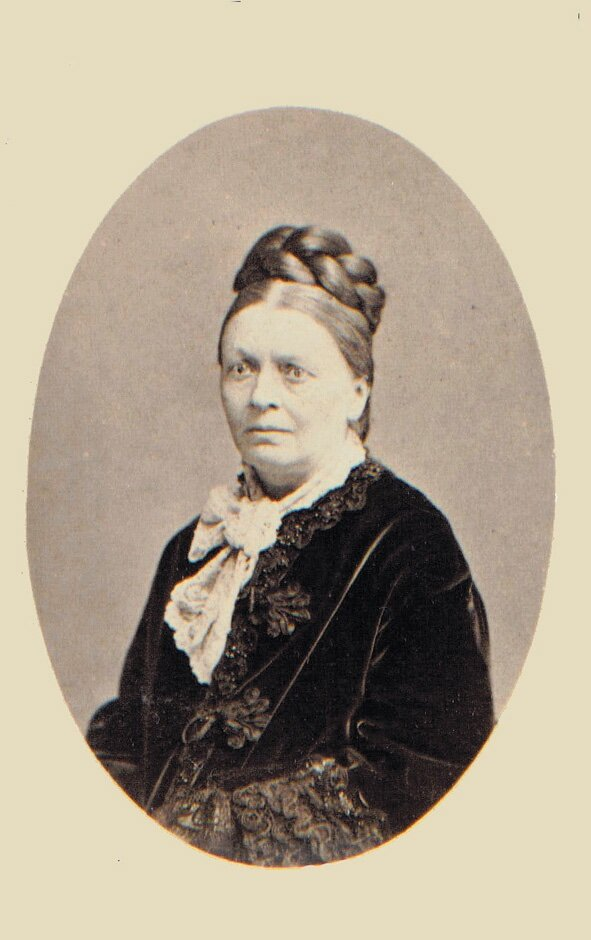
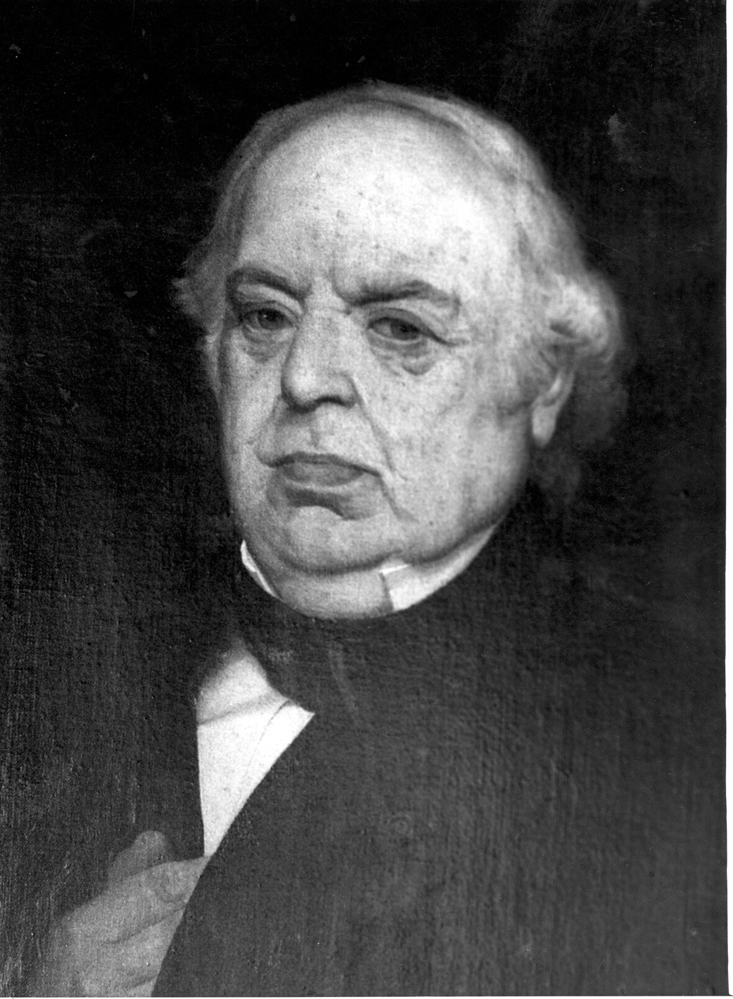
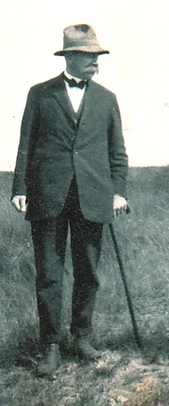
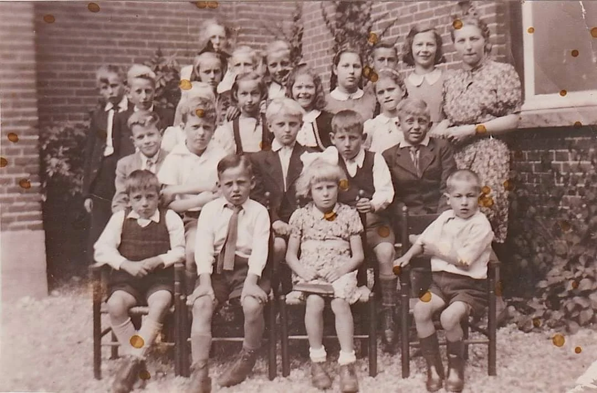

# fotos-2

> Bron: helenaveenvantoen.nl

Station Helenaveen

Personeel station Helenaveen

Station Helenaveen

Helena Panis, de vrouw van Jan van de Griendt. Naamgeefster van Helenaveen en de Helenavaart

Jan van de Griendt

Adrianus Bos (1874-1931) van 1906 tot 1931 directeur van Maatschappij Helenaveen.

Kinderen zondagschool Collectie Mieke Schonewille
