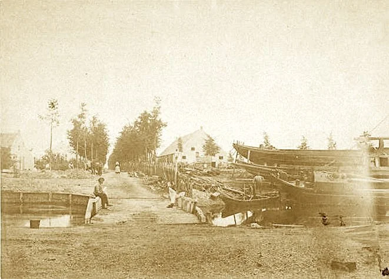
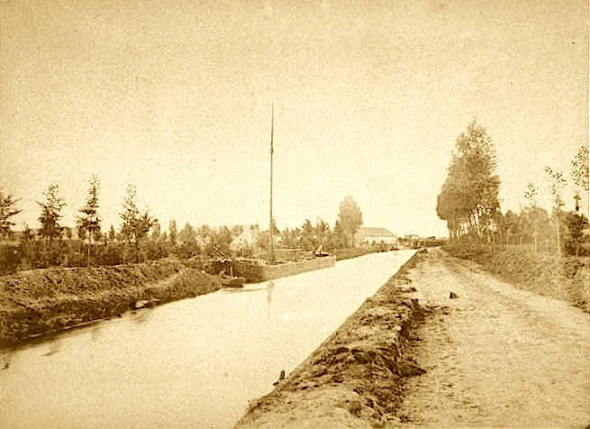
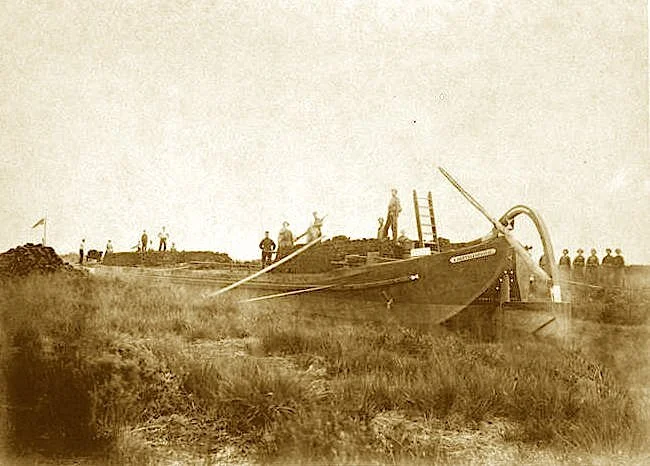

# fotos-turfgraven

> Bron: helenaveenvantoen.nl

Stoomsleepboot Helenaveen in de bocht bij de protestantse kerk

Scheepswerf Geldersestraat

laden van een zeilschip in de Helenavaart

Turfhopen in het veld

Pas gegraven wijk met turfbulten

Turf laden in het veld

Drijvende turfstrooiselfabriek

Turfschip in Helenavaart

Een diepe bank turf

In de oorlog bij Koolweg 60, turf voor Vlisco
