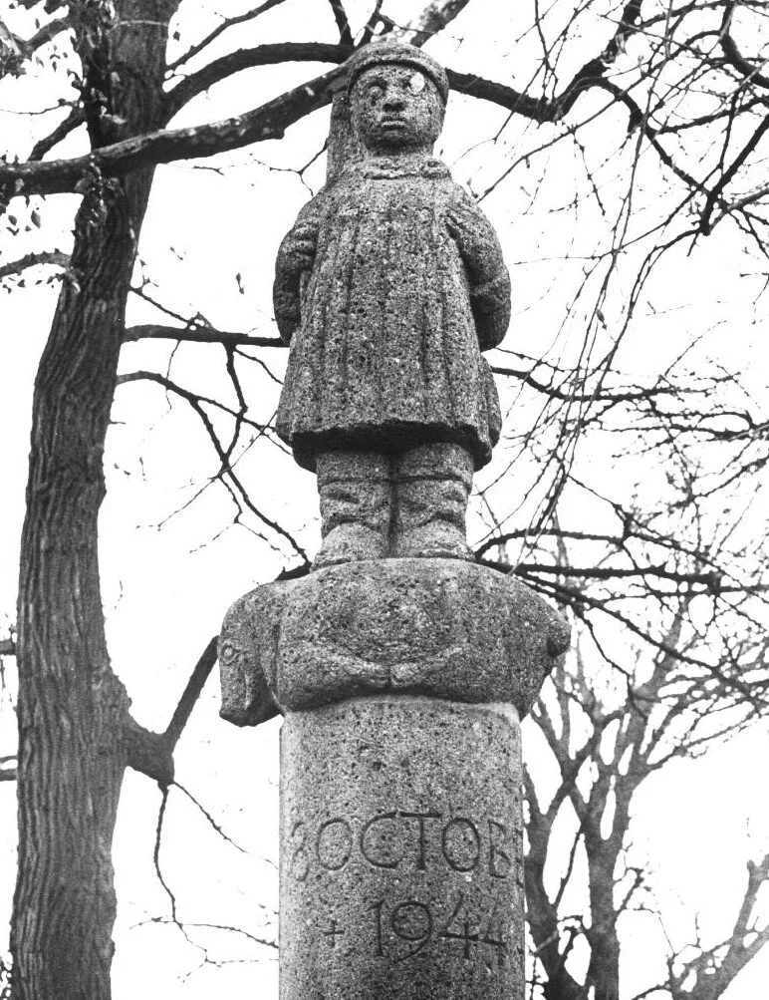

# gedeporteerden-kerkrazzia

> Bron: helenaveenvantoen.nl

### De Kerkrazzia

Plaquette op het monument bij Mariaveen

Monument opgericht door bond van gerepatrieerden

Tijdens de kerkrazzia op 8 oktober 1944 in Helenaveen werden 162 mannen opgepakt en tewerkgesteld in Nazi-Duitsland. 23 van hen overleefden de ontberingen niet. (Dit zijn ander getallen als bekend toen de plakette gemaakt werd.)

(J.v.W oktober 2024: Lijst volgens CDROM Helenaveen 150 jaar, samengevoegd met de lijst in de tweede druk Sporen die Bleven, Oorogsbronnen.nl en de gijzelaars van de aanslag die ook allemaal zijn afgevoerd.Graag commentaar als er onjuistheden in de lijst staan)

Aarts, Johan - 24 jaar oudAarts, Theodorus - 23 jaar oud

Anker, Cor - 18 jaar oudAnker, Klaas - 19 jaar oudAnker, Klaas - 27 jaar oud† Anker, Klaas - 46 jaar oud (overleden in Duitsland)

Arts, Nol - 30 jaar oud† Arts, Arnoldus - 46 jaar oud (overleden in Duitsland) Arts, Sjun - 44 jaar oudArts, Frans - 43 jaar oud (Gijzelaar aanslag)Arts, Marines - 41 jaar oud

Barneveld van, Otto (Onderduiker)

Beks, Sjaa k ( Onderduiker uit Asten)Berg van den, Jan (evacué uit Griendtsveen afkomstig)Berg van den, Piet (evacué uit Griendtsveen afkomstig)Berkers, Antoon (onderduiker)Berkers, Theo ( onderduiker)

Beukers, Stef - 26 jaar oud

Biene van , Sjors (Joodse onderduiker, gijzelaar aanslag)Bovenkamp van de, Bruur - 33 jaar oudBovenkamp van de, Geurt - 23 jaar oudBovenkamp van de, Jan - 25 jaar oud

† Brekelmans, Bert (Op bezoek in Helenaveen, overleden in Duitsland)

† Bremer, Jan - 24 jaar oud (overleden in Duitsland) Bremer, Ot

Brouwer, Gerrit - 32 jaar oud (gijzelaar aanslag)

† Buis, Jan Willem 43 jaar oud (overleden in Duitsland)

Crommentuyn, Arie - 25 jaar oudCrommentuyn, Sjaak - 19 jaar oudCrommentuyn, Leo - 21 jaar oud

† Derks, Berend - 46 jaar oud (overleden in Duitsland) Derks, Jan - 43 jaar oudDerks, Jan - 21 jaar oudDerks, Piet - 18 jaar oudDerks, Geert

Eckendonk van, Driek - 35 jaar oud (Gijzelaar aanslag)Eckendonk, Jantje - 29 jaar oudEckendonk, Marinus - 31 jaar oudEckendonk, Giel - 36 jaar oud

† Erkelens, Bertus - 30 jaar oud (overleden in Duitsland)

Esseveldt van, Bertus - 48 jaar oudEsseveldt van, Lind - 34 jaar oud (Gijzelaar aanslag)

Feijtel, Jacob - 22 jaar oudGend van, Wilhelm - 25 jaar oud (Gijzelaar aanslag)

Gielens, Harrie (evacué uit Griendtsveen)Gielens, Grad (evacué uit Griendtsveen)

† Grunsven van, Cor - 31 jaar oud (overleden in Duitsland)Grunsven van, Hendrikus - 29 jaar oudGrunsven van, Giel - 36 jaar oudGrunsven van, Pietje - 28 jaar oud

Hendriks, Johannes M. - 20 jaar oudHendriks, Jan - 28 jaar oudHendriks, Leo - 32 jaar oud† Hendriks, Piet - 41 jaar oud (overleden in Duitsland) Hendriks, Piet - 35 jaar oud

Hermans, Hubertus Theod. - 43 jaar oud

Hoes, Adriaan - 32 jaar oud (Onderduiker uit Asten)Hoes, Tjeu - 28 jaar oud (Onderduiker uit Asten)

Horen van, Arie - 23 jaar oudHoren van, Cor - 27 jaar oudHoren van, Gerard - 21 jaar oudHoren van, Gerardus h -33 jaar oudHoren van, Piet - 25 jaar oud

Janssen, Toon - 39 jaar oudJanssen, Piet - 33 jaar oud

Jong de, Peer - 33 jaar oud

Joosten, Antoon,Joosten, Job - 27 jaar oudJoosten, Leonard - 27 jaar oud

† Klerks, Harry - 23 jaar oud (Onderduiker overleden in Duitsland)

Kessel van, Grad - 19 jaar oud† Kessel van, Willem - 56 jaar oud (overleden in Duitsland)

Kluitenberg, Gaatse - 18 jaar oud

Kluitmans, Jo - 38 jaar oud

Kroes, Hendrik Jan (onderduiker Westzaan) (Gijzelaar aanslag)

† Kröne, Carl - 29 jaar oud (overleden in Duitsland)

Kreynen, St.J.J -39 jaar oud

Lagarde, Driek - 30 jaar oud† Lagarde, Bertus - 31 jaar oud (overleden in Duitsland † Lagarde, Martinus - 38 jaar oud (overleden in Duitsland) Lagarde, Thedoor - 17 jaar oud

Lieshout van, Arie - 33 jaar oud† Lieshout van, Albert - 22 jaar oud (overleden in Duitsland) Lieshout van, Antoon - 20 jaar oud† Lieshout van, Hendrik - 27 jaar oud (overleden in Duitsland) Lieshout van, Willy - 19 jaar oud

Loon van, Sjaak - 21 jaar oud

Lormans, Adrianus - 16 jaar oud

Luijten, Coen - 22 jaar oudLuijten, Cor - 22 jaar oud† Luijten, Frans - 27 jaar oud (overleden in Duitsland) Luijten, Leo - 30 jaar oud

Maessen, Gradus - 24 jaar oudMaessen, Harrie - 28 jaar oud† Maessen, Naad - 61 jaar oud (overleden in Duitsland)Manders, Jo (Onderduiker)

Mullekom van, Gerard - 31 jaar oudMullekom van, Marinus - 56 jaar oudMullekom van, Hendrik (evacué uit Griendtsveen)

Neerven van, Theodoor - 47 jaar oudNoordergraaf, Kees

Oosterveen, Albert (Appie) - 25 jaar oudOosterveen, Hannes - 31 jaar oudOosterveen, Driekus - 37 jaar oudOosterveen, Roel - 33 jaar oud

Otten, Albert - 41 jaar oud

Otterlo, Adrianus - 29 jaar oud

Philipsen, Jos (evacué uit Meyel)Philipsen, Theo (evacué uit Meyel)

Postuma, Jan - 17 jaar oudPostuma, Oege - 19 jaar oud

Prijs, Jan - 28 jaar oudPrijs, Jan - 26 jaar oud

Roelofs, Johannes ( onderduiker)

† Ruiten van, H.S. - 37 jaar oud (Broeder Leonard, gijzelaar aanslag, overleden in Duitsland))

† Rutten, Andries - 16 jaar oud (overleden in Duitsland) Rutten, Piet - 21 jaar oudRutten, Bert - 19 jaar oud

Schelven van, B.A. (directeur van Maatschappij Helenaveen)

Schonewille, Jan - 37 jaar oud

† Slot, Driek - 37 jaar oud (overleden in Duitsland)

† Snieder, Jan - 39 jaar oud (overleden in Duitsland)

Sonnemans, Sjraar - 20 jaar oudSonnemans, Jan - 16 jaar oudSonnemans, Theo - 17 jaar oud

Stommels, Frans - 36 jaar oud

Swinkels, Willem - 32 jaar oud

Teeffelen van, Hein - 41 jaar oud

Toonen, Chris - 20 jaar oudToonen, Hein - 21 jaar oud

Vechel van, Michel - 33 jaar oud (evacué uit Griendtsveen)

Veldhuyzen, Arie - 53 jaar oud

Verschaeren, Ties - 38 jaar oud

Verstappen, Pietje - 36 jaar oudVerstappen, Harrie -(Uit Asten)

Verstegen, Johan - 26 jaar oud (politieagent in Helenaveen)

† Vleut van de, J. (evacué overleden in Duitsland)

Voert ter, Hein (evacué uit Griendtsveen)

Vries de, Henk - 23 jaar oudVries de, Koos - 31 jaar oud

Wageningen, van (Onderduiker)

Werf van der, Ad - 28 jaar oud (Gijzelaar aanslag)Werf van der, Bas - 33 jaar oudWerf van der, Cor - 35 jaar oudWerf van der, Jan - 40 jaar oud

Woezik van, Piet -43 jaar oud (evacué uit Griendtsveen)

Wullms, Piëre - 26 jaar oud

Wijnands, Harrie - 25 jaar oudWijnands, Toon - 20 jaar oudWijnands, Joseph - 18 jaar oudWijnands, Martien - 56 jaar oudWijnands, Wim - 22 jaar oud

Wijnen, Toontje - 29 jaar oudWijnen, Nol - 27 jaar oudWijnen, Harrie - 21 jaar oudWijnen, Albert - 17 jaar oud

Zanten van, André - 32 jaar oud (Gijzelaar aanslag)

Zwaan van der, Sjaak - 26 jaar oudZwaan van der, Jan - 29 jaar oudZwaan van der, Leo - 24 jaar oud

De volgende inwoners van Helenaveen zijn door oorlogsgeweld om het leven gekomen:- Piet van Lierop (op 31 oktober 1944 werd Piet slachtoffer van granaatvuur tijdens zware gevechten rond Liessel.) - 24 jaar oud- Geesje de Vries-Schonewille (gedood bij granaat inslag in Maasbree) - 46 jaar oud- Jan H. van der Zwaan (op 13 december 1944 was Jan bezig met graafwerk op hel land van zijn vader. Hij stuitte daarbij op een Duitse landmijn die ontplofte. Hij was op slag dood) - 27 jaar oud

### De Kerkrazzia

Zondag 8 oktober 1944 lijkt een mooie zonnige dag te worden, maar het zou heel anders verlopen. De Duitsers zijn bang voor sabotage- en partizanenacties door de bevolking. Bovendien is er in de Duitse fabrieken een groot gebrek aan arbeidskrachten. Door de Duitse fronttroepen (Wehrmachtsoldaten en Fallschirmjäger), Ordnungspolizei ("die Grünen"), Sicherheitspolizei en Sicherheitsdiensten SA en SS wordt een perfect gecoördineerde actie gepland. Overal verschijnen Duitse patrouilles, worden kerken omsingeld en worden in het vrije veld drijfjachten gehouden in alle dorpen van Noord- en Midden-Limburg ten westen van de Maas én het Brabantse Helenaveen. Ongeveer 3000 mannen tussen 16 en 60 jaar in het frontgebied worden opgepakt en naar Duitsland gedeporteerd voor de "Arbeitseinsatz”. Door de tactiek wordt deze actie later 'de Grote Kerkrazzia' genoemd.

Tijdens de Mis van 7.00 uur omsingelen parachutisten ("Fallschirmjäger") de twee kampen (de toenmalige Rijkswerkkampen I en II) in Mariaveen. De mensen worden tijdens de Mis uit de kapel naar buiten gedreven. De Duitsers zetten de wegen af en doorzoeken de kerk en alle huizen. Alle mannen en jongens worden bijeengedreven en afgevoerd in een lange, trieste karavaan. Zonder eten en drinken, zonder extra kleding. Sommige zijn nog in nachtkleding. Volgens de Duitsers moeten ze gaan werken in Maasbree of Helden. Niet iedereen wordt opgepakt; Jan Crommentuijn ontkomt bijvoorbeeld op die zondag, doordat hij met enkelen anderen tijdig kan vluchten. Met een broer, een neef en Walter Kortooms heeft hij zich daarna nog wel ongeveer drie weken schuilgehouden in een groot hol, dat in een schuur gemaakt was. Zijn broers Arie, Leo en Jac ontkomen echter niet.

In een artikel in "Het Licht" van zaterdag 5 mei 1945 verscheen het verhaal van de heer Van Schelven, directeur van Maatschappij Helenaveen, over deze razzia:

“…'t Was 8 Oktober 1944, een stralende zondagmorgen. Door de vredige stilte van de ochtend begaf ik mij naar het klooster van de Paters van de H.H. Harten, die, omdat ze hun eigen klooster, het Pater Damiaanhuis te Sint-Oedenrode moesten verlaten, hun toevlucht hadden gezocht in twee kampen in Helenaveen. 't Liep tegen zeven uur, toen ik daar aankwam. Aanstonds na de dienst verliet ik het kamp weer. Het viel me op, dat er een Duitser op en neer liep alsof hij iets zocht. Ik kreeg achterdocht en dus vroeg ik hem: 'Was wünschen Sie?' Op zijn vraag of ik de burgemeester was, antwoordde ik bevestigend. Ik had mij nl. omdat alle contact met Deurne verbroken was, voor het welzijn van de bevolking als burgemeester uitgegeven. 'Kommen Sie mit!' In het dorp aangekomen zag ik een troep mannen staan, die de moffen tijdens de H. Mis uit de kerk hadden gehaald. De Fallschirmjäger, het gemeenste gespuis van het Duitse leger en het laagste gepeupel van het Duitse volk - die ons dorp al sedert geruime tijd bezetten en onveilig maakten - dreven ons nu voort. Ondertussen werden ook uit de huizen alle zich daar bevindende mannen tevoorschijn gehaald. De colonne groeide gestadig en toen we eindelijk buiten ons dorp stonden, waren er 163 mannen bij elkaar, waarvan 130 uit Helenaveen. We moesten voor twee dagen naar Helden om daar te werken. Dan konden we weer terug…”

De Helenaveners die eerder naar Grashoek waren geëvacueerd, zijn daar niet veilig. Ook daar wordt dezelfde dag een razzia gehouden en te voet gaat de colonne richting Beringe en Panningen. Van Schelven krijgt het met veel woorden klaar dat vijf Helenaveners, die thuis onmogelijk gemist kunnen worden, naar huis mogen. Na de middag vertrekt de colonne lopend naar Helden, nagestaard door een menigte machteloze vrouwen en kinderen en vandaar uit via Kessel, Reuver en Belfeld naar Venlo. Een andere groep waar ook Helenaveners tussen zitten gaat vanuit Panningen via Maasbree en Blerick naar Venlo. Bij elk dorp wordt de groep groter met mannen uit de omgeving. Gedurende de 4 dagen erna worden nog eens 2000 mannen opgepakt in Limburg.

In Venlo worden de "partizanen" in veewagens geladen en in de avond van 8 oktober vertrekt vanaf het station in Venlo een trein met ‘n 50-tal veewagons volgepropt met mensen richting Duitsland. Via Düsseldorf komen ze in de vroege ochtend in Wuppertal-Varresbeck terecht, in doorgangskamp "Am Giebel". Met 25 tot 30 man worden de mannen in kamers van 4 bij 5 meter ondergebracht. Een strozak of iets dergelijks ontbreekt, dus men probeert maar met een opgerolde jas op de betonnen vloer iets te slapen na de uitputtende reis. 's Middags maken de mannen kennis met het kampeten. Het in de openlucht genuttigde brouwsel wordt koolsoep genoemd; een portie warm water waarin koolbladeren ronddrijven en, voor wie geluk heeft, een toevallige aardappel. Het geheel is op "smaak" gebracht met wat omschreven kan worden als anijszaad, peper of zangzaad. Na de soep verschijnt een medewerker van het regionaal "Arbeitsamt" om ieders beroep te noteren, waarna de mannen als slaven op een slavenmarkt door Duitse zakenlui gekeurd en 'gekocht' worden. De mannen uit Helenaveen proberen net als de groepen uit de andere dorpen zoveel mogelijk bij elkaar te blijven. Maar de Duitsers zijn onverbiddelijk: ZIJ bepalen wie waar moet gaan werken. Een deel komt terecht in de Herman Göringwerke te Watenstedt (hoogovens) of op een nevenbedrijf in Drütte; een ander deel moet in de suikerfabrieken van Salzgitter en Nordstemmen aan de slag (daar kun je in ieder geval af en toe wat snoepen om op kracht te blijven). Wie geluk heeft, komt bij een boer terecht. Weer anderen komen in andere bedrijven te werken; één ding hebben alle werkzaamheden met elkaar gemeen. De arbeid is zwaar, smerig en moeilijk en de levensomstandigheden daarbij zijn miserabel. Hard werken met gewapende opzichters achter je, zeven dagen in de week en twaalf uur per dag. Natuurlijk is het eten niet overal hetzelfde, maar gezien de arbeidsomstandigheden is het wel altijd te weinig.

Veel Helenaveners komen via Haverlahwiese in "de hel van Watenstedt" terecht in Lager 6. Er moet gewerkt worden in de slakverwerking bij de hoogovens. Het afval van de hoogovens, de "slakken", wordt met treinen naar de "slakkenberg" gereden en daar in kuilen van 4 bij 6 meter gestort. Dat spul is nog roodgloeiend. Als het een beetje is afgekoeld, moeten de mannen de brokken met grote pikhouwelen uit de kuilen trekken en in stukken hakken. Daar staan ze dan in hun zondagse pak en sommige nog in een zomers outfit, in de stromende regen en bittere kou. En boven een stomende massa slakken. Het is vreselijk zwaar werk.

Een werkdag verloopt als volgt: om 5 uur 's ochtends opstaan en wassen. Elke barak (40 tot 50 mensen) heeft maar één kraan, met alleen maar koud water. Vervolgens gaan ze onder bewaking in optocht naar de werkplek, zonder ontbijt (3 kwartier lopen!) en klokken vóór 6.00 uur. Om 18.00 uur mogen de dwangarbeiders weer naar huis. Voordat de colonne weer aanloopt, krijgt iedereen een bonnetje waarmee ze in het kamp een kommetje koolsoep, twee sneetjes brood en een klein blokje margarine kunnen ophalen. Wie een dag niet kan werken, krijgt geen bonnetje en dus ook geen eten. Ziek zijn kan dus niet.

De leefomstandigheden in de kampen zijn verschrikkelijk. De gevangenen moeten met 40 tot 50 mannen in één houten barak wonen en slapen. De bedden zijn houten kribben, de matrassen strozakken (vervuild en vol met luizen). Iedereen krijgt een paardendeken om onder te slapen. De mannen dragen dag en nacht, in de barakken en tijdens het werk, dezelfde boven- en onderkleding die ze aanhadden toen ze werden opgepakt die achtste oktober. Vrijwel niemand beschikt over reservekleding. De sokken zitten inmiddels vol gaten en van velen zijn de schoenen doorgelopen of zelfs helemaal kapot.

Maar het ergste van alles is het ongedierte: de luizen en de ratten. Ze vormen een ware plaag, maar de mannen hebben geen schoonmaakmiddelen, geen tijd en geen energie om ze buiten de deur te houden.

De omstandigheden waaronder de dwangarbeiders moeten leven zijn erbarmelijk. Ze krijgen veel te weinig eten, hebben onvoldoende kleren en dekens om zich tegen de kou te beschermen, moeten zwaar werk leveren, worden geregeld door hun bewakers afgeranseld, en tot overmaat van ramp worden ze vaak door de geallieerden aangevallen. Die proberen met hun luchtaanvallen de Duitse industrie uit te schakelen, maar treffen daarbij geregeld onschuldige dwangarbeiders.

Vanzelfsprekend wagen sommigen een vluchtpoging. Enkele mislukken en de vluchters worden zwaar gestraft. Twee inwoners van Helenaveen wagen ook een ontsnappingspoging, maar worden niet ver van het fabrieksterrein al verraden. Terug op het terrein takelen de bewakers de jongens met ijzeren staven dermate toe, dat één van hen er blijvend rugletsel aan overhoudt. Het is door tussenkomst van twee Franse krijgsgevangenen, dat ze niet worden doodgeranseld. Anderen lukt zo'n vluchtpoging wel. De broers Theo en Antoon Berkers (afkomstig uit Schinveld, maar ze zaten ondergedoken bij familie in Helenaveen) hebben al een eerdere poging ondernomen, die mislukt was. Hun tweede poging op Tweede Kerstdag (voordeel: onderbezetting van de bewaking) heeft meer succes en vanaf hun werkplek lukt het om weg te komen. Ze volgen het spoorlijntje naar Salzgitter en stappen vervolgens op de trein om met list en een flinke dosis geluk via Brunswijk, Osnabrück in Papenburg te komen, waar Henk Erkelens, hun neef woont. Ze duiken daar vervolgens onder en blijven uit de handen van de Duitsers.

Velen overleven de ontberingen in de kampen niet.

• Frans Luijten is de eerste inwoner van Helenaveen die in Duitsland om het leven komt. Hij verbrijzelt zijn hand en onderarm tussen een lopende band. De Duitsers vinden het niet nodig om hem te verzorgen, want hij zal hen toch niet meer van nut kunnen zijn. Ze laten hem creperen. Op 14 december 1944 sterft hij onder helse pijnen op 27-jarige leeftijd in een van de Duitse kampen (officiële doodsoorzaak: "Herzschwäche" oftewel hartzwakte).

• Jan Willem Buis is 43 jaar oud en gehuwd, wanneer hij op 23 januari in het Krankenhaus te Drütte overlijdt aan darmcatarre.

• Andries Rutten is pas 16 jaar oud, wanneer algehele verzwakking en uitputting ("Herzschlag") op 1 februari een einde aan zijn leven maakt.

• Bertus Erkelens (30 jaar) probeert samen met een zekere Harrie vanuit Watenstedt-Salzgitter zijn broer Henk te bezoeken, die in Papenburg woont en werkzaam is. Ze zijn echter niet in het bezit van geldige reispapieren en worden uit de trein gehaald en meegenomen. Na een verblijf in een strafkamp overlijdt Bertus Erkelens in Oldenburg op 1 februari 1945. (Bertus vertelt kort voor zijn dood tegen zijn broer Henk: "In Watenstedt is het nog een hemel daartegen, want in het Lager krijgt je helemaal geen eten, en wel veel slaag")

• Berend Derks uit Helenaveen (46 jaar) vindt op 5 maart de dood in Lager 24, het "Todeslager". Men vindt het niet nodig de doodsoorzaak te vermelden.

• Als zoveel anderen wordt ook Leonard Maessen (55 jaar), wegens arbeidsongeschiktheid, verwezen naar Lager 24. Voor hem komt de dood op 16 maart.

• Op 22 maart 1945 komt Jan Bremer om in het Gestapo-Straflager 21 bij Hallendorf ("Herz- und Kreislaufschwäche", met andere woorden: totale verzwakking). Jan is 25 jaar en gehuwd.

• Op 26 maart overlijdt Willem van Kessel in Hildesheim.

• Cornelis van Grunsven (32 jaar) is één van de mannen die vóór de komst van de geallieerden weg kan vluchten uit Watenstedt. Op 3 april komt hij in Holzminden om tijdens een bombardement.

• Wanneer Bertus Lagarde op 8 oktober 1944 wordt opgepakt is zijn vrouw net zwanger van hun zevende kind. Bertus sterft op 13 april 1945 in een kapotgebombardeerde kerk in Hildesheim, helemaal uitgeteerd en uitgemergeld.

• Albert van Lieshout verblijft in het kampziekenhuis te Drütte tijdens de bevrijding. Hij is echter te zeer verzwakt om naar huis te gaan en overlijdt daar op 7 mei op 22-jarige leeftijd.

• Op 13 mei, acht dagen na zijn terugkeer uit de hel van Watenstedt, overlijdt in het ziekenhuis van Maastricht Arnoldus Arts op 47-jarige leeftijd.

• Hendrik van Lieshout (broer van Albert) verblijft tijdens de bevrijding in het "Todeslager". Hij is daar zover verzwakt dat een terugkeer naar huis niet mogelijk is. In de loop van mei wordt Hendrik door de geallieerden per vliegtuig overgebracht naar Reims in Noord-Frankrijk. Daar wordt hij opgenomen in de TBC-afdeling van een Amerikaans hospitaal. Hendrik sterft daar op 11 juni 1945.

Dit zijn maar enkele Helenaveense inwoners, die niet meer teruggekomen zijn. Van de 135 mannen uit Helenaveen die naar Duitsland gedeporteerd waren, komen er 26 niet meer thuis. Sommigen hebben de bevrijding door de Amerikanen nog wel meegemaakt, maar waren te verzwakt om er nog bovenop te komen.

Het duurt even voordat de mannen door het kapotgeschoten Duitsland weer terug naar huis konden. En wanneer het eenmaal zover is, worden ze eerst naar opvangcentra aan de Nederlandse grens gebracht. Daar proberen ambtenaren de Nederlanders, die vrijwillig naar Duitsland waren gegaan eruit te zoeken. Wanneer men het maar even niet vertrouwt, krijgt die persoon een grote rode 'V' (van 'verdacht') op zijn registratiekaart.

Voor de directeur van Maatschappij Helenaveen, de heer Van Schelven zou het duren tot vrijdag 27 april 1945 voor hij Helenaveen terugziet. Voor P. Janssen duurt het zelfs tot 11 mei 1945 voor hij uitbundig verwelkomd wordt in zijn woonplaats.

Bij de achtergeblevenen in Helenaveen leeft na de razzia de grote angst en de onzekerheid. Waar zijn onze mannen en zonen? Hoe maken ze het? Komen ze wel terug en wanneer? Vragen waar niemand een antwoord op weet. In het dorp heerst een akelige stilte, die slechts doorbroken wordt door een verdwaalde kogel en vliegtuiggeronk. Drie jonge meisjes moeten zich bij de Duitse staf melden om dagelijks aardappelen voor de soldaten te schillen. Weer is er de angst bij de ouders en andere mensen, dat het niet alleen om het keukenwerk zou gaan. Wanneer op 18 oktober de keukenwagen vertrekt en het werk voorbij is, haalt iedereen weer even opgelucht adem. Niet voor lang echter, want daags erna worden de bruggen opgeblazen door een "Sprengkommando". Helenaveen is afgesloten van de bewoonde wereld. Naderhand stichten de Duitsers op grote schaal brand.

Helenaveen is het laatste kerkdorp van Deurne, dat in Duitse handen is. Heel het dorp is leeggeplunderd en bijna iedereen is vertrokken. Veel Helenaveense vluchtelingen hebben in Kronenberg en Sevenum onderdak gevonden. Het is nauwelijks mogelijk om even thuis te gaan kijken, hoe de situatie is. Met gebruikmaking van de kanalen houden de Duitsers het dorp als het ware op slot. Intussen beginnen de geallieerde strijdmachten aan hun laatste gevechtshandelingen op Zuid-Nederlands grondgebied. De Maas moet bereikt worden en om daar te komen, moeten de Britse troepen de vijand stap voor stap terugdrijven. Op 14 november 1944 start deze operatie, die de naam "Nutcracker" krijgt. Meijel wordt bevrijd en de Britten gaan vervolgens stug door, ondanks de regen die dag in dag uit blijft vallen. Op 19 november kan de 15e Schotse divisie de oversteek van het Deurnese kanaal maken en de bevrijding van Helenaveen is snel een feit. Een van deze Schotse bevrijders is de 19-jarige Clifford Secker, die onder de wapens is gegaan in plaats van zijn broer, die thuis niet zo goed gemist kon worden. Helaas moet hij zijn goede daad met de dood bekopen. Rond half november 1944 komt hij met een patrouille terecht in de velden van de tuinderij van de familie Veldhuijzen. Door de Duitsers zijn daar echter mijnenvelden aangelegd en de hele groep sneuvelt hierdoor.

De heer C. Veldhuijzen vertelt in 1985 zijn verhaal in Het Weekblad voor Deurne. Toen hij na de strijd om Helenaveen terugkeerde, zag hij tien gesneuvelde geallieerden liggen. Op 120 meter afstand ontdekte hij nog een gesneuvelde militair, die niet op een mijn is getrapt, maar door een schot in het hoofd om het leven is gekomen. Kennelijk heeft hij flink om het behoud van zijn leven gestreden, want er lagen wel zo`n honderd lege geweerhulzen naast hem. In de portefeuille uit het uniform stond de naam Secker.

Alsof de Duitsers nog niet voor genoeg ellende gezorgd hebben in Helenaveen. Op 20 november 1944 steken de Duitsers tijdens hun terugtocht de kerk, de pastorie en het klooster met de meisjesschool in brand. Merkwaardig is dat het beeld van Ignatius blijft staan op de ruïne van het zusterklooster. Ook van het winkeltje van Bertus Klerks tegenover de R.K. Kerk blijft niet veel over, evenals van Café van Horen. Aken van de Maatschappij worden door de Duitsers opgeblazen. Een spoor van vuur en vernieling laten zij achter zich. De weinige mensen die nog in het dorp zijn achtergebleven, krijgen de eerste bevrijders te zien. Ze krijgen cake, biscuit, chocola en sigaretten van de Tommies. Wat een geweldige luxe na zo'n lange periode van ontbering en onderdrukking. Vanwege het mijnengevaar mogen de bewoners niet onmiddellijk terugkeren naar hun woningen of naar de overblijfselen ervan. Rondom het hele dorp liggen mijnen en pas tegen Kerstmis mag iedereen weer terugkomen, ook al zijn nog lang niet alle explosieven opgeruimd.
