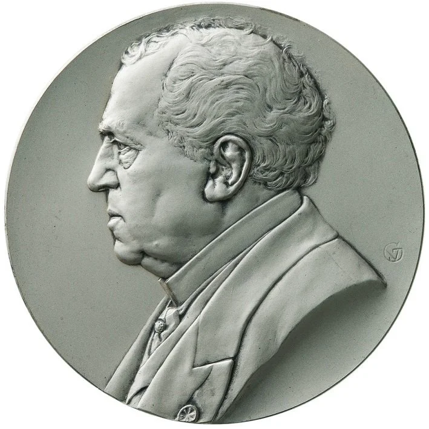
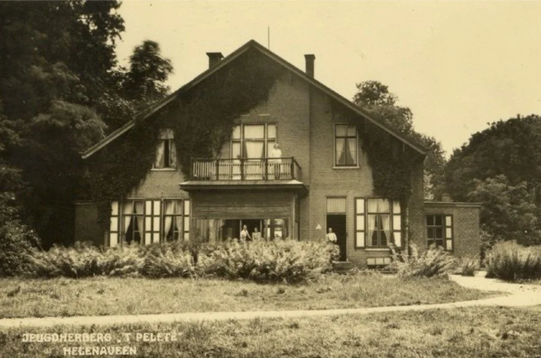

# gereformeerde-kerk

> Bron: helenaveenvantoen.nl

## DE GEREFORMEERDE KERK TE HELENAVEEN (1892-1926)

door GJKOK. 15 JULI 2021

### Een kleine Kerk zonder kerk en dominee.

De hervormde gemeente in het Noord-Brabantse Helenaveen ontstond in 1870 vanuit de hervormde gemeente te Deurne. Het hervormde kerkje aan de Soemeersingel was al eerder in gebruik genomen, namelijk op 3 november 1867. Ook veel Peelwerkers, die in dat gebied in die tijd turf staken en kanalen groeven, bezochten het kerkje.

### De Hervormde Gemeente te Helenaveen.

Ook in Helenaveen bestond bij sommige gemeenteleden onvrede over de toenemende vrijzinnigheid in de hervormde kerk en over de synodale hiërarchie, zoals de centralistische hervormde kerkregering genoemd werd, vertegenwoordigd door de Algemeene Synode en haar Algemeene Synodale Commissie

Zo werkte de synodale hiërarchie volgens ‘De Heraut’: de synode aan de knoppen. Kuyper wilde de kerkenraden ‘aan de knoppen’.

De plaatselijke kerkenraden dansten naar de pijpen van de synode, terwijl bij steeds meer hervormden het besef ontwaakte dat – zoals dr. A. Kuyper (1837-1920) betoogde – de macht bij de plaatselijke kerkenraad behoorde te liggen. Het Algemeen Reglement voor het Bestuur van de Hervormde Kerk verhinderde zulks echter; het was in 1816 in de plaats gekomen van de aloude gereformeerde Dordtse Kerkorde, die aan de plaatselijke kerken juist de ruimte liet.

Dr. A. Kuyper (1837-1920), voorman van de Doleantie.

### Een verzoek om ‘de reformatie der kerk ter hand te nemen’.

Herhaalde malen werd door Helenaveense gemeenteleden geprobeerd bij hun eigen kerkenraad ‘veranderingen ten goede‘ teweeg te brengen, maar toen die uitbleven namen enkelen van hen in 1889 contact op met de ‘gecombineerde classis ‘s-Hertogenbosch– Breda-Heusden-Eindhoven–Maastricht van de Dolerende Kerken, met een verzoek om advies. Op grond daarvan richtten ze zich in 1889 in een schrijven officieel tot de kerkenraad van Helenaveen, met het verzoek ‘de reformatie der hervormde gemeente ter hand te nemen, het Algemeen Reglement voor de gemeente te Helenaveen af te schaffen en opnieuw kracht en geldigheid te verlenen aan de Dordtse Kerkorde’.

“Het verzoek werd op ongeloovige en hooghartige wijze door deze blinde leidslieden en ontrouwe opzieners afgewezen, en werd het ongeloof openlijk uitgesproken en aangeprezen”, zo meldden de notulen van de eerste kerkenraadsvergadering van de Dolerende kerk. De briefschrijvers wilden de kerkenraad echter nog wat tijd geven om verbetering te tonen, en stelden zich zo lang onder het opzicht van de hervormde gemeente te Helmond, maar ook na een paar jaar wachten, veranderde de houding van de Helenaveense kerkenraad niet.

### Ambtsdragers gekozen.

Ds. J.H. Feringa (1859-1925).

Daarom namen de briefschrijvers eind 1891 opnieuw contact op met de classis …. van de Dolerende Kerken, en verzochten de broeders om hulp bij de instituering van de Dolerende Kerk te Helenaveen. In opdracht van de classis kwam daarom ds. J.H. Feringa (1859-1925) van Klundert op 12 januari 1892 naar Helenaveen de noodzaak van ‘de reformatie der kerk’ uit te leggen en te onderzoeken of de instituering van een Dolerende Kerk in Helenaveen mogelijk was. Men had de pech dat in Helenaveen op dat moment een felle brand woedde, waardoor slechts weinig belangstellenden op de vergadering aanwezig waren, hoewel alle hervormde gemeenteleden een uitnodiging voor de vergadering hadden ontvangen.

Ds. Feringa begon de bijeenkomst in een particuliere woning met een korte preek naar aanleiding van Jesaja 40 de verzen 9 tot 11, handelend over ‘de voorzegging van Israëls verlossing’. Na de dienst vertelde ds. Feringa wat de bedoeling van zijn komst naar Helenaveen was, die plaatsvond in opdracht van en namens de classis. Hij wees op de toestand in de Hervormde Kerk en wees op de noodzaak van de reformatie der kerk. “Aanwezig zijn (benevens vele niet stembevoegden) de volgende zes stemgerechtigden die bij rondvraag allen instemming betuigden met de leer en de Vrijmaking der Gereformeerde Kerken [c.q. met de Doleantie]: A. Buijs, G. Buijs, F. Blankenstijn, J. Veldman, G. Brink en J. van de Bovenkamp.

Vervolgens riep ds. Feringa hen op ambtsdragers te kiezen overeenkomstig de opdracht in Gods Woord en in overeenstemming met de Dordtse Kerkorde. De stemming verliep kennelijk niet zo makkelijk. Want de notulen melden, dat – ‘na vele stemmingen en herstemmingen met gesloten briefjes’ – gekozen werden A. Buijs en G. Buijs als ouderlingen en F. Blankenstijn als diaken. Hun namen zouden de komende twee weken in de godsdienstoefeningen worden afgekondigd en indien geen gegronde bezwaren binnenkwamen, zouden ze op zondag 31 januari 1892 in het ambt bevestigd worden, tenzij de vroegere ambtsdragers – die van de hervormde gemeente – zich nog mochten bekeren.

### De Nederduitsche Gereformeerde Kerk (doleerende) te Helenaveen geïnstitueerd.

Dat laatste gebeurde echter niet. Vandaar dat ds. Feringa op zaterdag 30 januari opnieuw naar Helenaveen reisde om op zondag 31 januari 1892 de verkozenen in hun ambt te bevestigen, waardoor de Nederduitsche Gereformeerde Kerk (doleerende) officieel geïnstitueerd werd.

Prof. dr. F.L. Rutgers (1836-1917).

### Ds. Feringa zwaar beladen naar Helenaveen…

Dr. Feringa had van de classis opdracht gekregen niet alleen behulpzaam te zijn bij de instituering van de kerk, maar ook te zorgen voor de nodige officiële stukken, zodat de kerkenraad van de jonge Kerk wist waar hij zich aan te houden had. Zijn kerkenraad in Klundert had hem daarom van alles meegegeven: twee exemplaren van de Dordtse Kerkorde (waarvan één exemplaar bestemd was ter kennisgeving aan de regering), het landelijk kerkelijk handboekje van de Nederduitsche Gereformeerde Kerk (doleerende) van 1892 (handig voor het contact met de zusterkerken), de Acta van de eerste officiële bijeenkomst van Dolerende Kerken (het Synodaal Convent van 1887) en de Acta van de daarop volgende Voorlopige Synodes van de Nederduitsche Gereformeerde Kerken, namelijk die van 1888 tot en met 1891.

In ‘De Heraut’ van 7 februari 1892 werd de instituering van de kerk te Helenaveen officieel bekend gemaakt.

Namens de classis deelde ds. Feringa allerlei andere cadeaus uit: “doop-, avondmaals-, huwelijks-, censuur-, notulen- en buitenledenboeken en de nodige duplicaatboeken”. Bovendien kregen ze de kosten vergoed van de gezegelde verzending van de stukken voor de regering. Ook ontving de kerkenraad uit handen van de predikant (namens de classis) een tiental blanco credentiebrieven (formulieren waarmee officieel verklaard werd dat de afgevaardigden naar de synode werkelijk door de kerkenraad als zodanig benoemd waren). Verder had de predikant ook nog een aantal door hemzelf geschreven traktaatjes bij zich, die op de catechisaties mooi gebruikt konden worden.

Met andere woorden: ongetwijfeld kwam de predikant zwaar beladen in Helenaveen aan, en keerde hij op maandag 12 februari weer opgelucht – want ontdaan van zijn bagage – vanuit Helenaveen naar Klundert terug. Als consulent zou hij de kerkenraad tot 1897 – toen hij naar de kerk van Zaandam vertrok – van advies blijven dienen.

### Iets over het kerkelijk leven.

De volledige vierdelige prekenserie ‘Uit de Diepte’ (1886-1890), waarvan men in Helenaveen ongetwijfeld (ook) gebruik maakte.

Tot preses van de kerkenraad werd G. Buijs benoemd en tot scriba F. Blankenstijn. De kerkdiensten werden gehouden in de woning van de familie Buijs in de Geldersestraat, twee keer per zondag, namelijk ’s ochtends om 10 uur en ’s avonds om 6 uur. Soms kwam een classispredikant of een dominee van verder weg om een kerkdienst te leiden, de doop en/of het avondmaal te bedienen, of een andere voorganger, maar vaak las een van de ouderlingen een preek. Er was een voor de Dolerenden zeer betrouwbare prekenserie in de handel: Uit de Diepte. In vier dikke delen waren talloze preken van Dolerende predikanten uit de begintijd van de Doleantie bijeengebracht.

In totaal hadden zich vier gezinnen en enkele alleenstaande personen in Helenaveen losgemaakt van de Hervormde Gemeente. De Gereformeerde Kerk in dat dorp heeft nooit een eigen kerkgebouw of een eigen predikant gehad. De enige eigendommen van de kerk bestonden uit een doopvont, een avondmaalstel, een collectezak, een lessenaar en twaalf stoelen!

De Geldersestraat (hier rond 1900), waar jarenlang de gereformeerde kerkdiensten gehouden werden.

Nadat de kerkdiensten enkele jaren gehouden waren in de woning van de familie Buijs in de Geldersestraat, koos men (mogelijk door het enigszins toenemende aantal bezoekers) als plaats van samenkomst de woning van de familie Kappe in Griendtsveen. Maar omdat de afstand zo groot was (tweemaal anderhalve kilometer lopen) werd na verloop van een aantal jaren de tweede kerkdienst afgeschaft. Bovendien ging de familie Kappe verhuizen, en besloot men weer in de woning van de familie Buijs aan de Geldersestraat in Helenaveen te gaan kerken.

### De Gereformeerde Kerk te Helenaveen (1892).

De Nederduitsche Gereformeerde Kerk (doleerende) te Helenaveen werd dus op 31 januari 1892 geïnstitueerd door de bevestiging van de ambtsdragers. Ondertussen waren sinds 1887 al contacten gelegd tussen de synodes van de Christelijke Gereformeerde Kerk en de Nederduitsche Gereformeerde Kerken (resp. afkomstig uit Afscheiding en Doleantie), om te komen tot eenwording. Dat lukte officieel per 17 juni 1892, dus enkele maanden na de instituering van de Dolerende Kerk te Helenaveen. Ook díe kerk sloot zich in 1892 aan bij De Gereformeerde Kerken in Nederland, zoals de twee ‘ineengesmolten’ kerkgenootschappen sinds 17 juni 1892 genoemd werden. De Nederduitsche Gereformeerde Kerk te Helenaveen heette sindsdien dus De Gereformeerde Kerk te Helenaveen.

### Een wijkgemeente van Helmond (1926).

De gereformeerde kerk aan de Kromme Steenweg te Helmond (foto: Reliwiki).

Vanaf november 1926 werd de te kleine Gereformeerde Kerk te Helenaveen opgeheven en werd gereformeerd Helenaveen een wijkgemeente van de Gereformeerde Kerk te Helmond. Daardoor werd de kerk van Helmond meer bij het wel en wee van de gereformeerden in Helenaveen betrokken. Maar de gereformeerden bleven toch meestal in Helenaveen bij elkaar komen. Zo werd in november 1931 afgesproken dat elke zondag in Helenaveen een kerkdienst gehouden zou worden waar de predikant eens per maand zou voorgaan en voor de rest de Helmondse ouderling G.B. Praasterink een preek zou lezen.

### Een eigen ouderling in de Helmondse kerkenraad.

Overigens was in oktober 1941 besloten een in Helenaveen woonachtige ouderling te benoemen die speciaal de belangen van de gereformeerden in Helenaveen zou behartigen. Ouderling C. Hoogendoorn werd in die functie benoemd. Sinds 1943 kerkten de gereformeerden van Helenaveen trouwens in de huiskamer van de familie Hoogendoorn, in de voormalige jeugdherberg aan de Geldersestraat 2a. Daar woonde de familie sinds hun boerderij afbrandde. Ouderling Hoogendoorn werd opgevolgd door zijn zoon Jac. Hoogendoorn. Na een tussenperiode van enkele jaren op de Geldersestraat 3 bij de familie Ulens, werden de huiskamerdiensten weer in de jeugdherberg gehouden.

In deze voormalige jeugdherberg aan de Geldersestraat te Helenaveen werden gedurende vele jaren (tot aan 9 november 1969) gereformeerde kerkdiensten gehouden.

Op 11 juli 1963 werd tijdens een kerkenraadsvergadering de vraag gesteld of er volgens de kerkorde eigenlijk wel sprake was van een officiële kerkdienst als Jac. Hoogendoorn in Helenaveen een preek las en er verder geen ambtsdragers aanwezig waren. Men kon er niet uit komen, maar men besloot er geen moeilijkheden over te maken: Hoogendoorn was immers ouderling en vertegenwoordigde op die manier de kerkenraad! Wel moest Hoogendoorn er voor zorgen dat de door hem voorgelezen preken geschreven waren door een gereformeerde predikant. Overigens kwam niet lang daarna ook een Helenaveense diaken in de Helmondse kerkenraad, in de persoon van P. Hoogenboom. Toen was er niemand meer die zich nog afvroeg of het eigenlijk wel ‘echte kerkdiensten’ waren.

### Samen-op-Weg.

Van links naar rechts: de hervormde pastorie en de hervormde kerk te Helenaveen, waar vanaf 16 november 1969 de gezamenlijke diensten van hervormden en gereformeerden gehouden werden. Rechts het zondagsschoolgebouw.

Vanaf 1963 kwamen gesprekken op gang over hervormd-gereformeerde samenwerking in Helenaveen. In de hervormde kerkenraadsvergaderingen kregen na enige tijd ook gereformeerden zitting. Vanaf 1965 kwam de samenwerking goed op stoom en vanaf 16 november 1969 werden de gereformeerde en de hervormde kerkdiensten in Helenaveen geheel samen gehouden en werd de Nederlands Hervormde kerk aan de Soemeersingel in Helenaveen ook de thuiskerk voor de gereformeerden. Daardoor werd op 9 november 1969 de laatste dienst in de voormalige jeugdherberg aan de Geldersestraat gehouden. Uiteindelijk ontstond door de steeds verdergaande samenwerking de Protestantse Gemeente te Helenaveen. Ds. P. Verschoor (*1945), destijds gereformeerd predikant te Helmond, verricht er sinds 2010 bijstand in het pastoraat

### De ledentallen van De Gereformeerde Kerk te Helenaveen.

De ledentallen van de Gereformeerde Kerk te Helenaveen (bron: Jaarboeken GKN).

Bronnen onder meer:

Gemeenten en predikanten van De Gereformeerde Kerken in Nederland. Leusden, 1992

De Heraut voor de Gereformeerde Kerken in Nederland. Amsterdam, div. jrg.

Jaarboeken (ten dienste) van De Gereformeerde Kerken in Nederland. Goes, div. jrg.

W.A. Jelsma e.a., Van uit-één tot bij-één. Fragmenten uit de geschiedenis van Protestants Helmond en Helenaveen. Helmond, 1987

N.N., Het Helenaveen van toen. Kerk en School, Helenaveen, g.j.

Dit artikel is integraal overgenomen van

https://gereformeerdekerken.info/2021/07/15/de-gereformeerde-kerk-te-helenaveen-1892-1926/

jvw dec 2021
