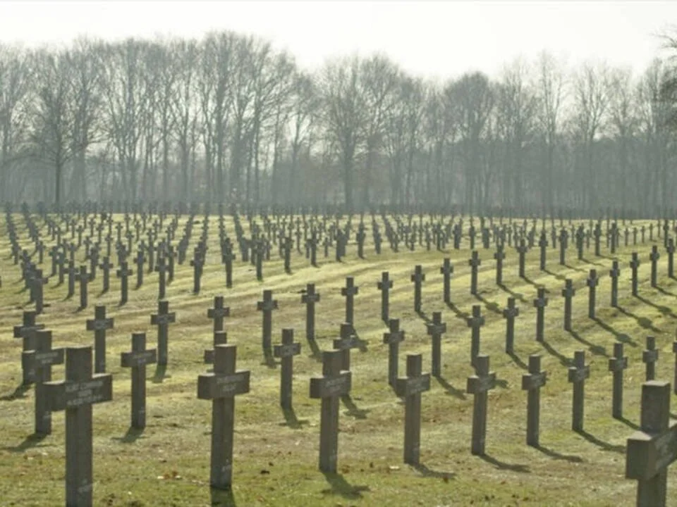
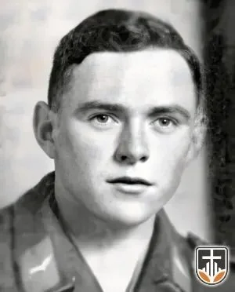
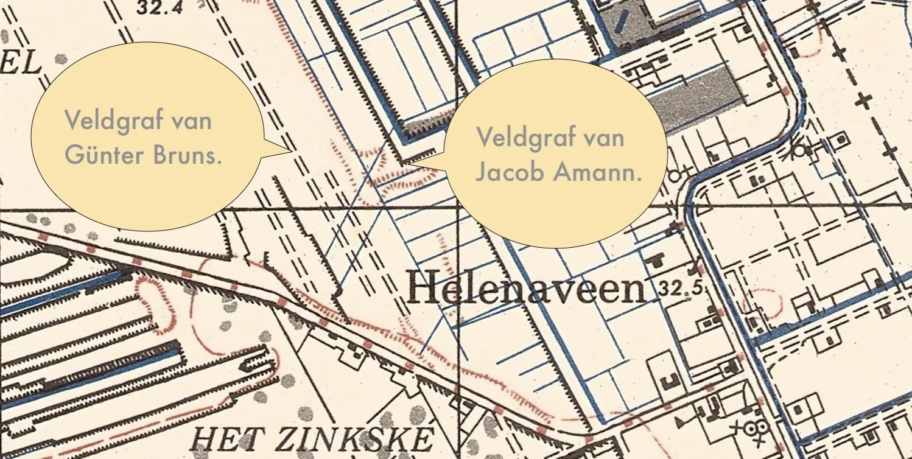
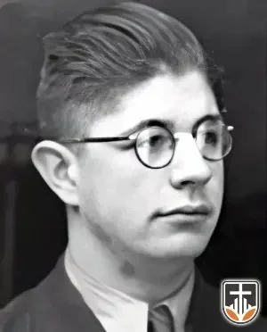
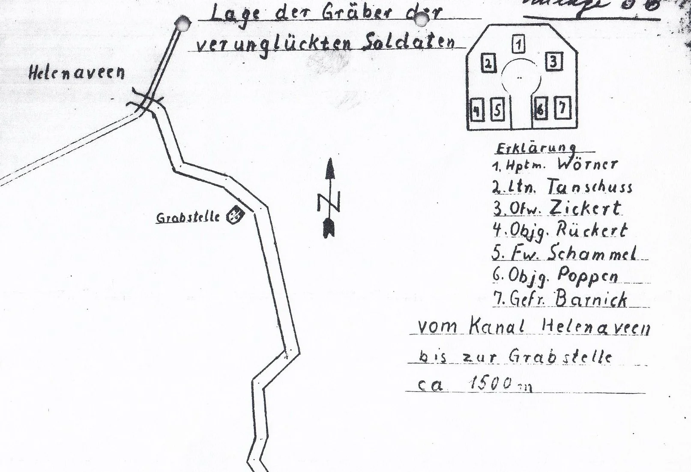

# gesneuvelden-in-helenaveen

> Bron: helenaveenvantoen.nl

### Duitse soldaten Gesneuveld in Helenaveen

Op het einde van de oorlog in 1944 kwamen 27 soms nog zeer jonge soldaten om het leven. Onder hen ook twee Nederlanders die dienden in het Duitse leger.

De meesten zijn uiteindelijk begraven op de Duitse militaire begraafplaats in YsselsteynDe gegevens komen van de site van Richard Schoutissen: https://www.oorlogsslachtoffers.nl/

De veldgraven in Helenaveen zijn aangegeven op een Amerikaanse militaire stafkaart uit de collectie van Dirk Verberne.(verkend: waarschijnlijk in 1935 of 1936)

Hieronder de voor Duitsland gesneuvelde militairen en voorzover bekend de plaats van hun veldgraven. Voor meer gegevens zie de site van Richard Schoutissen

Jacob Glock 17 jaar Geboorteplaats: DarmstadtJägerI Rekruten-Kompanie Flieger-Ersatz-Bataillon XII Overleden 20-11-1944 Helenaveen

Het veldgraf van Jacob Glock bevond zich in de boomgaard van M.H. Erkelens, 2 meter noord van de noordelijke gevel en 8 meter west van de westelijke gevel van perceel H.135 te Helenaveen.

Otto Schöne 18 jaarGeboorteplaats: Güsten, Kreis Bernburg Jäger Flieger Ersatz Bataillon XII Freiwilligenliste 28512Overleden 20-11-1944 Helenaveen

Het veldgraf van Otto Schöne bevond zich in de boomgaard van M.H. Erkelens, 26 meter noord van de noordelijke gevel en 8 meter west van de westelijke gevel van perceel H.135 te Helenaveen.Josef Westerwinter 21 jaarGeboorteplaats: Neuhaus, PaderbornObergefreiter Schützen-Ersatz-Bataillon (Motorisiert) 64Overleden: 29-10-1944 HelenaveenHet veldgraf van Josef Westerwinter bevond zich in Asten

Willem Simon de Voogd 22 jaarGeboorteplaats: Amsterdam SS-Grenadier-Regiment ‘Landstorm Nederland’Overleden: 04-10-1944 Helenaveen

Anton Schweighart 21 jaar Geboorteplaats: Nordholz ObergefreiterII Bat. Fallschirmjäger Ersatz- und Ausb.-Regiment “Hübner”Overleden 11-11-1944 Helenaveen (nabij Griendtsveen)

Anton Schweighart

Willem Hendrik Geerling 21 JaarGeboorteplaats: RotterdamIn dienst Duitse legerOverleden 24-09- 1944 HelenaveenHerbert Krause 21 jaar Geboorteplaats: NeustadtOberfeldwebelOverleden 20-11-1944 Helenaveen

Het veldgraf van Herbert Krause bevond zich 100 meter rechts van de weg Deurne Helenaveen, 50 meter voor de school van Helenaveen.

Karl Gerlach 26 jaar oudGeboorteplaats: UrbachObergefreiter 4. Kompanie Fallschirmjäger-Regiment 2Overlijdensdatum: 20-11-1944 Helenaveen

Het veldgraf van Herbert Krause bevond zich 100 meter rechts van de weg Liessel Helenaveen, 50 meter voor de school van Helenaveen.

Willy Bürgin 21 jaar Geboorteplaats: Freiburg-HaslachObergefreiterI2. Kompanie Panzer-Abteilung 115Overleden 29-10-1944 Helenaveen

Het veldgraf van Willy Bürgin bevond zich links van de weg Deurne Helenaveen, tussen perceel H.28 en H.29.

Eduard Burger 33 jaarGeboorteplaats: Eggendorf am Walde (Oostenrijk)StabsfeldwebelOverleden 31-10-1944 Helenaveen

Het veldgraf van Eduard Burger bevond zich rechts van de weg Helenaveen Liessel, voor de brug.

Günter Bruns 18 jaarGeboorteplaats: –GrenadierOverleden 26-10-1944 Helenaveen

Het veldgraf van Günter Bruns bevond zich in het buurtschap ’t Zinkske ter hoogte van het perceel H.27 te Helenaveen, bewoond door Th. van Teeffelen. 270 meter ten westen van het graf van Jacob Amann.

Kurt Karkat 23 jaar Geboorteplaats: Wellenhausen, Kreis Goldap Obergefreiter Fallschirmjäger Overleden 27-10-1944 Helenaveen Graf 132Het veldgraf van Kurt Karkat bevond zich aan de Helenaveensevaart in de voortuin van perceel H.64 te Helenaveen, genaamd “Oranje Hoeve” en bewoond door Hermans. 7 Meter oost van de oostelijke gevel en in het verlengde van de zuidelijke gevel.

Jacob Amann 26 jaarUnteroffizier Flieger-Untersuchungs-Stelle ErlangenOverleden 20-11-1944 Helenaveen

Het veldgraf van Jacob Amann bevond zich 300 meter ten noorden van noordelijke gevel van perceel H.27 te Helenaveen, bewoond door Th. van Teeffelen. 270 meter ten oosten van het graf van Günter Bruns.

Jacob Amann

Wilhelm Weisheit 20 jaar Geboorteplaats: DuisburgGefreiter 3. Kompanie Grenadier Ausbildungs Regiment 18 Overleden: 27-10-1944 Helenaveen

Het veldgraf van Wilhelm Weisheit bevond zich 10 meter ten westen van boerderij van de Zwaan H.29 te Helenaveen.

Peter Schlenger 20 jaar Geboorteplaats: KölnSchütze Infanterie Ersatz Bataillon 77Overlijdensdatum: 17-11-1944 Helenaveen

Het veldgraf van Peter Schlenger bevond zich 10 meter ten westen van boerderij van de Zwaan H.29 te Helenaveen.

Gerhard Trömel 19 jaarGeboorteplaats: Oberlödla, ThüringenGefreiter Batterie schwere Flak-Abteilung 532Overleden 29-10-1944 Helenaveen

Gerhard Trömel was slechts vier dagen eerder ingedeeld bij een compagnie welke in stelling lag aan het Deurnes kanaal toen hij omstreeks 08:30 uur, tijdens een geallieerde luchtaanval, dodelijk werd getroffen in zijn rug.

Het veldgraf van Gerhard Trömel bevond zich 10 meter ten westen van boerderij van de Zwaan H.29 te Helenaveen. Op zijn kruis stond geschreven “Gefallen für Großdeutschland”.

Gerhard Trömel

Werner George 19 jaarGeboorteplaats: GroßörnerGefreiter 6. Fallschirmjäger-Regiment HübnerOverleden 04-11-1944 Helenaveen

Het veldgraf van Werner George bevond zich 10 meter ten westen van boerderij van de Zwaan H.29 te Helenaveen. Op zijn kruis stond geschreven “Gefallen für Großdeutschland”.Josef Obermüller 25 jaarGeboorteplaats: TittlingObergefreiter 3. Infanterie Ersatz Bataillon 10Overleden 28-10-1944 Helenaveen

Onderscheiden met het Verwundetenabzeichen. Josef Obermüller heeft o.a. gevochten in Rusland, Sardinië, Italië, Frankrijk en Nederland.

Het veldgraf Josef Obermüller bevond zich aan de Helenaveenseweg te Grashoek.

Josef Obermüller

Reinhold Rückert 23 jaarOberjäger 1. Kompanie Fallschirm-Pionier-Bataillon Overleden 05-10-1944 Helenaveen

Het veldgraf van Reinhold Rückert bevond zich aan de Helenaveenseweg te Grashoek. Hij kwam om bij het mijnongeluk bij Kluijtmans

veldgraf van Reinhold Rückert en de andere verongelukten bij mijnexplosie Kluytmans

Heinrich Wörner 30 jaar

Hauptmann 2. Bataljon FallschirmjägerOverleden: 05-10-1944 Helenaveen.

Het veldgraf van Heinrich Wörner bevond zich aan de Helenaveenseweg te Grashoek. Hij kwam om bij het mijnongeluk bij Kluijtmans

Christian Tanschus 22 jaar Leutnant Overleden: 05-10-1944 Helenaveen

Het veldgraf van Christian Tanschus bevond zich aan de Helenaveenseweg te Grashoek. Hij kwam om bij het mijnongeluk bij Kluijtmans

Heinz Schammel, 25 jaar,Feldwebel,Overleden: 05-10-1944 Helenaveen

Het veldgraf van Heinz Schammel bevond zich aan de Helenaveenseweg te Grashoek. Hij kwam om bij het mijnongeluk bij Kluijtmans

Werner Barnick 19 jaar Gefreiter Overleden: 05-10-1944 Helenaveen

Het veldgraf van Werner Barnick1 bevond zich aan de Helenaveenseweg te Grashoek. Hij kwam om bij het mijnongeluk bij Kluijtmans

Hermann Poppen 23 jaarOberjäger Overleden: 05-10-1944 Helenaveen

Het veldgraf van Hermann Poppen bevond zich aan de Helenaveenseweg te Grashoek. Hij kwam om bij het mijnongeluk bij Kluijtmans

Helmut Zickert 21 jaar Oberfeldwebel Overleden: 05-10-1944 Helenaveen

Het veldgraf vanHelmut Zickert bevond zich aan de Helenaveenseweg te Grashoek. Hij kwam om bij het mijnongeluk bij Kluijtmans

Ignatz Haaf 17 jaarGeboorteplaats: UnterdiessenJäger Flieger Ersatz Bataillon XIIFallschirmjäger-Regiment HübnerOverleden: 20-11-1944 Helenaveen

Het veldgraf van Ignatz Haaf bevond zich aan de Helenaveenseweg te Grashoek.

Rolf Dieckmann 21 jaarGeboorteplaats: Beverstedt Flieger Kompanie Fallschirmjäger-Regiment 24 Hübner) Overleden: 17-11-1944 Helenaveen

Het veldgraf van Rolf Dieckmann bevond zich aan de Helenaveenseweg te Grashoek.

Zoon van Diedrich en Adelheid Dieckmann. Broer van Matrose Heinz Dieckmann (1924-1944) die in Bergen op Zoom sneuvelde en eveneens op de Duitse Militaire begraafplaats in Ysselsteyn rust.

Drager van het Erdkampfabzeichen der Luftwaffe.

Rolf Dieckmann

jvw November 2024
