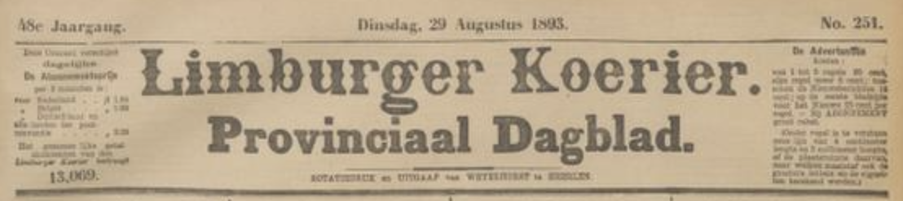

# helenaveen-een-oase-in-de-woestijn

> Bron: helenaveenvantoen.nl

### Helenaveen, Een oase in de woestijn.

Limburger koerier 29-08-1893

Een toerist-medewerker deelt in het „Handelsblad" de indrukken mee, door hem opgedaan, bij gelegenheid vaneen bezoek aan Helenaveen. ’We achten zijn mededeelingen omtrent de kolonie, hare wording, hare aanzienlijke industrieele inrichtingen voor onze lezers van te groot belang, dan dat we hen niet ermee zouden doen kennis maken.

Na Boxtel gepasseerd te zijn schetst de schrijver volgenderwijze het landschap : De aanblik van het landschap tusschen Boxtel en en Deurne is inderdaad fraai. Het oog blijft herhaaldelijk rusten op met zorg bebouwde akkers met rogge en haver, schilderachtig gelegen tusschen bosjes, hoog opgeschoten hakhout of min of meer grootere uitgestrektheden sparrenbosch. Telkens steekt de toren van de een of andere Katholieke kerk hoog boven het vrij geaccidenteerde terrein uit. Is men Deurne voorbij dan verandert dit alles. Dan spoort men tot bij Venloo door de barre heide. Zoo ver het oog reikt, strekt zich de dorre vlakte uit. Het oog ontwaart niets dan hoog opgestapelde bergen turf, nu en dan een berkeboom of een rij bijenkorven, aan den gezichtseinder zich boven de vlakte verheffende torenspitsen.

De trein stopte aan de halte Helenaveen, een vrij onoogelijk stationsgebouwtje, maar waar men al dadelijk merkt, dat in deze buurt drukverkeer plaats heeft, getuige het groote aantal geladen en ongeladen goederenwagens, dat inde buurt der halte staat.

Wij gaan in de postkar, waarin behalve voor den koetsier en den brievengaarder, nog plaats is voor twee passagiers, en als wij al dadelijk den hoek bij het station zijn omgeslagen en de fabrieken der „Griendtsveen Moss Litter Co. “ zjjn gepasseerd, ligt langs het Helena-kanaal voor ons de weg naar het dorpje Helenaveen. In den aanvang is die weg vrij eentonig, rechts en links strekt zich de heide uit met de hooge stapels turf; ter rechterzijde staan nog jong-geplante boomen, die weinig of geen schaduw afwerpen, nu en dan ziet men een arbeiderswoning, waaromheen een stukske in cultuur gebrachte grond. Maar hoe verder men komt, hoe meer teekening er komt inde omgeving. De flinke, breede, harde grindweg maakt langs het kanaal dikwerf groote bochten, daar waar een zijkanaal in de hoofdvaart valt en daar ter plaatse moet ons rijtuig dan over drijvende pontonbruggen. Dergelijke bruggen vindt men in grooten getale op de kanalen te Helenaveen; sommige ervan, die, waarover rijtuigen kunnen passeeron, zijn steviger en breeder dan andere, waarover alleen verkeer te voet mogehjk is. Deze bruggen hebben dit voor boven draaibruggen, dat de brugwachters onnoodig zijn: de schippers, die door de kanalen varen maken de bruggen zelf open en sluiten ze weer achter zich, door ze aan den ketting vast te leggen.

Kort geleden kwam een schipper uit Holland te Helenaveen. Hij was er nooit te voren met zijn schuit geweest en al spoedig versperde eender bruggen hem de doorvaart. Inden omtrek was geenmensch te zien. Toen na zijn aanhoudend geschreeuw van : „brug op!“ niemand verscheen om de brug te openen, zeide de schipper tot zijn knecht: „Wij zullen de brug zelf openen en om die luie kerels" hier, die niet op hun post zijn, een kool te stoven, laten wij de brug dan open." Zoo gezegd, zoo gedaan. Doch nauwelijks was het schip een eindweegs door de brug of toevallig kwam een opzichter der maatschappij „Helenaveen" daar ter plaatse en onze schipper was heel verbaasd te hooren, dat hij de brug achter zich moest sluiten en elke schipper hier zelf ’t brugwachterswerk had te doen. Zoo iets had hij in Holland nooit gehoord !

Zooals gezegd, er komt allengs meer leven in het landschap. De boomen langs den weg worden steviger en. lommerrijker ; de arbeiderswoningen, eenvoudig doch net van steen opgetrokken, met haar moestuinen en bouwland, worden talrijker ; de perceelen ontgonnen land met hun dik staand graan en aardappelen nemen toe; overal inden omtrek ziet men boschaadjes en fraaie lanen, waardoor men aan het einde weder de barre heide ontwaart; wij rijden voorbij de nette woning van den boekhouder met den fraai aangelegden tuin, voorbij dein het hout verscholen kleine Protestantsche kerk, langs de openbare school, langs de Katholieke kerk en de Katholieke school, tot de postkar na een groot uur rijden ophoudt voor del groote, ruime woning met kantoren van den directeur der maatschappij „Helenaveen", waartegenover ook het hulppostkantoor staat: die lange rit met de postkar heeft ons de somma van dertig, zegge dertig cents, gekost.

De directeur der maatschappij „Helenaveen", de heer J. 0. van de Blocquery, wien wij ons verlangen te kennen gaven omtrent Helenaveen iets meer te vernemen, verklaarde zich tot het geven van alle mogelijke inlichtingen volgaarne bereid en van hetgeen wij van hem vernamen en door eigen aanschouwing zagen, wenschen wij den lezer een en ander mede te deelen. Voor veertig jaren bestond de plaats die thans Helenaveen heet, nog niet. Het was in 1853 dat de heer Vander Griendt te ’s-Hertogenbosch van de gemeente Deurne eenige honderden bunders veen in de Peel kocht met het doel, die te gaan ontginnen. Wilde men daartoe kunnen komen, dan diende allereerst een kanaal te worden gegraven, om het moeraswater te kunnen afvoeren en de eventueel uit te baggeren turf te kunnen transporteeren. Daartoe werd begonnen met het; graven vaneen kanaal, beginnende bij de Noordervaart, die weder uitloopt inde Zuid-Willemsvaart. De voor dat kanaal uitgegraven grond vormt thans de onderlaag van den flinken rijweg langs het kanaal. Het werk ging de krachten van den heer V.d. Griendt die deze plek naar zijne echtgenoote Helenaveen noemde al spoedig te boven, doch hij wist eene maatschappij te vormen, waarvan hij de eerste directeur werd en die thans nog is de „Maatschappij Helenaveen". Het doel dier Maatschappij was het land uitte venen, de turf aan de markt te brengen en de uitgeveende gronden in cultuur te brengen of te bebosschen.

„Er was hier huis noch plant, mijnheer", aldus sprak de 79-jarige Kempers, een man, die, oorspronkelijk uit Zeeland afkomstig, in 1853 de eerste spade inden grond stak voor het te graven Helenakanaal, „’t was hier moeras en nog eens moeras. En kijk u nu eens! Thans overal bosch, flinke boomen, mooie wegen, tal van woningen, best land, dat jaarlijks meer en meer opbrengt. Ik woon zelf in een best huisje met een aardige lap grond, ja, er kan heel wat gebeuren in veertig jaar tijds. Ik heb hier alles als ’t ware zien geboren worden. Heeft u dien grooten kerseboom gezien daar op het erf van de directeurswoning ? Ik had hem gezien, ’t Was een kerseboom, zoo groot als ik er nooit te voren een had gezien, een reus onder zijns gelijken, waarvan dezen zomer niet minder dan 600 pond kersen was geoogst. „Welnu, mijnheer", vervolgde de oude man, „dien boom heb ik geplant; ’t was een nietig plantje uit een kersepit gegroeid, ik kweekte het uit aardigheid op en plantte het bij mijn huis, want op die plek, waar nu de directeurswoning staat, heb ik mijn eerste hutje gehad en kijk nu eens wat een boom dat is geworden ! En zoo is ’t met alles gegaan. Vruchtboomen ho maar! en thans groote boomgaarden met beste peren en appelen; menschen woonden hier niet; wij kwamen hier van alle kanten heen om te werken aan het kanaal, uit Zeeland, uit Overijsel, uit Holland, uit Friesland, uit Brabant zelf. De meeste lui, die hier wonen, zijn dan ook oorspronkelijk geen Brabanters en nu wonen hier bijna 700 menschen en ze hebben ’t allemaal vrjj goed. Ja, ja. mijnheer, je kunt vaneen leelijk stuk grond heel wat goeds maken, als je maar werkt en als je maar mest, want de mest moet ’t ’m doen, de mest moet ’t ’m doen! En dat was inden beginne een last. Die werd met schepen aangevoerd I en iedereen kon er dan van koopen uit de kuilen waarin hij bewaard werd. Daar ginder is nog zoo’n kuil over, maar nu worden ze niet meer gebruikt, j Maar och, van koopen kwam niet veel, ’t volk had er! ’t geld niet voor en zoo kreeg men ’t dan ook meestal voor niemendal. Nou, u kunt wel zien dat er goed gebruik van is gemaakt. Veertig jaar, er kan in zoo ’n tijd wat gebeuren!“ De oude man zweeg. Hij leunde op de schoffel waarmee hij bezig was geweest zijn tuintje van onkruid te zuiveren, toen wij tot hem kwamen en liet peinzend den blik gaan over het landschap voor hem. Ik vroeg hem nog een en ander uit het verleden en verliet hem toen, om met den boekhouder de turfstrooiselfabrieken te gaan bezichtigen.

De turfstrooiselfabriek.

Het oorspronkelijke doel, waarmede de Maatschappij Helenaveen optrad, was het in cultuur brengen van woeste gronden. Dat doel is nooit uit het oog verloren, integendeel, wij zullen later zien dat het een zeer groote plaats inneemt onder de werkzaamheden der kolonie, maar daarnaast heeft de turfstrooisel-fabricage inde laatste jaren een verbazende vlucht genomen. Van de 1000 bunders grond ongeveer, die door de Maatschappij bewerkt worden, zijn er 150 in cultuur gebracht, de overige moeten dienen voor de fabricage van turfstrooisel. Het hoogveen, waaruit de gronden van de Peel hoofdzakelijk bestaan, heeft als bovenste laag het zoogenaamde grauwe veen. Tot voor een jaar of acht werd die laag als waardeloos afgegraven en in kuilen geworpen, „ingebonkt" zooals men dat noemt, vandaar dat men in de buurt tal van zoogenaamde „bonken" vindt, waaruit het grauwe veen thans geleidelijk weder wordt opgegraven voor de fabricage van het turfstrooisel. Het was vroeger alleen te doen om de onder het grauwe veen gelegen sliblaag, om daarvan de zoogenaamde persturf te maken.

Die persturf wordt ook nu nog gebruikt; het is eene degelijke brandstof, die bij de verbranding in hitte niet voor steenkolen behoeft onder te doen en waarvan de groote steenfabrieken dan ook gretige afnemers zijn. Het grauwe veen wordt thans afgestoken in groote lichtbruine turven, die gedroogd zijnde, gelijken op groote mikbrooden, met dit onderscheid dat zy aanmerkelijk lichter zijn. De groote hoopen turf, die men in en om Helenaveen ziet, zijn gevormd uit deze lichtbruine turven. Het kanalennet is hoofdzakelijk uitgebreid met het doel de groote hoeveelheden grauwveen naar de fabrieken te kunnen vervoeren.

De Maatschappij heeft haar turfstrooisel-fabricatie dermate zien uitbreiden, dat zij thans twee fabrieken ervoor in werking heeft. De eene is een vaste fabriek, de andere eene drijvende, gelegen op de Helenavaart, en kan door twee paarden gemakkelyk langs het kanaal worden voortgetrokken naar de plekken waar de grootste hoeveelheden turf zijn bijeengebracht.

Treden wij eender fabrieken binnen, ’t Zij u geraden niet bang te zijn voor een beetje stof, want natuurlijk de vermalen droge turf maakt, dat men in de fabriek als’t ware stof eet en men, haar verlatende, die stoflaag duimen dik op de kleeren heeft en neus en ooren er hun deel van hebben erlangd. Op de bovenverdieping wordt de turf inde machine gegooid, die door stoomkracht in beweging gebracht, de stukken fijn maalt. Die fijn gemalen turf komt beneden tusschen persen, die haar persen tot groote balen, gemiddeld 150 kilo wegende. Voor die baal de pers verlaat, wordt zij omklemd door latten en dunne ijzeren banden, vervolgens bij het verlaten der pers gewogen, gemerkt- en op de schuiten geladen, die gevuld zijnde, den voorraad langs de kanalen naar de halte vervoeren, vanwaar deze verder per spoor wordt getransporteerd. Dagelijks worden eenige duizenden kilo’s turfstrooisel gemaakt en vooral dezen zomer is de vraag naar dit artikel ontzaglijk groot.

Uit Frankrijk, België, Engeland, Amerika krijgt de Maatschappij aanvraag tot levering en die vraag is zóó groot, dat aan alle bestellingen onmogelijk kan worden voldaan. Wat daar, van de reden is ? De in vele landen door de langdurige droogte mislukte hooioogst. Door de weinige voorraden hooi, moet het stroo, dat anders grootendeels inde veestallen wordt gebracht om later als mest dienst te kunnen doen, thans voor een groot deel als haksel onder het veevoeder worden gemengd, zoodat voor het vee iets anders als ligging inde stallen moet dienst doen; dat andere nu is het turfstrooisel. Maar zelfs in normale tilden geven vele veehouders aan turfstrooisel. verre de voorkeur boven stroo, omdat het strooisel zich met de faecaliën der dieren veel beter mengt tot mest, waardoor weinig verloren gaat. 'De mest, door turfstrooisel verkregen, is voor vele gronden beter dan die van stroo en in ’t bijzonder 'geschikt voor droge kleigronden. Ook de zindelijkheid :en de frischheid inde stallen wordt er zeer door bevorderd. Het turfstrooisel wordt dan ook inde stallen van tram- en rijtuigmaatschappjjen veel meer gebruikt dan stroo, maar ’t is een eigenaardig verschijnsel dat de afnemers bij ons te lande in vergelijking van die in het buitenland zeer klein in aantal zijn : in ons land schijnt men over ’t algemeen nog maar niet nuttig te kunnen vinden, wat in het buitenland zoozeer gewild is.

De stof, die bij het vermalen van het grauwe veen tot turfstrooisel blijft liggen, is ook niet geheel waardeloos. Ook die wordt tot balen geperst, waarvan evenwel bij het vervoer uit den aard der zaak ved! verloren gaat. Zij wordt inden laatsten tijd veel gebruikt voor privaten, in die huizen waar geen Liernurstelsel bestaat; vooral in Duitschland wordt die stof daartoe veel gevraagd. Te Helenaveen zelf wordt die stof inde privaten der woningen van directeur en boekhouder gebruikt, waardoor die privaten geheel reukeloos zijn. Zou er, vroegen wij ons bjj deze gelegenheid af, niet op de een of andere wijze iets op te | vinden zijn, dat in die woningen te Amsterdam, die ; nog altijd den beerwagen voor de deur moeten zien, steeds eene hoeveelheid van die turfstrooisel-stof kon zijn, voor de vaten of emmers, waarin men de faecaliën moet opzamelen; de gezondheidstoestand van hen, die in dorgelijko woningen leven, zou er zeker door bevorderd worden.

De blijvende vraag naar turfstrooisel, die natuurlijk: s winters, als het vee gestald is, nog grooter is dan thans, maakt dat aan de fabrieken zomer en winter volop werk is. In dezen tijd des jaars graaft men dan grootste hoeveelheden grauw veen af en stapelt die op in de nabijheid der fabrieken, opdat als straks strenge vorst het graven inde venen onmogelijk maakt voldoende hoeveelheid voorradig is en men geregeld zal kunnen doorwerken.

De ventilatie inde fabrieken der Maatschappij laat niets te wenschen over, wat evenwel niet wegneemt, dat de werklieden nog altijd veel last hebben van het stof, dat hun in neus, mond, oogen en ooren vliegt. Tot dusverre wordt door de directie te vergeefs gezocht naar een voorwerp, dat, het hoofd van den werkman bedekkende, hem tegen het stof beschermt; een masker dat beproefd is, bleek onvoldoende, daar de werklieden het daarachter te benauwd kregen, hoe licht en luchtig het ook werd gemaakt.

Beide fabrieken zijn electrisch verlicht, terwijl ze, evenals de halte Helenaveen, telephonisch met het hoofdkantoor verbonden zijn. Er is nog een product dat bij het opgraven van het grauwveen verkregen wordt-, hetwelk in den iaatsten tjjd mede zjjn nut krijgt, nl. de z.g. „lok“, dat zijnde vezels, die inde turf zitten. Zij blijven ind e veenderijen liggen, doch worden door een fabrikant opgezameld tot het maken van anti-septische verbanden, terwijl zij bovendien ook voor het vlechten van matten, loopers en tapijten goede diensten bewijzen.

---
