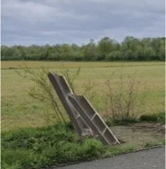

# herdenking-80-jaar-bevrijding

> Bron: helenaveenvantoen.nl

Herdenking Bevrijding Helenaveen op 21 november – 80 jaar later

Als "Helenaveen van Toen" willen we stilstaan bij een belangrijk moment in onze geschiedenis: de bevrijding van ons dorp, 80 jaar geleden. De bevrijding van Helenaveen voelde destijds echter niet als een feest. Toen de bevrijding eindelijk kwam, was ons dorp leeg en zwaar beschadigd. De kerk en het klooster waren afgebrand, de huizen geplunderd. Maar het zwaarste van alles was misschien wel de afwezigheid van onze mannen, die tijdens de razzia waren weggevoerd.

Helenaveen werd bevrijd door jonge Schotten van het 9de bataljon Cameronians – dappere jongens die hun leven op het spel zetten voor onze vrijheid. Zij vochten voor een dorp dat zij niet kenden, voor mensen die zij nooit hadden ontmoet.

Tien van deze jonge jongens liggen nu begraven op de Engelse erebegraafplaats in Mierlo. Hun offer is onmetelijk, en hun namen mogen we nooit vergeten. Op 21 november willen we bloemen leggen op hun graven, ter nagedachtenis aan hun moed.

Daarna gaan we terug naar Helenaveen om een klein monument te onthullen dat de herinnering aan de verschrikkingen van de oorlog en de bevrijding helpt levend te houden.

Vlak bij de Hogebrug, naast het fietspad, liggen de restanten van een tankversperring die de Duitse opmars moest stoppen, een zogeheten aspergeversperring. Dirk Verberne heeft deze versperring gerestaureerd en gecompleteerd met twee stalen balken volgens de originele tekeningen. Op deze dag zullen we de versperring officieel aanbrengen en onthullen.

Tenslotte houden we een kleine bijeenkomst in de Gouden Helm, waarbij een film wordt vertoond over de bevrijding van de Peel

Programma:

· 13:00 uur: Vertrek naar Mierlo (met belangstellenden en leden van de KBO)

13:30 uur: Bezoek aan de Erebegraafplaats in Mierlo en bloemlegging op de graven van de Schotse bevrijders

14:30 uur: Terug naar Helenaveen

15:00 uur: Opening van de gerestaureerde aspergeversperring bij de Hogebrug

15:30 uur: Samenkomst in de Gouden Helm met koffie en een broodje

15:45 uur: Vertoning van de film van Rob Smit over de bevrijding van Helenaveen

18:00 uur: Einde van de herdenking

Wij hopen dat u deze dag met ons wilt herdenken, zodat we samen de helden kunnen eren die vochten voor onze vrijheid en de geschiedenis van Helenaveen levend kunnen houden.

U kunt nauurlijk ook aansluiten om 15.00 uur op de oude Peelstraat of om 15.30 in de Gouden Helm.

Als we een kwartiertje van te voren bij de Gouden Helm zijn, kunnen de mensen die naar Mierlo gaan zoveel mogelijk met elkaar meerijden.

Werkgroep Bevrijding Helenaveen
