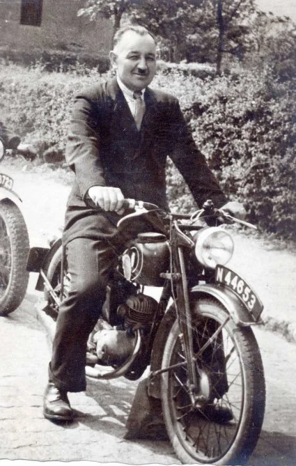
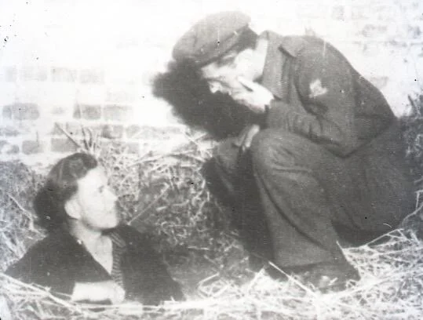

# het-drama-van-het-joods-meisje

> Bron: helenaveenvantoen.nl

### Het drama van het Joodse meisje in Helenaveen.

Onbezoldigd rijksveldwachter Toon Joosten

In juni 1944 leidde verraad tot een razzia op joodse onderduikers in Helenaveen. Bij Paardenhandelaar Willem Janssen die woonde op Boven H.78 (Huidige adres Soemeersingel 141) was een 15 jarig Joods meisje ondergedoken.

Frans Ruyters, een jongere broer van de vrouw van Willem Janssen woonde bij hen in. en heeft het meisje verraden.

Toen Willem Janssen hoorde dat de Duitsers onderweg waren, stuurde hij het meisje het bos in, zodat ze haar niet zouden vinden, maar het bleek tevergeefs, hij moest haar van de Duitsers uit het bos gaan halen.

Het meisje werd door de Duitsers meegenomen. Niemand heeft ooit meer iets van haar vernomen, ze is waarschijnlijk vermoord in een Duits concentratiekamp

Willem Janssen werd ook opgepakt en overgebracht naar kamp Vught, daar heeft hij enkele weken gezeten. Er waren in de buurt veel Joodse onderduikers, waaronder bij Jan en Bertha Schonewille-Tabor, die een paar huizen verder woonden en waar Willem Janssen vaak kwam.

In de Neerkant dreigde al eerder verraad door een zekere VerversDe ondergrondse en de politie Van Liessel hebben op 19 juni in de Neerkant C. Ververs opgepakt en naar de zwarte plak gebracht. Hij noemde tijdens zijn verhoor door de ondergrondse de namen van zijn compagnons: Frans Ruyters en een zekere Ortha.

Men wilde het risico niet lopen dat er nog meer veraden zou worden en daarom is door de Helenaveense ondergrondse, onder leiding van de veldwachter Toon Joosten op 10 juli ook Frans Ruyters afgeleverd bij de verzetsgroep op de Zwarte Plak.

Ortha, Ruyters en Ververs chanteerden en verraadden gezinnen die onderduikers hadden. De gevangenen werden bij de familie Smedts op de Zwarte plak in de kelder onder de paardenstal vastgehouden.

De kelder onder de paardenstal bij de familie Smets op de Zwarte Plak

De secretaris van de bisschop van Roermond, verzetsman en priester Leo Moonen vond dat het nodig was om een ‘bisschoppelijke rechtbank’ op te zetten om verraders te berechten en wilde zo voorkomen dat men het heft in eigen hand nam. Kerkelijke autoriteiten waren niet vertegenwoordigd onder de ‘rechters’. In plaats daarvan waren er enkele juristen en andere belangrijke mensen in de gemeenschap die die rol op zich namen.

Uiteindelijk ging het om totaal vier verraders. Men vergaderde uitgebreid in de kleine voorkamer van de familie Smedts op de Zwarte plak

De beschuldigingen wisselden van geldafpersing van onderduikhelpers tot hulp aan de SD bij het verraden van joden. Men kon niet anders dan de verraders executeren. Als ze dat niet deden liep het hele ondergrondse netwerk gevaar.

Nadat men een besluit genomen had over het lot van de beschuldigden werd er contact gelegd met het Bisdom Roermond. Hun goedkeuring werd per telegram in code teruggestuurd.

Op 10 juli 1944 vonden de executies van Ruyters en Ververs plaats.Een week later trof de afperser G. L. Ortha en verrader José Peerbooms uit Deurne hetzelfde lot.

De verslagenheid bij de familie Janssen moet groot geweest zijn:Het Joodse meisje meegenomen,Willem Janssen gevangen in VughtDe broer van vrouw Janssen geëxecuteerd

### Nog wat achtergrond

UIt de dissertatie van Cammaert over Harrie Janssen uit de Neerkant

Eind 1942 bracht Van de Bilt de eerste joden naar Helden en dorpen in de omgeving zoals Maasbree, Sevenum, Koningslust en Heythuysen. Niet alleen de oorspronkelijke verzetsrelaties vertrouwden haar joodse kinderen toe, hetzelfde deden nieuwe contactpersonen als de heer Bührmann, mejuffrouw V. Rosenberg en naderhand ook medewerkers van de Amsterdamse crèche zoals V. Co hen en personeel van de Centraal Israëlitische Ziekenverpleging. Van de Bilt haalde kinderen, later ook jongeren en volwassen, op in Amsterdam en begeleidde ze per trein naar Limburg. Knapen, haar vaste Limburgse verbindingsman, en zijn echtgenote P.J. Knapen-Joosten droegen uiteindelijk de zorg over 114 joodse kinderen. De meesten waren door Van de Bilt gebracht, een aantal kwam via Sevenum en andere plaatsen naar Helden en Panningen. Knapen en Van de Bilt ondervonden veel steun van plaatselijke L.0.-ers zoals W.L. Houwen en de Heidense arts L.J.A. Verberne. Laatstgenoemde gaf Van de Bilt in de zomer van 1943 het adres van H. Janssen uit Neerkant in Noord-Brabant. Janssen was veekeurder en kende veel veehouders in de Brabantse Peelstreek. Dank zij hem openden zich nieuwe mogelijkheden, waarvan Van de Bilt uiteraard gebruik maakte. Ernstige problemen deden zich nergens voor. Aanvankelijk kocht Paul Terwindt valse PB 's bij de Utrechtse studenten en een Amsterdamse vervalsingsgroep, die overigens matig werk afleverde. In een latere fase ontving mejuffrouw Van de Bilt, met name van H. Janssen, vrijgemaakte en ontvreemde PB's van onopvallende, enigszins op de onderduiker in kwestie lijkende landgenoten waarop ze slechts het adres hoefde te veranderen. Als het nodig was leverden Houwen, de Utrechtenaren en Janssen distributiebonnen. Er werd echter zelden om gevraagd. Kostgeld hoefde helemaal niet betaald te worden. Sommige, overwegend volwassen joden kampten met aanpassingsmoeilijkheden, maar die konden over het algemeen worden opgelost. Lastiger werd het als gastgevers ten gevolge van een razzia van hun onderduikers af wilden (de groep-Meerburg en de N.V. deden soortgelijke ervaringen op). Dan moest in korte tijd een groot aantal nieuwe adressen gevonden worden. De door Tini van de Bilt geholpen joden overleefden vrijwel allemaal de oorlog. Janssen verloor één, door hem in Helenaveen geplaatst kind door verraad. De verantwoordelijke hiervoor zou later door de plaatselijke illegaliteit zijn geliquideerd. Knapen werd bij de grootscheepse razzia van oktober 1944 op de westelijke Maasoever opgepakt. Korte tijd later volgde de bevrijding van de regio, zodat zijn (tijdelijke) afwezigheid nauwelijks nadelige gevolgen had voor de joodse onderduikers.

Jan Leonard Moonen ( *1917 - ✝︎1945 )

Leo Moonen was priester en secretaris van de bisschop van Roermond en actief in het verzet. Hij was de bedenker van de bisschoppelijke rechtbank in de Zwarte Plak in Limburg. Hij was betrokken bij de onderduikhulp en werkte veel samen met Jan Hendrikx, de gewestelijk leider van de LO. Ook vervulde Moonen de rol van geestelijk leider in het Limburgse verzet. Op 10 augustus 1944 werd hij gearresteerd en hij overleed op 15 april 1945 in het kamp Bergen-Belsen.

UIt de dissertatie van Cammaert over de Razzia

Ofschoon de plaatselijke bevolking zweeg, was inmiddels vrij algemeen bekend dat de Peel veel joodse onderduikers herbergde. Op een N.S.B.-bijeenkomst in de zomer van 1944 in Venray sprak men er schande van en een jongeman deed zijn beklag bij de Sipo-Eindhoven. De Venlose commissaris van politie, O. Couperus, vernam er eveneens van, evenals

het Eindhovense Sipo-lid W. Weber . Weber gaf de politiebeambte P.J. Eickhout opdracht pleeggezinnen in de regio Venray op te sporen, omdat deze al eerder te kennen had gegeven dat daar joden zaten ondergedoken.. In juni vond de eerste razzia plaats n Helenaveen, waarbij bij Willem Janssen een inval werd gedaan. Diezelfde maand arresteerden de Duitsers acht volwassen joden en vier joodse kinderen in het vlak bij Tienray gelegen Oirlo.

Bronnen

Geert SchonewilleBert Poels Memoires Vriend en vijand pp. 117-122, 142-144, 169-17Mathieu Smets, Waarheid en Leugen in het verzet pp.214, 225-226Cammaert, Het verborgen front. hoofdstuk IV, paragraaf VIH Brandhorst Moord op een onderduiker

Jan van Woezik / mei 2021
