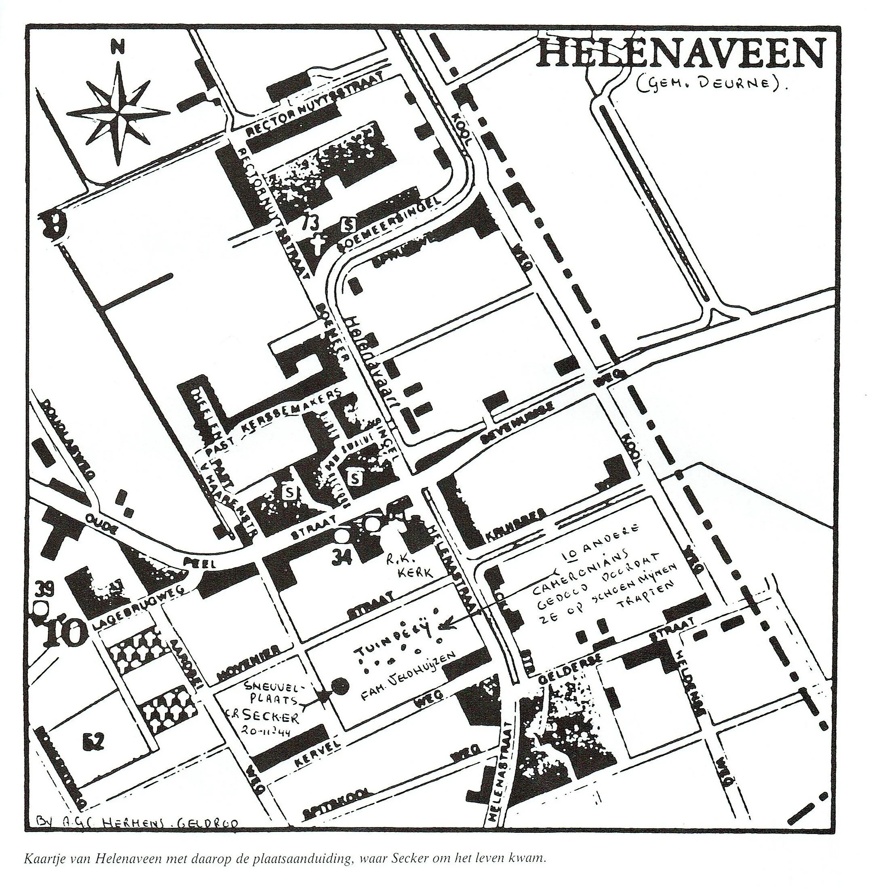
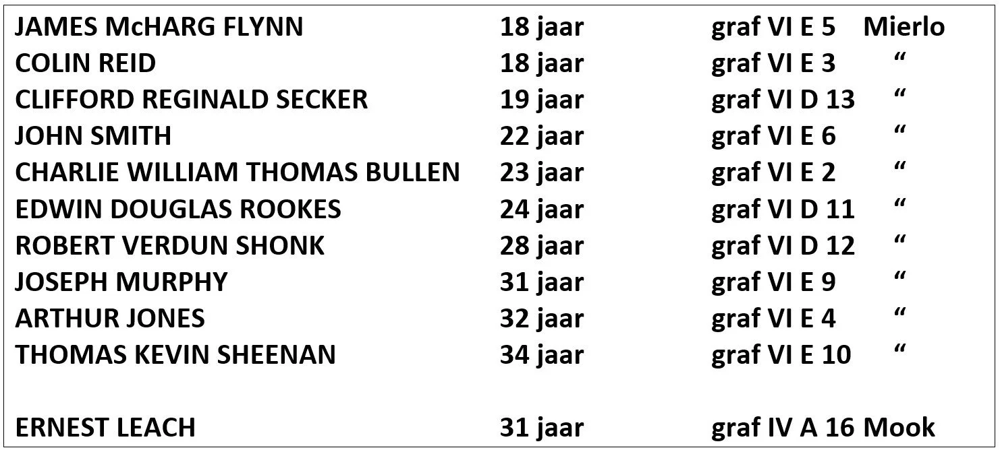

# het-mijnen-drama-bij-de-bevrijding

> Bron: helenaveenvantoen.nl

### Het Mijnen drama bij de bevrijding van Helenaveen

Op de tuinderij van de familie Veldhuijzen was door de Duitsers een mijnenveld aangelegd. Een patrouille van het 9de bataljon Cameronians kwam daarin terecht, waarna zich een drama voltrok: elf nog zeer jonge soldaten sneuvelden. Een van die soldaten was Clifford Reginald Secker…

Artikel uit het Weekblad voor Deurne, 19 december 1985. Clifford diende weliswaar in een Schotse divisie, maar was Engelsman. Hij kwam uit Tottenhill bij King’s Lynn in Norfolk.

### Dit is het Engelse verslag van de strijd rond Helenaveen

Bron: A. Korthals Altes en N.K.C.A. in ‘t Veld, Slag in de schaduw (Venlo, 1981)

The commander of the 15th (Scottish Infantry division) soon reckoned the fact that the heavy continuing rain would be his major problem. Heavy traffic would certainly destroy the few roads available and turn them into mud pools.This was also the case at Overloon and Meijel.After studying air reconnaissance pictures the Scottish commander decided to create two axes of advance.One leading from Meijel through Beringe towards Sevenum named Skye. The other from Liessel through Helenaveen and Achterste Steeg named Ayr.The Schwerpunkt was Ayr.On both routes a tight network of control posts manned by military police was created. Strict orders were given to avoid double traffic to guarantee a smooth flow of traffic.Engineers were given iron plates to reinforce the roads and the unit received 6 US amphibian Weasels ( these vehicles could free other vehicles from the mud).On 19-11 the 9th Cameronians moved out from Hooge Brug to Helenaveen on the Ayr route. It wouldn’t take long before they met German resistance west of Helenaveen.Next morning the unit resumed the advance, but close to the village the leading company drove into a minefield causing heavy losses. This caused a long delay, the mines were cleared manually. Soon after the advance was resumed the men walked into a another minefield.It wasn’t until 15:00 in the afternoon that the battalion reached the western bank of the Helenavaart where they dug in.In the meantime the 2nd battalion Gordon Highlanders of the 227th brigade started their advance supported by a squadron tanks along the Skye route.Following them close behind were the Argyll and Sutherland Highlanders.This battalion was met by heavy mortar fire from the surrounding woods, farms and houses.The supporting Churchills moved forward to give cover fire; during that action 3 were knocked out by 88mm guns.At the beginning of the evening the battalion stopped 3 miles passed Beringe.The Germans destroyed everything during their retreat and fleeing civilians hindered the allied advance.On the Skye route nature shelled the men with heavy rains for 3 days, these rains continued untill the 227th reached Horst on the 23rd.On November 21 around 13:00 hour the Gordons reached de Voorste Steeg southwest of Sevenum, here their enemies were mines, mud, rain, craters and blown up bridges.The Ayr axe had more success, Helenaveen was cleared of the enemy and troops of the 46th Infantry Brigade crossed the canal without meeting enemy resistance.Its 2nd battalion Glasgow Highlanders and the 7th Seaforth Highlanders went straight through the swamps in eastern direction.With the falling of the evening they dug in at Achterste Hees about 1 km from Sevenum.Weather was bad from the start and got worse, at night the rain became heavy.Roads changed into mud slides, men got sucked into the mud, vehicles got stuck and the engineers did all they could to help.Iron panels, trees and everything they could use was thrown on the roads to keep the traffic moving, all in vain.Only the Weasels were able to reach the men in the first line.That night they made 14 trips to the men carrying, rations, ammo, blankets and other equipment.The battalions used their light carriers to resupply the platoons.For the men it was a terrible ordeal, no cover, no housing and no shelter was available against this torture of mother nature.22 November gave even more rain than the day before.At Skye the Gordon Highlanders reached Sevenum at late afternoon, the Argyll and Sutherland Highlanders occupied Vorst east of Sevenum.Recon units 3 miles to the north found Horst, a small town, abandoned by the Germans and not destroyed.The 7th battalion occupied Achterste Hees where the 2nd Battalion quickly linked up.9th Battalion set up defensive positions west of Sevenum.The 46th Brigade’s units were now located east of the Veen (Peel region), while their HQ and logistic units were in the west.Only the Weasels were able to resupply the men in the forward units. The AYR route was a big mess now.The brigade was asked to move its artillery and logistic units through the area of the 11th Armoured Division.That way those units should be able to reach the other parts in 2 days.http://www.warandtactics.com/smf/operations-battles/ww2-battles-in-the-netherlands-(1944)-blerick/?wap2

DODENHERDENKING BRITSE EREBEGRAAFPLAATS MIERLO

Mierlo, Geldropseweg 68 | adoptiegravenmierlo.nl

Op 4 mei herdenken we in Helenaveen tijdens de nationale Dodenherdenking onze oorlogsslachtoffers. Sinds enkele jaren worden ook door een groepje ‘Helenaveners’ de gesneuvelde Britse bevrijders van Helenaveen herdacht, zowel op 4 mei als op 20 november. De Cameronians sneuvelden namelijk op 20 november 1944 in Helenaveen in de strijd tegen de Duitse bezetter, waardoor Helenaveen op 21 november 1944 haar vrijheid terugkreeg. De jongste Cameronians waren 18 jaar, de oudste 34. Zij gaven hun leven voor onze vrijheid. Ook de herinnering aan hen moet levend gehouden worden door herdenking. Tien hebben hun laatste rustplaats gekregen op de Britse Erebegraafplaats aan de Geldropseweg te Mierlo. Ze liggen naast of dicht bij elkaar begraven. Een rust op de Britse Erebegraafplaats in Mook aan de Groesbeekseweg. Mocht u in de buurt zijn, sta dan even stil bij hun graven. Hun namen zijn:

Midden 2025 is de stichting Adoptiegraven Mierlo opgericht die het mogelijk maakt om een of meerdere graven van gesneuvelde Britse militairen op de erebegraafplaats te Mierlo te adopteren. Het Helenaveen van Toen heeft alle tien de graven van de gesneuvelde bevrijders van Helenaveen geadopteerd.

Mei 2021 Mierlo

21 november 2024 herdenking bij 80 jaar bevrijding Helenaveen.

DODENHERDENKING BRITSE EREBEGRAAFPLAATS MOOK

Mook, Groesbeekseweg 21

Van de elf in Helenaveen op 20 november 1944 gesneuvelde Britse bevrijders is Ernest Leach (31 jaar) als enige begraven op de erebegraafplaats te Mook.

Herdenking 16 november 2025 Mook

| HvdL | 20210513/20251120
