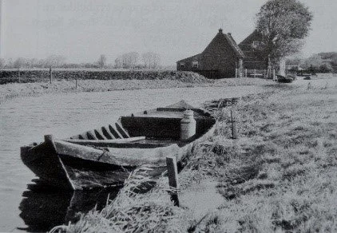
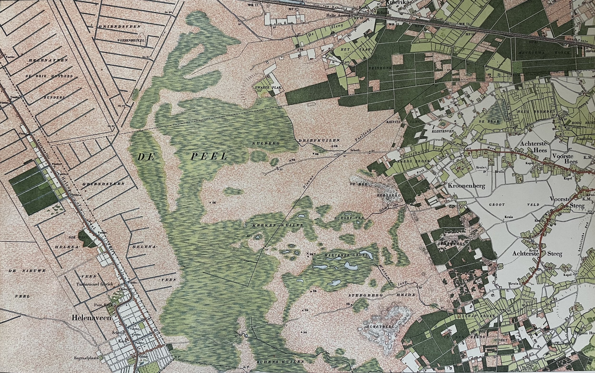
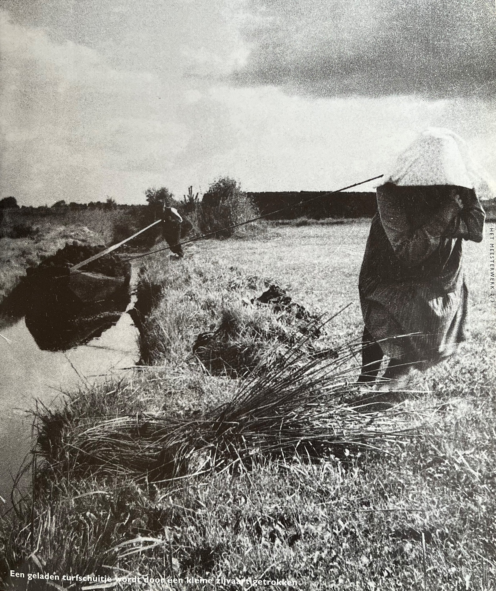

# houtenbok_deel1

> Bron: helenaveenvantoen.nl

### Verdwenen schepen terug in de Peel

Graag vragen wij aandacht voor ons bouwproject De houten Bok “Janske Pardoel”.

Het project betreft het volgens originele bouwwijze reconstrueren en terug in de omgeving brengen van het verdwenen varend erfgoed, de houten Bok. De oma van Hans, “Janske Pardoel”, was dochter van een turfschipper en de hobby van Hans is houtbewerking.Het idee is simpel, de realisatie blijkt echter moelijker. Deze uitdaging ben ik (Hans) samen met mijn buurman aangegaan.

De houten bok

De geschiedenis van De houten Bok - Helenaveen 1854.Naar voorbeeld van Overijssel en in opdracht van Jan van de Griendt. Vanuit het hoofdkanaal (de Helenavaart), werden voor de turfwinning zijkanalen, de wijken of wieken, gegraven, waarop telkens drie wijken uitkomen (drietandsysteem). Hierlangs wordt de turf met lichte schuiten, zogenaamde bokken, in de hoofdvaart gebracht. Een bok is een platbodem met twee sterk naar voren vallende stevens. Geschikt om in ondiep water zowel voor als achteruit te kunnen varen.In de smalle kanalen en de nog minder brede wijken, welke bovendien slechts van geringe diepte waren, kon men alleen met de kleine scheepjes, de “houten bokken” varen. Deze bokken werden geboomd of door mensen voortgetrokken, door “het jagen” via de jaagpaden. Later werden deze vanwege lage bouw- en onderhoudskosten van staal gemaakt.

Hoe het begonIn september 2023 zijn we enthousiast van start gegaan met het leggen van contacten en het verzamelen van informatie. We wilden alles weten over het historische gebruik, de bouwwijze en de materialen die nodig zijn. Dankzij ons eigen onderzoek, boeken en gesprekken met Heemkundeverenigingen en musea zoals het Maritiem Museum Rotterdam hebben we een schat aan kennis opgedaan. Daarnaast hebben we praktische inzichten verkregen van vakmensen bij Gieterse scheepswerven en het Arnhems Openluchtmuseum. Hun expertise en passie voor het ambacht maken dit project nog mooier. De samenwerking met al deze enthousiaste mensen uit verschillende hoeken van Nederland is ontzettend inspirerend en motiveert ons extra om dit bijzondere erfgoed tot leven te brengen!

Ook is er samenwerking met de lokale werkgroep “Het Helenaveen van Toen”, welke actief is om de historie vanaf 1850 weer op de kaart en in de schijnwerpers te zetten. Via de website https://helenaveenvantoen.nl/ gaan we de voortgang en onze kennis publiceren en daarmee borgen.

Helenaveen en de Peel in 1892 met duidelijke weergave van het drietandsysteem

Herbeleef de historie van de Peel op het waterProject De Houten Bok “Janske Pardoel” brengt het verdwenen varend erfgoed weer tot leven. Zonder commercieel doel draait het om het reconstrueren van oude technieken en het behouden van kennis en kunde. Door straks weer te jagen met de houten bok over de Helenavaart wordt de rijke cultuurhistorie en natuurbeleving van de Peel weer tastbaar voor jong en oud.Met de financiële steun van Waterschap Aa en Maas wordt dit project mogelijk gemaakt.

Jan van de Griendt kreeg bij de ontginning van de Peel te maken met een uitdaging: het zure veenwater. Aanvankelijk loosde hij dit water op de Noordervaart, maar al snel kwamen er klachten van boeren – hun gras wilde niet groeien. De oplossing bleek een extra afwateringskanaal, dat het veenwater rechtstreeks naar de Maas afvoerde. Dit kanaal, nu bekend als het “Neers kanaaltje”, vormt een natuurlijke verlenging van de aansluiting op de Noordervaart. Deze kanalen, ooit onmisbaar voor de turfwinning, spelen nu een cruciale rol in waterbeheer en recreatie. Het beheer ligt bij Waterschappen Aa en Maas en Limburg, die zorgen voor waterkwaliteit en ecologisch evenwicht.

Een bijzonder detail: waar de kanalen en wijken vroeger water afvoerden, worden ze nu gebruikt voor de aanvoer. Ook het historische jaagpad langs de Helenavaart naar Griendtsveen, ooit een trekroute voor schepen, is hersteld en is nu onderdeel van een prachtige wandel- en fietsroute.

Dit project verbindt zo Peels erfgoed met waterbeleving en draagt bij aan het waterbewustzijn, zodat iedereen optimaal kan genieten van de kanalen en hun verhaal.

#HistorieHerleeft #Turfwinning #Scheepvaart #Helenaveen #historie #varenderfgoed #depeel #Janske Pardoel #Bok #Houten Bok #Verdwenen erfgoed @aaenmaas #genietenvanwater *Herbeleef #HetHelenaveenVanToen
