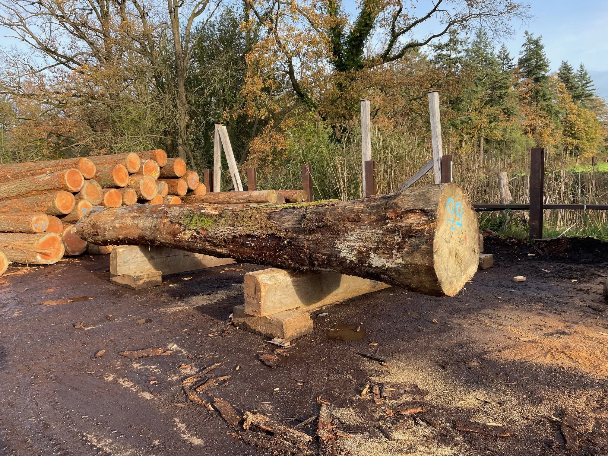
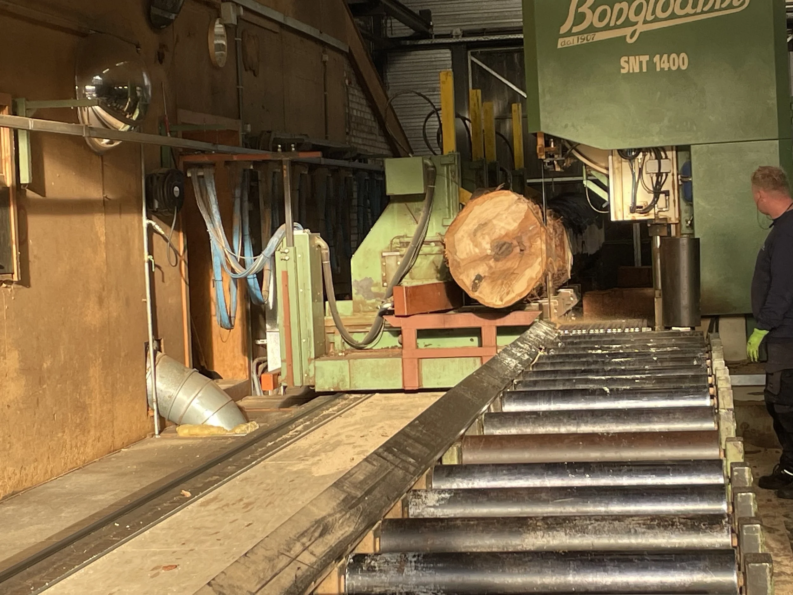
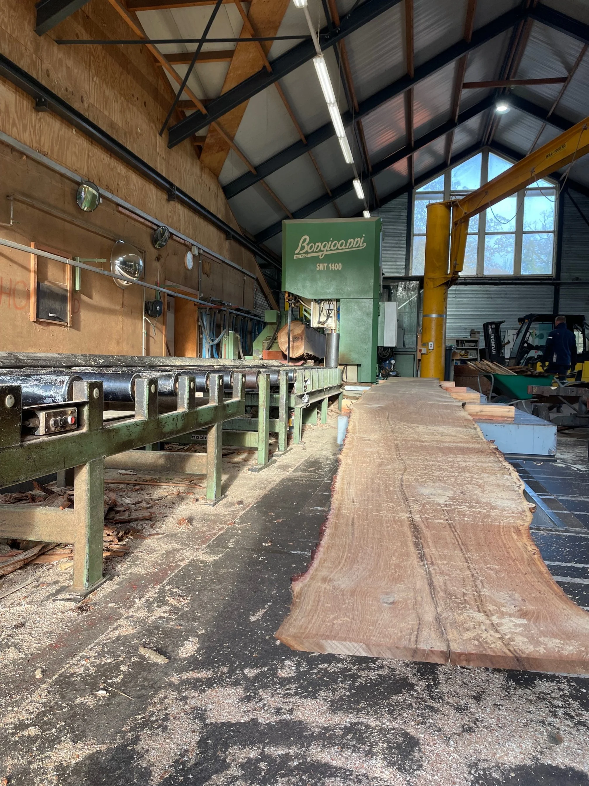

# houtenbok_deel3

> Bron: helenaveenvantoen.nl

### Het zagen van de planken en de geur van vers hout

Een bijzondere belevenis

Een volgende stap. Na eigen speurwerk en advies vanuit Giethoorn en het Openluchtmuseum Arnhem is het juiste hout gevonden. Alweer een bijzondere belevenis, met nieuwe ervaringen en leerpunten.

Het hout voor onze Bok komt van Houtzagerij Twickel: stammen van Europees eikenhout, zorgvuldig uitgezocht. Van dik hout zaagt men planken. Oeps, blauwe vlekken! Voor en tijdens het zagen worden de stammen nauwlettend onderzocht op ijzer. Dit toont zich door een hardblauwe kleur – de reactie van ijzer met het zuur van het eiken. Zie je ijzer, dan stop je met zagen, verwijder je de spijker of granaatscherf, en ga je verder.

Het zagen gebeurt op de lintzaag (zie filmpje). Brede planken van duims (27 mm dik) vormen straks de wangen – oftewel de zijkanten van de Bok. Deze planken worden langzaam gedroogd tot 25%, precies goed om later te kunnen buigen. Daarover later meer… spannend! Ook de Douglas balken voor de platte bodem zijn vers gezaagd. Alles van de juiste kwaliteit, met minimale knoesten om het lekdicht te houden. Begin 2026 wordt het hout geleverd en dan… wordt vervolgd!

Hans en Huub

#HistorieHerleeft #Turfwinning #Scheepvaart #Helenaveen #historie #varenderfgoed #depeel #Janske Pardoel #Bok #Houten Bok #Verdwenen erfgoed @aaenmaas #genietenvanwater *Herbeleef #HetHelenaveenVanToen
