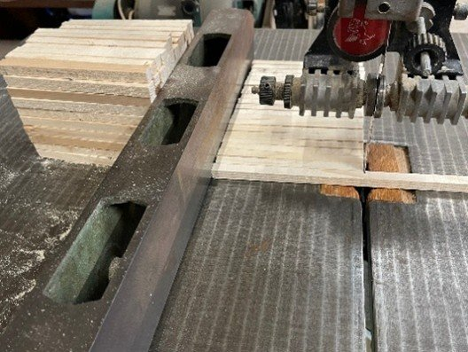
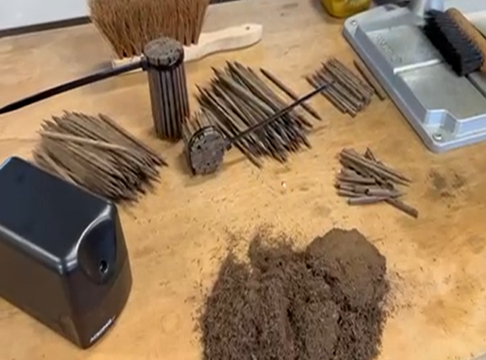

# houtenbok_deel4

> Bron: helenaveenvantoen.nl

### De Bouw van de Houten Bok “Janske Pardoel” – hoe het wordt gemaakt

door Hans en Huub – een belevenis om nooit te vergeten

Het verslag van de bouw van een houten Bok lijkt eenvoudig samen te vatten: een vlak leggen, in vorm zagen, dwarsverbindingen plaatsen, voor- en achtersteven erop, ribben (korven) zagen, de zijwanden branden en buigen, alles in de teer zetten en klaar. Maar zo simpel als het klinkt, zo uitdagend is het in de praktijk.

We nemen jullie in dit hoofdstuk, stap voor stap mee in onze bouwreis. Van de voorbereidingen tot aan de tewaterlating in en het jagen op de Helenavaart.

We vinden het belangrijk om het bouw proces gedetailleerd te beschrijven en zo onze ervaringen via het Helenaveen van Toen te delen. Wij halen veel uit boeken en gesprekken en zetten het al doende en proefondervindelijk om in de praktijk. Zo blijft deze ambachtelijke kennis en oer-Hollandse bootbouwgeschiedenis bewaard. En met onze bok komt zodoende een stukje verdwenen erfgoed weer zichtbaar en ook voelbaar tot leven 😊

Voorbereiding: het werk vóór het werk

Terwijl onze benodigde planken, gezaagd uit twee eiken stammen van acht meter lang en zeventig centimeter breed, rustig liggen te drogen, zitten wij niet stil. We bouwen volgens de oude, oorspronkelijke werkwijze: geen schroeven, geen lijm. Het vlak met de klampen en de korven worden straks aan elkaar verbonden met pennen en deutels, precies zoals de bouwers het in 1853 deden.

Dat betekent: alles zelf maken. En veel ook.

Hans zaagt met de lintzaag maar liefst 500 pennen uit zéér goed droog grenen. Huub neemt de 500 deutels voor zijn rekening, maar dan uit “knokenhard” eikenhout.

Grenen pennen zagen met lintzaag

Eiken deutels inkorten en punten aanslijpen

De grenen pennen zijn 10 cm lang voor de klampen en 16 cm voor de korven. Allemaal vierkant 10 bij 10 mm. Daarna achthoekig gemaakt en licht aangepunt. Ze komen straks in een rond gat van 1 cm, waarna ze aan de onderzijde worden geborgd met de kleine deuteltjes. Deze eiken deuteltjes zijn allemaal 3 mm dik, vierkant en 4 cm lang.

En die deuteltjes? Die worden één voor één aangescherpt met de puntenslijper. Een heerlijk werkje voor in de winter binnen bij de kachel, al hebben we er wel al twee slijpers aan opgeofferd.

Vrijdag is onze bouw dag

In de regel werken we alleen op vrijdag, en alleen wanneer we allebei kunnen. Dat blijkt een fijne formule: het blijft leuk, we vullen elkaar aan en samen weet en kan je meer. Zo groeit er de komende maanden, stap voor stap, iets bijzonders in de Peel. De verloren gegane Bok komt langzaam maar zeker in onze bouwschuur tot weer leven.

Nu is het nog even afwachten. Zodra het door Twickel gezaagde hout droog genoeg is, komt het onze bouwschuur en leggen we het vlak. Deze bestaat uit 5 balken en vormen de bodem van de Bok, het fundament van alles wat volgt. Het wordt in de juiste vorm gezaagd en met klampen (de dwarsliggers) stevig aan elkaar gemaakt. De klampen worden op het vlak vastgezet met onze zelfgemaakte pennen en deutels. Hierover later meer.

Blijf ons volgen…

Groetjes, Hans en Huub

HistorieHerleeft #Turfwinning #Scheepvaart #Helenaveen #historie #varenderfgoed #depeel #Janske Pardoel #Bok #Houten Bok #Verdwenen erfgoed @aaenmaas #genietenvanwater *Herbeleef #HetHelenaveenVanToen
