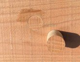
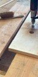
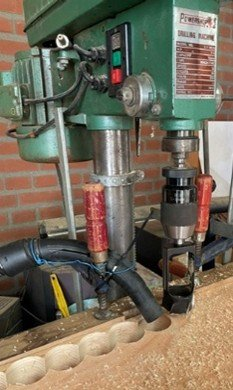

# houtenbok_deel5

> Bron: helenaveenvantoen.nl

De zuinige Hollander vervangt knoesten door houten proppen! Een tijdrovend, maar mooi stukje vakwerk Voordat we aan het vlak, de bodem van de bok, kunnen beginnen, wacht ons eerst een kleine en onverwachte hobbel. In de vijf Douglas balken welke samen het vlak vormen, blijken namelijk véél meer knoesten te zitten dan gehoopt. Vanuit Arnhem en Giethoorn kwam het advies: Verwijderen en vervangen! Maar hoe dan?

Gelukkig bestaat er een oer-Hollandse methode: “de Dutch men”. Zuinig, precies, en helemaal in de geest van vroeger. Je haalt de slechte knoesten eruit en vult ze op met houten proppen. Zo blijft het hout sterk, betrouwbaar en historisch verantwoord. Het doet me denken aan vroeger, wanneer mijn moeder mijn broek “uitstukte” wanneer ik weer een keertje gevallen was en er een gat in zat. Met een stukje stof van een andere broek werd het vakkundig gerepareerd. Als je het niet wist, zag je het niet.

Hans en Huub aan de slag. Elke knoest is beoordeeld en wordt bij twijfel uitgeboord. Dit doen we met een gatboor van 40 of 50 mm. Met behulp van een grote kolomboor voorzien van een proppenboor, van 40 en 50 mm, boorden we vervolgens exact passende houte proppen uit een reservebalk. Deze voorzie je van een laagje hars en sla je vervolgens in het gat. Belangrijk hierbij is dat je de nerven van het hout exact in de zelfde richting houdt, balk en prop. Dit vanwege, het gelijke uitzet en krimp effect. Zo krijgt elke knoest een nieuw stukje hout, zorgvuldig passend, alsof het er altijd al heeft gezeten. En dat 80 keer! En zo zijn we een nieuwe ervaring rijker, en hebben we vijf perfecte balken.

De volgende keer laten we zien hoe we hiermee het vlak construeren. Het krijgt de juiste vorm en wordt met hennep, waterdicht gemaakt. Wordt vervolgt!

HistorieHerleeft #Turfwinning #Scheepvaart #Helenaveen #historie #varenderfgoed #depeel #Janske Pardoel #Bok #Houten Bok #Verdwenen erfgoed @aaenmaas #genietenvanwater *Herbeleef #HetHelenaveenVanToen
