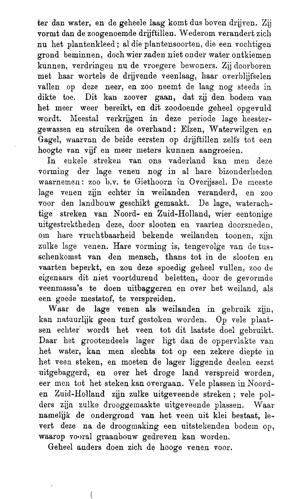
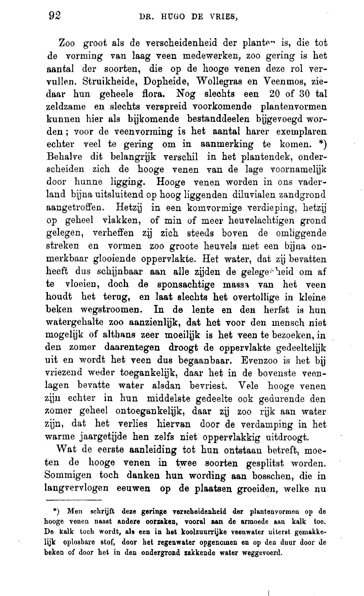
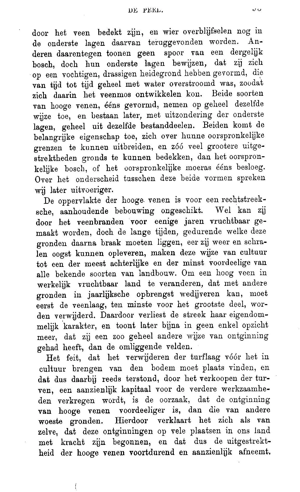
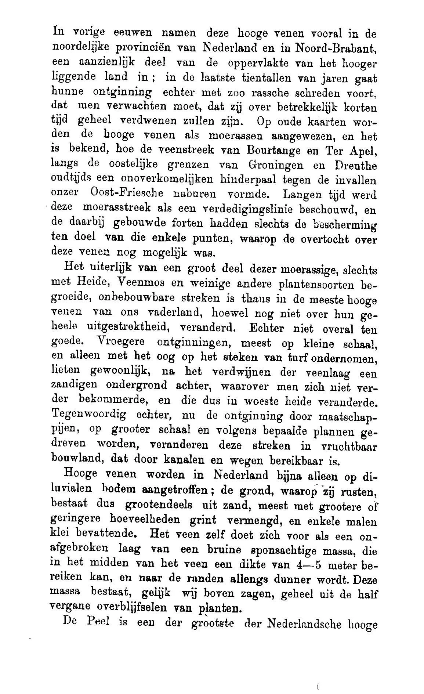
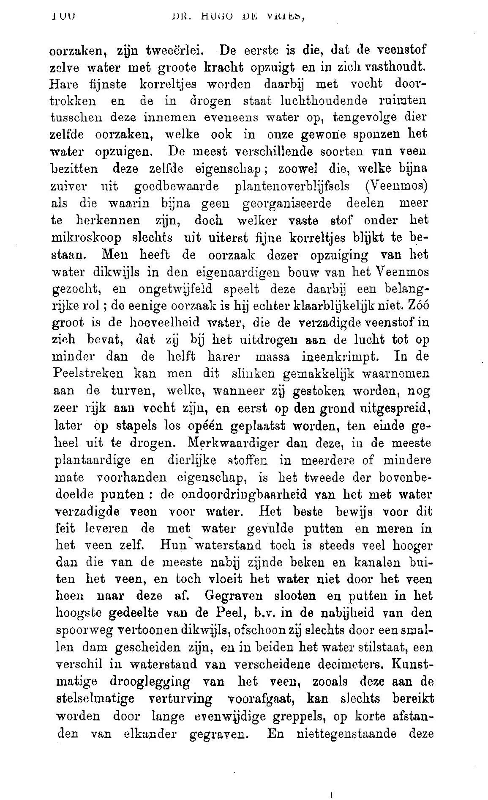
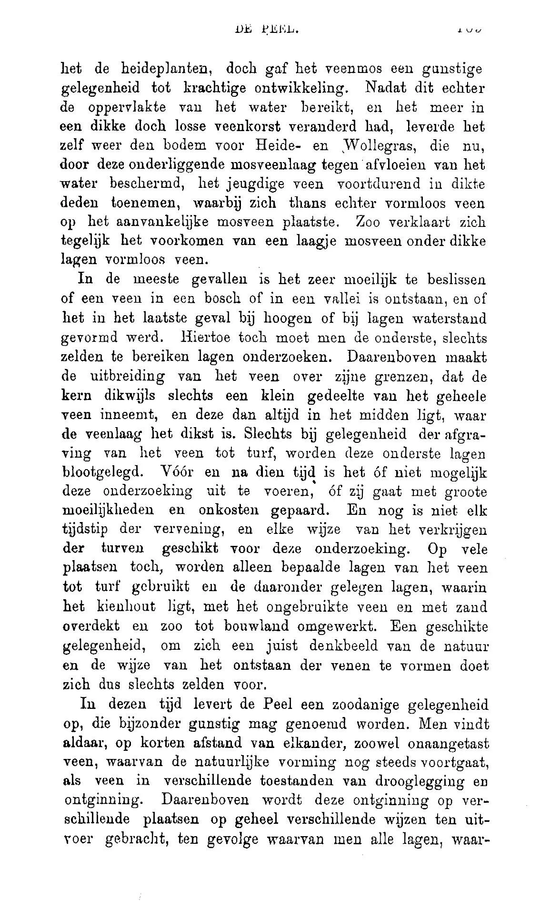
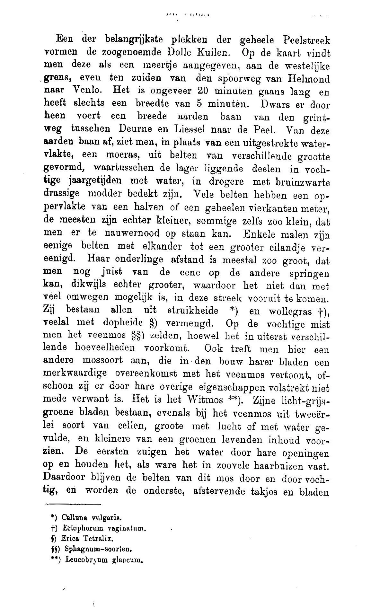
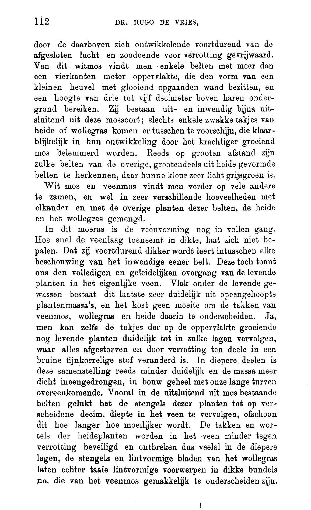
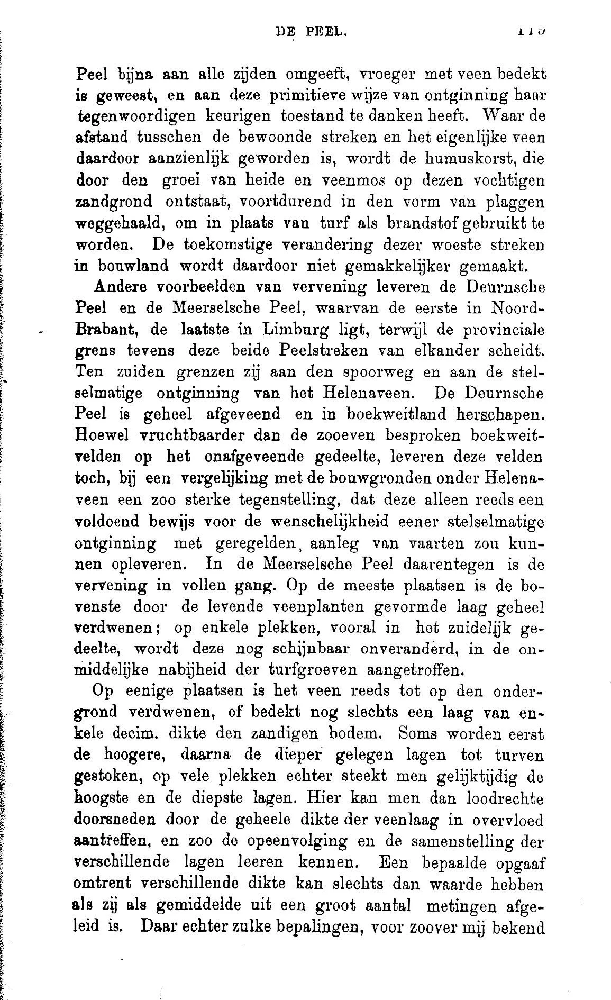

# hugo_de_vries

> Bron: helenaveenvantoen.nl

De “ronde kuilen” (bij Liessel) maakten veel indruk op bioloog Hugo de Vries toen hij de Peel bezocht, nadat dat makkelijker was geworden door de aanleg van de spoorlijn Eindhoven-Venlo met een ‘Halte Helenaveen’.

In 1874 schrijft De Vries hierover in een artikel in Onze Tijd.

