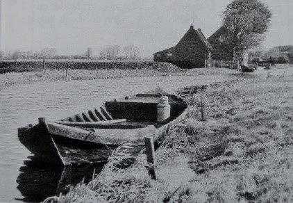
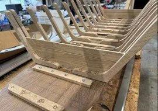
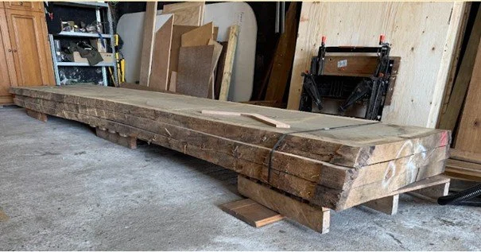

# janske_pardoel

> Bron: helenaveenvantoen.nl

### Verdwenen schepen terug in de Peel

Graag vragen wij aandacht voor ons bouwproject De houten Bok “Janske Pardoel”.

Het project betreft het volgens originele bouwwijze reconstrueren en terug in de omgeving brengen van het verdwenen varend erfgoed, de houten Bok. De oma van Hans, “Janske Pardoel”, was dochter van een turfschipper en de hobby van Hans is houtbewerking.Het idee is simpel, de realisatie blijkt echter moelijker. Deze uitdaging ben ik (Hans) samen met mijn buurman aangegaan.

De houten bok

De geschiedenis van De houten Bok - Helenaveen 1854.Naar voorbeeld van Overijssel en in opdracht van Jan van de Griendt. Vanuit het hoofdkanaal (de Helenavaart), werden voor de turfwinning zijkanalen, de wijken of wieken, gegraven, waarop telkens drie wijken uitkomen (drietandsysteem). Hierlangs wordt de turf met lichte schuiten, zogenaamde bokken, in de hoofdvaart gebracht. Een bok is een platbodem met twee sterk naar voren vallende stevens. Geschikt om in ondiep water zowel voor als achteruit te kunnen varen.In de smalle kanalen en de nog minder brede wijken, welke bovendien slechts van geringe diepte waren, kon men alleen met de kleine scheepjes, de “houten bokken” varen. Deze bokken werden geboomd of door mensen voortgetrokken, door “het jagen” via de jaagpaden. Later werden deze vanwege lage bouw- en onderhoudskosten van staal gemaakt.

Hoe het begonIn september 2023 zijn we enthousiast van start gegaan met het leggen van contacten en het verzamelen van informatie. We wilden alles weten over het historische gebruik, de bouwwijze en de materialen die nodig zijn. Dankzij ons eigen onderzoek, boeken en gesprekken met Heemkundeverenigingen en musea zoals het Maritiem Museum Rotterdam hebben we een schat aan kennis opgedaan. Daarnaast hebben we praktische inzichten verkregen van vakmensen bij Gieterse scheepswerven en het Arnhems Openluchtmuseum. Hun expertise en passie voor het ambacht maken dit project nog mooier. De samenwerking met al deze enthousiaste mensen uit verschillende hoeken van Nederland is ontzettend inspirerend en motiveert ons extra om dit bijzondere erfgoed tot leven te brengen!

Ook is er samenwerking met de lokale werkgroep “Het Helenaveen van Toen”, welke actief is om de historie vanaf 1850 weer op de kaart en in de schijnwerpers te zetten. Via de website https://helenaveenvantoen.nl/ gaan we de voortgang en onze kennis publiceren en daarmee borgen.

Helenaveen en de Peel in 1892 met duidelijke weergave van het drietandsysteem

Herbeleef de historie van de Peel op het waterProject De Houten Bok “Janske Pardoel” brengt het verdwenen varend erfgoed weer tot leven. Zonder commercieel doel draait het om het reconstrueren van oude technieken en het behouden van kennis en kunde. Door straks weer te jagen met de houten bok over de Helenavaart wordt de rijke cultuurhistorie en natuurbeleving van de Peel weer tastbaar voor jong en oud.Met de financiële steun van Waterschap Aa en Maas wordt dit project mogelijk gemaakt. Jan van de Griendt kreeg bij de ontginning van de Peel te maken met een uitdaging: het zure veenwater. Aanvankelijk loosde hij dit water op de Noordervaart, maar al snel kwamen er klachten van boeren – hun gras wilde niet groeien. De oplossing bleek een extra afwateringskanaal, dat het veenwater rechtstreeks naar de Maas afvoerde. Dit kanaal, nu bekend als het “Neers kanaaltje”, vormt een natuurlijke verlenging van de aansluiting op de Noordervaart. Deze kanalen, ooit onmisbaar voor de turfwinning, spelen nu een cruciale rol in waterbeheer en recreatie. Het beheer ligt bij Waterschappen Aa en Maas en Limburg, die zorgen voor waterkwaliteit en ecologisch evenwicht.

Een bijzonder detail: waar de kanalen en wijken vroeger water afvoerden, worden ze nu gebruikt voor de aanvoer. Ook het historische jaagpad langs de Helenavaart naar Griendtsveen, ooit een trekroute voor schepen, is hersteld en is nu onderdeel van een prachtige wandel- en fietsroute.

Dit project verbindt zo Peels erfgoed met waterbeleving en draagt bij aan het waterbewustzijn, zodat iedereen optimaal kan genieten van de kanalen en hun verhaal.

Van droom naar werkelijkheid: de bouw van Janske Pardoel

Wat begon met een idee, groeide uit tot een plan, en nu zetten we echte stappen! In september 2023 startten we met onderzoek en zochten samenwerking om kennis te vergaren. Zo ben ik samen met Huub aan de slag gegaan. We maakte schetsen, kartonnen modellen, mallen en … begonnen met bouwen. Elke week een stapje verder. Dit resulteerde al doende en lerende, begin 2025 in ons onderstaande 1:5 schaal- en leermodel 😊.

Een spannend moment: we presenteerden het model aan de werfeigenaren uit Giethoorn, en hun enthousiaste ontvangst was een prachtig compliment—een bevestiging dat we op de goede weg zijn. Bij de koffie en een meegenomen Peelneutje kwamen de verhalen van vroeger al snel weer op tafel. “Wij hebben deze zelf nooit gebouwd, maar onze grootvaders…..”

Met deze positieve bevestiging, de bijzondere verhalen en nog enkele tips konden wij verder. Met ons uitgewerkte bouw- en materialenplan in de hand gingen we op zoek naar houtleveranciers. Die vonden we lokaal, een stap die het project nóg specialer maakt.

Een mijlpaal: de echte bouw is begonnen! Op 30 mei 2025 zijn we gestart met de bouw van Janske Pardoel, een echte “kleine bok” van 7,5 meter lang en bijna 2 meter breed. En zoals het hoort: authentiek gebouwd van eiken en douglas, zonder schroeven en zonder lijm, helemaal volgens de traditionele ambachtelijke technieken zoals deze ook in 1850 gebruikt werden.

Volg onze reis! Nu komt het echte werk. We beginnen met het uitzagen van de 42 korven—de ribben van de bok—die straks met houten deuvels stevig verbonden worden met het vlak, de platte bodem. Het meest uitdagende deel? Het buigen en torderen van de wangen, de wanden van de bok, in precies de juiste vorm. Dit gebeurt op ambachtelijke wijze: door middel van verhitting en branding.

De weg is lang en kent zeker nog vele uitdagingen, maar elke stap brengt ons dichter bij het einddoel. We werken meestal op vrijdag en delen regelmatig updates, dus blijf ons volgen en beleef deze bijzondere reis met ons mee!

Ondertussen puzzelen en bouwen wij in onze vrije tijd door.

Met vriendelijke groet,Hans van Neerven & Huub Kleintjes

Het zagen van de planken en de geur van vers hout Een bijzondere belevenis

Een volgende stap. Na eigen speurwerk en advies vanuit Giethoorn en het Openluchtmuseum Arnhem is het juiste hout gevonden. Alweer een bijzondere belevenis, met nieuwe ervaringen en leerpunten.

Het hout voor onze Bok komt van Houtzagerij Twickel: stammen van Europees eikenhout, zorgvuldig uitgezocht. Van dik hout zaagt men planken. Oeps, blauwe vlekken! Voor en tijdens het zagen worden de stammen nauwlettend onderzocht op ijzer. Dit toont zich door een hardblauwe kleur – de reactie van ijzer met het zuur van het eiken. Zie je ijzer, dan stop je met zagen, verwijder je de spijker of granaatscherf, en ga je verder.

Het zagen gebeurt op de lintzaag (zie filmpje). Brede planken van duims (27 mm dik) vormen straks de wangen – oftewel de zijkanten van de Bok. Deze planken worden langzaam gedroogd tot 25%, precies goed om later te kunnen buigen. Daarover later meer… spannend! Ook de Douglas balken voor de platte bodem zijn vers gezaagd. Alles van de juiste kwaliteit, met minimale knoesten om het lekdicht te houden. Begin 2026 wordt het hout geleverd en dan… wordt vervolgd!

Hans en Huub #HistorieHerleeft #Turfwinning #Scheepvaart #Helenaveen #historie #varenderfgoed #depeel #Janske Pardoel #Bok #Houten Bok #Verdwenen erfgoed @aaenmaas #genietenvanwater *Herbeleef #HetHelenaveenVanToen
