# kassen-in-helenaveen

> Bron: helenaveenvantoen.nl

<audio controls>
  <source src="images/kassen-in-helenaveen/Hannes_Joosten3.mp3" type="audio/mpeg">
  Your browser does not support the audio element.
</audio>

### De kassen van Helenaveen

Het is bijna onvoorstelbaar, maar in Helenaveen stonden ooit maar liefst 65 kassen.

Tot aan de Tweede Wereldoorlog werden er in Helenaveen uitsluitend gewassen geteeld in de volle grond of onder platglas. In de vroege jaren vijftig werd bij bijna elk huis buiten het dorp nog getuind. ’s Avonds stonden langs de weg overal kleine stapels groenten klaar: bonen, peulen, tuinbonen, augurken, knolselderij, prei en nog veel meer.

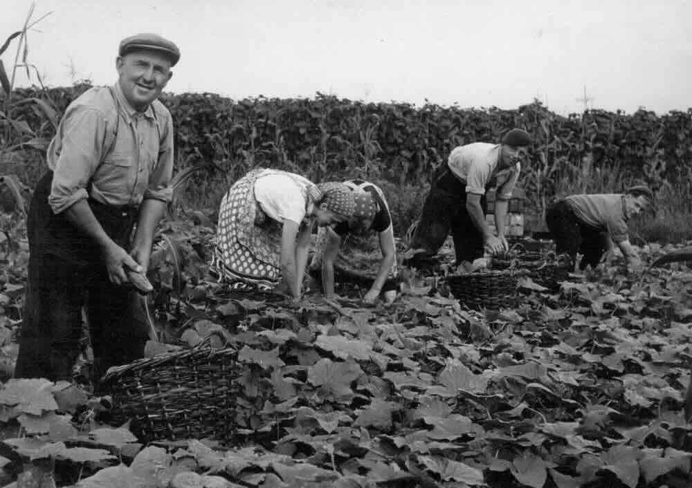

Pietje Sonnemans en zijn gezin plukken augurken van de koude grond. Op de achtergrond staakbonen.

Het ging daarbij om kleine bedrijfjes, die op den duur niet levensvatbaar bleken. Veel van deze kleine tuinders stopten uiteindelijk en gingen elders werken, bijvoorbeeld bij Vlisco in Helmond, waar zelfs een speciale bus naartoe reed.

### Platglas

Bijna elke tuinder had wel platglas. Dat waren ruiten van 73 bij 165 centimeter, gevat in houten lijsten. Ze werden broeiramen of eenruiters genoemd.

Peulen en tuinbonen werden onder platglas gezaaid om later uitgeplant te worden. Dat gebeurde ook met knolselderij. Voor augurken en slaplanten werden met een pottenpers van turfmolm eerst perspotjes gemaakt.

Behalve voor het opkweken van plantjes werd platglas ook gebruikt voor de teelt van wortels (bospeen) en aardbeien. Zo had bijvoorbeeld Jan van de Werf aan de Spruitweg wel meer dan 100 ramen met aardbeien.

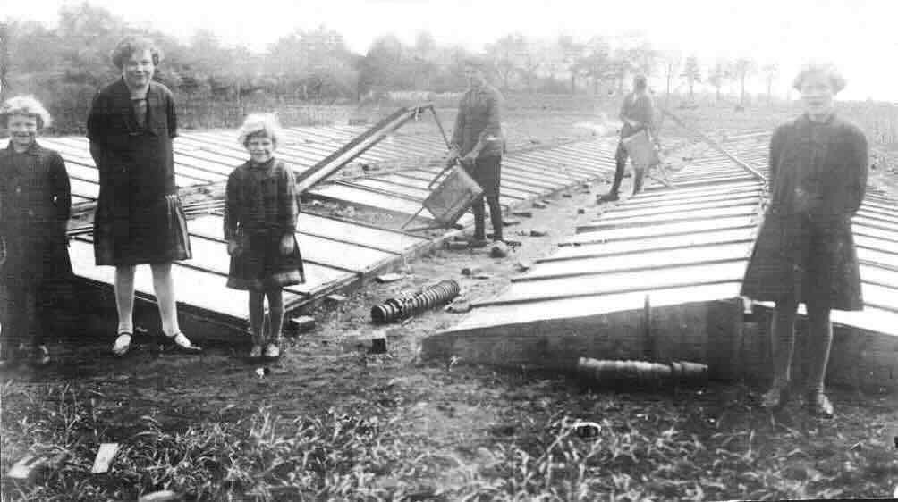

Platglas

### In Helenaveen pas na de oorlog kassen

In Venlo en omgeving was men veel eerder met de ontwikkeling van kassen. Al rond 1900 ontstond daar de zogenoemde Venlo-kas. Het idee was om het al lange tijd gebruikte platglas omhoog te brengen. In deze hogere kassen konden ook opgaande gewassen worden geteeld en bovendien was het werken er een stuk gemakkelijker.

In Helenaveen lag dat anders. Daar was het lange tijd niet mogelijk om bij de bank een lening te krijgen voor de bouw van kassen. Alle bedrijven waren gepacht van de Maatschappij en volgens het pachtcontract mocht er niets permanents op de grond worden gebouwd. Pas na de oorlog werden deze contracten aangepast en werd de bouw van kassen toegestaan.

Dit was te danken aan directeur Van Schelven, een landbouwingenieur die inzag dat de tuinbouw zonder kassen geen toekomst had. De kassen konden vervolgens worden gebouwd met behulp van het zogenoemde borgstellingsfonds. Dit overheidsfonds gaf banken een garantie, waardoor zij leningen konden verstrekken aan bedrijven met onvoldoende onderpand — wat in Helenaveen het geval was, omdat alle tuinderijen gepacht waren.

Hieronder een geluidsfragment waarin Hannes Joosten het heeft over de tuinbouw in Helenaveen.

### Rolkassen in de jaren ’50

In de vroege jaren vijftig werd, om de tuinbouw te stimuleren, subsidie verleend voor de bouw van rolkassen.

Deze kassen waren lager van opzet, met een kapbreedte van slechts 2,5 meter (later 3,2 meter) en een goothoogte van ongeveer 1,2 meter. Een bijzonder kenmerk was dat de kappen verrolbaar waren. Hierdoor konden twee teelten naast elkaar worden opgezet en afwisselend worden overkapt, wat de efficiëntie van het gebruik zou moeten verhogen.

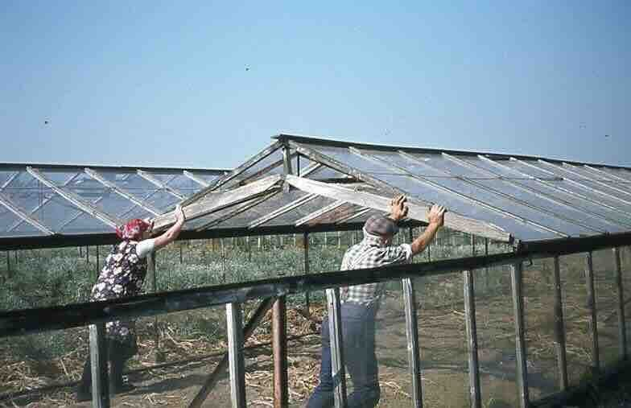

Verrollen van een rolkas

Helaas bleken deze rolkassen vaak geen lang leven beschoren. Door hun lage bouw waren de teeltmogelijkheden beperkt tot voornamelijk lage gewassen, zoals worteltjes, sla en andijvie, en slechts in beperkte mate tomaten. Bijzonder geschikt waren de rolbakken voor de teelt van bospeen. Wanneer deze groot genoeg was, kon de kap worden weggerold, waardoor er niet te veel loof werd gevormd.

De lage constructie vormde bovendien een duidelijke belemmering voor het werk in de kas. Mechanisatie van de grondbewerking was nauwelijks mogelijk, waardoor veel arbeid handmatig moest worden verricht. Ook was een efficiënte teeltplanning lastig, wat de praktische inzetbaarheid van de rolkassen verder beperkte.

### Het Venlo-warenhuis van hout

De eerste kassen in Helenaveen waren van hout en werden ook wel Venlo-warenhuizen genoemd. Ze hadden een goothoogte van slechts twee meter en stonden met hun stijlen op losse betonnen poeren. De luchtramen werden bediend met draden en kabels. Het gebruikte glas was dun, slechts 3 millimeter dik. De wanden bestonden uit kleine ruiten, die met kleine nageltjes en zwarte kit werden vastgezet.

Een belangrijk nadeel van deze kassen was hun kwetsbaarheid bij stormachtig weer. Regelmatig waren reparaties nodig. Bij hevige wind konden de kassen zelfs worden opgetild. Ook tegen een dik pak sneeuw waren ze niet bestand en soms stortten ze in. Dit overkwam onder andere de kas van Has Lagarde en Toon van Mullekom.

Aanvankelijk werden er vooral sla, tomaten en af en toe komkommers geteeld. Sla werd vaak geoogst in het vroege voorjaar of in de herfst.

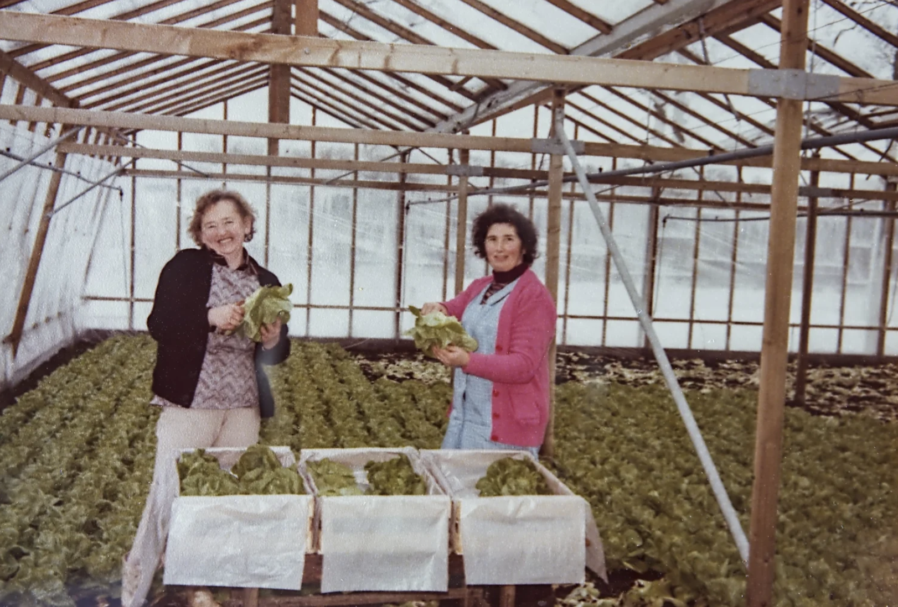

Houten kas van Harrie Jansen

Voor de teelt van tomaten en komkommers werden sommige kassen uitgerust met verwarmingsketels in een apart ketelhuis. Het warme water werd via een buizensysteem door de kas geleid. Afhankelijk van het aantal buizen per kap waardoor het hete water door liep, werd er gesproken van lichte of zware stook. Een kas met zogenoemde ‘zware stook’ was in die tijd iets bijzonders.

Bij lichte stook liep één verwarmingsbuis in het midden van de kap, met aan beide zijkanten nog een buis. Bij zware stook liepen aan de zijkanten twee buizen, wat zorgde voor een veel krachtigere verwarming.

De meeste kassen in Helenaveen waren echter koude kassen of beschikten over luchtverwarming, waardoor de teeltmogelijkheden beperkter waren. In het begin werden verplaatsbare plaatijzeren kachels (Hylo’s) gebruikt die petroleum verbrandden. Later kwamen hetelucht kanonnen die opgehangen werden en die aardgas verstookten.

Van alle kassen was alleen de eerste kas van Jan Bakker aan de Kervelweg verwarmd met een kolenketel. De overige kassen met lichte of zware stook werden verwarmd met ketels die brandden op zware stookolie. (Later aardgas)

### De aluminium Venlo-kas

In de jaren zestig werden de eerste aluminium kassen gebouwd. Aanvankelijk hadden deze kassen nog de standaard kapbreedte van 3,2 meter, maar al snel verscheen een verbeterde uitvoering met horizontale stalen liggers, waardoor een rij palen kon vervallen. Deze zogenoemde tweekapper had een overspanning van 6,4 meter tussen de palen, wat het werken in de kas aanzienlijk efficiënter maakte.

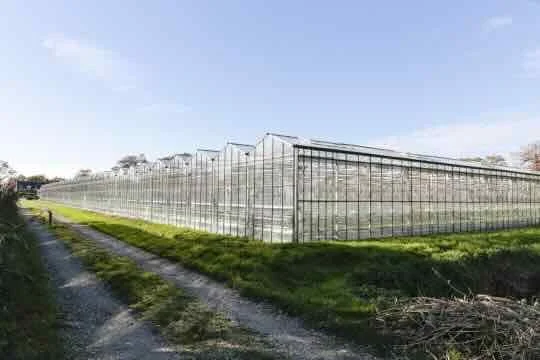

Aluminium kas (Soemeersingel 4)

Een nadeel van telen in kassen is dat de grond na verloop van tijd besmet raakt met ziektekiemen. Zo werd bijvoorbeeld de teelt van tomaten op een gegeven moment onmogelijk. Om dit te voorkomen werden de kassen gestoomd. Daarbij werd de grond afgedekt met zware zeilen, waaronder stoom werd ingeblazen. De bodem werd als het ware gekookt en was daarna volledig vrij van ziekten en onkruidzaden.

Het stomen van kassen werd in Helenaveen uitgevoerd door Van Lier, die het voormalige bedrijf van Jan Bakker aan de Kervelweg had overgenomen. Naast stomen kon de grond ook chemisch worden ontsmet.

Zowel het stomen als het chemisch ontsmetten waren kostbare ingrepen. Tegenwoordig zijn ze niet meer nodig, omdat men is overgegaan op substraatteelt. In de loop der jaren zijn kassen bovendien steeds hoger geworden om een beter en stabieler klimaat te creëren.

Een belangrijke verbetering van de Venlokas werd geïntroduceerd in 1983. De tot dan toe gebruikelijke glasbreedte van 73 cm werd vergroot tot 100 cm. Deze aanpassing verbeterde niet alleen de technische kwaliteit van de kas door een grotere lichtdoorlating, maar maakte de constructie ook goedkoper doordat er minder roeden nodig waren. Door het kleinere aantal roeden nam bovendien de warmtetransmissie van het dek af, waardoor de kas energiezuiniger werd.

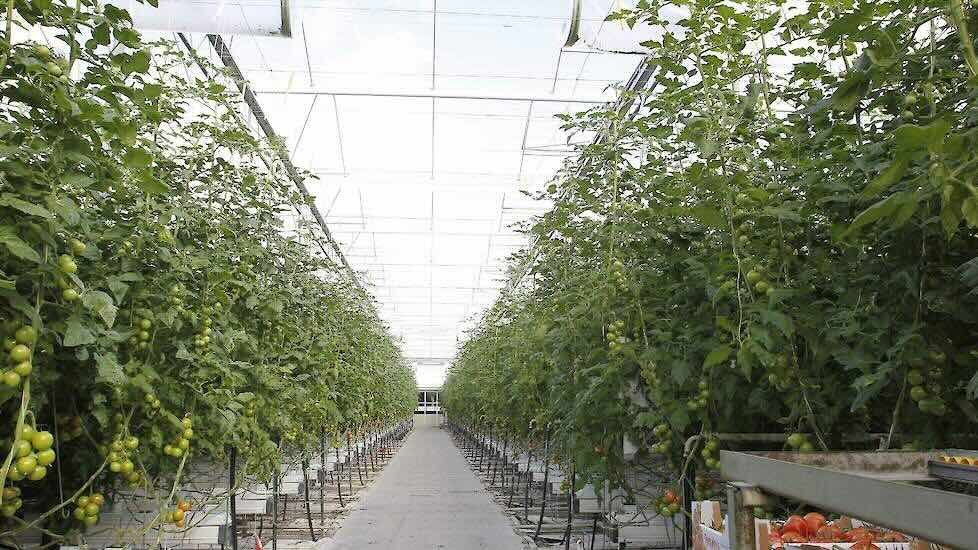

Tomaten teelt in een hoge aluminium kas met substraat teelt ( planten in steenwol)

### Het verdwijnen van de tuinbouw in Helenaveen

Helenaveen was ooit een echt tuindersdorp. Van de meer dan 150 tuinderijen die er ooit waren zijn er nog naar een handvol over.

Er zijn drie grote verdwijningsgolven te onderscheiden:

Midden jaren vijftig: kleine koude grond bedrijfjes stoppen. De glastuinders blijven nog actief.

Midden jaren tachtig: kleine kassen worden met behulp van een saneringsregeling afgebroken.

Begin 21e eeuw: De aanwijzing van de Peel tot Natura 2000 gebied met bijbehorende regelgeving- met name op het gebied van hydrologie, heeft de glastuinbouw in en rond Helenaveen jarenlang 'op slot' gezet. Een plan om een grootschalig tuinbouw gebied te stichten waar die bedrijven naar toe zouden kunnen verhuizen ging niet door. De kassen aan o.a. de Soemeersingel en de Koolweg maakten plaats voor natuur.

### Alle kassen van Helenaveen

Kervelweg 3 – Jan Bakker: sla en tomaten, 1953 eerste verwarmde kas (kolen), opvolging Jan Bakker jr./Van Lier

Kervelweg 9 – Piet Maessen: komkommer, koolrabi

Kervelweg 4 – Arie van Horen opvolger Marinus Lauwers

Kervelweg 8 – Jantje van der Zwaan

Oude Peelstraat 11 – Toon Wijnen: 1965–1995 Rolbak wortels,aardbeien

Oude Peelstraat 34 – Willem Maessen - Piet van der Zwaan: Rolbak wortels, tomaten,

Oude Peelstraat 42 – Antoon van Teefelen: bloemen, 1965–2015: fresia’s Chrisanten, anjers

Oude Peelstraat 44 – Leo Vercoulen: blauwe-bessen stek

Helenastraat 12 – Leo Veldhuijzen

Helenastraat 14 – Cobus Maessen

Helenastraat 26 – Henk van Mullekom

Helenastraat 32 – Cor van de Werf daarna Wim van de Werf 1953 gestart met rolbak, daarna staand glas.

Helenastraat 34 - Martien van Grunsven 1954

Soemeersingel 4 – Hans Maas: opvolger Harry Arts

Soemeersingel 21 – Willem van Esseveldt

Soemeersingel 39 – Mat van Grunsven

Soemeersingel 55 – Theodoor/Johan Lagarde

Soemeersingel 57 – Jan Bakker: sla, augurken, komkommers

Soemeersingel 61 – Albert van Teeffelen, komkomers

Soemeersingel 75 – Hannes Joosten: 1968–1985 opvolger Jan Jonker

Soemeersingel 77 – Harrie Jansen:

Soemeersingel 79 – Grad Jansen: actief 1968–1985

Soemeersingel 99 – 1958 Roel Vermeulen: opvolger Wijnand Vermeulen

Soemeersingel 101 – Leonard Joosten: actief 1965–1995, opvolger Jan Arts

Soemeersingel 109 – Geert Schonewille:

Soemeersingel 113 – Henk de Vries

Soemeersingel 123 – Jan Prijs: bloemen

Soemeersingel – Toon van de Mortel: rododendrons

Zinkskeslaan 6 – Jan Bakker opvolger jan Bakker Jr

Zinkskeslaan 16 – Gerrit van der Werf

Zinkskeslaan 20 – Jo van der Werf

Zinkskeslaan 10 – Rinus van Mullekom later Jan Bakker, Michiel Penninx

Zinkskeslaan – Jan Philipsen

Fruitweg 2 – Marinus van de Werf:

Fruitweg 4 – Rien Erkelens

Lagebrugweg 15– Jan van der Zwaan, een van de eerste kassen van Helenaveen. Deze kas had oliegestookte luchtverwarming. Opvolger Leo Vercoulen

Lagebrugweg 7 – Rein van Woezik: rolbak wortels, tomaten

Lagebrugweg 1a– Theo Wijnen

Rector Nuijtsstraat 12 – Cor van Horen: opvolger Ger van Horen vroege kas ‘55 zware stook

Centurioweg 10 – Wim van Mullekom

Centurioweg 8 – Toon van Mullekom

Grashoekseweg 5 – Jan Crommentuijn

Heldensewg 3 Jan philipsen

Heldenseweg – Harrie Luijten

Heldenseweg 6 – Wim Luijten

Heldenseweg 7 – Harry van Neerven

Spruitweg 8 – Sjaak van Horen

Spruitweg 6 – Jan van der Werf later Jan Faassen

Koolweg 7– Ad van der Werf (1991 aan de westzijde van de weg)

Koolweg 7 – Toon van Mullekom (aan de oostzijde van de weg)

Koolweg 8 – Harrie Toonen

Koolweg 10 – Jan Boots

Koolweg 32 – Cor Luijten later Piet Maessen

Koolweg 36 – Sjun Arts, later Sjaak Hermans

Koolweg 48 – Jan van Cauwenberghe: bloemen

Koolweg 3 – Jan van Well

kruisbeswg 4 – Theo van Well

Jan Deckerstraat 3 – Huub Sonnemans

Jan Deckerstraat 9 – Wouter Swinkels Rolbak

Sevenumseweg 2 – Harrie Sonnemans

Helenaveensewed 37 – Gerard van Horen

Helenaveenseweg 39 – Jan van Horen

Geldersestraat 12 – Marinus van Mullekom

Geldersestraat 10 – Piet Philipsen

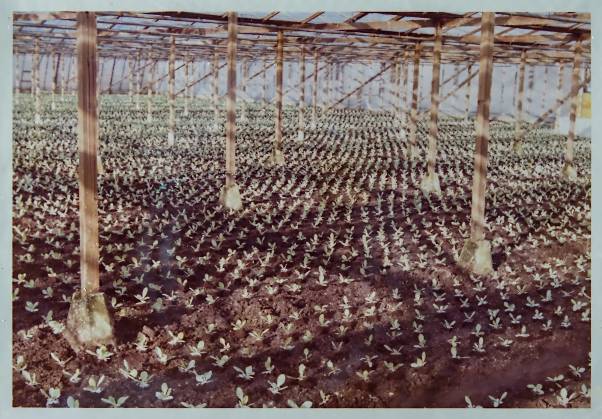

Slateelt in houten kas Harrie Janssen

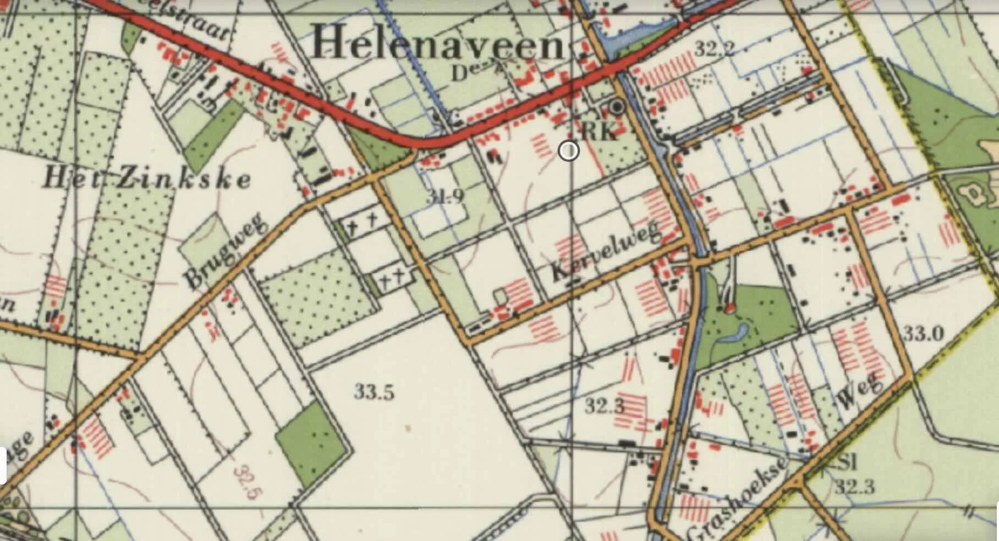

toestand 1967

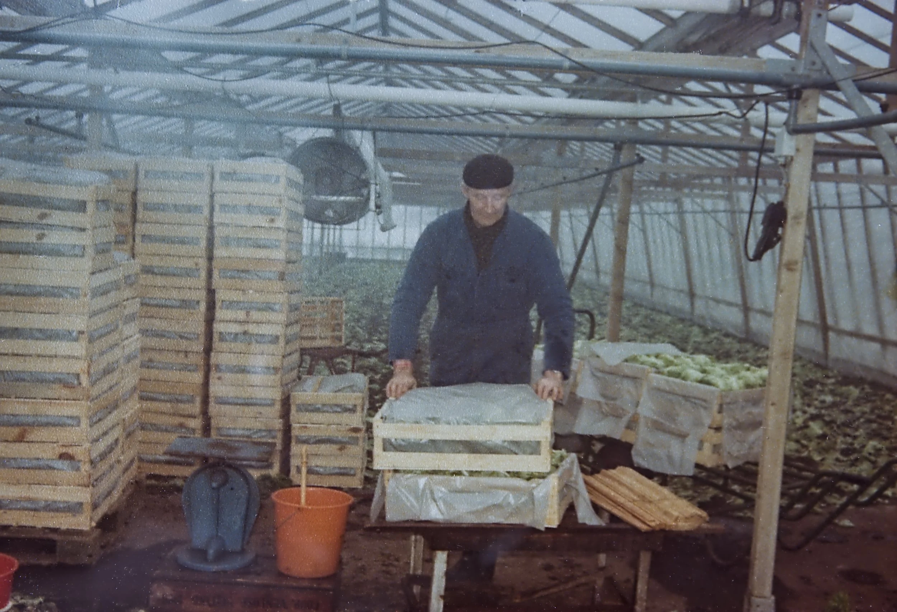

Harrie Janssen, slateelt met een heteluchtkanon

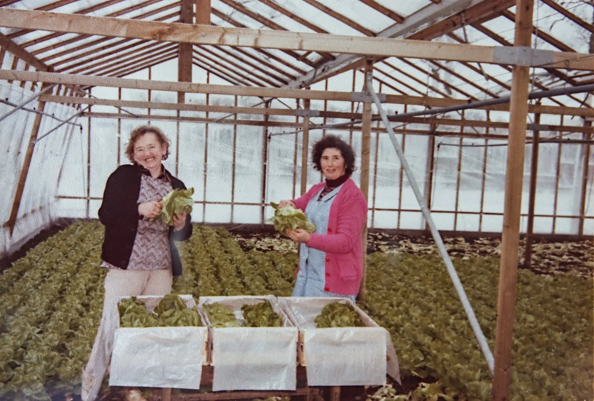

Sla snijden bij Harrie Janssen

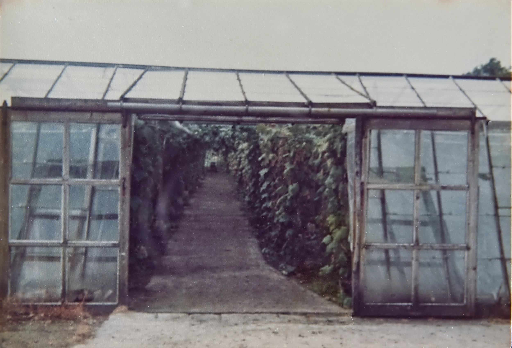

Augurken na de sla bij Harrie Janssen

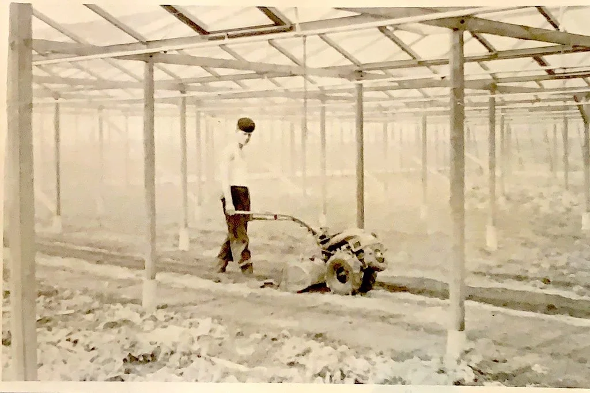

Theo Bakker in de kas van Jan Bakker op het Zinkske

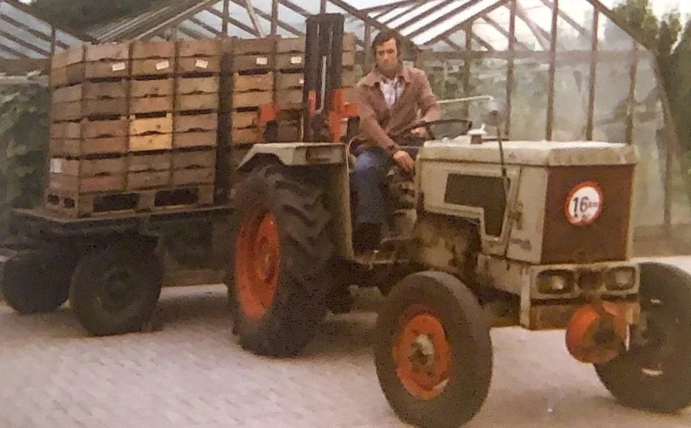

Wim van Mullekom: Augurkenteelt, Centurioweg

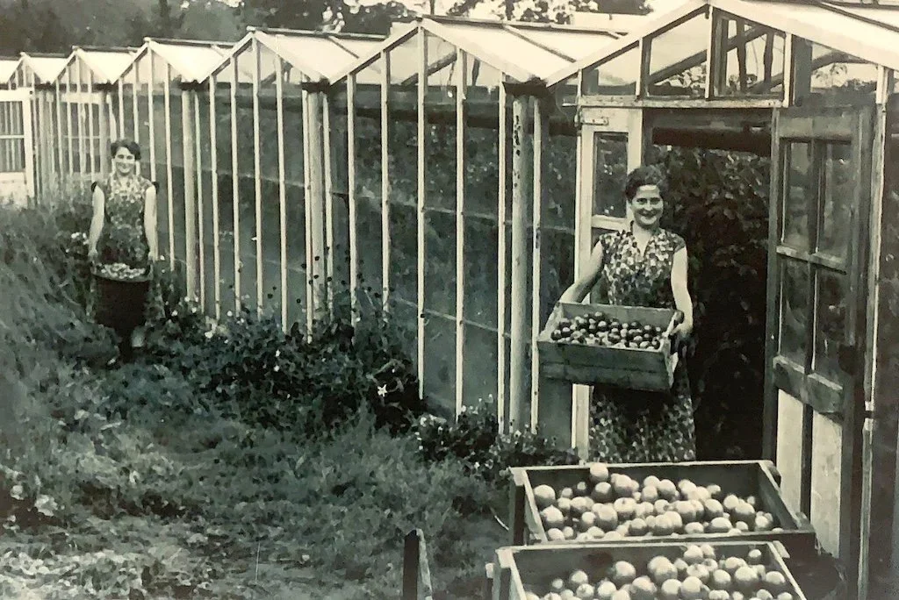

De eerste kas van Helenaveen van Jan Bakker aan de Kervelweg

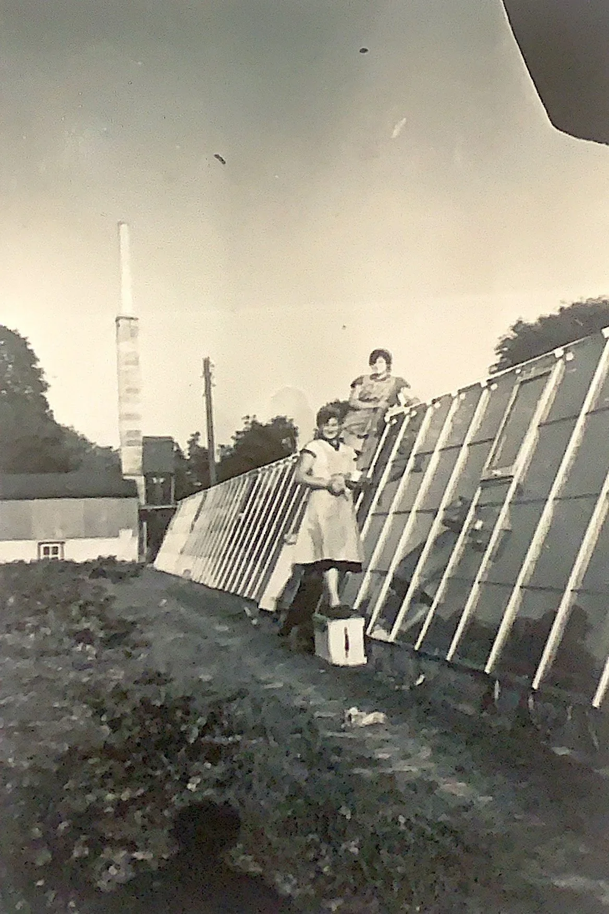

Schilderen van de houten kas van Jan Bakker aan de Kervelweg. Op de achtergrond het ketelhuis (kolenstook)

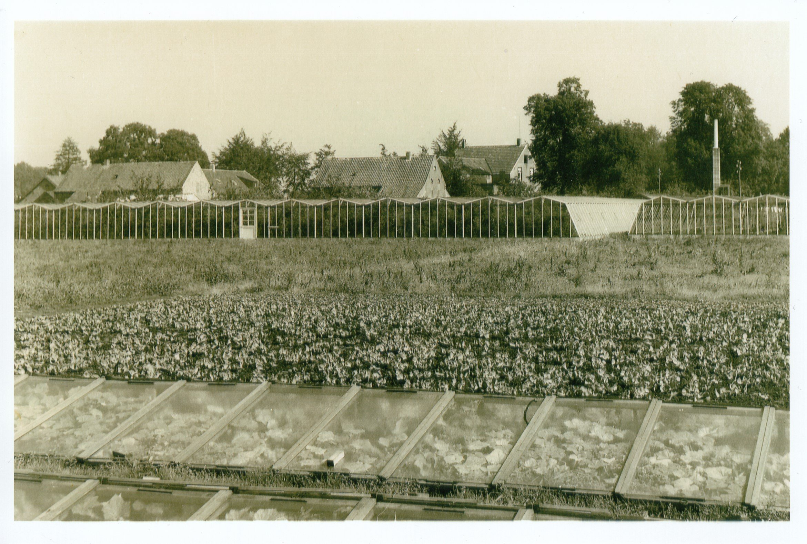

Tuinderij Jan Bakker, Kervelweg

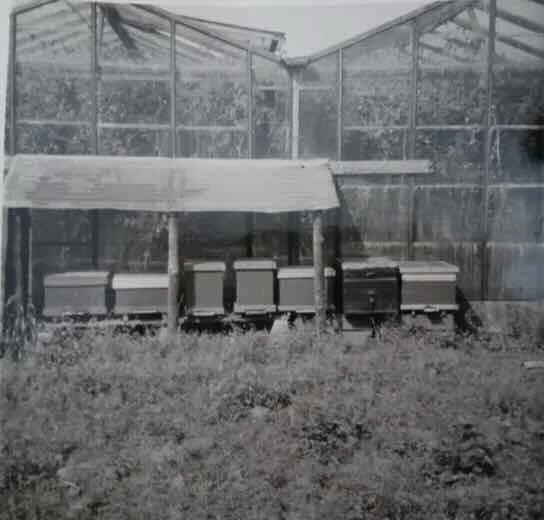

Kas Martien van Grunsven Helenastraat

Fim over het initiatief om een grootschalig tuinbouw gebied te creeern in Helenaveen (2004) https://www.youtube.com/watch?v=ReHW16PzHx4

W.vdWerfJvWoezik
