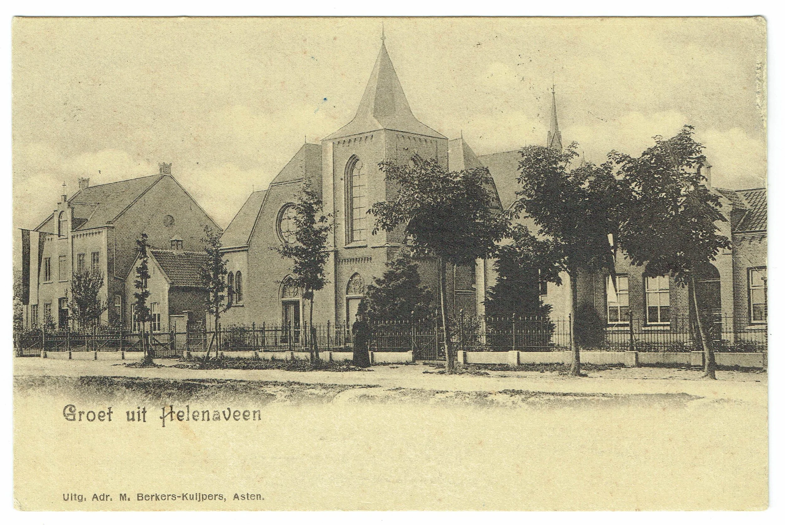
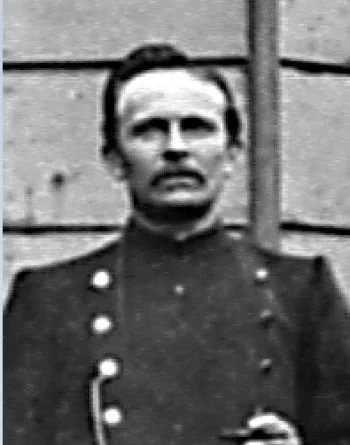
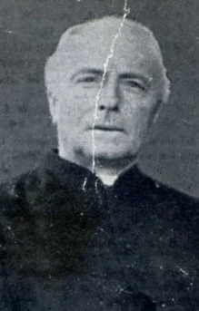

# kee-knies

> Bron: helenaveenvantoen.nl

### Kee Knies de onbetrouwbare huishoudster van Pastoor Bijnen

Op 20 mei 1885 arriveerde Kee Knies in Helenaveen. Zij werd daar de huishoudster én vertrouwelinge van pastoor Bijnen en wist hem volledig voor zich te winnen. Kort vóór haar komst waren zes Franciscanessen uit Veghel naar Helenaveen gekomen. De moeder-overste, zuster Agnes, stond bij de pastoor, de koster en Kee zelf vanaf het begin in een kwaad daglicht, mede door roddels over haar eerdere standplaats in Dinther.

Kee beschouwde de zusters al snel als rivalen en deed er alles aan om hen bij de pastoor in een slecht daglicht te stellen.

Een zeldzame ansicht met daarop Pastorie, kerk en Klooster.Het klooster nog in oude staat voordat er een verdieping op gezet werd. (collectie G.V.)

Al spoedig werden ’s ochtends op de poort tussen kerk en klooster herhaaldelijk anonieme briefjes aangetroffen, voorzien van minderwaardige zinspelingen en spotprenten die waren gericht tegen de kloostermoeder, zuster Agnes. Op één van die briefjes stond zelfs de dreiging dat zuster Agnes binnen zes weken Helenaveen moest verlaten, anders zou zij door de andere zusters worden gedood.

De angst zat er bij zuster Agnes zo diep in dat zij veldwachter Aarts op een nacht in het klooster liet waken, zowel ter bescherming van haar leven als om de mogelijke briefjesplakker(s) op heterdaad te betrappen. De volgende ochtend werd er echter geen nieuw briefje op de poort gevonden, wat door sommigen werd opgevat als bewijs dat de zusters zelf de schuldigen waren.

De werkelijke dader(s) zijn nooit ontmaskerd. Wel lijkt de pastoorsmeid Kee de hoofdverdachte te zijn geweest, mogelijk samen met koster Kees van Teeffelen. Deze was namelijk door de zusters bijna betrapt toen hij diep in de nacht nog rondliep, terwijl er juist een nieuw briefje op de poort hing.

De dader kreeg uiteindelijk zijn of haar zin: zuster Agnes, zuster Cornelia en zuster Virginia werden overgeplaatst. Volgens verschillende andere zusters was moeder-overste Agnes weliswaar streng, maar zeker niet gehaat.

Toen pastoor Bijnen ernstig ziek werd en op zijn sterfbed lag, kwam de kapucijner pater Cajetanus naar Helenaveen om de parochiedienst waar te nemen. Aanvankelijk geloofde hij de negatieve verhalen die dienstmeid Kee over de zusters verspreidde en stond hij zeer argwanend tegenover de nonnen. Dit veranderde echter na een gezamenlijke reis met de nieuwe moeder-overste, zuster Cecilia, die hem de andere kant van het verhaal vertelde. Vanaf dat moment richtte zijn wantrouwen zich niet langer op de zusters, maar op de dienstmeid.

Kee liet niemand toe tot de zieke pastoor, zelfs geestelijken niet, en zij beheerde bovendien de sleutel van de brandkast. Op een dag wist pater Cajetanus de brandkast te openen. Hij ontdekte dat er 3000 gulden in lag en kreeg het vermoeden dat er geld verdween. Om dit te controleren legde hij een van zijn baardharen op de geldstapel. De volgende dag bleken zowel het baardhaar als het geld uit de kluis verdwenen.

Kort daarop overleed pastoor Bijnen en werd hij opgevolgd door pastoor Kerssemakers, die in Helenaveen een grote administratieve wanorde aantrof. Pastoorsmeid Kee verliet daarop de pastorie en ging inwonen bij maatschappijopzichter Verhoeven. Daar liet zij blijken over aanzienlijke geldmiddelen te beschikken. Verhoeven meldde dit aan de nieuwe pastoor, die veldwachter Aarts opdracht gaf Kee te laten halen.

Veldwachter Aarts (coll. AV)

Om het geld aan het licht te brengen werd Kee gesommeerd zich uit te kleden. Zij wilde zich daarvoor terugtrekken in een ander vertrek, maar dat werd haar niet toegestaan. Onder haar kleding bleek zij inderdaad een bedrag van 3000 gulden verborgen te houden. Pastoor Kerssemakers begon daarop een procedure over de rechtmatigheid van dit geld, maar verloor het proces uiteindelijk, waarschijnlijk wegens gebrek aan bewijs. De rechtszaak kostte hem bovendien veel geld.

Pastoor kerssemakers

Kee Knies deed nog een poging om als pastoorsmeid bij Kerssemakers in dienst te treden, maar dat leidde tot zijn uitspraak: “Nog niet, al brengt ze iedere dag 1000 gulden mee.”

Op 8 september 1896 verliet Kee Helenaveen.

De verwikkelingen rond pastoor Bijnen, Kee Knies en de zusters van Helenaveen werden in maart 1945 vastgelegd door zuster Hendrina in het memoriaal van de zusters van Helenaveen. Zij had deze gebeurtenissen vernomen van zuster Scholastica, die dit alles zelf had meegemaakt. Over haar schreef zuster Hendrina dat zij een eerlijk, onpartijdig en betrouwbaar mens was.

Het bedrag van 3000 gulden dat Kee zou hebben ontvreemd, lijkt ongelooflijk hoog (tegenwoordig zeker gelijk aan 100.000 euro). De pastoor was echter bouwpastoor, en bij de bouw van de kerk en het klooster waren grote sommen geld gemoeid.

Bron: Deurnewiki

jvw 24-12-2025
