# kerkhof

> Bron: helenaveenvantoen.nl

### De oude en nieuwe begraafplaatsen van Helenaveen

Helenaveen, ontstaan rond 1853 langs de Helenavaart, kent een rijke begraafcultuur die nauw verweven is met de ontwikkeling van het dorp. In 1857 werd aan de huidige Fruitweg een katholieke noodkerk ingericht in een omgebouwde stal van een boerderij. Bij deze locatie ontstond ook de eerste begraafplaats van Helenaveen: een klein kerkhof van circa 20 bij 25 meter, waar totaal 35 overledenen werden begraven.

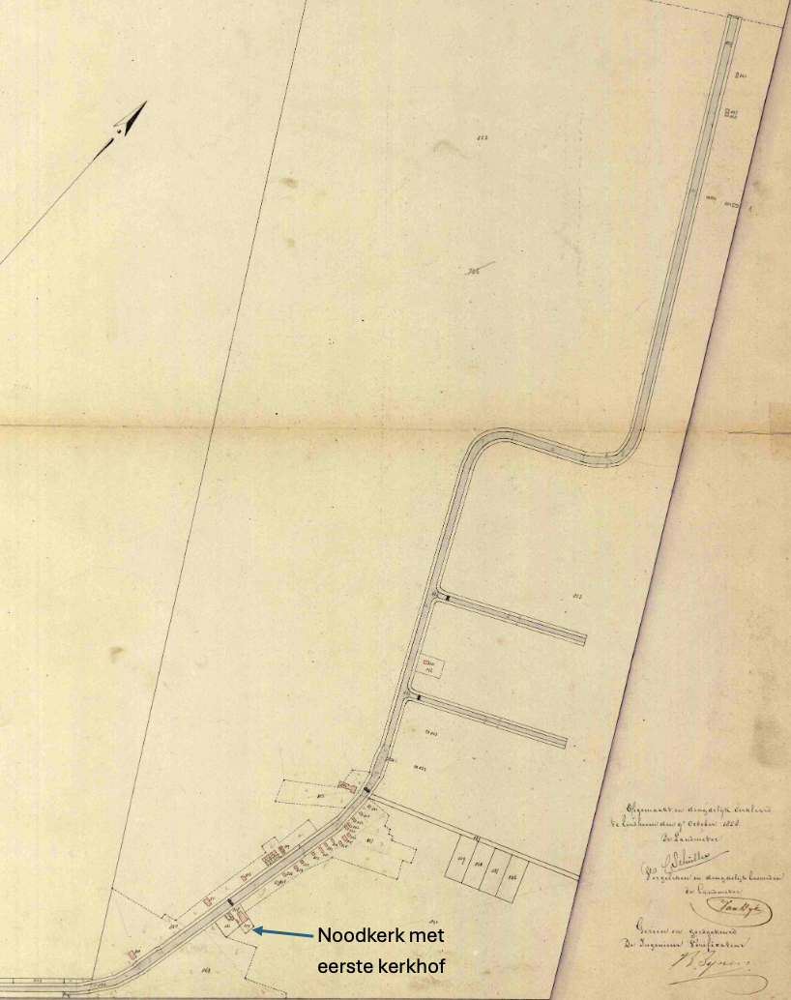

Kaart uit 1858 van het prille begin van Helenaveen met daarop de noodkerk en het eerste kerkhof

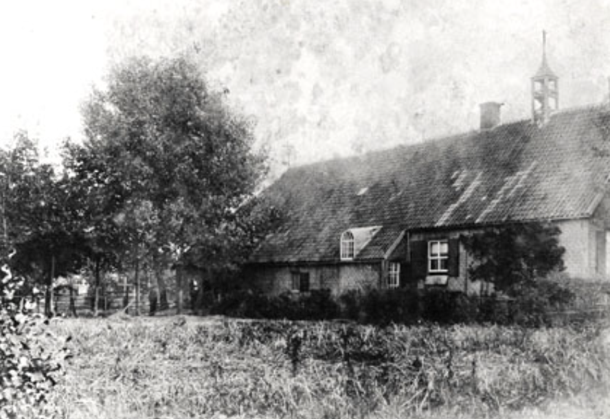

De Noodkerk aan Fruitweg

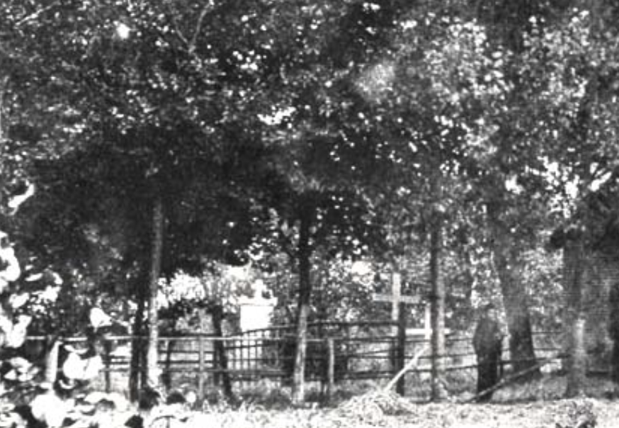

Detail uit de vorige foto, met daarop het kerkhof. Duidelijk te zien is het graf van Rector Nuijts (zie verderop)

Een nieuwe begraafplaats bij de kerk

In 1871 meldde directeur Deckers van de Maatschappij Helenaveen aan de gemeente dat een terrein was ingericht als algemene begraafplaats, voorzien van de wettelijk vereiste omheining. Drie jaar later, in 1874, werd er een lijkenhuisje toegevoegd. Dat jaar werd het kerkhof officieel in gebruik genomen.

Al spoedig volgde het verzoek om de begraafplaats te verdelen in een katholiek, een protestants en een algemeen deel. De nieuwe begraafplaats kwam te liggen naast de school, op het terrein waar later het klooster en de katholieke kerk zouden worden gebouwd.

Het ruimen van het oude kerkhof aan de Fruitweg verliep echter niet nauwgezet. Jaren later werden er nog menselijke resten aangetroffen. Zo werd een grafkelder door de familie Van der Werf gebruikt als opslag voor aardappelen, en er wordt zelfs verteld dat jongens voetbalden met schedels.

Ook de nieuwe begraafplaats was bescheiden van omvang, ongeveer 40 bij 40 meter. De algemene begraafplaats van de gemeente besloeg 432 m², de protestanten kregen 223 m² toegewezen en de katholieken beschikten over 872 m².

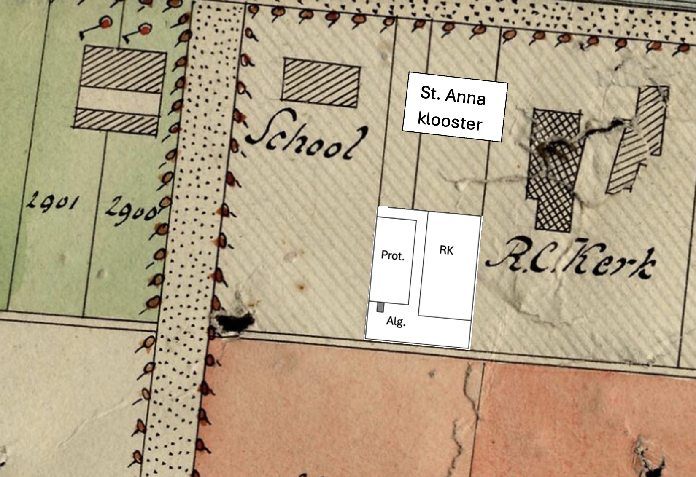

Kaart uit 1889 met daarop geprojecteerd het kerkhof aan het huidige Hannes JoostenpleinDe contouren van de kerk en de pastorie kloppen niet. Het klooster stond niet op de kaart.

Het RK Kerkhof aan de Aardbeiweg

Door bevolkingsgroei en ruimtegebrek stelde de gemeente een perceel heide van twee hectare beschikbaar aan de Rooms-Katholieke Kerk. In 1897 kreeg het kerkbestuur toestemming om hier, aan de huidige Aardbeiweg, een bijzondere begraafplaats aan te leggen van 41,6 are. Voor rouwstoeten werd de Hovenierstraat gebruikt, in de volksmond ook wel “het kerkhoflaantje” genoemd.

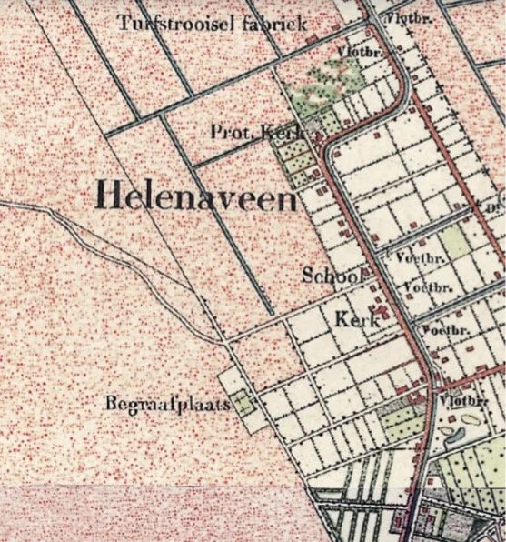

Het nieuwe RK kerkhof aan de Aardbeiweg 1897

Het Protestantse en het algemene Kerkhof aan de Aardbeiweg

In 1899 volgde de Nederlands Hervormde Gemeente met de aanleg van een nieuwe begraafplaats van 50 are, gelegen ten noorden van het katholieke deel. In 1901 werd daar een algemeen gedeelte van 5 are aan toegevoegd.

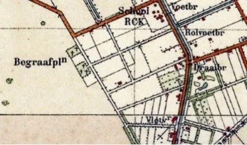

Het Protestantse kerkhof aan de Aardbeiweg 1899

De oude hervormde begraafplaats werd op 18 juli 1899 gesloten. In 1907 werd ook het katholieke deel van de oude begraafplaats officieel buiten gebruik gesteld. De graven werden geruimd of overgebracht naar de nieuwe begraafplaatsen.

Beschrijving van de protestantse begraafplaats

Aan de Aardbeiweg ligt de protestantse begraafplaats, herkenbaar aan het sobere smeedijzeren toegangshek, voorzien van gekruiste zeisen als symbolen. Bezoekers lopen eerst langs een ovaal perk met rododendrons, waarna de grafvelden zichtbaar worden. De begraafplaats heeft een kruisvormige indeling met vier velden en een centrale wandelroute.

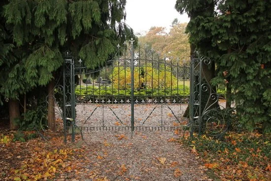

Het mooie toegangshek van de protestantse begraafplaats

Opvallende monumenten uit het begin van de twintigste eeuw zijn hier te vinden, waaronder een tombe voor mevrouw Van de Blocquerij-van Musschenbroek, echtgenote van een van de directeuren van de Maatschappij Helenaveen.

Een aantal graven zijn van het oude naar het nieuwe kerkhof verplaatst, waaronder dat van de eerste dominee E.B. Swalue

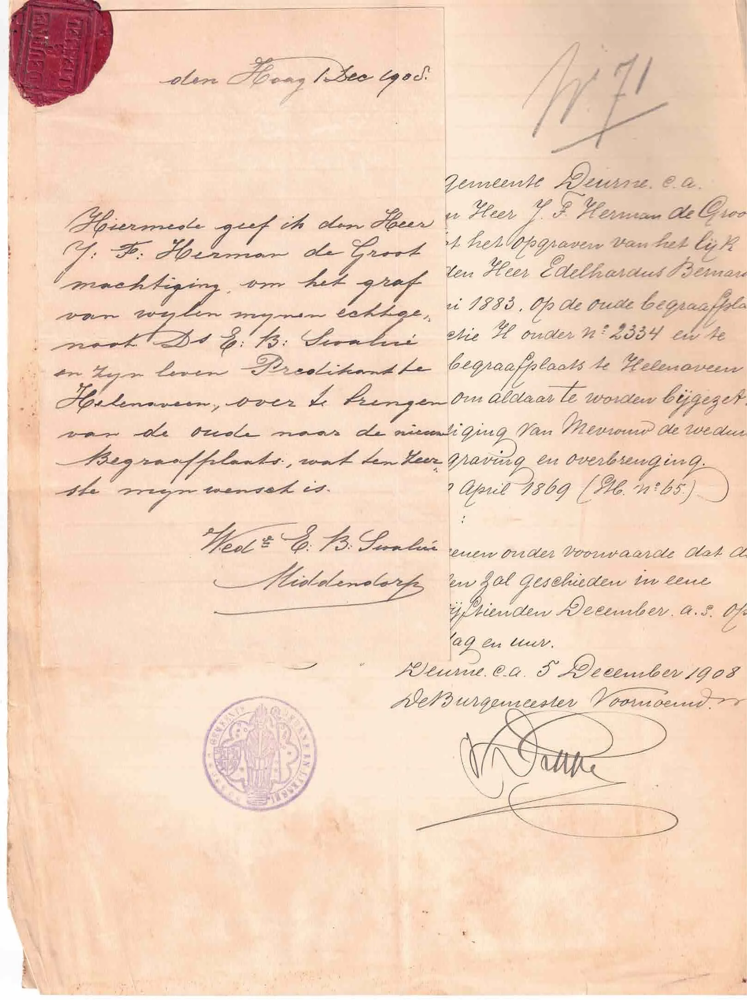

Toestemming van Wed. Swalue-Middendorp om het graf te verplaatsen

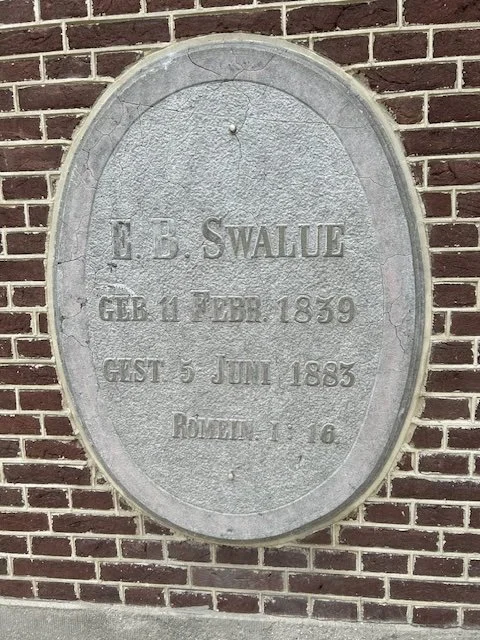

De grafsteen van Ds. Swalue is bij de restauratie van de protestantse kerk in de muur gemetseld.

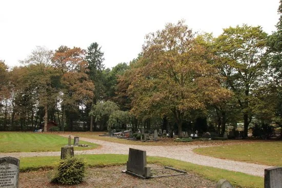

Overzicht Protestantse begraafplaats richting veld 4

Aan de achterzijde bevindt zich een urnenhof, ingericht tijdens recente restauraties. De protestantse begraafplaats is een groene oase met rododendrons, treurbomen en een goed onderhouden padenstructuur.

Beschrijving van de katholieke begraafplaats

De Rooms-Katholieke begraafplaats ligt iop een kunstmatige verhoging in het landschap en is bereikbaar via een kort pad met lage haag, geflankeerd door twee esdoorns. Het toegangshek bevat nog originele elementen van het oorspronkelijke hekwerk.

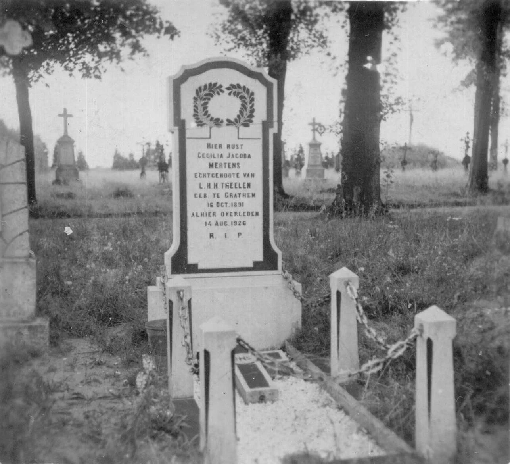

Op de achtergrond: graven op het gedeelte links achteraan. Deze zijn allemaal verwijderd. Let op de mooie gietijzeren kruisen.

Het grasveld links achteraan was ooit volledig bezet met graven. In de jaren vijftig zijn de grafmonumenten door Pastoor Timmers verwijderd, maar de stoffelijke resten zelf zijn gebleven. Aan de achterzijde bevinden zich zeven oorlogsgraven van slachtoffers van de kerkrazzia, in 1951 overgebracht uit Duitsland.

Vooraan aan de linkerzijde van het middenpad ligt het tweede deel van het kerkhof. De vele verticale grafmonumenten met kruisen geven het een typisch katholiek karakter, een beeld dat in Noord-Brabant steeds zeldzamer wordt.

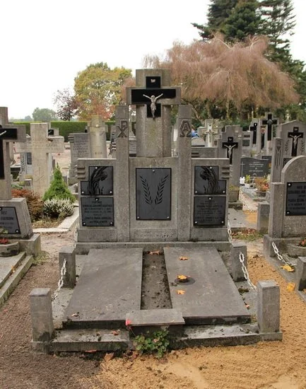

Grafmonumenten op het oude gedeelte, verzorgd door Memori

Verder naar achteren bevinden zich modernere grafmonumenten, die duidelijk afwijken van het oorspronkelijke beeld. Hier is ook een rij urnenkeldertjes aangelegd, die tot op heden niet in gebruik zijn genomen.

Op het voorste veld rechts liggen voornamelijk uniforme grafmonumenten uit de jaren zeventig en later, uitgevoerd in gepolijst zwart graniet. Enkel de teksten en symbolen zorgen voor enige variatie. Het was vooral pastoor Lips die ervoor gezorgd heeft dat de uniformiteit verplicht werd, naar de mode van die tijd.

Rechts achter op het terrein ligt een veld met kindergraven aan de voorkant en enkele oudere grafmonumenten verder naar achteren. Deze zijn afkomstig van prominente Helenaveners of priesters uit de negentiende en vroege twintigste eeuw, waarvan sommige monumenten zijn overgebracht van eerdere kerkhoven.

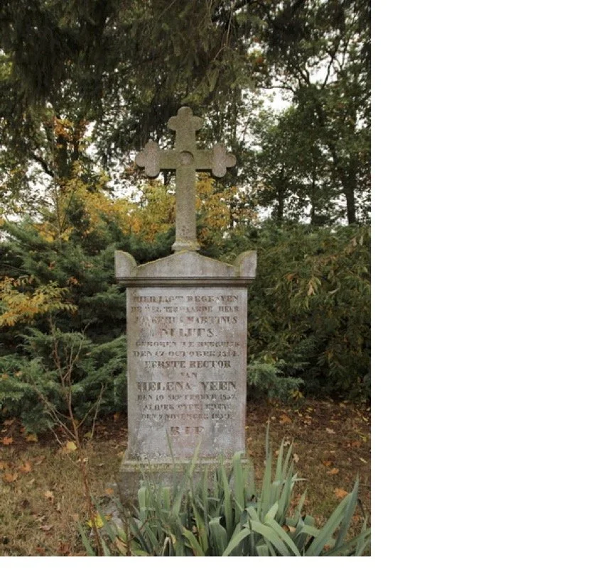

Het van het tweede kerhof over gebrachte graf van Rector Nuijts

Een opvallend verschil tussen de Protestantse en de Katholieke rituelen is de omgang met levenloos geborenen. Op het protestantse kerkhof werden deze normaal begraven, terwijl bij de katholieken ongedoopten niet in gewijde aarde begraven mochten worden. Daar werden ongedoopte kinderen zonder verdere plichtplegingen door de ouders zelf ergens achter de heg begraven. Zo moest C. van der Zwaan in 1954 zijn zoon Gerardje in een boterdoos achterop de fiets gaan begraven, ergens onder de heg, wat een langdurig trauma heeft opgeleverd bij de ouders.

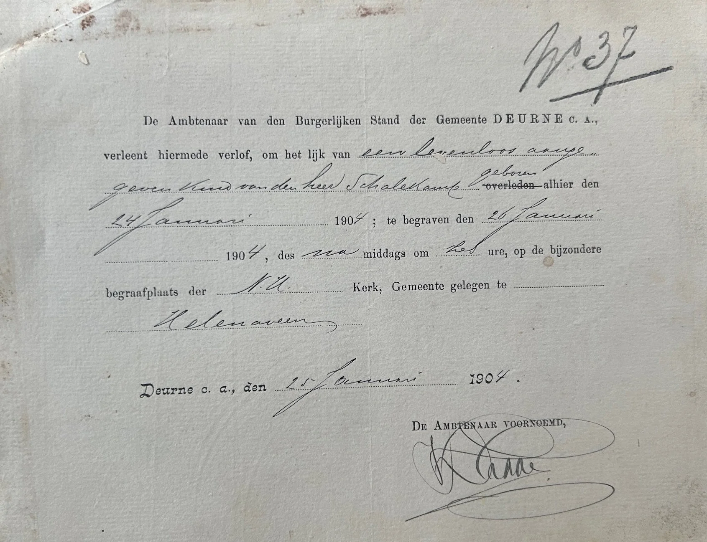

Begrafenis van een levenloos geboren kind van Ds. Schalekamp.

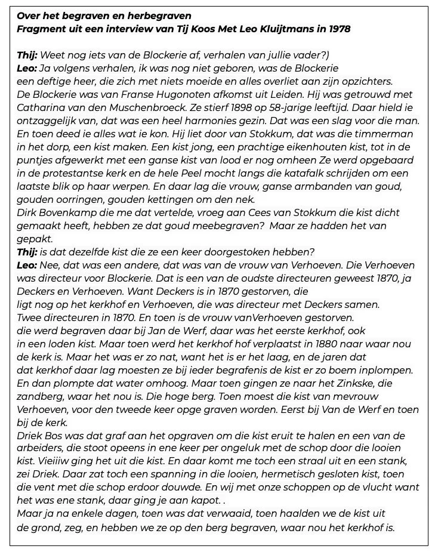

Cultureel erfgoed

De begraafplaatsen van Helenaveen vormen samen een bijzonder en waardevol onderdeel van het culturele en religieuze erfgoed van het dorp. Ze vertellen het verhaal van pioniers, geloofsgemeenschappen en veranderende tijden – en verdienen daarom blijvende aandacht en zorg.Beide kerkhoven zijn dan ook aangewezen als gemeentelijk monument.

Jan van Woezik Juli 2025

Bronnen:DeurnewikiStichting Dodenakkers – https://www.dodenakkers.nlCollectie André VervuurtCollectie Gerard VeldhuizenCollectie Huub Kluitmans (interview Leo)Collectie Paul TheelenMemori Helenaveen
