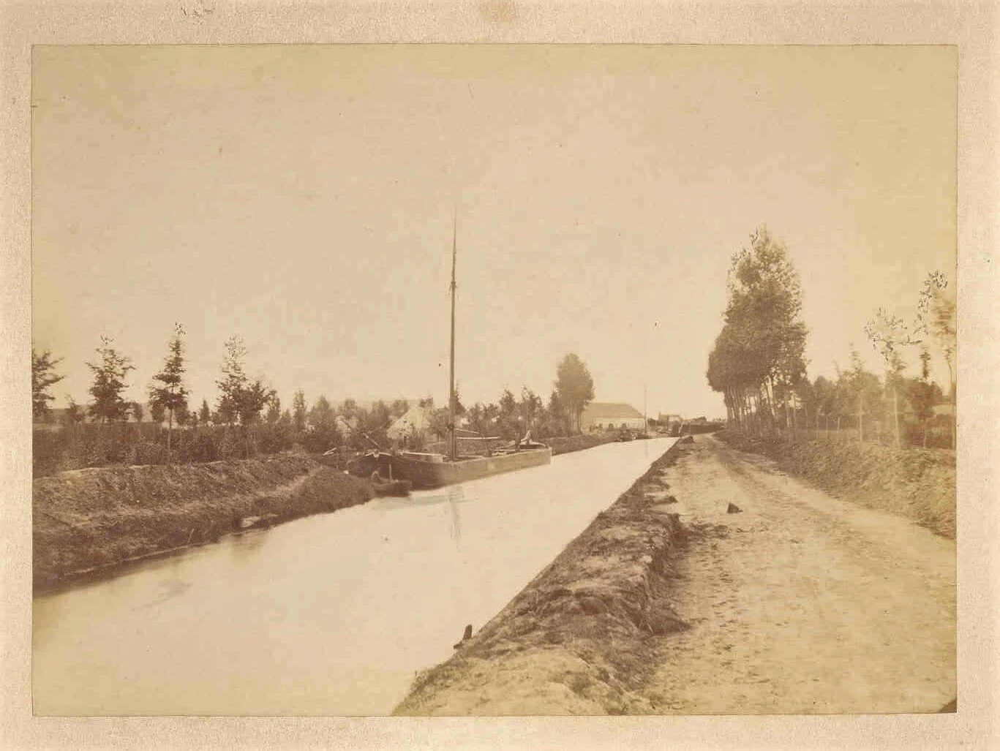
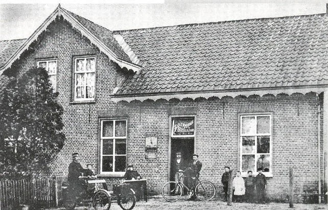
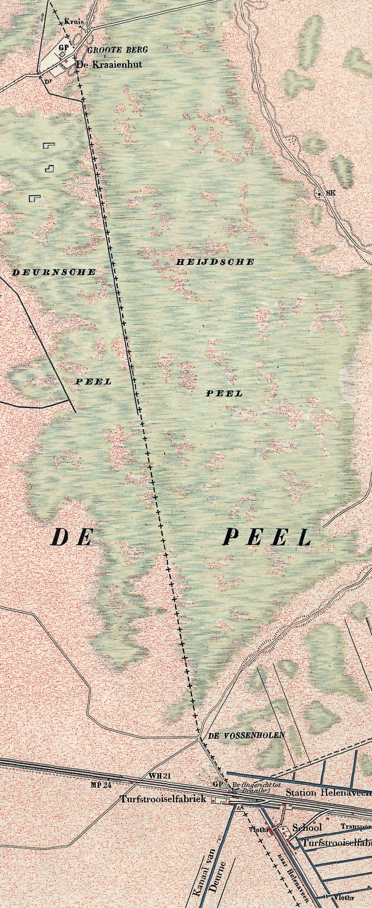
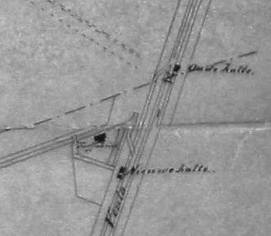

# kermis-1895

> Bron: helenaveenvantoen.nl

## HELENAVEEN KERMIS IN 1895

Op zondag 1 september 1895 begonnen de botanici Goethart en Vuijck vanuit Boxmeer aan hun eerste tocht door de Peel op zoek naar planten. De plantenkundigen wilden die dag Helenaveen bereiken om te overnachten bij logement Van Oers. Het werd een barre tocht, die, vanwege het verzamelen van planten, maar meer nog door het verdwalen vanwege de onbekendheid met de gevaren van het Peelmoeras, veel langer duurde dan ze gedacht hadden. ’s Avonds laat kwamen ze in Helenaveen aan, alwaar hen een verrassing wachtte. Het was Helenaveen kermis. Vuijck maakte van hun meerdaagse Peeltocht een uitgebreid verslag, waarvan we de voor Helenaveen belangrijke passages hieronder laten volgen.

### “Een botanische excursie in de Peel. Sept. 1895”

Ons landje is rijk aan water, aan plassen en moerassen en op de kaart teekent zich voor den botanist de Peel als een zeer aantrekkelijke streek af, om na te gaan wat er kan gevonden worden in deze eeuwenoude moerasvenen. (…)

Na de laatste bijeenkomst der botanische Veree­niging te Hengelo was de lust tot het maken van eene excursie aange­wakkerd en had ik met mijn vriend Goethart te Hoorn afgesproken zoo mogelijk nog eens een afzonderlijken tocht te ondernemen, waarbij onze keuze viel op de Peelstreek. Een besluit was spoedig genomen en den 31en Augustus zouden wij ‘s avonds te Boxmeer samenkomen, om dan den volgenden dag reeds zeer vroeg op weg te gaan door al de op de kaart aangegeven plassen zuidwaarts tot Helenaveen, om den volgenden dag van daar naar Weert te gaan en eindelijk den laatsten dag de streek tusschen Susteren en Roermond te doorsnuffelen. (…)

Na een snelle reis over Utrecht-Arnhem, ontmoet­te ik mijn reismakker aan ‘t station Arnhem voorzien natuurlijk van een plantenbus van de noodige afmeting, benevens een bruine alpenzak op den rug, over wiens uitgebreidheid ik me wel wat verbaasde. Want ofschoon ik zelf voor een driedaagsche wandeltocht de noodza­kelijkste benoodigdheden in een tasch had meegevoerd, was ik wel een weinig verwonderd wat er alzoo in die enorme reisne­cessaire zou zitten. Mijn verwondering maakte wel eenigs­zins plaats voor bewondering, toen ik merkte dat mijn vriend zich voor alle mogelijke gevallen en ongevallen had uitgerust en zelfs een paar blikken cornedbeaf meevoerde, voor ‘t geval dat we bij onzen Peeltocht op het punt zouden zijn van gebrek te zullen omkomen. Geheel ongegrond was de voorzorg voorzeker niet, want een grooter woestenij als we nu zouden betreden, heb ik in ons land nog niet gezien. (…)

DOOR DE PEEL VAN BOXMEER NAAR HELENAVEEN

Na met eenige inspanning [in het hotel waar ze in Boxmeer overnacht hadden] het noodige verorberd te hebben, ving onze Peelreis om kwart over zessen [zondag 1 september 1895] aan. Heerlijk weer, lekker frisch (…)

Van Merselo ging onze weg over Weverslo langs de plas naar Volen en hier werd eindelijk koers gezet naar Helenaveen. [Onderweg werden vershillende planten verzameld.] Bij de laatste woning, die we passeerden overtuigden we ons van den juisten weg; we hadden nog slechts eenige schreeden te gaan, dan zouden we de nieuwgebouwde kerk en de fabrieken van Helena­veen zien liggen en inderdaad bleek dit het geval te zijn. [Ze hadden de tocht ‘goed’ voorbereid, maar van Boxmeer tot de spoorlijn bij Griendtsveen waren ze al enkele keren verdwaald. En daar bij de spoorlijn dachten ze Helenaveen bereikt te hebben. Op het verkeerde been gezet door ‘Halte Helenaveen’ en ‘station Helenaveen’. Ze zagen de nieuwe kerk van Griendtsveen en de turfstrooiselfabrieken daar aan voor die van Helenaveen.] Helder glinsterde het nog niet met leien bedekte dak der kerk in het zonlicht; als hooge bergen spiegelden zich de opgestapelde turven tegen de lucht af, want een ontzettende vlakte scheidde ons slechts van ons doel, een vlakte zoo ontzettend kaal, zoo troos­te­loos eentoonig, dat het zelfs een botanist wee te moede wordt, wanneer hij bedenkt dat hij dezen afstand nog moet afleggen, met het vooruitzicht hoegenaamd niets te zullen vinden. Uren van elk­an­der verspreid, ziet men hier en daareen schaapskooi; verder kan men zich op zee denken. Een geregeld pad is er niet of waar men het vindt, doet men wijzer het spoedig te verlaten, daar het, om welke reden dan ook, nooit den kortsten weg volgt; hier en daar zijn enkele plaggen uitgestoken; bij zulk een overvloed schijnt men de beste stukjes uit te zoeken, diep doorploegd van wagenspo­ren en derhalve moeilijk begaanbaar, onvruchtbaar in hooge mate, zonder zichtbare grenzen, ziedaar het hoogeveen der Peel; de eigenlijke Peel. De afstand is in rechten afstand ruim een uur gaans, doch gemakkelijk loopt men niet en nadert men eindelijk het station Helenaveen, dan moet men een onbe­schrijf­lij­ken omweg maken om zijn doel te bereiken, daar men anders op uitgegraven venen stuit. De weg, dien men eindelijk vindt, schijnt in tweestrijd te verkeeren of ze U naar 't station Helenaveen of naar Deurne zal voeren; eindelijk draait hij bij en zoo komt men ten slotte aan de plaats van bestem­ming. Ik moet eerlijk bekennen dat ik meer dan genoeg had van dit gedeelte Peel en den tocht wel een beetje begon te verwen­schen. Troosteloozer streek ken ik niet, aan planten armer land evenmin.

“De weg naar het dorp Helenaveen is een goed onderhouden grintweg, waarlangs aan de linkerzijde het afvoerkanaal loopt”, aldus Vuijck. Foto: Collectie Mij Helenaveen, 1875.

“De weg biedt uiterst weinig afwisseling; men pas­seert de ver­schillende dwarskana­len, die op de kaart veel op vorken gelij­ken; bij elk kanaal wijkt de weg een weinig bin­nen­waarts af terwijl de verbinding met den overkant door een drij­vende pont wordt verkregen; beide in­richtingen om te voorkomen, dat men gevaar loopt dat het veen door zwaren druk onder den weg wordt weggeperst.” Topografische kaart, 1892.

“Boven de deur den naam “den Oes” volgens Vuijck, Hotel Van Oers, waar de twee botanici na hun barre Peeltocht geen bed konden krijgen vanwege het Helenaveense kermisvertier.

De leden van de Nederlandsche Botanische Vereeniging zijn op 23 augustus 1895 in Hengelo bijeen gekomen voor de viering van hun 50-jarig bestaan. Staand in het midden met nummer 10 L. Vuijck en met nummer 11 J.C. Goethart, die een week later een tocht door de Peel ondernemen.

Goethart en Vuijck ploeteren op 1 september 1895 door de Heijdsche Peel naar Station Helenaveen in Griendtsveen. De kerk is nog in aanbouw en staat nog niet op deze topografische kaart uit 1892.

De oude Halte Helenaveen op het grondgebied van de gemeente Deurne en de nieuwe halte Station Helenaveen in Griendtsveen.

VAN HALTE HELENAVEEN NAAR HELENAVEEN

Ons einddoel voor dezen dag was echter nog niet bereikt, want het station Hele­naveen ligt anderhalf uur min­stens van het dorp; het vormt eigenlijk een afzonderlijk dorp, dat zijn ontstaan dankt aan de aanwezigheid van de spoorbaan, evenals waar­schijnlijk eerlang het station Amerika aanleiding zal geven tot een dorp van dien naam. Laatstgenoemde station kunt ge nog op geen kaart vinden, evenmin is het in de gewone spoorboekjes ver­meld, doch eenmaal kan het een bloeiend dorp worden, dat zijn ontstaan aan het veen te danken heeft. De weg naar het dorp Helenaveen is een goed onderhouden grintweg, waarlangs aan de linkerzijde het afvoerkanaal loopt. Nieuwe planten vonden we er niet, slechts Kikker­beet en Melkeppe konden we nog optee­kenen. Het begon trouwens reeds donker te worden en door het vervelende van de weg, verhaast­ten we onzen pas, zoodat we dien afstand aflegden met een vaart van 8 minuten per mijl. Bij de halte was geen sprake van een loge­ment, doch men verze­kerde ons dat er in het dorp een goed logement was, maar bovendien hoorden we dat het er kermis was. Dit nu was wel zeer aanlokkelijk, maar we hadden toch weinig plan om van de kermisdrukte te profiteren; en ten tweede bekroop ons een heimelijke vrees dat de kermis ons ditmaal nog een leelijke poets zou bakken. Onderweg kwamen we verschillen­de kermishou­ders in diverse stadien van feest­vreug­de tegen; de meesten hielden ons voor muziekanten, een verge­lijking, waar­aan een botanicus ook in andere streken, licht bloot staat. Doch hier scheen men alge­meen overtuigd te zijn dat we nog 's avonds op het dorp moes­ten zijn om onze muzieka­le talenten ten toon te spreiden. De weg biedt uiterst weinig afwisseling; men pas­seert de ver­schillende dwarskana­len, die op de kaart veel op vorken gelij­ken; bij elk kanaal wijkt de weg een weinig bin­nen­waarts af terwijl de verbinding met den overkant door een drij­vende pont wordt verkregen; beide in­richtingen om te voorkomen, dat men gevaar loopt dat het veen door zwaren druk onder den weg wordt weggeperst. Ook de ver­binding met de woningen aan den ande­ren kant van het kanaal geschiedt door smalle drijvende bruggen. Men is hier geheel in de ontgonnen veenstreek, die echter alleen den geoloog meerde­re belangstel­ling kan inboezemen, voor ieder ander hoogst vervelend zal genoemd worden.

KERMIS IN HELENAVEEN

Wij begonnen reeds te twijfelen of er wel een hotel te vinden zoude zijn, doch einde­lijk waren wij er. Het was reeds gaan schemeren, doch dicht bij gekomen, lazen we boven de deur den naam “den Oes”, die voor ons de aanwijzing was, dat we aan het rechte kantoor waren. Met de meeste wel­willendheid zou men er echter toch moeielijk een hotel in zien; vooral nu niet, want het scheen pas verbouwd, zoodat alles zoowel binnen als buiten ruwe steenen muren vertoonde en het geheel zag er zeer onoog­lijk uit. Op de plaats voor het hotel, zooals ik het maar zal blijven noemen, stonden een paar koekkramen; een hoop volk er buiten, terwijl de gezelschapska­mer opgevuld was met mannen, die er hun pijp rookten onder het genot van bier en luisterend naar iemand die op de viool speelde en nu en dan een ander accompagneerde. De laatste was een hollandsche komiek, die berijmde liederen voordroeg, zeer ten genoegen van de luiste­rende mannen. We hebben zelf eenige van die liederen met vioolbegeleiding bijgewoond en in ieder geval waren ze nieuw voor ons, ofschoon ik ze weer vergeten ben en ik geloof dat ze ook niet zoo net waren om in grooter kring bekend te maken. Het begin er voor ons lelijk uit te zien en onze vrees scheen bewaarheid te worden, want toen we tusschen de mannen waren doorgedrongen naar het buffet, waar de eigenaar, wiens hoofd van de groote drukte wel een wenig scheen om te loopen, zijn scepter voerde, kregen we op onze vraag of we hier zouden kunnen logeeren, het korte maar bondi­ge antwoord dat dit in geen geval mogelijk was. Na een tocht van 14 uren hadden we eenige rust gaarne gewenscht en het voor­uit­zicht om nog een paar uur te marchee­ren om het naast­bijzijnde dorp te bereiken, lachte ons geens­zins toe. Natuur­lijk werden we als een paar natuurwonderen aangegaapt door de binnenzittenden, terwijl ook buiten vele conjecturen werden gemaakt over onze beroepsbezig­heden. Ter­wijl Goethart ten tweeden male zijn weg naar het buffet had gezocht ten einde eenige lafenis te bemach­ti­gen, was ik het midden van een cirkel, die met veel belangstel­ling mijn per­soon gadesloegen. In het eerst had de mededeeling dat we geen logies konden krijgen als een donderslag onze ge­dach­ten ge­troffen; ik kwam echter weldra op de gedachte of het ook mogelijk zoude zijn met een karretje het naastbijzijnde dorp te bereiken en jawel iemand uit de omstanders verzekerde mij dat dit wel zou gaan - de baas van het rijtuig was onder de omstanders en ofschoon lichtelijk aangeschoten, beweerde hij wel kans te zien ons naar Meijel te kunnen brengen. Van andere zijde hoorden we dat hij altijd erg wild reed, zijn paard flink de zweep gaf en zijn tegenwoordige toestand gaf ons wel aanleiding ons te prepa­reeren op een zwemoefening. Na een geruime poos wachten, waarin we ons van koek proviandeerden, verscheen eindelijk een uiterst net tentwagentje, terwijl het bestuur over dit span was opgedra­gen aan ene knecht, die minder opgewonden was, zoodat wij ons corpus gerust konden toevertrouwen. Met zekere behagelijkheid strekten wij ons uit in het rijtuig en lieten ons op een wijze, zoo gemakkelijk als we het dien dag nog niet gehad hadden, ver­voeren.

IN DE MANESCHIJN NAAR MEIJEL

Inmiddels was de maan opgekomen en scheen zoo helder dat we zelfs op dit late uur een goed overzicht kregen over de streek die we passeerden. Eerst voerde de weg nog langen tijd langs het afvoer­kanaal en gaan we midden door de veenstreek, dan echter treden er aan onze rechterzijde diluviaalheuveltjes op en hier en daar een dennenboschje. Eindelijk laten we het kanaal links liggen en ko­men op den grooten weg; weldra ver­kondigt het gerammel op de klin­kers dat we het dorp Meijel zijn genaderd en na een korte wijle houden we stil voor ons hotel. Ofschoon de tocht geen drie kwartier duurde, scheen het toch wel langer, zeker omdat men bij avond niet zulk een juist begrip over afstanden heeft. Ook op deze plaats was het kermis en inderdaad veel drukker dan te Hele­na­veen en we begonnen opnieuw eenige vrees te koesteren dat we misschien ook hier niet onder dak zouden komen. In ieder geval was onze intocht op waardige wijze en toen het wagentje ratelend stilhield voor van Hassel’s hotel, kwam de waard terstond naar buiten en verzekerde ons dat wij uitstekend bij hem zouden lo­gee­ren. Ook daarbinnen was de kermisdrukte in vollen gang, doch hij ge­leidde ons naar een prettig vertrek, waar we het ons spoedig gemakkelijk maakten. Van nu af schenen er betere tijden voor ons aan te breken, want, ofschoon het reeds vrij laat was, wist hij ons nog een uitstekend middagmaal voor te zetten, waarmede we de verloren krachten eenigszins konden herstellen. Na nog een ogen­blik onder het rustig genot van een sigaar het plan voor den volgenden dag besproken te hebben, togen we ter ruste en konden inslapen met de voldoening van een welbesteden dag achter den rug te hebben. (…)

L. VUIJCK [HetHelenaveenvanToen|HvdL|20210527]
