# kippen

> Bron: helenaveenvantoen.nl

Kippenhouderij in Helenaveen

Je zou het nu niet meer zeggen, maar Helenaveen was naast een tuindersdorp ook een dorp met heel veel kippen. Op de vaak kleine tuinderijen was het houden van kippen een goede inkomstenbron om de winter te overbruggen. Het begon al vroeg in de jaren dertig. Het houden van kippen werd gepropageerd door meester Theelen, de hoofdonderwijzer van de school. Hij experimenteerde met het houden van kippen en hield nauwkeurig de resultaten bij.

Meester Theelen gaf in de avonduren ook les aan de tuinders, die een vakdiploma moesten hebben voor het verkrijgen van een teeltvergunning. De meeste tuinders hadden vanaf de jaren dertig één of meer kippenhokken, met per hok ongeveer 100 kippen. Al vóór de oorlog was er een eierafzetvereniging. Na het sorteren en wegen werden de eieren verkocht via de Venlose veiling.

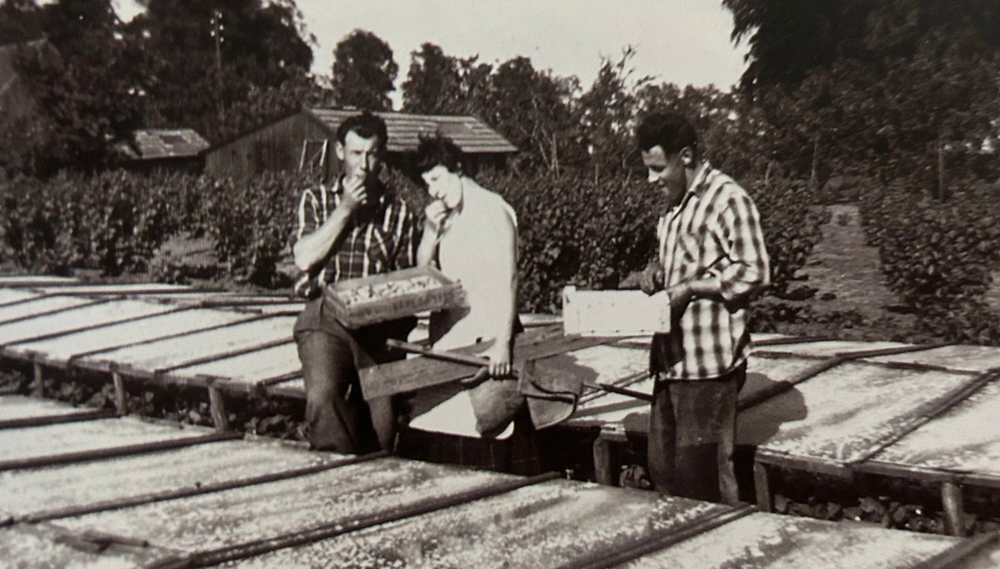

Toon Bets en Leo van Mullekom proeven van de aardbeien onder platglas. op de achtergrond twee kippenhokken.

De kippenhokken mochten op de pachtgrond van de maatschappij worden gebouwd, omdat ze als het ware los op een fundering van betonblokken stonden en eenvoudig weer afgebroken konden worden.

Een houten kippenhok

De kippenhokken waren meestal van hout en gebouwd volgens een gestandaardiseerd model, laag van achter, hoog met ramen aan de voorkant. Aan de kopse kant zat een deur en aan de hoge lange zijde bevonden zich ramen en de kippendeurtjes, die uitkwamen op een grote ren van kippengaas. Aan de lage kant van het hok waren de zitstokken, met daaronder grof gaas waar de mest doorheen viel. Boven de zitstokken, onder de pannen, was riet aangebracht om de warmte ’s nachts enigszins vast te houden. Aan de andere kopse kant bevonden zich de legnesten.

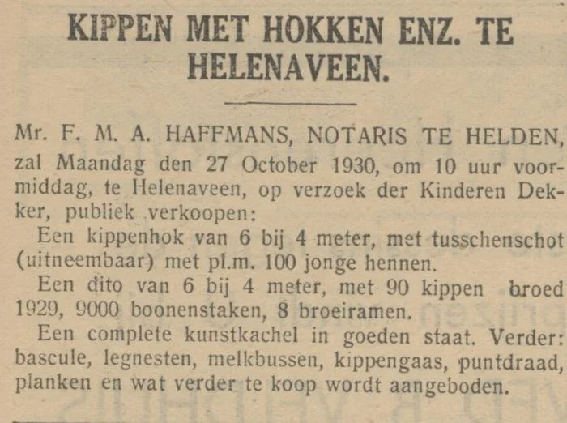

Het hout van de hokken werd regelmatig in de carbolineum gezet. Op het dak lagen bijna altijd muldenpannen. De ramen bestonden vaak uit een aantal broeiramen, die er op de tuinderijen meestal in overvloed waren.

Toen er, net voor de oorlog, elektriciteit kwam, ontstond ook de mogelijkheid om de dag te verlengen met lampen, vooral in de winter. De kippen hadden daardoor meer tijd om te eten, waardoor de eierproductie werd vergroot. De lampen werden automatisch in- en uitgeschakeld met een zogenaamde kippenklok.

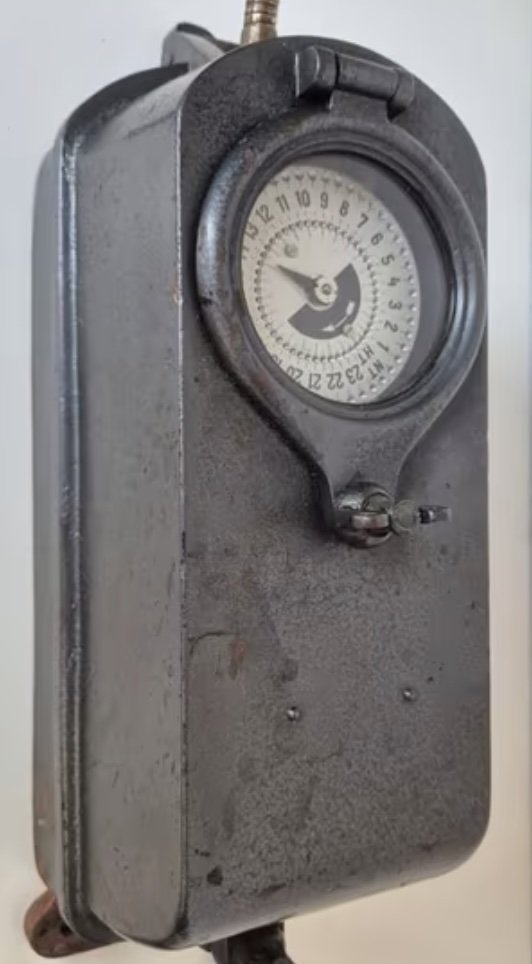

Kippenklok

Het voer van de kippen bestond uit ochtendvoer dat eiwitrijk was en uit hardvoer, bestaande uit gebroken maïs en granen. Ook was het noodzakelijk om de kippen van grit te voorzien – gebroken schelpen – omdat dit nodig was voor de vorming van de eierschalen. Zonder grit kreeg men veel windeieren, eieren zonder schaal.

In de eerste jaren beschikten sommige kippenhouders over een eigen broedmachine, maar later werden de kuikens geleverd door officiële kuikenbroeders, zoals in Helenaveen bijvoorbeeld Toon Joosten. Zo’n kuikenbroederij werd een vermeerderingsbedrijf genoemd.

Het meest gebruikte kippenras in Helenaveen was de Witte Leghorn, hoewel er ook wel hokken met bruine Barnevelders waren. Het waren raskippen, waarmee je zelf verder kon fokken door de eieren uit te broeden met een broedmachine.

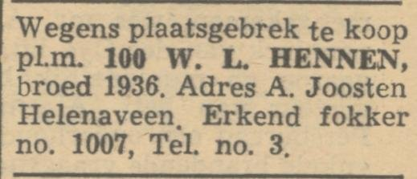

100 witte leghorns te koop.

Wanneer de kuikens geleverd werden, werd in het hok een kachel geplaatst die met eierkolen werd gestookt. Op de kachel lag een grote kegelvormige ijzeren plaat, waaronder de warmte werd vastgehouden.

De kuikenkachel was een goede oplossing voor het warmhouden van de kuikens in de eerste levensfase. Tijdens de eerste 6-7 weken hebben kuikens warmte nodig om te kunnen overleven als moeder kip niet aanwezig is. Ze gebruiken deze warmte om zichzelf te ontwikkelen tot volwassen kippen.Rondom de kachel, op een paar meter afstand, werd een kartonnen rol uitgezet. Dat bruine karton werd kuikenkarton genoemd.

De kuikens liepen in Helenaveen natuurlijk op turfmolm.Later zijn er infrarood kuikenlampen gekomen.

Kuikens bij de kuikenkachel die met eierkolen werd gestookt.

De kuikens kregen speciaal kuikenvoer en, zodra ze wat groter werden, opfokvoer. Het voer werd in speciale lage, langwerpige zinken bakjes gedaan, met daarover een draadrooster of een rollende houten stok om te voorkomen dat de kuikens in het voer gingen staan.

In plaats van kuikens werden soms ook zogeheten pullen aangekocht. Dat waren kippen die bijna aan de leg waren, waardoor er minder tijd verloren ging met het grootbrengen van de kuikens.

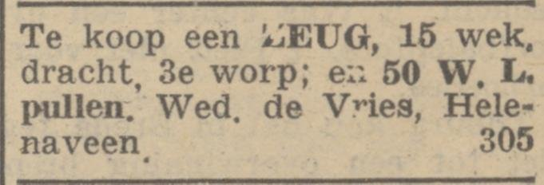

Witte Leghorn pullen te koop. Nieuwe Venlosche couranrt 23 okt. 1940

De eieren werden thuis gepoetst, vaak een klusje voor de kinderen. Het poetsen gebeurde met een nat doekje, dat na een paar dagen behoorlijk kon gaan stinken. Na het poetsen werden de eieren in houten kisten gedaan, met daarin kartonnen vierkante eierrekken en bijbehorende hortjes met ronde gaten. In een eierkist konden vijf lagen van elk honderd eieren worden gestapeld.

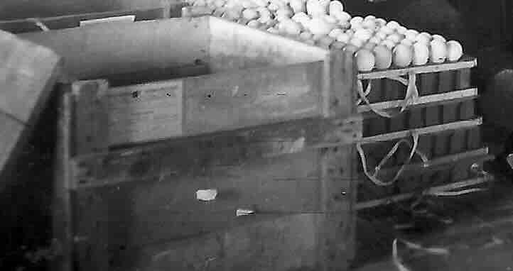

eierkist

Soms werden de mooiste eieren apart gehouden om te gebruiken als broedeieren. Die mochten niet gepoetst worden, omdat ze dan hun beschermlaagje verloren. Broedeieren werden voorzien van een stempel.

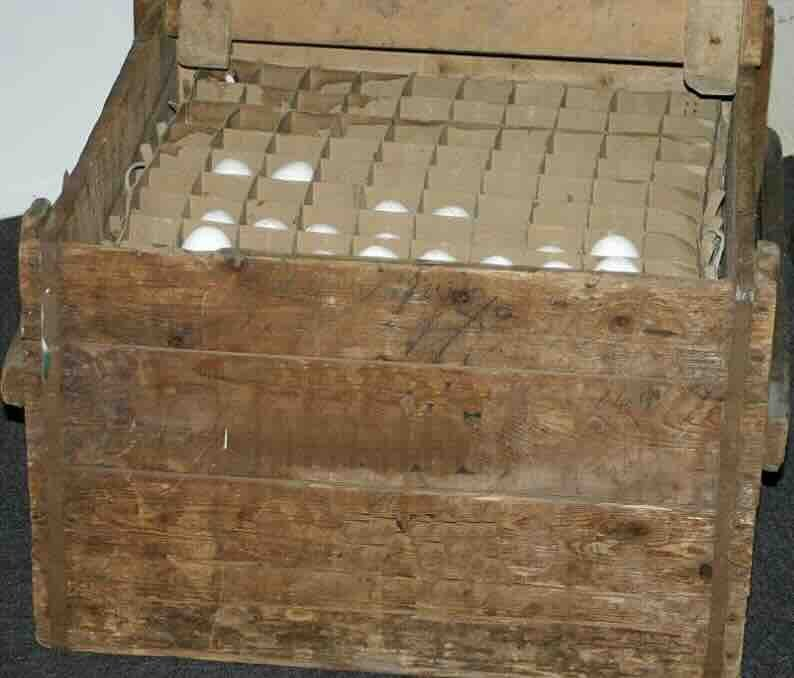

Eierkist met 500 eieren

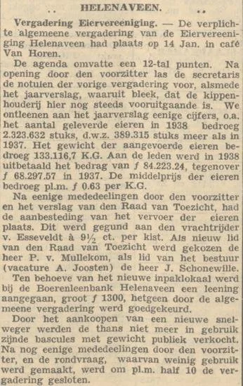

1939 Lening nieuw inpaklokaal: f 1300,-

De eieren gingen naar het eierlokaal, waar ze op grootte werden gesorteerd en gewogen. Alle eieren werden geschouwd. hierbij werd een hortje met 100 eieren op een schouwkast gezet waarna automatisch sterke lampen onder de eieren werden ingeschakeld. Op die manier werden kapotte eieren, bloedeieren en soms bebroede eieren eruit gehaald. Nadat de eieren waren gesorteerd, gewogen en verpakt, werden ze naar de eierveiling van de CVV in Venlo gebracht door de vrachtrijders Van Esseveldt of Arts.

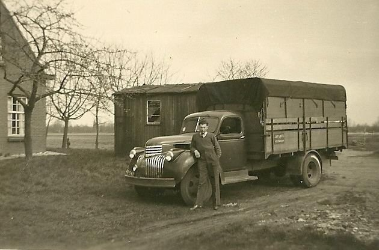

Jan Arts Jr. voor hun huis, Koolweg 42

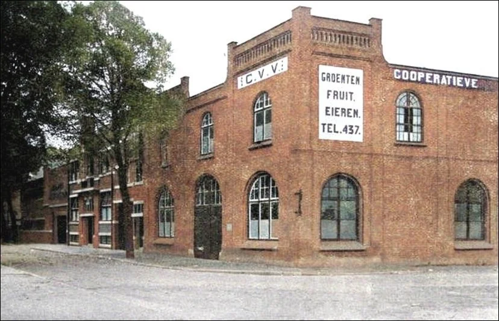

De Eierveing aan de Havenstraat in Venlo

Beeld uit de eierveiling in Venlo

Nadat de eieren daar waren verkocht, bracht de secretaris-inpakker Cor Veldhuijzen het geld in een zogeheten eierbuiltje huis-aan-huis rond. Het eiergeld vormde zo een regelmatige inkomstenbron voor menig huisgezin in Helenaveen.Cor Veldhuijzen was de opvolger van Bertus Lagarde (HendZn).

Er konden ook problemen ontstaan: berucht was het zogenaamde verenpikken. Sommige kippen deden dit en soms werd een zogenaamde kippenbril van aluminium op de snavel vastgezet om het te voorkomen. Ook hielp het om de kip die gepikt werd in te smeren met hertshoornolie, een stinkende substantie met een zeer afstotende geur.

Kippenbrillen

Ook konden kippen ziek worden, bijvoorbeeld aan coccidiose of kippensnot. In dat geval werd er een medicijn door het drinkwater gedaan. Soms leerden een paar kippen zichzelf aan om de eieren kapot te pikken, iets wat heel moeilijk weer af te leren was. Ook werden kippen soms broeds en waren dan niet meer van het nest af te krijgen. De remedie was om ze enige tijd apart op te sluiten.

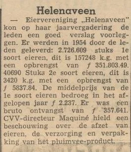

Jaarvergadering Eiervereniging 1954

Het aantal kippen in Helenaveen steeg geleidelijk van 2.500 in 1910 naar 25.000 in 1960, met een dip in de oorlogsjaren. Na 1960 verdwenen de kleine kippenbedrijfjes één voor één, en bleven er nog maar een paar grote over, zoals Jan van der Zwaan aan de Kervelweg, Toon van Mullekom aan de Koolweg, Koos de Vries op de Spruitweg en Antoon Joosten aan de Lagebrugweg.

De kippenhokken waren nog steeds van hout, maar veel langer. Vaak werden hiertoe een aantal kleine hokken tegen elkaar gezet om één groot hok te vormen.

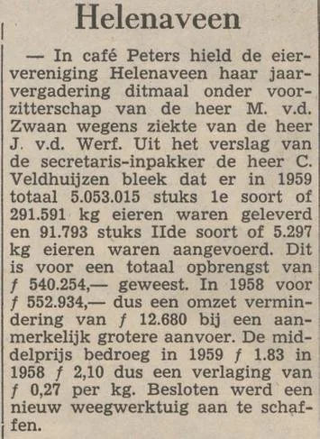

Jaarvergadering Eiervereniging 1960

Met het verdwijnen van de kleine kippenbedrijfjes na 1960 veranderde het beeld van Helenaveen langzaam. De kleinschalige kippenhouderij, ooit een bron van inkomsten voor veel gezinnen en een belangrijk onderdeel van het dorpsleven, verdween grotendeels. Alleen enkele grotere bedrijven bleven over.

Voor wie nu door Helenaveen wandelt, is het bijna niet meer voor te stellen dat bij zowat elk huis een paar kippenhokken stonden en dat het eiergeld een vast onderdeel van het gezinsinkomen was.

Kippenvocabulair

Pullen, jonge kippen nog niet aan de leg

Kuikenkarton, Rol bruin karton, rond de kachel om de kuikens bij elkaar te houden

Kuikenkachel, kacheltje met daarop een zinken kegelvormige plat om de jonge kuikens warmte houden

Kunstmoeder, plaatijzeren bak met elektrische gloeispiralen die aan ijzerdraad werd opgehangen voor het warmhouden van de kuikens.

Turfmul, turfstrooisel dat in pakken werd geleverd en diende als bodembedekking bij de kuikens, maar soms ook in het hok.

Kippenemmer, speciale wateremmer met bodem die na het vullen snel op de kop gezet moest worden

Voeremmer, lage zinken emmer voor hardvoer, ongeveer 15 cm hoog

Ochtendvoer, Eiwitrijk voer

Hardvoer, gebroken mais en graan

Kippengrit, gebroken schelpen voor het binnenkrijgen van voldoende kalk, ter voorkoming van windeieren

Wind-ei, een ei zonder kalkschaal

Bloed-ei, een ei met een bloedinsluitsel

Houten kippenhok, een houten kippenhok volgens een gestandaardiseerd model

Betonnen kippenhok, een kippenhok gemaakt van betonplaten

Rietmatten, Isolatiemateriaal boven de zitstokken

Carboleumen, de kippenhokken werden om de paar jaar in de carbolineum gezet om het hout te conserveren

Zitstok, 4 of 5 latten achter elkaar waar de kippen ‘s nachts zaten. onder de zitstokken zat gaas, waar de mest doorheen viel

Legnest / legnesten, houten kast met schuin deksel en een gaasbodem met meestal houtkrullen

Kippengaas, gaas. voor om de kippenren

Kippenren, meestal een grote buitenren waar de kippen los konden lopen.

Kippenuitlaat, kleine openingen in de voorkant van het hok, naar de ren, ze werden ‘s nachts gesloten.

Kippen bijlichten, kunstlicht om in de winter de dag te verlengen

Kippenklok, Klok om de lamp voor dagverlenging automatisch in en uit te schakelen.

Voersilo, draaibare hoge ton voor ochtendvoer

kippen-drinkemmer, wateremmer met losse bodem die omgekeerd moest worden

Ochtendvoer, gemalen eiwitrijk meel

Hardvoer, gebroken mais en andere graankorrels

Kippengrit, gebroken schelpen

Opfokvoer, speciaal eiwitrijk voer voor kuikens en pullen

Kuikenvoer, fijngebroken mais en graan

Kuikenvoerbak, lange zinken bak met een draaiende stok erboven

Eieren uithalen, eieren verzamelen, meestal een of twee keer per dag

Eierdoek, (stinkend) doekje om eieren te poetsen

Eierkist, speciale kist om eieren in te pakken voor de veiling (500 stuks)

Eierrek, rek van in elkaar geschoven bruin karton dat 10 x 10 eieren kon bevatten

Hortje ,bodem van latten en karton, met ronde gaten en twee handvatten van lint.

Eieren stempelen, mooie eieren bestemd voor broedeieren kregen een nummer van de leverancier

Broedeieren, eieren bestemd om uit te broeden met een broedmachine

Schouwen, met een sterke lamp door de eieren kijken ter controle

Coccidiose, kippenziekte door een darmparasiet

Kippensnot, kippenziekte, luchtweginfectie

Bloedluizen, rode kippenluizen

Verenpikken, kippen die elkaar pikken en de veren uittrekken

Leeuwieken, afbranden van de topjes van de vleugels om vliegen te voorkomen

Kippenbril, aluminium brilletje tegen het verenpikken

Hertshoornolie, stinkende olie tegen het verenpikken

Kalkpoten, kalkpootmijt die zich schuilhoudt onder de schubben van de poten

Broedse kip, kip die niet meer van het nest te krijgen is en wil broeden

Kippenmest, zeer gewilde mest voor de moestuin met veel stikstof

Legkip, kip speciaal gehouden voor de leg

Slachtkip, kip speciaal gehouden voor de slacht

Witte Leghorn, veel voorkomend kippenras

Barnevelder, mooie bruine kip

Hy Line, hybride niet soortvaste kip die veel meer legt maar minder oud wordt

Eierbond

Eierhuiske

Cor Veldhuize

Eierbuil

Eierveiling

Broeieier

Kuikens seksen

Vermeerderingsbedrijf

Cor Veldhuijzen bracht builekes met eiergeld rond.

Ik zie hem nog geld uittellen en de builekes vullen aan de keukentafel.

Hij haalde wel de eieren mee op in de Peel, met Jan Arts of Cees van Esseveldt.

Hij schouwde ook de eieren. Ik herinner me de schouwkast.

Bron Venlo Wie Ut Vruuger Waas

Website Jan Arts Transport
