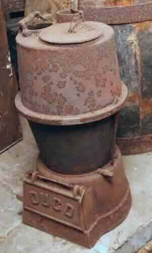
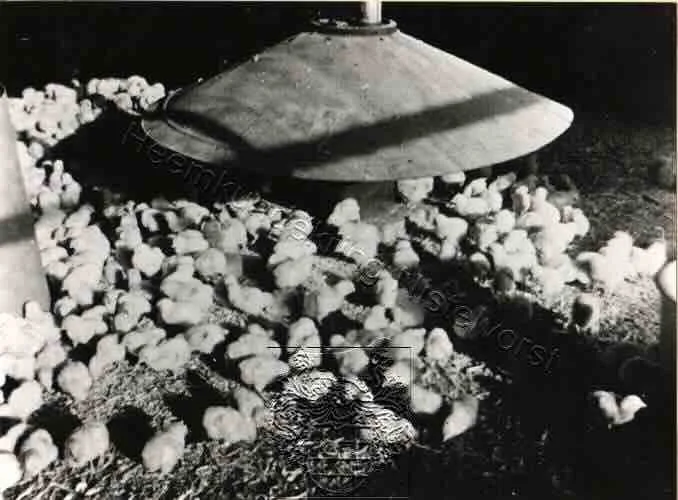
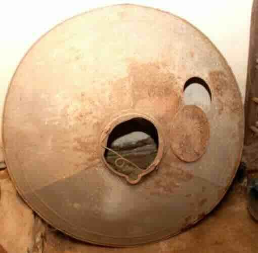
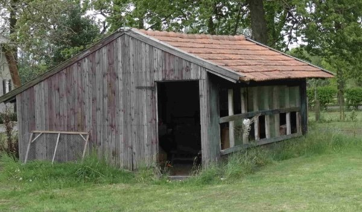
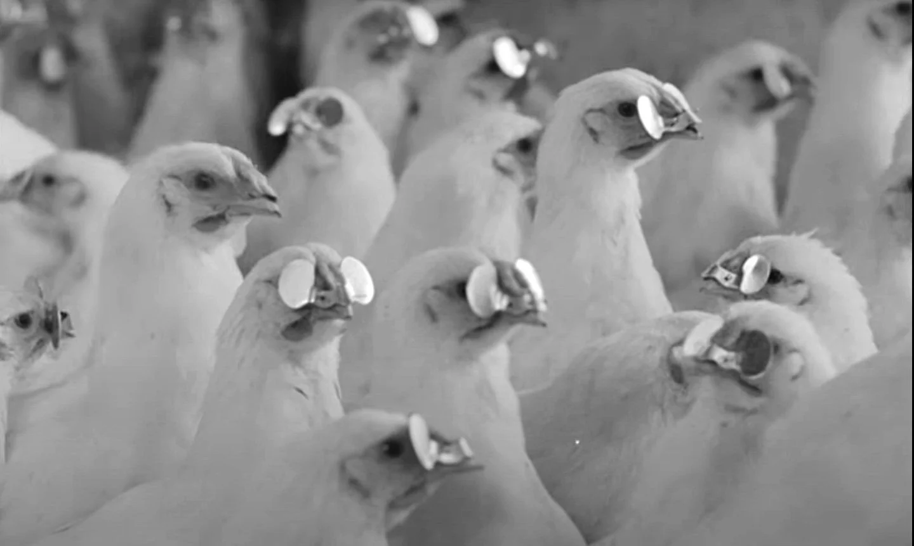

# kippen

> Bron: helenaveenvantoen.nl

Kiepe, legnest, voersilo, kiepe ren, kiepegaas, kiepen emmer, zitstok, windei kippegrit, ochtendvoer, hardvoer, kuiken kachel, kuikenkarton, turfstrooisel, eierkist, eierdoekske, eierkist eieren poetsen, eier stempele, kiepe emmer, asfaltpapier of rietmatten, kiepeklok, kiepe luchten, drinkes emmer, kuikes, pullen, legkiep, slachtkiep kiepe mest carboleumen, kiepehok, eierlokaal, eierbuileke, Cor Veldhuize. coccidiose, kippensnot, hertshoornolie, broedse kiep, verepikke, bloedluizen, houtkrullen, legnesten, houte kiepehok, betonne kiepehok kiepebril, kunstmoeier broeieier, leeuwieken, eierbond, witte eier bruine eier, kiepe uitlaat, eier uithale,

Peelse Kippen woorden

1. Kuikens & opfok

Kuikes

Pullen, jonge kippen nog niet aan de leg

Kuikenkarton, Rol bruin karton, rond de kachel om de kuikens bij elkaar te houden

Kuikenkachel, kacheltje met daarop een zinken kegelvormige plat om de jonge kuikens warmte houden

Kunstmoeier, Plaatijzeren bak met electrische gloespiralen die aan ijzerdraad werd opgehangen voo het warmhouden van de kuikens.

Turfmul, turf strooisel dat in pakken werd geleverd en diende als bodembedekking

Kiepe emmer, speciale wateremmer met bodem die na het vullen snel op de kop gezet moest worden

Voeier emmer, lage zinken emmer voor hardvoer, ongeveer 15 cm hoog

Ochtendvoer, Eiwirijk voer

Hardvoer, gebroken mais en graan

Kippegrit, gebroken schelpen voor het binnenkrijgen van vondoende kalk, ter voorkoming van windeieren

Windei, een ei zonder kalkschaal

### 🐔 2. Huisvesting

Houte kiepehok, een houten kippenhok volgens een gestandariseerd lessenaar model

Betonne kiepehok, een kippenhok gemaakt van betonplaten, geleverd door de betonfabriek in Neerkant

rietmatten, Isolatie materiaal boven de zitstokken

Carboleumen, de kippenhokken werden om de paar jaar in de carbolineum gezet om het hout te conserveren

Zitstok

Legnest / legnesten

Houtkrullen

Kiepe gaas

Kiepe ren

Kiepe deurke

Kiepe bijluchten

Kiepeklok

### 🍽️ 3. Voer & water

Voersilo

Kiepen emmer

Drinkes emmer

Ochtendvoer

Hardvoer

Kippegrit

opfokvoer

kuikenvoer

kuikenvoerbakske

### 🥚 4. Eieren

Witte eier

Bruine eier

Eier uithale

Eierdoekske

Eierkist

eierrek

rekbojem

eier poetse

Eier stempele

broei eier

schouwen

### 🔁

### ⚠️ 6. Ziekten & problemen

Coccidiose

Kippensnot

Bloedluizen

Verepikke

Leeuwieken

Kiepebril

Hertshoornolie

kalkpoten

Broedse kiep

### 🧹 7. Onderhoud

Kiepe mest

### 🔪 8. Soorten kippen

Legkiep

Slachtkiep

Witte Leghorn

Barnevelder

Witte kiepe

bruine kiepe

hy line

### 📦 9. Organisatie & handel

Eierbond

Eierhuiske

Cor Veldhuize

Eierbuil

Eierveiling

Broeieier

Op de kachel kan een grote, ronde zinken plaat gelegd worden waaronder de warmte blijft hangen. t. De kuikenkachel was een goede oplossing voor het warmhouden van de kuikens in de eerste levensfase. Tijdens de eerste 6-7 weken hebben kuikens warmte nodig om te kunnen overleven als moeder kip niet aanwezig is. Ze gebruiken deze warmte om zichzelf te ontwikkelen tot volwassen kippen. Rondom de kachel, op een paar meter afstand, werd een kartonnen rol uitgezet. Dat bruine karton werd kuikenkarton genoemd. Zo bleven de kuikens warm en dicht bij de kachel. De kachel werd gestookt met steenkool. (eierkolen)

De kuikens liepen in Helenaveen natuurlijk op een turfmolm Later zijn er infrarood kuikenlampen gekomen.

Een houten kippenhok

Een kippenbril is een plaatje dat op de snavel van een kip wordt gemonteerd. Het brilletje is niet bedoeld om het zicht te verbeteren, het belemmert dit juist. Vroeger was het hulpmiddel van metaal, vaak aluminium, de moderne versie is gemaakt van kunststof.Kippen kunnen het slachtoffer worden van verenpikkerij, iets wat zelfs tot kannibalisme kan leiden. Het is een uitwas van de instinctmatige behoefte in een groep een rangorde vast te stellen. Dit wordt naar voorbeeld van het kippengedrag de pikorde genoemd.Door met de kippenbril het zicht van de vogels te beperken wordt het vrijwel onmogelijk gemaakt andere vogels te beschadigen. Het plaatje is daartoe met een pen door de snavel voor de ogen van de vogel gemonteerd. Ook wel werd de gepikte kip ingesmeerd met hetshoornolie, de kenmerkende afstotende geur van hertshoornolie maakte een radicaal einde aan veren pikken bij kippen.

Ochtendvoer, hardvoer, schelpengrit, kuikenvoer opfokvoer

Kiepe, legnest, voersilo, kiepe ren, kiepegaas, kiepen emmer, zitstok, windei kippegrit, ochtendvoer, hardvoer, kuiken kachel, kuikenkarton, turfstrooisel, eierkist, eierdoekske, eierkist eieren poetsen, eier stempele, kiepe emmer, asfaltpapier of rietmatten, kiepeklok, kiepe luchten, drinkes emmer, kuikes, pullen, legkiep, slachtkiep kiepe mest carboleumen, kiepehok, eierlokaal, eierbuileke, Cor Veldhuize. coccidiose, kippensnot, hertshoornolie, broedse kiep, verepikke, bloedluizen, creoline, houtkrullen, legnesten, houte kiepehok, betonne kiepehok kiepebril, kunstmoeier broeieier, leeuwieken

Er werd ook turfstrooisel gebruikt in de hokken.

Cor Vldhuizen bracht jullie pa builekes met eiergeld rond.

Cor Veldhuijzen opvolger van Toon Joosten

Ik zie hem nog geld uittellen en de builekes vullen aan de keukentafel.

sorteren en keuren werdop de peelse eierbond gedaan.

Hij haalde wel de eieren mee op in de Peel, met Jan Arts of Cees van Esseveldt.

hij schouwde ook de eieren. Ik herinner me de schouwkast.

: Kuikevoer opfokvoer

Kuikens seksen

Vermeerderingsbedrijf

leeuwieken? [ Anders vlogen ze uit de kiepe ren

De “echte” deskundige kiepeboeren noemden ze kiepedokter.

Of kiepepriester

Grote kiepeboere

Koos de vries

Toon Joosten

Jan van der Zwaan

Martien van der Zwaan

: Antoon Joosten (Lagebrugweg)

Knilles van der zwaan

Gerda zegt de mooie eieren werden niet gepoetst maar gestempeld voor broedeieren

Zouden die dan geschouwd worden?

Er moesten een bepaald aantal hanen in een hok zitten

Op een gegeven moment kwamen hyline kiepen, hybride rassen

Die legden veel beter, maar je kon er niet zelf mee verder fokken.
