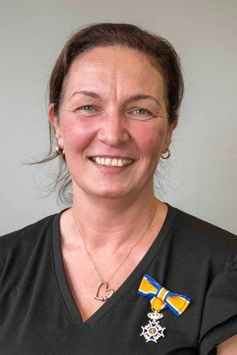
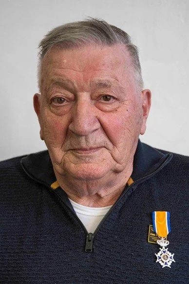

# lintjes_hveen

> Bron: helenaveenvantoen.nl

### Koninklijke onderscheidingen in Helenaveen

2026

Sandra van Cauwenberghe

Sandra van Cauwenberghe (49) zet zich al 25 jaar in voor de dorpsgemeenschap in Helenaveen. Haar toewijding, betrokkenheid en onvermoeibare inzet dragen in grote mate bij aan de leefbaarheid in Helenaveen. Het motto ‘door samen de schouders eronder te zetten kom je ver’ is haar op het lijf geschreven. Sandra is bij veel activiteiten en verenigingen betrokken. Met een scherp inzicht, brede betrokkenheid en een onmiskenbaar verantwoordelijkheidsgevoel is zij een constante factor. Sandra kijkt naar kansen en oplossingen en zet zaken in beweging die tot resultaat leiden.

Gegevens van de decorandus; Sandra van Cauwenberghe. Woonplaats: Helenaveen. Decoratie: Lid in de Orde van Oranje Nassau.

Dick van Esseveldt

Dick van Esseveldt (85) heeft zich in Helenaveen vele jaren als vrijwilliger ingezet. Hij is nog steeds betrokken bij de Protestantse Gemeente Helenaveen waar hij het secretariaat verzorgt en het kerkhof verzorgt. Hij is geruime tijd als chauffeur werkzaam geweest bij Stichting Buurtbus Helenaveen-Deurne. Ook bij Stichting De Peelbascule heeft hij zich jaren ingezet. De inzet van Dick is van groot belang geweest voor de leefbaarheid in Helenaveen.

Gegevens van de decorandus; Dick van Esseveldt. Woonplaats : Helenaveen. Decoratie: Lid in de Orde van Oranje Nassau.

Onderscheidingen in eerdere jaren(deze lijst is in bewerking)

Geurt van Esseveldt (30 of 33 jaar geleden)

Jan Gerrits (2008)

José Gerrits (2017)

Hans Arts (2017)

Michiel Penninx (2018)

Dory Verberne (2016)

Wies Daniëls (2020)

Cor Mooren (2021)

Jan van Woezik (2008)

André Joosten (2023)

Wim & Annie Luijten (2024)

Nelly Kastelijn (2003)

Cor Veldhuijzen (1994)

Hannes Joosten

Henk Koopmans

Elly Sanderson-de Jongh (2014)

Truus Louwers-van Leeuwen (2017)

Jeanne Donders (2010)

Harrie Arts

Piet Krekels

Roel Oosterveen

Helm Verhees

Toon Daniëls (20231) (niet in Helenaveen)
