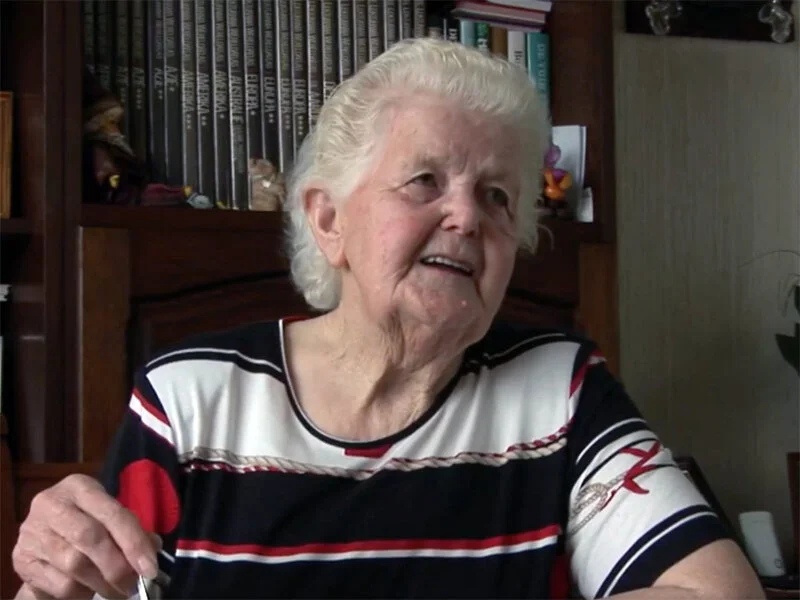

# marietje-van-horen-van-der-werf

> Bron: helenaveenvantoen.nl

# Marietje van Horen-van der Werf

## Marietje van Horen-van der Werf

In het begin van de oorlog was Marietje 11 jaar. Nederlandse soldaten waren in het dorp gelegerd. Ze herinnert zich nog goed hoe het allemaal begon: “we zaten bij ons in de kamer voor de raam en toen zag je die (Nederlandse) soldaten zo allemaal Helenaveen inkomen.” Dat was op 10 mei 1940. Daarna merkte ze niet zoveel meer van de oorlog want ze kwamen volgens Marietje niet zo veel op het dorp, ze waren altijd thuis op het bedrijf.

### Voor straf allemaal weg

Die schijnbare rust veranderde in september 1944 toen de gebeurtenissen elkaar snel opvolgden en ze al weer vier jaar ouder was. Wat toen allemaal gebeurde, staat haar nog steeds scherp voor de geest. “Er was iets gebeurd met de ondergrondsen. Waar die zo mee bezig waren en ik weet niet, iets met Duitse soldaten beschieten, maar het fijne weet ik daar eigenlijk niet van. Voor straf moest de brug opgeblazen worden en iedereen het huis uit en naar de Grashoek toe. Dat was op 28 september 1944.”

### Naar de Familie Linders

“Het was een halfuurtje lopen denk ik, ons pap met de kruiwagen met alle beddengerei erop, ik met de kinderwagen en ons moe met nog een paar klein jong aan de hand, we waren toen al met z'n achten.” Na een half uur lopen kwamen ze op de Grashoek bij de familie Linders. De grootmoeder van Marietje die er ook bij was kende die familie goed. “We zijn daar met vier huisgezinnen ingetrokken. Ze hadden een grote boerderij en ze hadden langs het paadje kippenhokken staan. Er zaten geen kippen meer en zodoende mochten wij met twee huishoudens er in. Mijn vader en een zuster van mijn vader met gezin. Wij moesten daar slapen, want dat kon niet allemaal in huis. De mensen moesten er zelf wonen en dan waren er Sonnemans en Vermeulen, dat waren oudere mensen dus die sliepen bij die mensen binnen.”

### Jongens en jonge meiden

“We sliepen op stro. Dat werd een in hele rij langs de kant gelegd en daar ging het beddengerei wat we meegenomen hadden allemaal op. De ene kant daar sliepen wij en de andere kant sliep de andere familie. Verder waren er nog een tante en ook een jongen die in die oorlogstijd bij mijn grootmoeder in huis was. Dat waren jonge jongens en er lagen jonge meiden dus er werd gelachen. Dat was nog echt net zoals vroeger: er gebeurde niks, maar dat was wel veel plezier.”

### Angst

Ofschoon ze plezier genoeg hadden, waren ze ook erg bang van de vele vliegtuigen die overkwamen waarop geschoten werd, zeker als het zo dichtbij was dat ze de schuilkelder in moesten. “Ze hadden van een sloot een grote schuilkelder gemaakt en als d'r dan vliegtuigen overkwamen dan moesten wij die sloot in. Dat is ook echt wel een paar keer gebeurd. Het was gewoon een hele lange greppel en er zat van alles bovenop. Aan twee kanten hadden ze wat zitplaatsen gemaakt, zodat iedereen zitten kon. We waren daar nogal met wat man, maar je kon daar zo net helemaal in.”Dat die schuilkelder geen overbodige luxe was bleek wel uit het volgende: “waar wij weg keken daar liep in de wei een paard, dat had ons grootmoeder meegebracht. Die waren met paard en kar want die kon echt niet lopen en een auto die was er nog niet. Dat paard heeft een scherf in zijn buik gekregen en die zagen wij lopen. Alles hing eruit. Dat maakte je allemaal mee, dat hoorde er allemaal bij.”

### eten

Het moet een heel gedoe geweest zijn om al die monden te vullen daar bij de familie Linders. De gastvrije familie zorgde goed voor iedereen, maar het bleef natuurlijk improviseren en achteraf is het eigenlijk een wonder dat dat allemaal zo maar kon. “Ze hadden ze een stookhok, daar stond ook een grote tafel in voor ons en tante Anna en ome Marinus die bij ons in het kippenhok sliepen om 's morgens koffie te drinken. Er was ook een hele grote schuur en daar hadden ze hele lange tafel gemaakt, daar zaten we dan met alleman rond omheen voor het middageten. Wij hadden het grootste huishouden. Ons pap en ons moeder met acht kinderen en grootmoeder. Marinus had er ook acht en Sonnemans had drie kinderen, ome Rien en twee tantes van mij. Die van Vermeulen hadden er ook drie, maar die waren met tweeën, want de oudste die was bij het meisje waar hij mee verkering had, die zaten een eindje verder op Grashoek aan.”

“We hadden genoeg te eten. Ze hadden koeien, er werd een varken geslacht en ze hadden zo'n grote weckketel en daar werd de pap in gemaakt. Beschuiten pap en brokkenpap gewoon van mik, net wat er was. En rijstepap. In Maasbree daar was een kroetfabriekske en waar ge kroet kon halen voor op het brood. Dat was lekker. Naar Erkelens naar de boomgaard, dat was van Linders uit niet zo ver weg, daar gingen ze appels en al het fruit dat onder de bomen lag halen. Honger hebben wij nooit geleden.”

### De kat

“Er waren twee jongens, Cor Sonnemans en Willie van Hameren uit Hoensbroek, die moesten altijd die weckpot op de tafel brengen zodat ons moeder allemaal pap kon geven. Een keer wilden de jongens geen pap. Later kwamen we erachter dat toen ze die ketel met pap wilden brengen, er een kat in sprong. Daar wisten wij helemaal niks van, maar later kwam dat wel uit.”

### De Duitsers: Mit Arbeiten!

Het gaat zo allemaal redelijk goed tot op zondagmorgen 8 oktober. “De jongens liepen allemaal in hun zondags pak, zo gingen ze naar de kerk. Zij werden toen door de Duitsers opgepakt. Onze jongens die hadden daar schijnbaar iets van mee gekregen en die waren er tussenuit getrokken. Wij zaten wij koffie te drinken 's morgens en onze vader zat met z'n rug naar de deur toen de Duitsers binnenkwamen. Ons pap had ze niet gezien en ze grepen hem in z'n nekvel. ‘Mit arbeiten!’ Ons moeder had gauw een duffeltje - zo'n winterjas - en een deken meegegeven en een stuk brood. Zo was ons moeder, die raakte niet gauw in paniek. Manus Sonnemans namen ze ook nog mee, maar die was oud en kon het lopen niet volhouden, die mocht terugkomen. Jan Sonnemans zat bij ons met Cor, die had een korte broek aan en Jan had een lange broek aan en zodoende namen ze Jan mee, die was pas 16. Op 8 oktober zijn ze toen 's zondags 's morgens allemaal weggehaald.”

### De Engelsen: Weg uit de Grashoek

Nog bijna twee weken bleven ze bij de familie Linders, tot de Engelsen in Beringe aankwamen en het te gevaarlijk werd om in het frontgebied te blijven. Ze werden door de bevrijders op vrachtwagens weggebracht naar een veiliger plek. Ze moesten een half uur lopen vanaf de boerderij naar de vrachtwagens. Om half negen 's avonds vertrokken ze naar Gemert.”In zo'n grote auto van het leger, daar gingen we mee naar Gemert toe. Hoe laat we daar waren weet ik niet maar het was wel 's nachts eer wij daar waren. Wij werden allemaal naar een grote school gebracht. Het was 21 november 's avonds en daar zijn wij die nacht toen gebleven. Er lag stro waar ze allemaal op konden liggen, degene die slapen konden. Ons moeder was met acht kinderen en tegen een politieagent die stond te helpen zei ze dat ze een paar klompen kwijt was. Eerder had ze die politieman ook al gezien. Hij zei: ‘dat is minder erg want er is ook een moeder haar kind kwijt’. Ons mam reageerde: ‘die moeder die ben ik ook.” Dat was onze Jo, altijd een vlugge, die zat al lang in de school eer wij binnen waren. We hebben daarna daar nog vaak om moeten lachen.”

### Naar De Rips

“Tegen de middag kwam er een boer uit De Rips, Ploegmakers, met een paard en een grote kar en daar gingen wij allemaal op. We zijn daar 14 dagen geweest. Er was een grote zolder met een aantal bedden, de jongens gingen bij mekaar en zodoende konden wij daar ook in een bed slapen.”

### Terug naar de Grashoek

Op zes december, sinterklaasdag, gingen Marietje en haar familie weer terug naar Helenaveen. Met paard en wagen, met dekens omgeslagen tegen de kou. Ook de terugkeer kan ze zich nog goed herinneren. “Er waren in Helenaveen allemaal linten gespannen langs de weg, want er lagen allemaal mijnen. Toen zijn wij op het Zinkske bij Daniels binnen gegaan en zijn daar 's nachts gebleven. Daar hadden ze, dat weet ik nog goed, een biezen matje onder de keukentafel liggen. Onder die keukentafel hebben wij liggen slapen. En toen ander daags 's morgens weer naar de Grashoek waar wij geëvacueerd waren, want daar lagen onze spullen nog allemaal. Mijn grootvader kwam er toen ook bij, die was uit Liessel gekomen waar ie in een schuilkelder had gezeten. Ook zijn twee zusters en zijn oudste broer waren er toen bij.”

### Het huis in Helenaveen

De familie is nog enkele weken in Grashoek gebleven, omdat het huis in Helenaveen niet meer bewoonbaar was. De deuren hingen eruit en alle ramen waren kapot. Het huis was helemaal leeggeroofd, vooral door Duitsers. Met vereende krachten is het huis weer dichtgemaakt, zodat ze met kerstmis weer in hun eigen huis waren. Maar ook nu weer met heel veel mensen bij elkaar. ”Alle beddengerei werd op de grond gelegd. Grootvader sliep onder in de kamer met ons moeder en wat kleinen. De rest sliep weer net zo als op de Grashoek in het kippenhok. Daar lag het helemaal vol met beddengerei. Aan de ene kant lag ome Huub en Jan Maessen, aan de andere kant lagen tante Grada en tante Martha. Jan Maessen vrijde toen met tante Grada. Ze zijn een heel tijdje bij ons geweest eer ze weer naar het Deurnes kanaal konden. Er waren heel veel dingen uit het huis weggehaald. Ook de mannen die bij die ondergrondse zaten, hadden overal in het huis van alles weggehaald. Niemand was in zijn huis, ze konden d'r doen wat ze wilden.”

### Terug uit Duitsland

“Ons pap was het laatste thuis uit Duitsland. Hij kwam 's nachts om half 12, ons moeder en ik waren meteen wakker. Hij kwam eerst aan de voordeur, die was dichtgetimmerd en ging niet open. Dus moest hij via de achterdeur, achter het huis om. De anderen die sliepen allemaal maar ik was op, maar ik was ook de oudste.”

Vader van Horen had het minder slecht gehad dan veel anderen. Eerst heeft hij een tijdje in een suikerfabriek gewerkt en daarna op een boerderij. De mannen werden op een dorpsplein bij elkaar gezet en de boeren konden dan werkvolk uitkiezen.

“De Duitse boeren waren allemaal in het leger. De vrouwen zaten alleen met de boerderij en ze kwamen naar de markt toe om te kijken welke mannen ze mee naar huis konden nemen om op de boerderij te werken. Ons pap was een grote man, dus ons pap kon toen mee naar de boerderij toe. Die vrouw waar hij werkte wilde graag, toen het voorbij was, dat ie daar bleef. Haar man was op een zondag thuis toen hij in dienst was en de stier pakte hem en hij was dood. Hun zoon was al eerder gesneuveld. Ze had nog twee dochters, Geertrui en Liesbeth. Ons pap moest koeien melken en met een os ploegen, hij kon dat allemaal. Hij had goed te eten en hij dronk warme melk als ze gemolken hadden.”

“Jan Sonnemans heeft veel pech gehad. Hij zat in Watenstedt in die cokesfabriek. Heel veel pech, hij heeft heel lang in de ziekenbarak gelegen met slechte verzorging en weinig eten. Hij is later met de Engelsen naar Frankrijk gegaan dat omdat hij ziek was. Toen hij thuis kwam had hij soldatenkleding aan, het enige wat ze hadden toen ze vertrokken was een dun zondags pak. Jan heeft drie jaar in een tbc-huisje voor de longen gelegen, van die witte keetjes die je zo rond kon draaien, die stonden achter het huis.”

### Bidden, veel bidden

“In de schuilkelder op de Grashoek werd altijd gebeden. Ons moeder had een gebedje, dat bad ze altijd in de schuilkelder. Ik heb het daar nog in de raam liggen. Ik bid het nog steeds iedere dag.

O Maria Machtige Maagd voor wie niets onmogelijk is. Juist om de macht waarmee de almachtige vader U begunstigd had, bidt en smeek ik U. Sta mij bij in mijn nood. Verraad mij niet gij voorspreekster in de meest hopeloze zaken. De glorie van God het welzijn mijner ziel en de inwilliging. Deze gunst beveelt u aan. ....dan de mensen die in Duitsland zijn... zoals dit in overeenstemming is met de wil van onze God. O spreek, dan bid ik u voor mij ten beste bij uw zoon die niks weigeren zal.

Dan drie weesgegroetjes bidden. Heilige maagd die genoemd wordt: zetel der wijsheid, Gij kent de grootte van mijn ellende, ik weet welke behoefte ik heb aan Uw bijstand. In het vertrouwen op u hoog verheven wijsheid geef ik mij geheel in uw handen over, opdat gij alles met kracht en zachtheid zult regelen tot de grootste eer van God. En het hoogste welzijn van mijn ziel verwaardig u mij te hulp te komen tot bereiking van mijn doel O Maria. U bent bid ik U waarmee de kostbare genade te verwerven welke ik verzoek. Ik vraag u om de verering van de heilige Antonius en alle verkondigers van de drie weesgegroeten.

En dan weer drie weesgegroetjes.

O goede en tedere moeder van barmhartigheid, ik kom smeken jegens mij gebruik te maken van Uw medelijdende goedheid. Hoe groter mijn ellende is des te meer zal zij Uw medelijden opwekken. Ik weet, ik verdien geenszins de kostbare genade welke ik verlang ik die U zo dikwijls bedroefd, maar zijt gij ook nu de moeder van de rouwmoedige zondaars. O gij die men nooit tevergeefs heeft aangeroepen genadige barmhartige zoete maagd Maria verwaardig U mij te hulp te komen. Ik bid en smeek erom in naam van de barmhartige goedheid waarmede de Heilige Geest die u voor ons heeft vervuld en ter ere van de heilige Alfonsus de leermeester van het weesgegroet. Amen

Dan weer drie weesgegroetjes.

Dat bad ons moeder en dan deed iedereen mee met de drie weesgegroetjes. Dat gaf troost, maar dat doet bidden altijd. Je moet het wel kunnen. Er zijn mensen die zeggen, waarom zal ik bidden, zeker in deze tijd. Maar je moet wat mee maken, dan krijg je daarmee veel troost. Dat is echt.”
