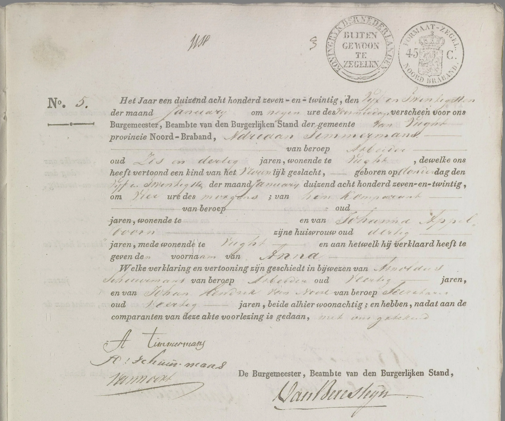
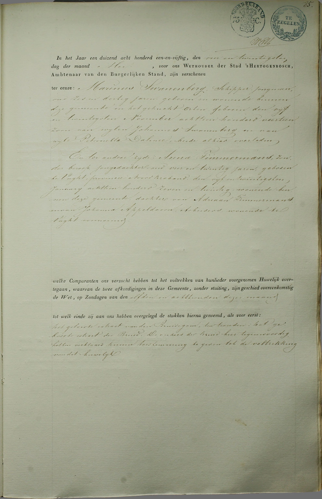
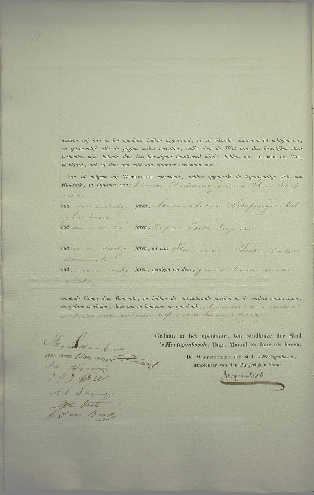
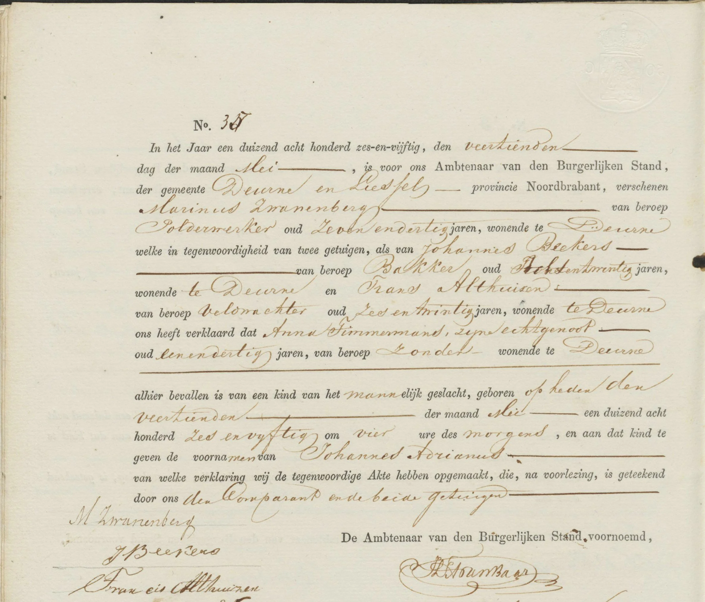
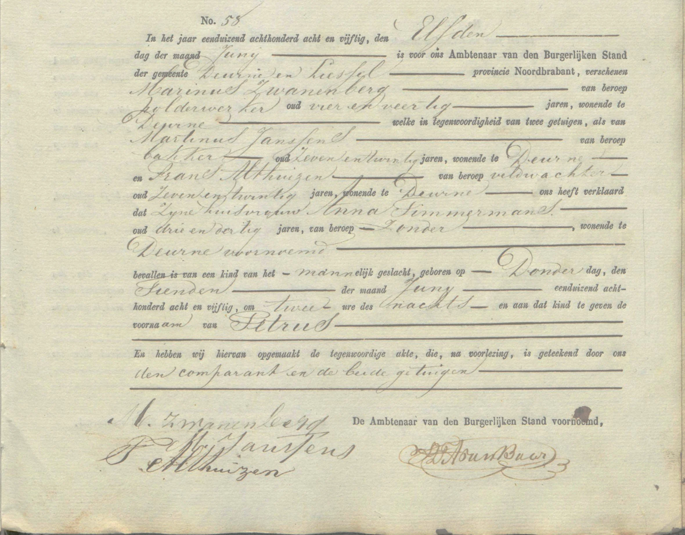
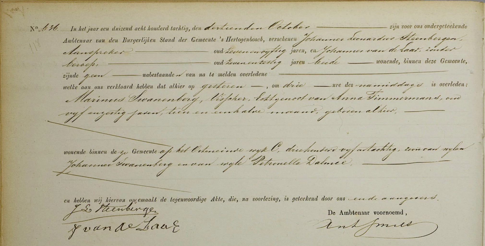
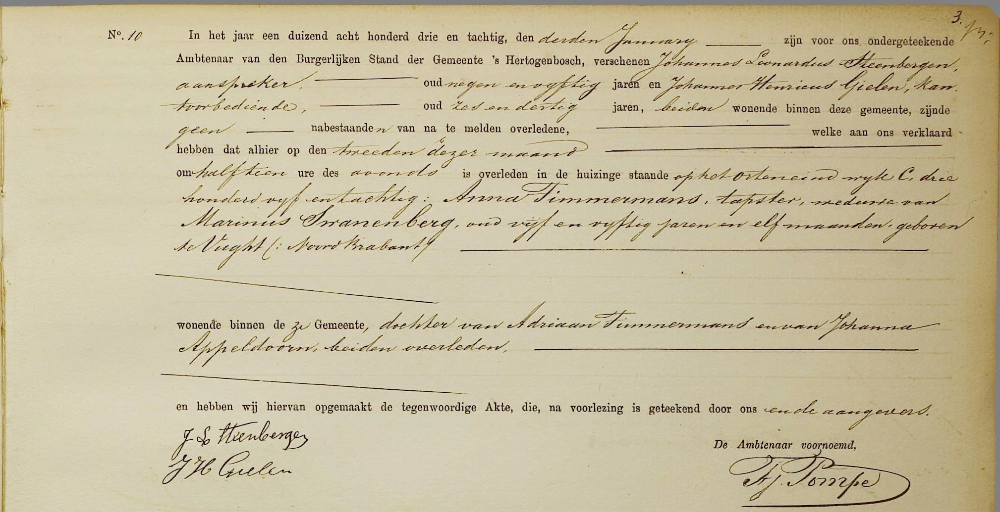
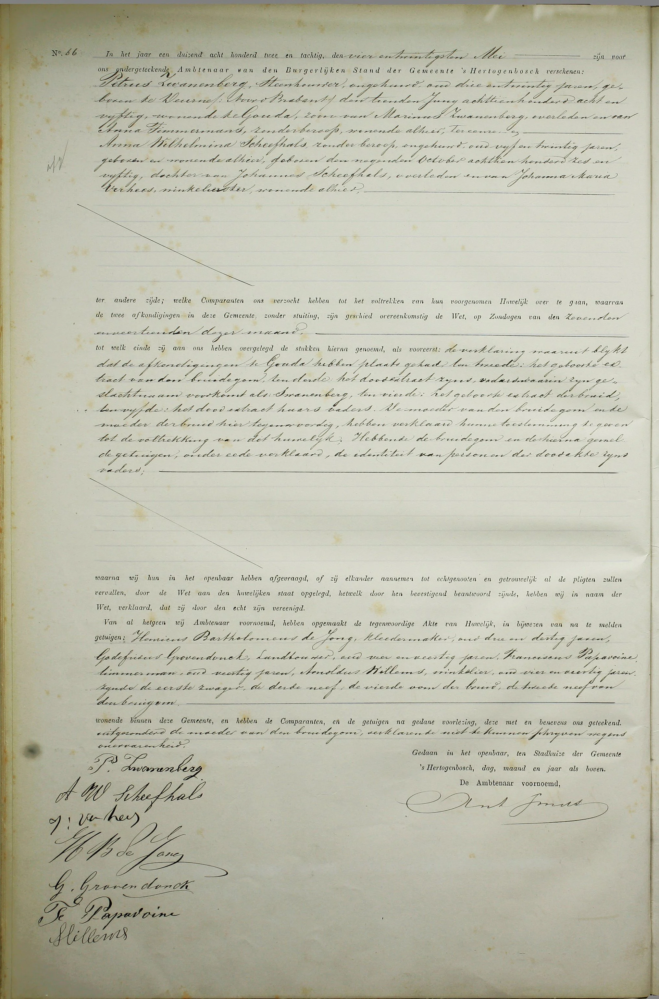

# marinusswanenbergdocs

> Bron: helenaveenvantoen.nl

### Marinus Swanenberg en Anna Timmermans

Geboorteakte Anna Timmermans - *25 januari 1827 te Vught

Huwelijksakte Marinus Swanenberg x Anna Timmermans - 24 mei 1851 - Blad 1

Huwelijksakte Marinus Swanenberg x Anna Timmermans - 24 mei 1851 - Blad 2

Geboorteakte Johannes Adrianus Zwanenberg - *14 mei 1856 te Deurne en Liessel

Geboorteakte Petrus Zwanenberg - *10 juni 1858 te Deurne en Liessel

Overlijdensakte Marinus Swanenberg - +12 oktober 1880 te ‘s-Hertogenbosch

Overlijdensakte Anna Timmermans - +2 januari1883 te ‘s-Hertogenbosch

Huwelijksakte Petrus Zwanenberg x Anna Wilhelmina Scheefhals - 24 mei 1882 te ‘s-Hertogenbosch
