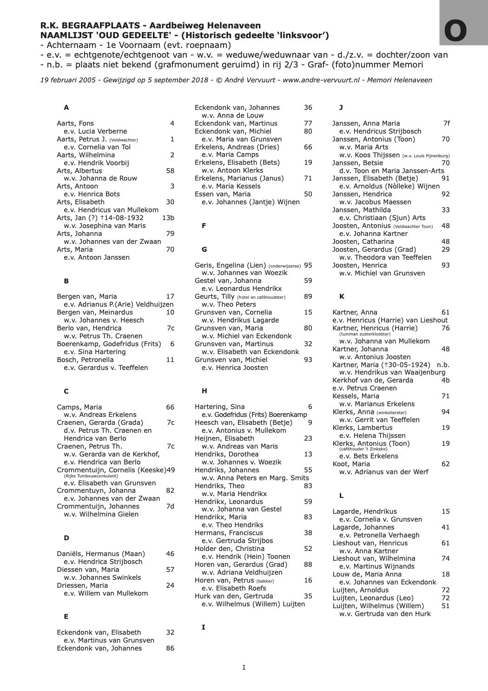
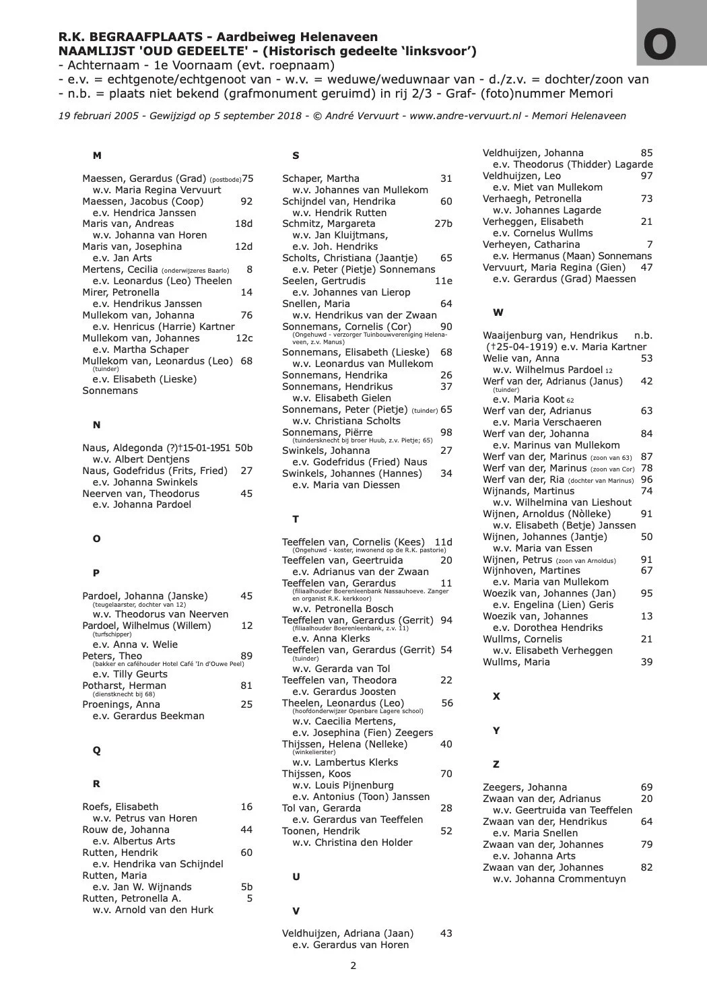
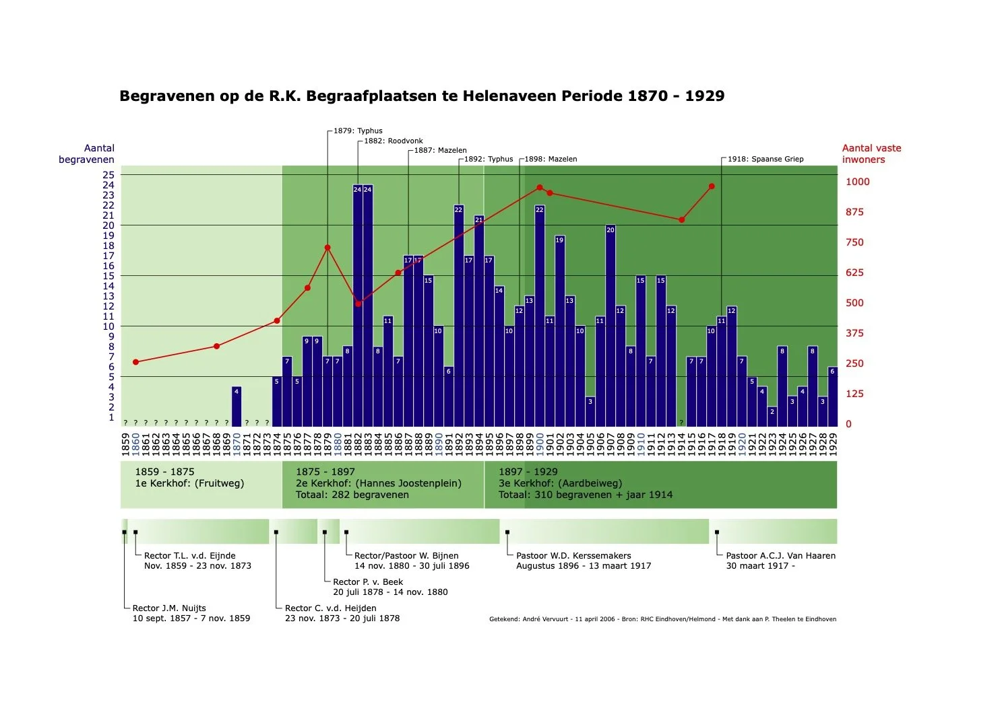
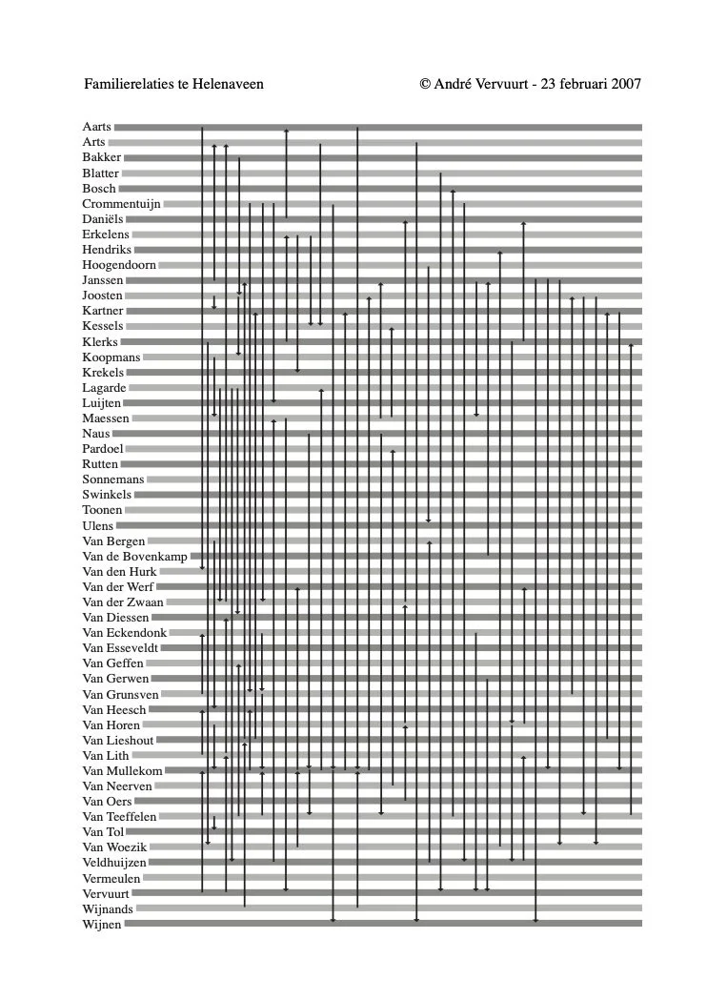
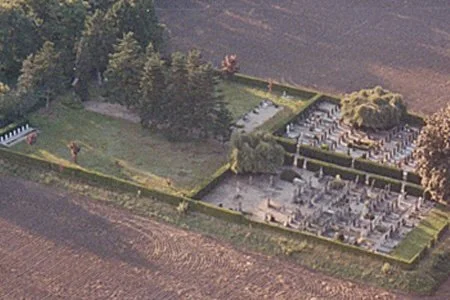
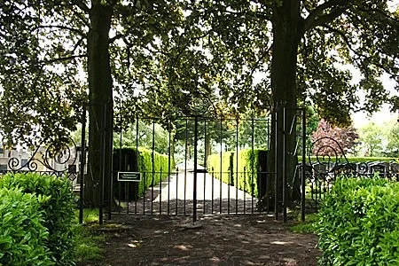

# memori

> Bron: helenaveenvantoen.nl

### Vereniging tot behoud en onderhoud van historische graven 'Memori'

Memori opgericht in 2006Om te voorkomen dat graven geruimd worden omdat er niemand meer naar omkijkt is in 2006 Memori opgericht door André Vervuurt, Jan van Woezik en Gerard Veldhuizen. Tot zijn afscheid in 2022 was André de grote kartrekker. Nu staan Gerard en Jan aan het roer en gaandeweg wordt steeds meer samengewerkt met de dorpsraad, het kerkbestuur en de schoffelploeg.

De Vereniging tot behoud en onderhoud 'Memori' pleegt onderhoud aan de historische monumenten op het R.K. kerkhof te Helenaveen. De vereniging heeft 14 leden, allen nakomelingen van Peelpioniers. Met inachtneming van geldende regels tracht men met volledige inzet de historisch waardevolle grafmonumenten te behouden voor het nageslacht.

Het doel van onze vereniging wordt prachtig verwoord door een van onze leden:"Wat doen de historici en archeologen van nu niet een enorme moeite om naar het 'gewone' leven van vroegere bewoners te gissen aan de hand van opgravingen. Dan moet je niet de bewijzen van het 'gewone' leven van recentere datum zomaar weggooien."Waarom hecht de Rijksdienst voor de Monumentenzorg waarde aan de instandhouding van historische graftekens?Nederland is rijk aan historische begraafplaatsen, niet alleen aan kerkhoven gelegen rondom of bij kerken, maar ook aan begraafplaatsen die ooit zijn aangelegd buiten de bebouwde kom of in het vrije veld. Een groot aantal hiervan is inmiddels rijksmonument.

Om een aantal redenen is het van belang goed te zorgen voor de historische begraafplaatsen en de daarop voorkomende graftekens. In de eerste plaats vormen ze een belangrijke bron voor onze vaderlandse en familiegeschiedenis. Dat betekent dat de genealogische, heraldische en historische waarde in veel gevallen groot is. Verder kunnen er op de begraafplaats graftekens voorkomen die een bijzondere vormgeving of symboliek kennen of zijn gemaakt van bijzondere steensoorten of andere materialen. We spreken dan van kunsthistorische en materiaaltechnische waarden. Ook kan de aanleg van de begraafplaats bijzonder zijn, bijvoorbeeld wanneer die is ontworpen door een bekende tuinarchitect. In die gevallen gaat het om tuinhistorische waarden. Heel vaak ligt een begraafplaats op een bijzondere plek: binnen de dorpskern, bijvoorbeeld bij of rond de kerk (kerkhof), in een stadsuitbreiding of juist in het open veld. Dan is sprake van een stedenbouwkundig belang. Vanwege deze waarden hecht de RDMZ aan de instandhouding van begraafplaatsen en de daarop voorkomende graftekens, of deze nu van rijkswege beschermd zijn, op een provinciale of een gemeentelijke lijst staan of niet beschermd zijn. Het gaat immers om een gemeenschappelijk cultuurbezit waarvoor overheden en particulieren gezamenlijk verantwoordelijk zijn.

Memori pleegt onderhoud

minimaal één keer per jaar, meestal op de zaterdag voorafgaand aan Allerzielen (2 november)

indien nodig plannen we ook een onderhoudsmiddag eind april

Iedereen die wil meewerken aan het onderhoud op het RK Kerkhof is welkom. Memori is een informele vereniging zonder rechtspersoonlijkheid en heft géén contributie.

Interesse?Kom gerust eens kijken tijdens een onderhoudsmiddag.Onderhoudsmiddagen worden gepubliceerd via Weekbericht “In d’n Ouwe Peel” en op deze site.

Aanmelden als lid kan via mailadres info@helenaveenvantoen.nl (t.a.v. Jan van Woezik of Gerard Veldhuizen).

Meer informatie:

STICHTING DODENAKKERS.NL

Met dank aan funerair deskundige Leon Bok.

VERENIGING DE TEREBINTH

Behoud waardevolle begraafplaatsen en grafmonumenten

ATELIER TERRE AARDE

Funeraire website die dood, rouw en begraven een normale plaats in het leven geeft.

Bron Website André Vervuurt: https://www.andre-vervuurt.nl/kerkhof.html
