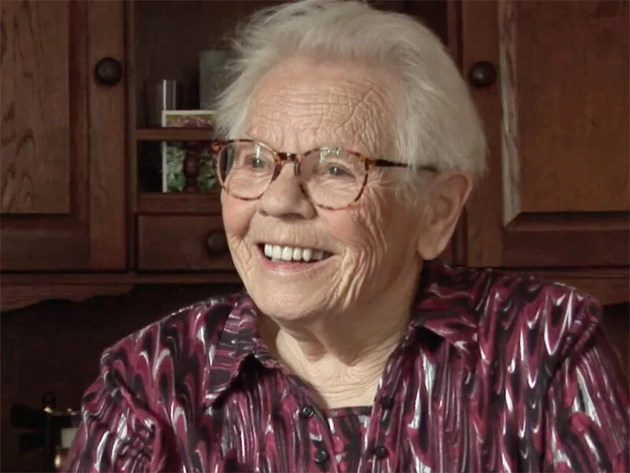

# mien-crommentuijn

> Bron: helenaveenvantoen.nl

# Mien Crommentuijn

## Mien Crommentuijn

Mien is 89 jaar oud en was 10 toen de oorlog uitbrak. Ze heeft wel eens de vraag gekregen van een schoolkind: “hoe weet u dat allemaal? Ik kan nu al slecht iets onthouden. Bent u wel echt 88?” Het antwoord van Mien: “iets dat zoveel indruk op je maakt, blijft je wel bij.” Kinderen vragen haar ook wel eens: waarom gingen jullie ‘gewoon’ mee met de Duitsers? “Nou, als er een geweer op je gericht wordt, wat zou jij dan doen?”

### Mensen in huis

“Vóórdat we moesten evacueren waren er bij ons 36 mensen in huis. Er waren een paar gezinnen bij ons, die op het dorp weg moesten. Er kwamen ook nog mensen uit de buurt, want zóveel mensen in één huis… dat gaf wel eens problemen.”

### Razzia 8 oktober 1944

“Een neef bracht ons melk, wij hadden zelf niet genoeg. En op de morgen van de razzia, stond er op het paadje naar de brug een emmer melk en was hij er tussenuit gegaan, de hei in. De meesten hadden die kans niet, ze werden opgepakt, zelfs op het moment dat ze uit bed kwamen. Bij ons werden drie van de zes jongens opgepakt, de andere ontsprongen de dans, meestal door simpel geluk. Wat ik mij goed herinner is de manier waarop Toon van Woezik wist te ontsnappen. Hij bedacht zich geen moment en sprong uit het raam, over een sloot en hij was in de hei, gewoon in zijn onderbroek. Hij kwam net uit bed.”

### De evacuatie

“In die tijd woonden we hier in een soort niemandsland, tussen de kanalen. In het oosten zaten de Duitsers, in het westen, over het Deurnes Kanaal, zaten de geallieerden. Wij moesten dus ons huis uit. Je kon proberen te weigeren, maar dan schieten we je dood, zeiden de Duitsers. We kwamen in het passantenkamp in het huidige Evertsoord. De ouderen, vooral de vrouwen, hadden de keukentaken en de kinderen werden op pad gestuurd voor boodschappen, meestal voor brood. Vlees kregen we vaak, doordat er veel noodslachtingen waren. Groenten konden we halen bij mensen in de omgeving.”

De ene helft van het dorp moet evacueren naar Grashoek, de andere kant ging naar de kampen in Mariaveen. Ook daar kwamen de Duitsers nog zoeken naar mannen en jongens. Eén van die jongens was zó slim: hij scheurde een stuk van een laken, doopte dat in het bloed van een pas geslacht varken en bond het om zijn been. Als de Duitsers dan kwamen, lieten ze hem met rust, zó bang waren ze voor ziektes. Mien en haar familie hebben 4 tot 5 weken in het kamp gewoond.

### Tegenaanval van de Duitsers

Het oorlogsgeweld kwam toen heel dichtbij. “We hebben het ook ’n keer gehad, toen was een aanval in Sevenum. Daar was de weg een stukje afgesloten en konden we alleen over het kerkhof bij de bakker komen. Er lagen allemaal dode soldaten op het kerkhof. Dat vergeet je nooit meer, ’n heel rijtje op het pad van het kerkhof. Toch was er een vrouw uit Sevenum in staat de dwangarbeiders in Watenstedt te bezoeken. Ze nam brieven mee en kwam die ophalen, want ze ging nog diezelfde dag naar Duitsland.Volgens mij was dat geen zuivere koffie. Van de Duitsers kreeg niemand de kans om naar Duitsland te reizen, maar zij wel.”

### Thuiskomst

“Eén grote hoop rotzooi! En alles wat nog deugdelijk zou zijn geweest, lag in de tuin. Ze zijn gewoon aan het vernielen geweest uit verveling. De eerste keer dat Erkelens bij ons zou komen eten, hij was met ons vader meegegaan, zei hij: ‘je moet dadelijk toch eens met mij meegaan. Er zit bij mij iets op zolder en ik weet niet wat dat is. Ik durf niet alleen naar boven.’ ‘Dan ga ik mee’, zei ons vader, ‘ik wil ook wel zien wat daar op zolder kan zitten.’ Toen lag daar een geit op bed. Niemand wist hoe die geit op zolder gekomen was. ’En, zei hij, je moet toch eens kijken: jullie klok hangt ook bij mij. ‘ Hoezo, onze klok? ‘Ja, dat is jullie klok, ik herken die aan de slag.’ Andere mensen kwamen zeggen dat ons fornuis bij hun in huis stond.”

In mei 1945 zijn de broers van Mien weer teruggekomen uit Duitsland. Haar jongste broer heeft er eigenlijk nooit meer over gepraat. Een andere broer, Arie, heeft zijn verhaal wel verteld.

“Jaren later kon je kiezen: als je daar een zoon of iemand had liggen (begraven in Duitsland) dan kon je dat stoffelijk overschot laten overbrengen naar Nederland. De vader van haar schoonzus zei: ‘ik laat onze Cor (van Grunsven) niet hier naartoe komen, want je krijgt misschien wel de grootste boeven hier op het kerkhof, van al die Duitsers. Want ze maken mij niet wijs, dat ze nu nog kunnen zien of dat onze Cor was.’”
