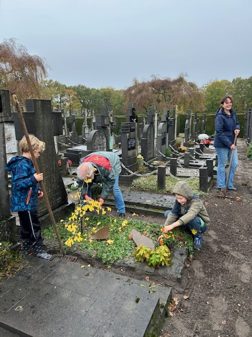

# natte-werkdag-memori

> Bron: helenaveenvantoen.nl

### een natte maar gezellige werkmiddag voor Memori

Afgelopen zaterdag 1 november 2025: , vlak voor Allerzielen, trok Vereniging Memori weer naar het katholieke kerkhof voor de jaarlijkse onderhoudsronde. Helaas zat het weer dit keer niet mee

Tussen de buien door hebben we toch nog het nodige kunnen doen: wat onkruid gewied, hier en daar wat rechtgezet, en natuurlijk de viooltjes geplant die – zoals elk jaar – weer gul beschikbaar zijn gesteld door Pennings–Jonker uit Liessel. Daar zijn we heel blij mee!

Memori zorgt al jaren voor de oude grafmonumenten die geen familie meer hebben om ze te onderhouden. In de beginjaren hebben we veel verzakte stenen rechtgezet en kleine herstelwerkjes gedaan, maar tegenwoordig is het vooral wat bijhouden en zorgen dat het er netjes en verzorgd uitziet.

Ondanks de regen was het weer gezellig, en het kerkhof zag er mede dankzij de Schoffelploeg opnieuw prachtig uit.

Zo blijft ons kerkhof een mooie, waardige plek!

Ook de achter-achterkleinkinderen van Meester Theelen werkten deze keer mee.
