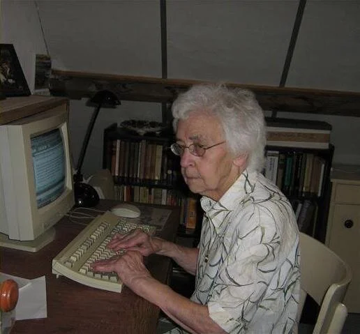
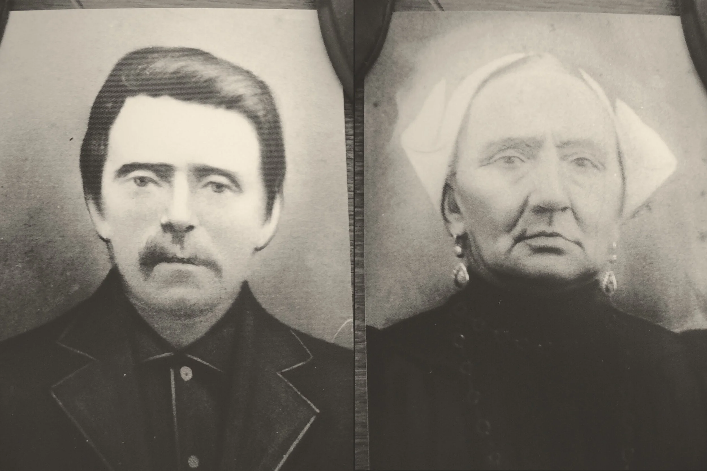
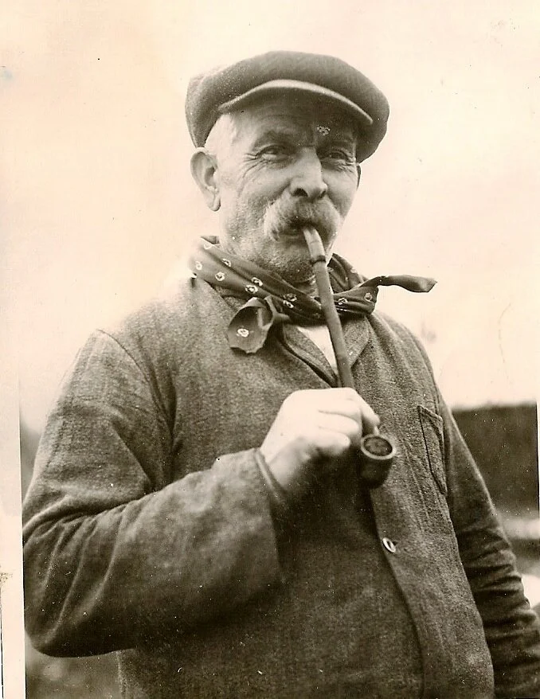

# new-page-2

> Bron: helenaveenvantoen.nl

### BIJEENGERAAPT

WAT MOEDER MIJ VERTELDE

Familieverhalen over de vroege geschiedenis van Helenaveen, zoals verteld door Pietje Naus - van der Zwaanen opgeschreven door Betje Naus.

Met dank aan de familie Van Wanrooij uit Beek en Donk, die het beschikbaar stelde.

Betje Naus * 12 december 1921 † 17 maart 2009

“Moeder, wil je me eens vertellen hoe het precies zat met jouw familie? Ik zou het graag eens allemaal willen opschrijven.” Moeder zette even een heel bedenkelijk gezicht toen ik haar dat vroeg: iets dat op papier stond vond ze wel erg gewichtig – wou ze dat wel? Mijn verzekering dat ik het alleen maar voor mezelf deed stelde haar blijkbaar gerust.

“Och, er is niets in onze familie waarover ik me hoef te schamen” zei ze. En terwijl ik m’n schrift en potlood voor den dag haalde begon ze te vertellen, en antwoord te geven op mijn vragen. Of ik dat bewuste schrift nog heb weet ik zo vlug niet meer: er liggen nogal wat stenogrammen en andere krabbelbriefjes in m’n bureau. Wat ik nog wel bewaarde is mijn “boek” dat ik de titel “Bijeengeraapt” meegaf. Bij het schrijven van dat verhaal werd de familie Pronke geboren – en kwam mijn vader aan de naam “Jakob Holters”.

Nu, ruim vijftig jaar later, ben ik niet bang meer om de echte namen van mijn ooms en tantes te noemen: ze zijn allemaal al lang overleden. Daarom wil ik nu onze familie­geschiedenis op gaan schrijven zoals ik die zelf heb gehoord van mijn moeder, Pietje Naus-van der Zwaan. Het is mogelijk dat anderen, als ze hetzelfde verhaal zouden vertellen, de feiten anders zouden weergeven. Ieder mens heeft nu eenmaal zijn of haar eigen herinneringen en iedereen bekijkt het verleden door de bril van de eigen ervaring. Wat ik vertel zijn de herinneringen van mijn eigen moeder, aangevuld met de gegevens die ik vond op oude gedachtenisprentjes, de “doodsprentjes” van mijn grootouders.

Het oudste prentje dat ik heb bewaard is dat van mijn overgrootvader, Cornelis van der Zwaan. Aan de voorzijde staat, onder de afbeelding van een heilige (Maria?) de tekst:

“Ik zal aan uwe zijde strijden, zoo gij onderdanig zijt” met daaronder de Franse vertaling “Je combattrai à vos côtes si vous êtes dociles”. Op de achterzijde wordt ons gevraagd om in onze gebeden te gedenken de ziel van zaliger Cornelis van der Zwaan, echtgenoot van Jacoba Bosmeijer. Hij overleed te Langeraar op 21 januari 1894, in den ouderdom van 73 jaren.

Op het gedachtenisprentje van zijn zoon Jan vind ik aan de voorzijde opnieuw een Franse tekst maar nu zonder de Nederlandse vertaling. “Jésus ne cache pas sa face aux âmes du Purgatoire, il exauce la prière pour les morts”. Mijn Frans is niet om over naar huis te schrijven, maar ik ben geneigd om die tekst te vertalen met: “Jezus verbergt zijn aan­gezicht niet voor de zielen in het vagevuur, hij verhoort het gebed voor de over­ledenen”.

Jan van der Zwaan werd geboren te Langeraar, op 28 november 1844, en overleed te Helenaveen, 11 februari 1892. Jan was toen nog maar 47 jaar: zijn dood was het gevolg van een trap van een paard. Daar werd in die tijd nog niet zoveel aandacht aan gegeven, waarschijnlijk hadden de dokters er ook niets aan kunnen doen. Volgens moeder zag alleen de pastoor de toestand ernstig in, dus kwam hij hem de “sacramenten der ster­ven­den” toedienen.

Een klein rekensommetje leert me dat Cornelis van der Zwaan nog maar 23 of 24 jaar was toen zijn zoon Jan geboren werd. Ik heb me wel eens afgevraagd of Cornelis wel echt mijn overgrootvader was, maar die twijfel duurde niet lang. De oudste zoon van Jan heette immers Kees, en in die tijd was het normaal dat de oudste zoon de naam kreeg van grootvader van vaders kant.

Ook het doodsprentje van mijn grootmoeder heb ik bewaard. Dit is helemaal in het Nederlands opgesteld, met de gebruikelijke vrome teksten. “Door kwellingen en ziekten moeten wij leren sterven” staat er op de voorzijde. En de keerzijde vraagt ons: “Bid voor de Ziel van Zaliger Martha de Lange, weduwe van Joannes van der Zwaan”. Martha werd geboren te Nieuwveen, op 1 maart 1845, en overleed te Mierlo-Hout op 29 maart 1914.

Van grootvader is nog een foto en van grootmoeder zijn twee foto’s bewaard gebleven.

Bij het maken van de oudste foto’s werd, volgens de fotograaf die ze kopieerde, nog met houtskool gewerkt. Ik kan me voorstellen dat het inderdaad zo gebeurd is, want toen ik heel voorzichtig probeerde het portretje van grootvader schoon te maken veegde ik het zwart van de foto gedeeltelijk weg, precies zoals de vakman me later uitlegde! Een ander, wat jonger, kiekje laat grootmoeder Van der Zwaan zien in Mierlo-Hout, samen met haar zoon Tinus, bij we ze haar laatste levensjaren doorbracht, en met haar dochter Aaltje.

Jan van der Zwaan en Marthe de Lange

Jan van der Zwaan was weduwnaar toen hij trouwde met Martha de Lange. Hoe zijn eerste vrouw heette weet ik niet, maar moeder vertelde me dat bij het huwelijk van Jan en Martha vier grootvaders samen dansten (een quadrille?), namelijk grootvader Van der Zwaan, grootvader Van Tol, grootvader de Lange en grootvader Vork. Martha de Lange was de weduwe van Hein van Tol, grootvader Van Tol was haar eerste schoonvader. Het ligt dus voor de hand dat grootvader Vork de vader was van Jan zijn eerste vrouw. Het feit dat Pietje de oudste dochter was van Jan en Martha, brengt me op de gedachte dat de naam van die onbekende eerste vrouw van Jan wel eens Pietje of Pietertje Vork zou kunnen zijn……

Jan van der Zwaan was tuinder, maar volgens moeder had hij daarvóór de kost verdiend als visser. Waarschijnlijk was de omschakeling naar het tuindersbedrijf mede het gevolg van de inpoldering van de Hollandse meren. Moeder had het tenminste nogal eens over de Haarlemmermeer­polder, en over de ringvaarten. Ze kende nog een rijmpje over een zeer strenge winter, toen:

“…… op de zevenentwintigste maartreed boer Zuidervaartmet kar en paardover de ringvaart……”

Er waren meer vissers in de familie, dat blijkt uit een ander verhaal. Een oom ging op een avond eens kijken waar zijn zonen bleven, die met hun vissersboot het meer op waren gevaren. Onderweg kwam hij een kennis tegen met paard en wagen. De man vroeg hem: “Van der Zwaan, waar ga je naar toe?” “Ik ga eens kijken of de jongens nog niet naar huis komen.” Hierop zei de man: “Ga maar niet verder, ik heb ze allebei hier op de kar.” Ze waren alle twee verdronken……

Jan had drie kinderen uit zijn eerste huwelijk: Kees, Jans en de kleine Arie. Toen Martha het klein jongske voor het eerst zag was het een zielig ventje dat nog maar amper praten en lopen kon – al had hij daar de leeftijd toch al voor – en vol zweren stond. “Arme stumper” zei Martha, “haalde onze lieve Heer jou maar bij je moedertje in de hemel.” “Nee oeder”, hakkelde de kleine, “bij oeder blijven.”

Daar kon Martha alleen maar op antwoorden: “Goed kind, dan zul je bij oeder blijven!” En Arie bleef bij moeder – tot de dag dat hij trouwde……

Ook Hein van Tol was weduwnaar toen hij met Martha trouwde. Hij had een zoon, Leen, die vrij jong stierf aan de tering (TBC), een gevreesde volksziekte. Hein en Martha kregen samen drie kinderen: Kee, Bet en Gerretje. Nadat Jan en Martha getrouwd waren kwamen er nog zeven kinderen bij. Hein, de oudste zoon, werd geboren op 5 november 1875, mijn moeder op 25 januari 1878. Zij was de oudste dochter. Verder was er nog Aaltje, waarvan ik de geboortedatum niet weet. Het is me dus niet bekend of ze nog “in Holland” geboren is of in Helenaveen.

Helenaveen, “De Ouwe Peel”, is in elk geval de geboorteplaats van de andere vier kinderen: Jan werd daar geboren op 23 maart 1883, Tinus 25 mei 1885, Marie zag het levenslicht op 28 mei 1888 en tenslotte kwam de jongste, Trui, de eerste februari 1890.

Als moeder vertelde over Langeraar, waren dat meestal verhalen die zij van haar ouders gehoord had. Zelf had ze maar weinig, meest vage, herinneringen aan die jaren. Ze was nog erg jong toen Jan en Martha naar Brabant vertrokken. Toch wist ze sommige dingen, volgens haar eigen zeggen, nog heel goed. “Als moeder me naar bed bracht droeg ze me door een grote kamer waar vreemde mensen zaten”, wist ze. Blijkbaar was dat een soort herberg, en gebeurde daar in Holland hetzelfde als in Brabant: mensen richtten als bijverdienste hun voorkamer in als café.

Dikwijls vertelde moeder ons over “moeder Lijsje”, de schoonmoeder van Hein van Tol, die de laatste jaren van haar leven bij Hein en Martha had ingewoond. Het was een bijzonder lastige vrouw die voortdurend aandacht vroeg. Op een dag vroeg moeder Lijsje “Wanneer gaan we eten, ik heb honger.” “O”, zei Martha, “het duurt niet lang meer, de aardappels koken hard.” Toen Lijsje even later haar bord eten voor zich had smeet ze het over de vloer. “Hier”, zei ze “vreet zelf maar op. Aardappels die hard gekookt zijn kan ik niet bijten.” Lijsje gedroeg zich niet alleen tegenover haar schoondochter zo on­vriendelijk, om niet te zeggen hatelijk. Een van haar zoons had ze jarenlang niet gezien, omdat hij heel ver weg woonde. Op zekere dag kwam hij toch bij zijn moeder op bezoek, waarbij hij zijn (aanstaande?) vrouw meebracht. Hij werd ontvangen met de woorden: “Wat kom je hier doen op een maandag? Je weet toch wel dat ik dan wassen moet! En wat voor een kakkerlak heb je daar bij je?” Haar onhebbelijke gedrag zal dus wel niet alleen gekomen zijn door haar ouderdom.

Als moeder Lijsje merkte dat de kapelaan in de buurt was – priesters gingen in die tijd veel op huisbezoek, vooral bij zieke mensen – dan begon ze heel hard te roepen: “Kapelaan, kapelaan, kom toch eens, Matje (zo werd Martha dikwijls genoemd) is toch zo slecht voor me.” De kapelaan kende het oude mensje wel en lachte er maar eens om. Ook de kleine Leen had het niet zo erg begrepen op zijn kijvende grootmoeder. Toen Martha haar stiefzoontje eens met een grote stok zag lopen vroeg ze: “Maar jongen, wat ga je met die stok doen?” Tot haar verbazing kreeg ze te horen: “Daarmee zal ik grootje er eens op gaan slaan, want ze doet weer lelijk van jou.” Dat ging dus mooi niet door……

Toen Lijsje stierf kwam haar eigen dochter over voor de begrafenis. Ze ging naast het bed van haar moeder zitten huilen, waarop Martha zei: “Je hebt al die jaren nooit naar je moeder omgekeken, dus hoef je nu hier niet te gaan zitten schreien. Ik durf eerlijk te bekennen dat ik blij ben dat ze dood is.” Hierop droogde dochterlief haar tranen en deed ook verder niet meer of ze bedroefd was om de dood van de oude vrouw.

Hein en Martha kregen een dochter die, zoals het toen hoorde, de naam van haar grootmoeder kreeg, maar Martha wilde beslist geen tweede “Lijsje”. De kleine Elisabeth werd dus “Bet” genoemd. Omdat tante Bet al zo jong stief kreeg ik later diezelfde naam.

Een heel dierbare, tastbare herinnering aan moeders kinderjaren was het kleine porseleinen kopje met schoteltje, waaruit wij mochten drinken op de dag van onze eerste heilige communie. Verder stond het altijd heel veilig opgeborgen in de kast. In haar laatste levensjaren, toen ze dikwijls heel somber en wantrouwig was, vertelde moeder me op een morgen: “Ik heb vannacht zo akelig gedroomd: ik droomde dat Ida mijn kopje mee wou nemen, maar ik zei: Blijf daar af, dat is mijn kopje, ik heb het gekregen van Naatje Wesselman, toen ik zes jaar werd.” Dat kopje is op dit moment nog in het bezit van Ria Naus, die er al even zuinig op is, al heeft het natuurlijk alleen een emotionele waarde. Wie die Naatje Wesselman was weet ik niet zeker, het was een meisje van haar leeftijd, zei moeder. De veronderstelling dat moeder dit kopje zelf gekregen zou hebben met haar eerste communie klopt niet met de leeftijd van zes jaar: pas tijdens het paus­schap van Pius X werd de kindercommunie ingevoerd, dus pas na 1903. Over een familie Wesselman heb ik verder nooit iets gehoord.

Wel vertelde moeder ons over een vrouw Koeleman, vermoedelijk een buurvrouw. Die vond het maar niets dat Martha en Jan naar Brabant gingen verhuizen. “Brabant? Wat ga je daar toch zoeken? Brabant…… vies land! De varkens lopen in huis, de kippen lopen in huis, ze poepen in huis…… vies land!” Omgekeerd waren, als ik mijn vader mocht geloven, veel Brabanders niet zo gesteld op “die Hollanders”. Toen mijn ouders pas getrouwd waren werd er tenminste wel eens schamper gezegd: “Jochem zit daar te verrekken van de armoe met zijn Hollands wijf.” De “Hollanders” waren, nog steeds volgens mijn vader, te deftig en DUS niet zuinig. Die “deftigheid” bestond er vooral in dat ze alles graag schoon en netjes hielden, dat ze gordijnen voor de ramen hingen en een kleedje op tafel legden – zaken die niet veel geld kostten. Zuinig leven konden ze even goed als de overige Peelbewoners……

Helenaveen was in die tijd een tuindersdorp in opkomst. Nadat de turfgravers hun werk hadden gedaan in het veengebied, bleef er vruchtbare grond over die heel geschikt was voor de teelt van bonen en erwten, toen de meest gangbare groenten. De tuinders kwamen uit alle windstreken: uit Gelderland en Overijssel, uit Limburg en Holland. Ook een zuster van Jan van der Zwaan vertrok met haar man Toon Bakker naar Helenaveen.

Het was een hele onderneming: in die jaren was naar een andere provincie verhuizen bijna te vergelijken met emigreren in onze tijd! Martha had in het begin ook nogal eens last van heimwee. “O”, zei ze soms als ze langs het kanaal liep, “wat zou ik er veel voor willen geven als ik nu Teuntje Maus nog eens zag.” Teuntje Maus was de koopvrouw die in Langeraar met haar bootje vol negotie langs de aan de waterkant gelegen huizen voer. Volgens moeder lagen er nogal wat huizen aan het water, en moesten de bewoners via een loopplank naar de doorgaande weg. Als het avond werd konden ze die loopplank inhalen, zodat er geen ongewenste bezoekers hun huis konden bereiken. Maar Teuntje Maus kwam niet in de Peel en Martha maakt nog maar een of twee keer de lange treinreis naar haar geboortestreek.

Het eerste huis van de familie Van der Zwaan was een oude pastorie. De kinderen speelden soms op het oude kerkhof en moeder vertelde ons over een tabernakel dat met een druk op een knopje open ging en rond draaide. Wat ik me daarbij moest voorstellen heb ik nooit goed begrepen, evenmin weet ik hoe het zat met de oude pastorie en de bijbehorende kerk. Ging het misschien om een noodkerkje, of een overblijfsel uit de tijd van de protestantse overheersing? Ook het verhaal over de herberg van Van der Zwaan is me niet helemaal duidelijk geworden; ik neem aan dat het ook een café was in de huiskamer, juist als, vermoedelijk, in Langeraar. Heel zeker was moeder als ze vertelde hoe Jan van der Zwaan – hij was in zijn hart nog altijd een beetje “een visserman” – in de winter ging “snoeken”. Dan hakte hij een gat in het ijs, schoof zijn dikke visserswant losjes over een hand en liet die in het ijskoude water zakken. De snoek zag die bewegen­de want als een smakelijke prooi en beet zich vast in de ruwe wol, zodat Jan hem ge­mak­kelijk boven water kon halen.

Toen Jan van der Zwaan stierf, in 1892, werd ook de herberg gesloten. Hoe het verder ging met de tuinderij weet ik niet; uit de verhalen van moeder kon ik niet opmaken dat een van de jongens het bedrijf voortzette. Nu zal die tuinderij wel heel wat kleiner zijn geweest dan de latere grote tuinderijen. Of er in die jaren al zoiets als een veiling­vereniging bestond betwijfel ik ook – dat mogen Deurne’s heemkundigen uitzoeken……

In elk geval had Van der Zwaan een veestal: Pietje moest als kind soms de koeien hoeden. Die koeien mochten dan grazen langs de vaart, waar veel gras groeide. Soms wilden de dieren niet doen wat het meisje wou: een keer liep een koe omlaag tot aan de waterkant. Pietje liep huilend naar binnen, bang dat het dier zou verdrinken. Vader Jan lachte maar eens: de koe wou gewoon gaan drinken en klauterde daarna weer heel bedaard de kanaalkant op.

Wat ook vaststaat, is dat de jongens later buitenshuis gingen werken, en ook de meisjes werden dienstbode, de meesten “voor dag en nacht” zoals dat heette.

Over haar schooljaren vertelde moeder niet zo heel veel. De school was in die tijd een plaats waar de kinderen moesten leren lezen, schrijven en rekenen en de meisjes kregen daarbij nog les in naaien, breien en stoppen. Zeker toen de zusters een meisjesschool openden werd aan die “nuttige handwerken” heel veel aandacht gegeven. Vermoedelijk was de school die Pietje bezocht nog een openbare school, ze kreeg tenminste les van een mannelijk onderwijzer. De man droeg een bril, die af en toe vuil werd en dus ge­poetst moest worden. Op een keer kwam hij met zijn bril in de hand naar Pietje toe en pakte de punt van haar schort om de glazen schoon te vegen. “Niet doen”, zei Pietje verontwaardigd, “mijn schort is pas schoon.” De man kon er om lachen en vertelde later aan Martha dat hij juist een schoon schort had uitgezocht om zijn bril te poetsen……

Pietje was nog erg jong toen Martha wat toen heette een “beslag” kreeg, vermoedelijk een herseninfarct. Het huishouden was door haar ziekte danig ontregeld. Een van de oudere dochters bleef thuis om te helpen en Pietje mocht de kleinste kinderen mee­nemen naar school. Als de baby verzorgd moest worden werd Pietje uit de klas gehaald om de kleine de fles te geven en te verschonen. Toen ze tien jaar was werd ze voorgoed van school gehaald en stilaan werd “ons Pietje” de rechterhand van haar half invalide moeder. Wel bleef Martha het huishouden besturen en deed ze nog wat ze kon. Ze had zichzelf aangeleerd om met een hand (de ander was verlamd) de aardappels te schillen voor het grote gezin.

Tante Kee heb ik nog goed gekend; als kind ben ik nog een paar keer bij haar op bezoek geweest. Van haar wist moeder te vertellen dat ze niet op haar mondje gevallen was. (Ik heb de indruk dat de “Van Tols” en de “Van der Zwaanen” geen van alle doetjes waren!) Kee moest een keer bij de kantonrechter komen, omdat er iets gebeurd was in de herberg – ik meen dat er gedanst was, wat eigenlijk niet mocht – en Kee moest ge­tuigen. Daar kwam het tot een vraag- en antwoordspelletje: “Hoe heet jij?” vroeg de rechter. “Cornelia van Tol.” “Wie is je vader?” “Jan van der Zwaan.” “En wie is je moeder?” “Martha de Lange.” “En hoe heet jij dan?” vroeg de man weer. “Cornelia van Tol.” Toen hij elke keer dezelfde antwoorden kreeg op zijn vragen vroeg de rechter: “Hoe kan dat dan, dat je vader Van der Zwaan heet en jij Van Tol?” “Omdat Jan van der Zwaan mijn stiefvader is” zei Kee. “Maar waarom heb je me dat niet eerder gezegd?” “Omdat jij het me niet eerder gevraagd hebt!” was het antwoord.

Kee trouwde later met een politieman, Peer Aarts. Ik heb die oom niet meer gekend, maar het moet een moeilijke man geweest zijn. Moeder vertelde tenminste dat Kee in de eerste jaren van haar huwelijk nogal eens thuis haar nood kwam klagen, hoewel ze daar­voor heel ver moest lopen. Moeder Matje kon haar dochter geen andere raad geven dan: “Je zult er mee moeten zien te leven, je bent met die man getrouwd.” Aan scheiden werd toen niet gedacht……

Peer vond zijn naam blijkbaar niet mooi: de neven en nichtjes mochten hem geen “ome Peer” noemen, dus zeiden ze maar “ome Aarts”. Voor zijn kinderen bedacht ome Aarts wel heel aparte namen. Een van zijn zoons, Willem, noemde hij naar de Duitse keizer Wilhelm. Volgens moeder heette zoon Leo: “Leopold Karel Lodewijk”, ook naar een of andere historische figuur. En Sjef, een andere zoon, liet hij Jozefus Nicodemus noemen, naar Jozef van Arimathea en Nicodemus, “twee heilige mannen die O.L. Heer in het graf hadden gelegd.” Over zijn dochter Martha, die ver­noemd was naar haar grootmoeder, sprak ome Aarts meestal als over “het aardappel­schilstertje” – dit omdat grootmoeder met haar ene, niet verlamde hand, altijd de aardappels schilde voor haar grote gezin…… “Nee”, zei moeder wel eens, “voor Kee was het niet zo erg dat ze haar man tamelijk vroeg verloor.” Dochter Martha zei later eens: “Ja, tante Pietje, we hebben een groot gezin en er zijn veel goede mensen bij, maar er zitten ook een paar “Aartsen” onder!” Wie nu de “Aartsen” waren en wie de “goeden” waren weet ik niet: er waren veel kinderen en ze waren allemaal een heel stuk ouder dan ik.

Het best herinner ik me Corrie, de jongste, een geestelijk gehandicapt meisje. Het was een vrolijke meid, die echter niet met zich liet sollen. Ze speelde graag kaart, met een denkbeeldige partner die “Piet van Kempen” heette. Die man, in die tijd een beroemd wielrenner, zat volgens Corrie op de stoel tegenover haar aan tafel. Als iemand per abuis op die stoel ging zitten werd hij er meteen afgejaagd door een luid protesterende Corrie: “Lelijkerd, jij gaat op Piet van Kempen zitten.” Haar meest geliefde traktatie was thee met beschuit. Als tante Kee met Corrie op bezoek ging bij tante Gerretje plaagde nicht Martha haar wel eens door te zeggen: “Moeder, Corrie wil koffie met roggebrood.” Corrie vatte meteen vlam: “Nee, jij lelijke ouwe koffiepot, ik wil thee met beschuit.”

Tante Gerretje had na haar schooltijd naaien geleerd, maar volgens moeder was ze nooit een goede naaister geworden. Misschien ook wel omdat ze zwakke ogen had: ik herinner me haar tenminste als de tante die altijd een donkere bril droeg. Toen ze een keer een foto liet maken moest ze zolang een gewone bril op zetten. Met die zwarte ogen werd de foto niet mooi, maar zonder bril zou het volgens de fotograaf evenmin een succes worden. Het bewuste portret zit nog in moeders oude album.

Gerretje hielp ook wel eens thuis in de huishouding – dan liep ze altijd even hard door het huis. Als ze dan water ging halen uit het kanaal aan de overkant van de weg, legden de broers wel eens een bezem voor de deur, zodat hun zus er over struikelde – en weer terug holde om opnieuw water te gaan scheppen. “Wat onze Gert met haar handen recht zet gooit ze met haar gat weer om” plaagde de jongens haar. Toch was de verstand­houding heel goed, en dat bleef ook zo toen ze allemaal al lang getrouwd waren. Gerretje trouwde met Gerrit van Teeffelen en bleef in de buurt wonen. “Kanaal Deurne Liessel” was het postadres waar we later onze kaarten en brieven naar toe stuurden. We kwamen er altijd graag, en ook ome Gerrit en tante Gerretje zagen we nog wel eens in Beek en Donk, al was die reis voor hen een hele onderneming.

Dat mijn moeder altijd thuis bleef om het huishouden te doen kwam misschien ook wel omdat ze slecht hoorde. Als meisje van een jaar of twaalf viel ze van de hooizolder, waarbij ze een lelijke hoofdwond opliep. Medische hulp was niet zo vlug te krijgen en dus lag ze een hele tijd te bloeden voordat de dokter met zijn rijtuig arriveerde. De dokter naaide de wond dicht, maar hij kon niet voorkomen dat de patiënt aan een oor volslagen doof bleef. Moeder hield aan die val een groot litteken over dat tussen haar oor en haar oog recht naar beneden liep en nooit verdwenen is.

Pietje bleef dus thuis, ook toen haar jongere zusjes opgroeiden. Wel ging ze af en toe ergens helpen, o.a. met het erwten poten, iets wat haar blijkbaar heel goed lag, want de tuinders uit de buurt vroegen dikwijls om haar hulp. De erwten werden vroeg in het jaar geplant. Zo herinnerde moeder zich goed dat ze half januari nog een heel stuk land vol gezet had. Op 24 januari zei ze: “Vandaag wil ik klaar zijn, want morgen ben ik jarig, dan blijf ik thuis.” Ze kreeg het karwei klaar – en op 25 januari viel er een flink pak sneeuw! Blijkbaar konden de jonge plantjes daar goed tegen.

Zus Aaltje ging dienen, als ik het verhaal goed begrepen heb, maar ze kreeg verkering met een man die haar niet veel meer te bieden had dan mooie woorden. “Ze hadden haar allemaal genoeg gewaarschuwd” zei moeder, maar ze trouwde toch. Of haar man, Pau van der Linden, bij haar wegging of dat Aaltje het zelf niet meer uithield is me nooit duidelijk geworden. Jan, een broer van Aaltje, zocht zijn zus een keer op toen ze alleen met haar dochtertje Martha in Venlo op een zolderkamertje woonde. Het was de bedoeling dat ze met haar kind weer naar Helenaveen terug zou komen, maar kort daarna stierf Aaltje. Pau van der Linden bracht zijn dochtertje toen naar haar oom en tante, Arie en Trui van der Zwaan, waar de kleine Martha hartelijk ontvangen werd en helemaal in het gezin werd opgenomen. Ze bleef bij Arie en Trui wonen, ook toen Pau niets meer van zich liet horen. De grote “broers” leerden het kind een liedje: “Pau van der Linden kan mij hier niet vinden.” Voor de familie werd het meisje al gauw: Martha van ome Arie.

Met Marie en Trui, de twee jongste zussen, had Pietje een bijzondere band. Trui ging dienen in Venlo, bij tuinder Seelen. Ze beviel niet alleen haar werkgever goed, maar ook zijn zoon Sjaak, die wel met Trui wilde trouwen. “Maar Trui heeft geen geld” zei Sjaak tegen zijn vader. “Dat geeft niks jong” was het antwoord, “jij hebt genoeg voor allebei.” Dus trouwden ze en “de ouwe Seelen” bleef tot aan zijn dood bij Sjaak en Trui wonen, waar hij mocht genieten van een goed verzorgde oude dag.

Tante Marie werkte (nog altijd volgens mijn moeder!) veel bij “deftige” mensen, o.a. bij de dominee. Of ze ooit bij een tuinder in dienst was weet ik niet. Ze was tien jaar jonger dan moeder en pas negentien toen mijn ouders trouwden – maar daarover later!

Van de jongens was, als je de vroeg gestorven Leen van Tol niet meetelt, Kees van der Zwaan de oudste. Wat hij in Helenaveen deed weet ik niet, maar volgens moeder had hij het daar niet erg naar zijn zin. Toch hield hij veel van zijn stiefmoeder. Als hij ruzie kreeg met vader Jan zei hij wel eens: “Vader, als jij moppert, kan me dat niets schelen, maar als moeder schreit vind ik dat erg.” Kees ging al jong naar Langeraar terug, waar hij, zoals moeder het noemde, “een drankhandel” begon.

Arie, de jongste halfbroer van Pietje, bleef tot aan zijn trouwdag “bij oeder”, zoals hij als kind al had gezegd. Toen hij groot was werkte ook hij in de Peel. Moeder wist nog goed hoe Jan, toen nog maar een jongetje, zijn grote broer het middageten moest brengen. Onderweg vertelde hij heel trots wat hij allemaal bij zich had: “Vlees, en aardappels, en soep met een mooi kloofie (kluifje) er in…… wat zal onze Arie kunnen eten!” Al babbelend lette hij niet op de weg en struikelde over een boomstronk…… daar lag het lekkere kloofie! Nadat Arie was getrouwd met Trui van Teeffelen werd hij tuinder, zoals veel inwoners van Helenaveen.

Hein, de oudste zoon van Jan en Martha, werkte ook in de Peel. Ik meen dat hij vooral zorgde voor het vervoer van de turf. Dat gebeurde per turfaak, door de vaarten en wieken van de Peel. Later, na zijn huwelijk met Bet Snellen, verdiende hij thuis de kost met zijn tuinderij.

Ook Jan en Tinus werkten in het begin nog “in de turf”. Tinus was blijkbaar maar een heel min ventje, want een van de vrouwen die in de Peel werkte zei: “Als dat manneke zijn drinkenskruikje (een emaillen kannetje met koffie) naar de Peel heeft gedragen heeft hij het al zwaar genoeg.”

Jan kwam als dienstplichtig militair bij de huzaren. Daar werd hij oppasser van een of andere officier, voor wie hij allerlei karweitjes moest opknappen, zelfs op de kinderen passen! Hij verliet de militaire dienst met een open been, waar hij later nog veel last van kreeg. Voor hij trouwde met Hanneke Crommentuijn was Jan nog enige tijd koetsier bij een dokter.

Tinus werd later tuinman bij de familie Raaijmakers in Mierlo-Hout. Hij trouwde met Anna Biemans en ze hadden nog enige tijd een winkel aan huis. Toen hij in Mierlo-Hout woonde ging hij dikwijls op zaterdag, samen met broer Hein, naar de markt in Helmond om groente te verkopen.

Hoewel er in die jaren hard gewerkt moest worden, kon moeder ook veel leuke herinneringen ophalen aan haar jeugd in Helenaveen. Tijdens de lange winteravonden zat de hele familie dikwijls gezellig bij het brandende fornuis. Dan werden er verhalen verteld over vroeger, vooral spook­verhalen waren in trek. Ome Toon Bakker – moeder praatte altijd over “ome”, de naam werd niet genoemd – kwam graag bij zijn zwager op bezoek. Of zijn huwelijk met Ant van der Zwaan erg gelukkig was weet ik niet zo net. Toen Jan van der Zwaan gestorven was zei ome op ’n dag tegen Martha: “Ja Matje, jij ben zo gelukkig, jij ben der af, maar ik zit nog met het lelijke lel te kijken.” Heel gemakkelijk schijnt “meue Ant” niet te zijn geweest…… (meue = tante)

Ome wist heel sappig te vertellen over de vreemde gebeurtenissen die zich hadden afgespeeld in Holland. Zoals op die zondagmorgen, toen het kerkvolk op weg was naar de Mis. Het had gevroren en op het meer zagen ze een man, die plotseling door het dunne ijs zakte. Op zijn hulpgeroep liepen alle mannen te hoop om de drenkeling te redden. Ze haalden ladders en stokken en touwen en wisten zo de man te bereiken, maar ze konden hem niet lostrekken uit het ijs. Het duurde net zolang tot de pastoor klaar was met de Mis. Toen kwam de drenkeling op eigen kracht uit het wak en (zo vertelde ome): “…… toen reed hij op ene poot weg. Hij was waarachtig de duivel!”

Ook Martha kende zulke verhalen en veel van die enge gebeurtenissen had ze zelf meegemaakt… zei ze! Matje was een van de weinige vrouwen die een naaimachine bezat en werd daarom nogal eens gevraagd om ergens een kleedje, een rok of jak te komen maken. Veel mensen kwamen trouwens ook met hun verstelgoed bij Matje thuis: zij had immers veel vlugger een naad dichtgenaaid of een zoom gestikt dan de vrouwen die het nog met de hand moesten doen! Matje was echter wel goed maar niet gek: ze was niet van plan om zomaar voor iedereen gratis het naaiwerk op te knappen. Op zekere dag kwam een van de vrouwen uit het dorp bij haar met de vraag: “Och Matje, wil je deze rok even voor me onder de naaimachine leggen?” Het antwoord was: “Ja hoor, dat zal ik wel doen.” Toen de vrouw een paar dagen later kwam vragen of het werk klaar was kreeg ze te horen: “Je vroeg me om dat even onder de naaimachine te leggen: nou, dat heb ik gedaan, kijk maar.” De rok lag netjes opgevouwen onder de machine…… “Ja”, vertelde Matje, “ik had die dure naaimachine gekocht en nu zou ik voor iedereen voor niks gaan zitten naaien.”

Maar op een avond ging ze, met haar handnaaimachine onder de arm, naar een vrouw die bekend stond als heks. Omdat het een dringend karwei was, bleef ze doorwerken. Toen de klok twaalf uur sloeg viel de huisvrouw in haar leunstoel in slaap. Matje hoorde een vreemd gezoem, alsof er een bijenzwerm rond het hoofd van de vrouw bleef vliegen. Dat gezoem hield een uur lang aan, terwijl Matje angstig doorging met haar naaiwerk. Klokslag één uur leek het haar alsof het gezoem door het gesloten raam heen naar buiten zweefde. De vrouw schrok wakker en lachte: “Ik was gewoon even in slaap gevallen, maar nu zal ik eens vlug een potje koffie gaan zetten.” Matje maakte haar werk af, maar nadien ging ze nooit mee zo laat uit naaien……

Spookverhalen kende iedereen in die tijd wel; ook mijn vader vertelde later dikwijls van die “ware” gebeurtenissen uit zijn jeugd. Hij maakte ons er echter niet bang mee – dat deed “ome” blijkbaar wel. Moeder wist tenminste nog dat ze na die griezelverhalen bijna niet meer naar bed durfden te gaan!

Heel wat minder griezelig waren de optochten die de familie Van der Zwaan soms hield. Dan liepen ze met z’n allen (uiteraard zonder Martha) door het dorp, terwijl een van hen zong: “Ben je al bij van Horen geweest?” De rest van het gezelschap antwoordde: “Overal, maar daar nog niet.” Zo werden alle inwoners van het dorp bezongen, alles op de wijs waarop in de kerk de litanie van Allerheiligen gezongen werd. Ook “musiceerden” de jongelui soms: daarbij bliezen ze op lampenglazen, die altijd wel in huis waren voor de petroleumlampen. Of ze sloegen op potdeksels, oude pannen en andere voorwerpen waarmee veel lawaai gemaakt kon worden. Het is me niet bekend of de buurtgenoten dat op prijs stelden!

Thuis werd ook veel gezongen: moeder had een mooie altstem, die volgens m’n broer Jan veel leek op die van Kathleen Ferrier. Haar stem bleef niet onopgemerkt: op een goede dag kreeg Pietje een geweldig aanbod. Iemand, moeder wist geloof ik zelf niet wie, zag voor haar een toekomst als operazangeres. Die persoon wilde haar zangstudie met alle bijkomende kosten, ook van het levensonderhoud, betalen – maar Martha weigerde haar toestemming te geven. Zoals veel ouders in die jaren zag ze haar dochter al op het verkeerde pad terecht komen en ten onder gaan in de artiestenwereld. Thuis zingen mocht wel: samen met Hein ging Pietje zelfs wel eens zingen bij feestjes, of als het kermis was in een herberg. In die jaren werden er veel liedjes gezongen die ik misschien wel ballades mag noemen. In “Bijeengeraapt” is nog de hele tekst te vinden van het lied over Charibald, een lied dat broer Tinus later in Beek en Donk nog wel gezongen heeft. Dit soort liedjes leerde mijn moeder natuurlijk pas toen ze wat ouder werd, verhalen over bedrogen geliefden hoorden kinderen niet te kennen!

Als het gesneeuwd had trokken ze voor het naar bed gaan soms hun kousen uit en liepen ze op blote voeten heel hard een paar keer rond het huis. Daarna doken ze meteen onder de wol en kregen in de kortste keren lekker warme voeten! Een ander grappig voorval, waar moeder soms nog om lachen kon, was het verhaal over twee jongere broers, die allebei graag het laatste restje uit de grote papketel wilden hebben. Ze kregen een lepel waarmee ze om beurten over de bodem mochten schrapen. Een van hen ging toen gewoon met z’n achterste op de pan zitten – en toen beliefde z’n broer niets meer zodat de ander alles kreeg!

Toen de jongens groter werden hoefden ze geen pappot meer leeg te schrapen, maar ze konden wel heel goed eten en Pietje was heel wat tijd kwijt met het klaarmaken van de warme maaltijden. Als het kermis was kookte ze echter enkel een grote pan erwtensoep en moesten de broers maar zien dat ze hun maag gevuld kregen. “Ik ga kermis houden”, zei ze dan. Zo wou moeder Martha het ook: “die ene keer in het jaar mag jij wel eens vrij zijn” zei ze dan.

De grote mannen waren trouwens niet zo kieskeurig. Eens kwam Hein de keuken binnenlopen met de vraag: “Wanneer gaan we eten?” Dat duurde nog eventjes en Pietje vond dat hij maar een boterham moest pakken als hij erge honger had. Hein ging naar de kelder en nam een groot roggebrood van de plank. Eerst sneed hij er aan de voorkant de korst af en at die op. Toen deed hij hetzelfde met de korst aan de achterkant en sneed daarna de hele bovenkant van het brood. Ook die ging naar binnen, waarna de onderkant aan de beurt kwam. Even later vroeg Pietje: “Hein, waar heb je dat brood neergelegd?” Tot haar verbazing kreeg ze te horen: ”Och, dat kleine brokkie brood heb ik ook maar opgegeten.” Nadat hij de korsten op had, had de jongeman ook heel het binnenste van het grote roggebrood naar binnen gewerkt, droog, zonder boter of beleg……

Roggebrood kwam bij elke broodmaaltijd op tafel. “Geef ons heden ons dagelijks brood” werd er dagelijks gebeden, en soms zeiden de mensen er lachend bij: “… en zondags een mikske (witbrood). Amen!” Witbrood was een luxe die bij een feestelijke maaltijd hoorde.

Van vakantie, anders dan de schoolvakanties, hadden ze nog nooit gehoord. De mannen werkten zes dagen in de week, alleen op zondag en met de kerkelijke feestdagen bleven ze thuis. Naar de jaarlijkse kermis werd echter even reikhalzend uitgezien als tegen­woordig naar de vakantieweken. Vader zei wel eens: “Als we die twee kermisdagen vrij hadden, gaf ons dat een gevoel alsof we nooit meer hoefden te werken!” Voor de kermis moest het huis goed schoongemaakt worden; de vloeren werden geschrobd en de ramen gewassen. Blijkbaar gebruikten ze geen spons en zeem voor het ramen lappen. Moeder wist tenminste nog hoe haar zussen een schone witte doek namen om de ruiten te drogen. Gek genoeg kreeg alleen Bet de ramen streeploos schoon. Toen de anderen vroegen hoe dat kwam zei Bet, die overal een antwoord op wist: “Jullie pakken een witte doek, en die is direct vuil. Ik neem een bonte doek, daar zie je het vuil niet op en dus worden m’n ramen ook beter schoon!”

Natuurlijk zijn de verhalen die moeder me vertelde haar eigen persoonlijke herinneringen en hebben haar zussen en broers hun kinderen weer andere dingen verteld. Dat er in haar ouderlijk huis een prettige sfeer heerste werd me echter wel duidelijk in mijn kinderjaren, als de familie met de kermis van Beek en Donk op bezoek kwam.

Dan kon ome Hein zo ineens vragen: “Pietje, zullen we samen nog eens zingen?” Of het hele gezelschap begon aan tafel ineens aan het lied: “O, daar zit een vlieg aan de lamp, vlieg aan de lamp, vlieg aan de lamp. O, er zit een vlieg aan de lamp, vlieg aan de lamp…!” Daarna volgden er nog een hele reeks “coupletten”, allemaal van één regel. Zo zat er nog een hommel in de trommel en een vlooi (vlo) in m’n hemd……

Wat die vlieg aan de lamp betreft, dat gebeurde nog al eens echt. Als zo’n vlieg aan de buitenkant van het lampenglas zat gaf dat een vreemde schaduw; kwam het diertje per ongeluk aan de binnenkant terecht dan begon de vlam te flakkeren…… De tekst van het lied stelde niets voor, maar de gekke grimassen des te meer.

Vooral de broers Arie en Hein kwamen uit moeders verhalen naar voren als echte grappenmakers. Arie had ooit de koffiepot, een ketel met een hengsel, met een katrol aan de zolderbalk vastgemaakt. “Als jullie koffie willen moet je netjes vragen: Arie, krijg ik alsjeblieft een kop koffie?” zei hij. Dan liet Arie de koffieketel zakken en konden ze inschenken. Moeder Martha moest echter zo lachen om de malle fratsen van haar stiefzoon, dat ze maar amper gezegd kreeg: “Toe malle jongen, geef me nou een kop koffie.” Arie liet de ketel zakken, maar hield toch vol: “Eerst zeggen: alsjeblieft Arie.”

Een andere keer verkondigde hij: “Moeder, als je zeventig jaar bent maken we een mooi hokje voor je, en zetten je daar in. We zullen heel goed voor je zorgen, maar je mag er niet meer uit, want dan ben je dood. Echt dood of niet dood, dat maakt dan niet meer uit.” Martha kon om die gekke uitspraken lachen, ze kende haar jongen wel. Andere mensen waren echter niet allemaal even gelukkig met dat soort grappenmakerij. Een van de buren zei eens: “Van Hein kan ik die gekkigheid heel goed hebben, die bedoelt het goed, maar Arie is niet echt grappig.” Toch wou ook Arie alleen maar wat plezier maken en niemand kwetsen, maar dat begrepen buitenstaanders niet altijd.

Toen de jongens zo ver waren dat ze over een rijwiel beschikten, vonden ze dat ook zus moest leren fietsen. Dus besteeg Pietje op een dag het stalen ros… en reed meteen het kanaal in. “Ik heb het naderhand nooit meer geprobeerd” zei ze. Mijn moeder heeft dus nooit leren fietsen – maar ze was niet de enige vrouw van haar generatie die overal lopend naar toe ging! Ze gingen te voet naar Deurne en naar Griendtsveen, en natuurlijk ook te voet naar Ommel, ter bedevaart naar O.L. Vrouw.

Regelmatig vertrok er uit Helenaveen ook een groep pelgrims naar Kevelaer, maar dat ging gedeeltelijk met paard en kar. Kevelaer had op moeder veel indruk gemaakt door de vele kapellen en kerken. Als er later werd gesproken over een boerderij of woonhuis met veel bijgebouwtjes zei ze dikwijs: “Daar is het net Kevelaer.”

In de loop van dit verhaal heb ik al verteld met wie mijn ooms en tantes getrouwd waren, maar er blijven nog twee namen over: mijn eigen moeder, Pietje, en haar jongere zus Marie. Voor ik daar over begin ga ik echter weer wat verder terug in de tijd, naar het begin van de negentiende eeuw. Nu niet naar “Holland”, maar naar de Limburgse plaats Helden-Grashoek.

Daar woonde in die tijd Joachim Naus, mijn grootvader. Waar en wanneer hij geboren werd is me niet bekend – een gedachtenisprentje heb ik nooit gezien en dat is er misschien wel nooit geweest…… Vader vertelde niet zoveel over zijn ouders, al wist hij wel hoe zijn ouderlijk huis destijds was “gebouwd”. Dat ging in die tijd heel eenvoudig: familie, buren en vrienden hielpen mee met het steken van plaggen (zoden van gras of heide). Van die bouwstenen werden vier muren opgetrokken met daarin een deur­opening. Een strodak erboven en het “huis” was in principe klaar. “In één dag” wist vader. In die plaggenhut woonde het hele gezin, plus eventueel aanwezige koeien, varkens en/of kippen. Naderhand vormden de bewoners stenen van leem, die in de zon gebakken (gedroogd) werden en waarmee ze de binnenmuren verstevigden. Naargelang ze geld hadden werd het huis door de jaren heen verbeterd: de plaggen maakten plaats voor echte stenen, het woongedeelte werd gescheiden van de veestal, er kwamen ramen en deuren, kortom: de plaggenhut werd een echt huis.

Joachim Naus trouwde met Ida Janssen, van wie ik wel een “doodsprentje” heb. Ze werd geboren te Helden op 29 augustus 1829 en stierf in Helenaveen, 15 juni 1907. Haar man was toen al een hele tijd dood. Ida was een klein vrouwtje, dat meestal “mooder Iedje” genoemd werd. Joachim en Ida kregen, voor zover ik kan nagaan, negen kinderen: vijf zoons en vier dochters, namelijk Piet, Hannes, Fried, Jochem, Hein, Gon, Han, Marie en Nel.

De oudste zoon heette Piet. Van hem weet ik dat hij in elk geval twee dochters had, Ida en Liza. Hij had een kwekerij in Tegelen.

Hannes trouwde met Mina van Woezik. Ze woonden in Griendtsveen en hadden drie kinderen: Bertha, Jo en Johan. Hannes was, meen ik, ploegbaas bij de veenderij in de Peel.

Fried trouwde met Sis Swinkels. Ze woonden in Helenaveen en kregen twee kinderen: Marietje en Dorus.

Van mijn vader, die ook Joachim heette, weet ik wel dat hij in 1869 werd geboren, maar welke plaats hij qua leeftijd innam tussen zijn broers en zussen is me niet bekend.

Hein was de jongste zoon, hij trouwde met Dora Kartner. Ze hebben enige tijd ergens in Duitsland gewoond, maar in mijn jeugd woonden ze in Swolgen, later in Tienray. Ze kregen een vrij groot gezin, waarvan ik me in elk geval de namen herinner van de zonen Jo, Sjaak, Johan en Harrie. Johan was verpleger, hij is jong gestorven. Harrie werd missionaris in Afrika, aan wat toen de Goudkust heette. Hij kwam in zijn studietijd dikwijls bij ons. Later is hij nog pastoor geweest in Limburg. Van de meisjes is Ida verloskundige geworden; Francien en Anneke werden verpleegster en Nellie ging al jong naar het klooster. Ook Francien en Anneke zijn enige tijd kloosterzuster geweest, maar alle drie keerden ze weer terug “in de wereld”. Francien en Anneke zijn later nog getrouwd.

Van de dochters van Jochem en Ida is Marie jong gestorven aan tering. Nel trouwde met een zekere Haenen en woonde in Maasbree. Dat ik niet zoveel van vaders oudere zussen hoorde is niet zo vreemd: vader was niet zo gehecht aan zijn familie. Hij mocht ze wel maar maakte zich er niet druk om. Toen hij eens in Maasbree was geweest, waar hij iets moest regelen, vroeg moeder hem: “Waarom ben je niet even naar tante Nel gegaan, je was nu toch in de buurt?” Ze kreeg als antwoord: “Och, de weg naar hun huis was zo modderig.”

Toch was mijn vader niet bang dat zijn schoenen vuil zouden worden – hij was een echte Peelwerker!

Van Gon weet ik, dank zij haar gedachtenisprentje, dat ze leefde van 1860 tot 1951. Haar man heette Albert Dentjens en had een rijwielzaak in Venlo.

Dochter Han trouwde later met Koob Kluijtmans. Ze bleven in de buurt wonen en nadat vader Jochem gestorven was kwam de jonge Jochem, “Jochems Jooech” zoals mijn vader volgens zijn zeggen wel genoemd werd, bij Han en Koob in huis wonen. Daar raakte hij al gauw goed bevriend met de oudste zoon, Harrie, de neef die later mijn oom zou worden.

Trouwfoto van Jochem Naus en Pietje van de Zwaan - 13 april 1907

Ik heb moeder wel eens gevraagd hoe ze verkering kreeg met de negen jaar oudere Jochem Naus. “Och” zei ze toen, “ik kende vader al zo lang…” Vader zelf wou me best wat meer vertellen. “Eigenlijk zou ome Hannes met je moeder willen trouwen” zei hij. In de jaren dat Jan van der Zwaan nog een herberg had gingen veel Peelwerkers daar wel eens een glas bier drinken. Ook later bleef er heel wat volk over de vloer komen, zeker toen de dochters ouder werden. Zo kwamen ook de gebroeders Naus nogal eens bij Van der Zwaan op bezoek en raakte Hannes, volgens de woorden van vader, “aan de scharrel” met Pietje. Toen hem echter een baan als ploegbaas werd aangeboden als hij met Mina van Woezik, de zus van een van de andere bazen zou trouwen, was het uit met de liefde……

“En toen kreeg ik de kans” zei vader. Natuurlijk weet ik niet zeker of het echt zo ging, maar ik vermoed van wel. Toen ome Hannes later wat begon te dementeren, kwam hij namelijk soms met de fiets van Griendtsveen naar Beek en Donk om mijn moeder op te zoeken. Moeder was toen al weduwe en ook tante Mina was gestorven. Op een keer kwam hij binnen toen ik thuis was. Met een “Dag Nel” stak hij z’n armen naar moeder uit. Die “Nel” was waarschijnlijk een andere oude vlam van hem geweest, hoorde ik later. Maar de manier waarop ze elkaar aankeken deed me vermoeden dat er toch wel ooit iets anders was geweest dan de verhouding zwager – schoonzuster. Achteraf bezien geloof ik niet dat moeder met ome Hannes gelukkiger zou zijn geweest, al was Hannes Naus wel meer “heer” dan zijn broer……!

Jochem Naus * 6 februari 1869 - † 26 juni 1943

Nee, een “heer van stand” om met Marten Toonder te spreken, was Jochem Naus zeker niet. “Het was toch zo’n lelijke mens” lachte moeder wel eens. “Hij had een grote, onverzorgde, pikzwarte baard en snor, droeg soms een oude verfomfaaide hoed en gaf niets om nette kleren.” Uit wat vader zelf vertelde over zijn jonge jaren werd wel duidelijk dat hij gewoon deed wat hij zelf wou en zich niets aantrok van wat anderen passend vonden. Het is misschien goed hierbij te vertellen dat ook de oude Jochem er niets van moest hebben als zijn zonen te “deftig” gekleed gingen. Dat blijkt wel uit het verhaal over ome Piet. Piet had voor zichzelf een boord en manchetten aangeschaft. Die werden toen los gekocht en met knopen aan de “boezeroen” vastgemaakt. De eerste de beste zondag dat Piet zich zo vertoonde vroeg zijn vader: “Wat is dat?” “O, dat is mijn overhemd” was het antwoord. De oude Jochem vloog overeind uit zijn stoel, rukte manchetten en boord van het zondagse hemd en gooide ze in de kachel. Na die dag zag hij zijn oudste zoon nooit meer zo chique uitgedost verschijnen… Mijn vader heeft ook nooit een overhemd of een losse boord gedragen: hij liep altijd in een boezeroen met daarvoor een soort befje. “Mijn lap” zei vader. Die “lap” was aan de hals afgewerkt met een smal opstaand boordje. Die lap zag er altijd netjes uit, daar zorgde moeder wel voor! Het verschil tussen mijn vader en moeder was later ook heel goed te zien bij het koffie drinken: moeder had haar eigen kopje met schoteltje en vader zijn grote aardewerk kom, zijn “tas”. Brabanders zeiden trouwens nooit: “Neem een kopje koffie” maar: “Vat een tas koffie” – maar dit tussen haakjes.

Toen ze nog bij moeder Iedje thuis woonden moesten de jongens allemaal zelf hun sokken breien van de wol die moeder had gesponnen. Als de mannen in de lange winteravonden ergens gingen buurten namen ze heel gewoon hun breiwerk mee! De kapotte sokken moesten ze ook zelf stoppen, maar Jochem had daar een andere oplossing voor. Kwam er een te groot gat in de kousenvoet, dan bond hij een touwtje om het teenstuk zodat de voet (en dus ook het been) van de sok wat korter werd. Op de lange duur had hij zo geen kousenvoet meer over: het “afgebonden” stuk knipte hij er af en toe gewoon af. Als het tenslotte zover was gekomen dat de boorden van de sokken onder zijn voeten verdwenen, gooide hij ze weg en breide nieuwe. Op een keer hadden zowel zijn klompen als zijn sokken het begeven, juist toen hij bij het turfgraven aan het einde van een perceel was gekomen. Hij trok de versleten voetbekleding uit en liep op blote voeten weg. Naderhand kwam de ploegbaas bij hem met de mededeling: “Naus, je hebt je sokken met je klompen in de Peel laten liggen.”

Ook de manier waarop hij zijn fiets – toen nog een kostbaar bezit – onderhield was verbluffend simpel. Als het rijwiel erg vuil was, en dat gebeurde nogal eens in een dorp met bijna uitsluitend zandweggetjes, dan dompelde hij zijn stalen ros helemaal onder in het water van de kuil waarin het groenvoer voor het vee werd gewassen! Als vrijgezel van in de dertig keek Jochem niet zo nauw en toen hij besloot een nieuwe fiets te kopen, gaf hij het oude exemplaar aan Harrie, de zoon van Han. Harrie was wel een stuk jonger dan zijn oom, maar “we waren goede kameraden” zei vader altijd – en mijn oom/neef was het daarmee eens.

In de jaren dat Jochem bij Han en Koob in de kost was verbleef moeder Iedje enige tijd bij haar zoon Hein en ook bij een paar andere zonen en dochters. Ze is zelfs nog even getrouwd geweest met een weduwnaar, Hannes Herings, die nog jonge kinderen had. De man stierf echter heel kort na hun huwelijk en zijn familie nam toen de zorg voor de kinderen weer van Iedje over.

Moeder was negenentwintig jaar toen ze trouwde met de achtendertigjarige Jochem, die in de kost was bij zijn zus en zwager, Han en Koob Kluijtmans. Hun zoon Harrie was van dezelfde leeftijd als Marie, de jongere zus van Pietje. “En zo is ’t gekomen” zou Frater Venantius zeggen. Harrie en Marie werden verliefd op elkaar en “Harrie van tante Han” werd onze “ome Harrie”. “Hoe moet ik je nu aanspreken” vroeg Harrie, “als zwager of als oom?” “Zeg maar Jochem” was het antwoord, maar toen de twee echtparen kinderen kregen werd het vanzelfsprekend “ome Jochem” en “ome Harrie”. We vonden het wel eens grappig als we anderen uitleg moesten geven over de ingewikkelde familiebanden van de Nausen, Van der Zwanen en Van Tols. Problemen heeft het nooit gegeven……

Aan het einde van mijn “bijeengeraapt” verhaal vertelde ik over de dood van groot­moeder Martha van der Zwaan-de Lange. Ze stierf in Mierlo-Hout, waar ze de laatste jaren van haar leven doorbracht bij haar zoon Tinus. Mijn ouders waren toen getrouwd en woonden al in het huisje waar ik geboren ben. Over dat “huisje aan de vaart” zongen m’n broers en zus toen ik trouwde. Maar in mijn bureau ligt, bij de map “Bijeengeraapt”, nog een bundeltje volgetikte A-viertjes, waarin datzelfde huisje een grote speelt. Dat verhaal noemde ik “Aan de Oudevaart” en ook dat is een mengeling van fantasie en werkelijkheid. De eerste regels van dat “boek” zijn een raad aan andere amateur­schrijvers: “Begin nooit aan een boek waarin je gaat vertellen over het wel en wee van je eigen familie!”

Zelf heb ik die raad niet opgevolgd, en op dit moment vraag ik me af of ik het misschien toch wéér zal doen. Of ik ook “Aan de Oudevaart” nog eens zal ontdoen van alles wat ik er omheen gefantaseerd heb. Wie weet, toch nog, ooit…… als ik de tijd van leven krijg……

Maar wie in staat is om in “Bijeengeraapt” waarheid en verzinsel van elkaar te onderscheiden, zal ook in “Aan de Oudevaart” gemakkelijk een stuk levensverhaal terugvinden van Jakob en Marijke, ofwel van Jochem Naus en Pietje van der Zwaan, mijn ouders.

Gerard Veldhuizen juni 2021
