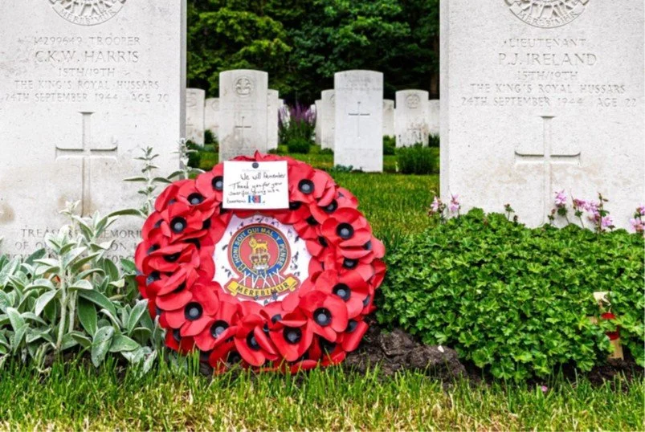

# new-page-4

> Bron: helenaveenvantoen.nl

### Herdenking gesneuvelde bevrijders van Helenaveen

### op 20 november 2025

Vorig jaar hebben we op de erebegraafplaats te Mierlo een indrukwekkende bloemenhulde gebracht aan de Britse jongens die hun leven hebben gegeven voor de bevrijding van Helenaveen. Dat was bij gelegenheid van de 75e herdenking.

Op 20 november a.s. gaan we dat weer doen.

Tijd: 14:00 uur Locatie: Geldropseweg 68, 5731 AD Mierlo

Iedereen die ons wil vergezellen tijdens deze herdenking is van harte welkom.Mocht u geen eigen vervoer hebben, stuur even een berichtje naar: info@helenaveenvantoen.nlEen van de chauffeurs uit Helenaveen neemt dan contact op met u.Mvg,Gerard Veldhuizennamens Het Helenaveen van Toen
