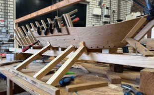
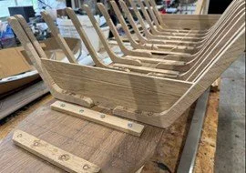

# new-page

> Bron: helenaveenvantoen.nl

Van droom naar werkelijkheid: de bouw van “Janske Pardoel”

Wat begon met een idee, groeide uit tot een plan, en nu zetten we echte stappen! In september 2023 startten we met onderzoek en zochten samenwerking om kennis te vergaren. Zo ben ik samen met Huub aan de slag gegaan. We maakte schetsen, kartonnen modellen, mallen en … begonnen met bouwen. Elke week een stapje verder. Dit resulteerde al doende en lerende, begin 2025 in ons onderstaande 1:5 schaal- en leermodel 😊.

Een spannend moment: we presenteerden het model aan de werfeigenaren uit Giethoorn, en hun enthousiaste ontvangst was een prachtig compliment—een bevestiging dat we op de goede weg zijn. Bij de koffie en een meegenomen Peelneutje kwamen de verhalen van vroeger al snel weer op tafel. “Wij hebben deze zelf nooit gebouwd, maar onze grootvaders…..”

Met deze positieve bevestiging, de bijzondere verhalen en nog enkele tips konden wij verder. Met ons uitgewerkte bouw- en materialenplan in de hand gingen we op zoek naar houtleveranciers. Die vonden we lokaal, een stap die het project nóg specialer maakt.

Een mijlpaal: de echte bouw is begonnen! Op 30 mei 2025 zijn we gestart met de bouw van Janske Pardoel, een echte “kleine bok” van 7,5 meter lang en bijna 2 meter breed. En zoals het hoort: authentiek gebouwd van eiken en douglas, zonder schroeven en zonder lijm, helemaal volgens de traditionele ambachtelijke technieken zoals deze ook in 1850 gebruikt werden.

Volg onze reis! Nu komt het echte werk. We beginnen met het uitzagen van de 42 korven—de ribben van de bok—die straks met houten deuvels stevig verbonden worden met het vlak, de platte bodem. Het meest uitdagende deel? Het buigen en torderen van de wangen, de wanden van de bok, in precies de juiste vorm. Dit gebeurt op ambachtelijke wijze: door middel van verhitting en branding.

De weg is lang en kent zeker nog vele uitdagingen, maar elke stap brengt ons dichter bij het einddoel. We werken meestal op vrijdag en delen regelmatig updates, dus blijf ons volgen en beleef deze bijzondere reis met ons mee!

Ondertussen puzzelen en bouwen wij in onze vrije tijd door.

Met vriendelijke groet,Hans van Neerven & Huub Kleintjes
