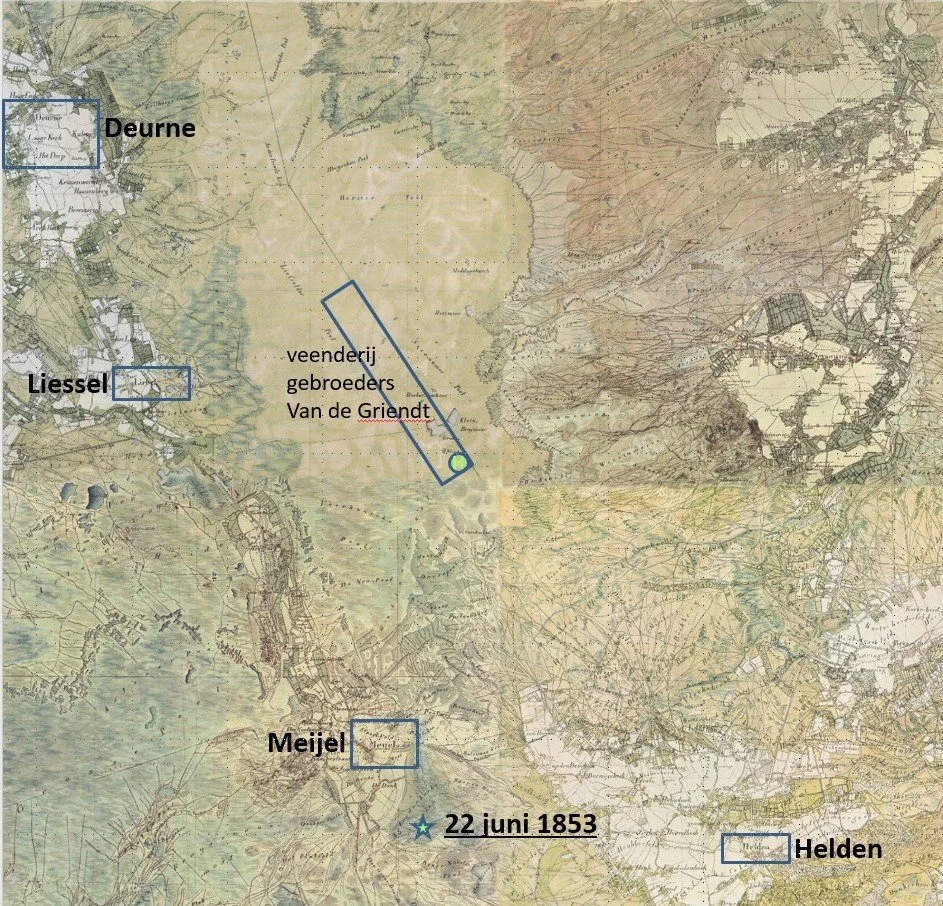
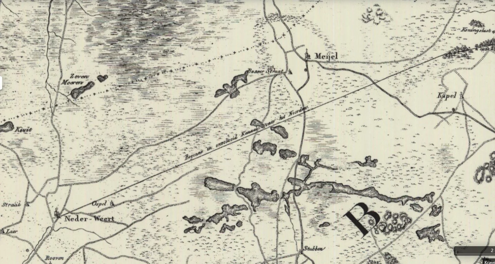
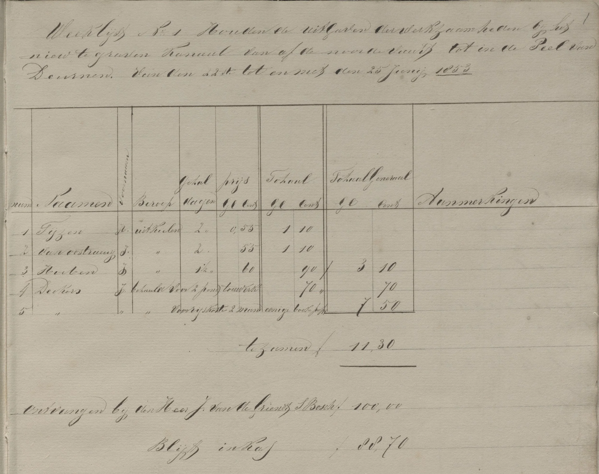
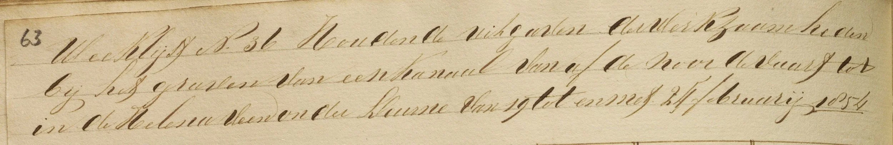
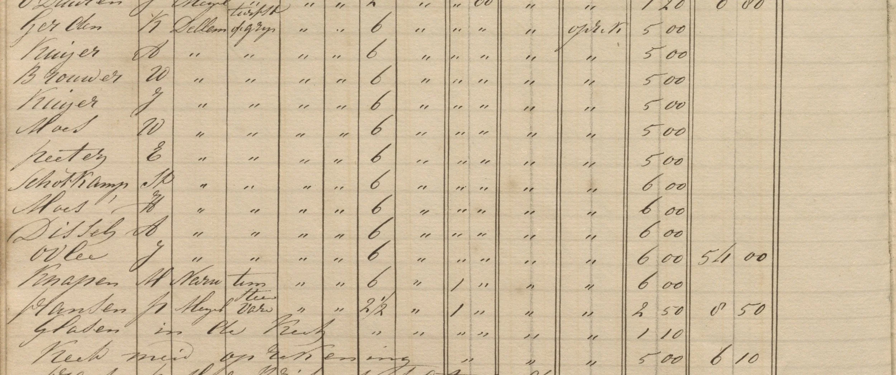
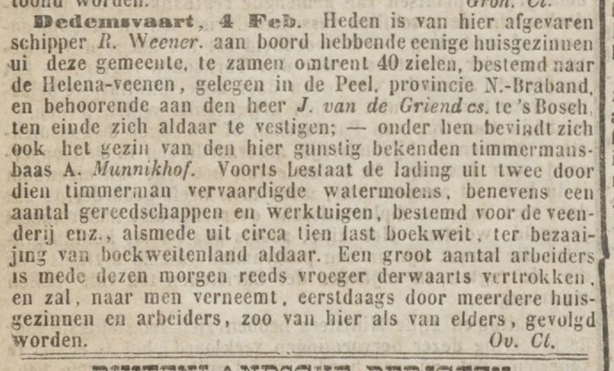
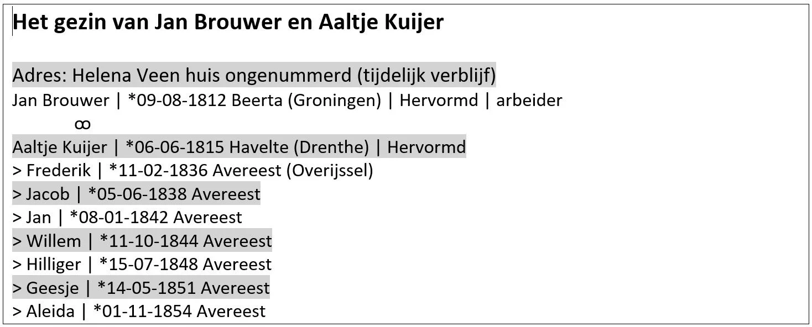
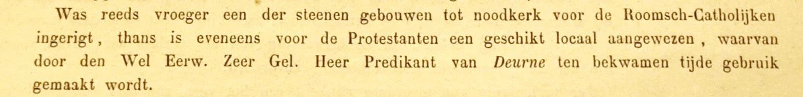
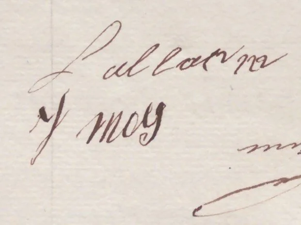

# ontstaan-helenaveen

> Bron: helenaveenvantoen.nl

## HELENAVEEN ONTSTAAT

Hans van de Laarschot (uitwerking van zijn lezingen op 17 en 26 april 2023 te Helenaveen)

Met een vaart naar het midden van het Peelmoeras

In 1852 lukte het de broers Jan en Nicolaas van de Griendt uit ’s-Hertogenbosch om eindelijk 610 hectare Peel van de gemeente Deurne te kopen om een veenderij te kunnen exploiteren. Hetgeen Deurne wilde verkopen lag in de zuidoosthoek van de gemeente tegen de grens met Limburg. Dat was midden in het Peelmoeras met geen enkele verbinding naar buiten het gebied (afb. 1).

1. De ligging van de veenderij van Jan en Nicolaas van de Griendt in de Peel van Deurne tegen de grens met Limburg, geprojecteerd op de Tranchotkaart (ca. 1807).

Om de turven de Peel uit te krijgen – onder meer naar ’s-Hertogenbosch – was een nieuwe waterweg nodig. De Zuid-Willemsvaart was een kleine 30 jaar eerder gegraven en werd druk bevaren. Bij Nederweert kon richting Meijel en de Peel gevaren worden via het Kanaal van het Noorden (nu Noordervaart). Op initiatief van Napoleon was het graven van het Canal du Nord begonnen maar niet afgerond (zie afb. 2). Voor de plannen van de Van de Griendts moest dat kanaal bevaarbaar worden gemaakt. Hun verzoek daarvoor viel in goede aarde. Ter hoogte van Meijel zouden de broers een nieuwe vaart graven naar hun veenderij in de Peel van Deurne. De eerste werkweek daarvan startte op 22 juni 1853 (ster op afb. 1).

2. Het ‘Begonne en onvoltooid Kanaal van het Noorden’ van Nederweert (linksonder) richting Koningslust (rechtsboven), een onmisbare schakel in de plannen van Jan en Nicolaas van de Griendt. (www.topotijdreis.nl 1847)

‘De Helena Veen’ bereikt

Jan Deckers, die al meer voor Jan van de Griendt had gewerkt, was de baas van de Peelonderneming. Hij kwam uit de buurt van ’s-Hertogenbosch en ging in logies bij burgemeester Van der Steen in Meijel. Jan van de Griendt was in en vanuit zijn woonplaats ’s-Hertogenbosch de directeur van de veenderij in de Peel. Beiden zorgden voor werkers, in eerste instantie kanaalgravers. Op woensdag 22 juni 1853 stond Jan Deckers met drie ‘uitkielers’ aan de Noordervaart op de plek waar de nieuwe vaart moet beginnen. N. Tijzen, J. van Oostrumy en J. Hoeben zetten in 2 dagen het eerste deel van het tracé van het kanaal uit, ofwel ze kielen het uit.

Jan Deckers houdt vanaf de eerste werkdag consciëntieus de boekhouding bij om de uitgaven te kunnen verantwoorden aan Jan van de Griendt, van wie hij wekelijks een budget in contanten krijgt. Een van de boeken is die van de weeklijsten. Hierin noteert Deckers en al snel een klerk wie in een bepaalde week gewerkt heeft, waar die kanaalwerker of turfstekers vandaan komt, wat zijn productie is en wat hij daarvoor krijgt. Boven elke lijst schrijft hij, met als voorbeeld de eerste weeklijst: “Weeklijst no. 1 houdende uitgaven der werkzaamheden bij het niew te graven kanaal vanaf de Noordervaart tot in de Peel van Deurne …” (afb. 3).

3. Weeklijst 1 van 22 tot en met 25 juni 1853. (Archief Maatschappij Helenaveen, inv.nr. 453 | scan RHCe)

In de tweede week wordt er echt gegraven. Er zijn dan al tientallen Peelwerkers bezig. De gravers graven in ploegen onder aanvoering van een ‘putbaas’. De uitgegraven grond wordt door kruiers afgevoerd voor de dijken, ook in ploegverband met voorop een ‘stortbaas’.

Tabel 1. Herkomst van de put- en stortbazen in de 2e werkweek, zijnde de 1e graafweek, van 27 juni tot en met 2 juli 1853 bij de Noordervaart in Meijel.

In de weeklijsten worden enkel de put- en stortbazen vermeld en helaas niet hun gravers en kruiers. Aannemelijk is, dat dat familieleden, buren en plaatsgenoten zijn. De Peelwerkers van de eerste weken, komen allemaal uit Noord-Brabant en Limburg, met de meesten uit Meijel (tabel 1). Ook uit de directe omgeving van Jan van de Griendt komen ze. Zij hebben met name ervaring in waterwerken, die ze hebben opgedaan bij eerdere projecten van Van de Griendt.

De eerste kilometers van het nieuwe kanaal gaan over het grondgebied van Meijel om met een knik in het tracé aan te komen op het grondgebied van Deurne. Daar liggen 10 van de van Deurne gekochte 610 hectare. Die zijn nodig om de vaart door te trekken in oostelijke richting naar de eigenlijke veenderij, 600 hectare groot ofwel 1 kilometer breed en 6 kilometer lang.

4. “Weeklijst n. 36 houdende uitgaven der werkzaamheden bij het graven van een kanaal vanaf de Noordevaart tot in de Helena Veen onder Deurne van 19 tot en met 24 februari 1854.” (AMH, inv.nr. 453 | scan RHCe)

In de 36ste werkweek van 19 tot en met 24 februari 1854 bereikten Jan Deckers en zijn kanaalgravers de veenderij en kwam boven de weeklijst voor de eerste keer de naam Helenaveen te staan: … vanaf de Noordevaart tot in de Helena Veen onder Deurne … (afb. 4). Inmiddels wordt dan ook al turf gestoken en naar de droogvelden gekruid. Het aantal Peelwerkers is in die 36 weken gegroeid. De herkomst is met name toegenomen uit Noord-Brabant en ook al geruime tijd is putbaas Kalskma uit het Friese Workum in de Peel aan het werk (tabel 2).

Tabel 2. Herkomst van de put- en stortbazen en geulwerkers in de 36e werkweek, zijnde de 35e graafweek, van 19-24 februari 1854.

De kaartenmakers van de Topografische Dienst hadden de ontwikkelingen in de Deurnsche Peel al snel in de gaten. Op hun kaarten van rond 1854 staat de “Helena of Peel Vaart” afgebeeld binnen de grenzen van Deurne en tot aan de “toegestane veenderij” (afb. 5).

5. Fragment van de topografische kaart met de “Helena of Peel Vaart”, die dan gegraven is tot aan de toekomstige veenderij en de plaats waar het dorp Helenaveen zal ontstaan. Links de originele kaart, rechts hetzelfde fragment verduidelijkt. (www.topotijdreis.nl 1854)

Meters dik veen

Bij het graven van de vaart in 1853 langs de Limburgse grens binnen Deurne tot aan de toekomstige veenderij kon ook al zwartveen gewonnen worden. Dat was niet van de allerbeste kwaliteit. Ingenieur J. de Kruijf van Waterstaat meldt dat 1.500 ton turf van de 2e klasse en 50.000 ton van de 3e klasse door de gebroeders Van de Griendt in 1853 in Deurne zijn gewonnen.

Hadden de Van de Griendts enig idee van de hoeveelheid veen die er in hun concessiegebied zat? Jawel. Ze hadden de ingenieurs van Waterstaat allerlei onderzoeken laten doen, zoals de mogelijkheid om de Noordervaart bevaarbaar te krijgen, een waterpassing van de Helenavaart vanaf de Noordervaart naar de Deurnsche Peel én boringen naar de veendiktes in de toekomstige veenderij (afb. 6, 7, 8 en 9).

6. Boorprofielen in en om de toekomstige veenderij van de gebroeders Van de Griendt in de Deurnsche Peel, ca. 1852. (Archief Rijkswaterstaat, BHIC 262, invnr 87, rubriek 223).

7. Een verduidelijking van de boorprofielen

De medewerkers van Rijkswaterstaat die de boringen in de toekomstige veenderij op verzoek van de gebroeders Van de Griendt hebben uitgevoerd, namen de grens Noord-Brabant – Limburg en het grenspunt Eyndepaal als uitgangspunten. Die gaven hen in die woeste en lege Peel houvast. De eerste boorlijn (‘profil no. 1’) lag op 600 meter (toen aangeduide met de maat ‘el’). Die lijn lag ter hoogte waar later de 1e wijk en de Kruisbesweg zijn gekomen. In noordelijke richting zijn de volgende 13 boorlijnen uitgezet, met een tussenafstand van 300 meter. ‘Profil 14’ ligt zo op 4½ kilometer van het 0-punt, de Eyndepaal. Dat is nu ter hoogte van de Emma-Hoeve en Willem III Hoeve. Dat betekent, dat het noordelijke deel van 1½ kilometer van het concessiegebied niet onderzocht is.

8. De boorpunten op de provinciegrens geprojecteerd op het kaartje van het concessiegebied van Helenaveen uit de prospectus voor werving van aandeelhouders voor de N.V. Maatschappij Helenaveen in 1857. 1 is ter hoogte van de 1e Wijk / Kruisbesweg; 14 ter hoogte van de Emma-Hoeve.

De boorlijnen 1 tot en met 6 kennen een lengte van 1 kilometer met elk vier boorpunten, de boorlijnen 9 tot en met 14 zijn 1400 meter lang met elk vijf boorpunten. Die laatste gaan daarmee over de toekomstige breedte van 1 kilometer van het concessiegebied heen. De afwijking in de lengte van de boorlijnen komt door de aanwezigheid van de ‘zandschel’. Die zandrug lag in de richting zuid-noord op ongeveer 1 kilometer van de provinciegrens en zal niet overgroeid zijn geweest door het veen. Tussen die zandrug en de provinciegrens is in 1854 de eerste woonkern van Helenaveen verrezen. Op de lijnen 7 en 8 kon geen boring op de provinciegrens gezet worden, omdat daar het Soemeer lag. Grappig is, dat de ingenieur van Waterstaat de naam heeft opgeschreven in beschaafd Nederlands (die Peellanders toch!) en daarbij dacht dat ‘Soe’ staat voor ‘Zoete’. Zijn ‘Zoete Meer’ reikte tot 500 meter van de provinciegrens en was een onrendabel deel van de toekomstige veenderij.

De profielen laten vier bodemlagen zien. Uit het oogpunt van ontstaan zijn dat van onder naar boven de ondergrond, de ‘zwarte turf of klot’, de ‘vale turf’ of ‘vale moer’ en de bovengrond. De ‘zwarte’ is bij sommige boorpunten (profielen 9-12) gekwalificeerd als ‘zwaar’, ‘ligte klot’ en ‘minder goed’.

De veenderij zou de eerste 30 jaar gericht zijn op het zwartveen, want de vale (het grauwveen) was niet geschikt als brandstof. Turfstrooisel, met als grondstof het grauwveen, moest toen nog uitgevonden worden. De ondergrond is ook niet overal hetzelfde. De ene keer is bij het boren ‘grondspetie’ aangetroffen, andere keren ‘zand’ of ‘grof zand’. De lijnen van de ondergrond laten mooi zien dat het Peelveen niet op een vlakke bodem is ontstaan. Bij zandhoogtes is de zwartveenlaag minder dik dan in laagtes. Bij profiel 2 schrijft de ingenieur dat op basis van de boorresultaten daar vermoedelijk 72 hectare (‘bunder’) geen klot bevat en bij de profielen 10 en 11 geldt dat voor 1 hectare.

Komen we in deze boorprofielen veendiktes tegen van zes of zeven meter, zoals vaak beweerd wordt dat het Peelveen zo dik was?

9. Profiel 12 met het dikste veen, de zwarte en de vale samen 5 meter en 55 centimeter.

Nee, door de golvende ondergrond zijn de veendiktes overal verschillend. Boorprofiel 12 heeft een boorpunt met het dikste veen, iets meer dan 5½ meter en met de bovengrond samen 5 meter en 70 centimeter. Daar zat 3 meter en 20 centimeter zwarte en 2 meter en 35 centimeter vale; tezamen 5 meter en 55 centimeter. Helaas voor de gebroeders Van de Griendt lag dat boorpunt net buiten het toekomstige concessiegebied. De boorlijn was daar 1400 meter lang en de veenderij zou een breedte hebben van 1000 meter. Mogelijk is door Van de Griendt bij de voorbereiding van de aankoop van het Deurnese veengebied uitgegaan van een lengte van 4½ kilometer en een breedte van ongeveer 1400 meter, wat ook een oppervlakte betekent van ruim 600 hectare. Het uiteindelijke concessiegebied had een lengte van 6 kilometer, wat in het voordeel was van de gemeente Deurne. Als verkoper had die als voorwaarde gesteld, dat de vaart zo dicht mogelijk op de grens gegraven moest worden. Dit om illegaal turfsteken vanuit de Limburgse kant, wat veel voorkwam, tegen te gaan. De toekomstige vaart zou die belemmering met 1½ kilometer verlengen.

(N.B. Het turfsteken in de veenderij van het Helena Veen zal in een ander verhaal op de website beschreven worden.)

Het Helena Veen raakt bevolkt

In de week van 19 februari 1854 wordt voor de eerste keer de naam Helenaveen gebruikt: “… het graven van een kanaal vanaf de Noordervaart tot in de Helena Veen onder Deurne”. Ze zijn in de veenderij. De houten keten, die met het vorderen van het graven van de vaart ook mee opschoven vanaf de Noordervaart richting het Helena Veen, worden daar weer opgebouwd voor permanente bewoning en onderkomen van de tijdelijke Peelwerkers. In de weeklijsten is soms sprake van de ‘Vriese keet’, waarmee waarschijnlijk het onderkomen van de ploeg van Kalksma uit het Friese Workum wordt aangeduid. Naast het verder graven van het kanaal wordt:

- turf weggegraven om een stevige ondergrond te hebben voor de te bouwen boerderijen, huizen en onderkomens van de pendelaars;

- de na millennia aan het daglicht gekomen zandgrond bemest voor het verbouwen van boekweit en aardappelen en het planten van fruitbomen.

In april 1854 wordt het een echt bouwdorp. De timmerlui Kuipers uit Nederweert en Pieters uit Helden bouwen meerdere keten van de aangevoerde planken, sparren en latten en ook een metselaar, Franken uit Meijel, heeft er werk aan. In de wanden komt ook glas. Van plaggenhutten is absoluut geen sprake. Het ‘strooien dorp’ krijgt vorm. Volop stro wordt aangeleverd om onder meer de daken van de keten te bedekken. In de laatste week van april 1854 leveren als voorbeeld H. Jansen 400 kg ‘strooij’, P. Sanders 2100 pond, Grijfraad 850 pond, Verstappen 1100 pond en Van der Weerde 1750 pond. De leveranciers komen allen uit Meijel, want Helenaveen is het makkelijkst te bereiken vanuit de zuidkant via de weg langs de Helenavaart. Een weg van Helenaveen naar Liessel en Deurne was er nog niet. Voor de inrichting levert J. Smits uit Helden meerdere keren een ‘keet-ameublement’ en die komen ook van andere leveranciers. C. v.d. Berg, die bij de Roggelse brug woont, zorgt voor ‘een klok in de keet’.

Binnen enkele maanden is een dorp uit het moeras verrezen, bevolkt door honderden Peelwerkers; een aantal met hun gezin. Voor het werkvolk zonder vrouw en gezin trekt het bedrijf ‘keetvrouwen’ aan. Voor een langere periode is dat Trui den Doop ( gedoopt 1796), een ‘mutsenwaschter’ uit Helmond. Ze verdient 65 cent per dag. Een brand treft In de laatste week van mei 1854 het jonge dorp. Keten branden af. De inboedel gaat verloren. Linden levert voor de getroffen werklieden nieuwe kleren. Smits sloopt de afgebrande keten. Mogelijk is ook een aak in de vaart in vlammen opgegaan. Timmerman Kuipers breekt die eind juni 1854 af.

Hendrik Janssen, de eerste Helenavener

Met ingang van 1850 moest elke gemeente in Nederland een bevolkingsregister bijhouden. Het zou dus een makkie moeten zijn om de eerste bewoners van Helenaveen te achterhalen. Jammergenoeg staan in het eerste bevolkingsregister van Deurne over de jaren 1850-1860 van Helenaveen alleen maar de bewoners van de twee eerste boerderijwoningen. De Peelwerkers die zich al in die periode in het Veen vestigden staan er niet in. Uit andere bronnen, zoals de weeklijsten en huurrregisters in het archief van de Maatschappij Helenaveen is een reconstructie te maken, zij het met gebreken.

De werkketen volgden de vorderingen van het graven van de Helenavaart. Als in februari 1854 de veenderij bereikt is en daar keten verrijzen worden het ook woonketen. Hendrik Janssen geniet het vertrouwen van baas Jan Deckers en hij is de eerste die permanent in het Helena Veen gaat wonen. Omdat dat niet geregistreerd is in het bevolkingsregister, is niet duidelijk of zijn vrouw en kinderen vanaf het begin ook al daar woonden. In de week van 27 maart 1854 staat in de weeklijsten bij zijn woonplaats ‘op het werk’. En vanaf 1 mei Helenaveen of andere varianten in verband met de schrijfruimte als ‘Heleveen’, ‘Helveen’ en ‘Hveen’. Andere ‘vaste’ arbeiders volgen pas later het voorbeeld van Hendrik om met hun gezinnen in het Veen te gaan wonen. Je zou verwachten, dat Jan Deckers als vaste kracht van Van de Griendt en belast met de dagelijkse leiding de eerste bewoner in de prille veenkolonie wordt en niet een Peelwerker, waarvan niet zeker is dat hij de volgende dag nog op het werk komt. Zo’n keet is voor Deckers vanzelfsprekend niet gepast. Voor hem en zijn vrouw zal een riante stenen woning worden gebouwd. Tot die klaar is in 1855 verblijft hij in het logement van burgemeester Van der Steen in Meijel.

Op Hendrik Janssen kan Deckers vertrouwen. Hendrik is al in week twee mee gaan graven aan de vaart. Hij is dan 31 jaar oud. Van 27 juni tot en met 2 juli 1853 staat hij paraat met twee werkploegen, waarvan hij de putbaas is. Hun gezamenlijke verdienste is die week 27 gulden. Mogelijk dat Hendrik en zijn maten zich bij Jan Deckers gemeld hebben na van de veldwachter gehoord te hebben dat er voor jaren goed betaald werk in de Peel arbeiders gezocht werden. Jan Deckers had dat de veldwachter laten ‘rondpublizeren’. Die kreeg er een gulden voor. Maar het kan zo maar zijn, dat Hendrik door zijn vader is aangespoord. Die was landmeter en mogelijk als zodanig betrokken bij de projecten van Van de Griendt om de Noordervaart van Nederweert tot Beringe bevaarbaar te maken en om de Peelvaart naar het Helena Veen te graven.

Het bevalt Hendrik Janssen goed en hij is continu met zijn maten aan het werk voor Van de Griendt. Van Jan Deckers krijgt hij ook andere taken, zoals het ‘vulle der turfkistjes’. Hij levert stro voor de keten en voor het afdekken van de turfmijten. En regelmatig kunnen de arbeiders een borrel jenever achterover slaan, die op kosten van de onderneming door Hendrik Janssen geleverd is. Geen wonder, dat we hem later in het bevolkingsregister (1860-1884) van Deurne tegenkomen als tapper in Helenaveen. Voor zijn brede inzet is Hendrik ook de eerste arbeider, die – naast baas Jan Deckers, enkele onderbazen en kantoorpersoneel – een vast weekloon krijgt van 7½ gulden. Dat kan hij vermeerderen met bijzondere klusjes en leveringen van stro, drank en keetbehoeften. Bij anderen blijft het bij prestatieloon; per dag of productie.

Hendrik Janssen is op 16 februari 1822 in Meijel geboren, maar als Van de Griendt met zijn onderneming in de Heitraksche Peel in 1853 start woont hij al jaren in Deurne. Volgens de tienjaarlijkse volkstelling van 1839 woont Hendrik als 17-jarige bij zijn zus Maria en haar man Hendrik Nijssen in Neerkant op de Moosdijk. Beiden zijn, net als Hendrik, geboren in Meijel. Zijn vrouw, Hendrina Manders is een Deurnese. Op 22 januari 1850 trouwen Hendrik en Hendrina in Helden. Hendrina verbleef daar toen, omdat ze er werkte als dienstmeid. Vijf dagen later is het weer feest, wanneer de jonge echtgenote haar 22ste verjaardag viert. Het echtpaar gaat wonen bij de ouderlijke woning op de Schans in Deurne dicht tegen de grens met Meijel. Hun eerste drie kinderen zijn daar buiten de Peel geboren. De volgende zien het levenslicht in het Helena Veen. Als in 1858 de eerste stenen woningen aan de Helenavaart in het Helena Veen gebouwd zijn, verwisselt Hendrik zijn woonkeet tegen de stenen woning met het nummer ‘2’.

Bronnen: Burgerlijke stand en bevolkingsregisters Deurne | Heemkundekring H.N. Ouwerling DocuDataDeurne.

Als eerste echte inwoner van Helenaveen verdient Hendrik een naar hem genoemde straat; wel met de juiste weergave van zijn achternaam. Onder-directeur Jan Deckers heeft in Helenaveen al een straatnaam; terecht. Bij het maken van het straatnaambord is het niet helemaal goed gegaan; Jan Decker in plaats van Jan Deckers.

De eerste stenen woning is voor Jan Deckers

Jan van de Griendt had aan de Maas een eigen steenfabriek. Via de Zuid-Willemsvaart, Noordervaart en Helenavaart komen de turfschepen terug in het Helena Veen. Niet leeg, maar onder meer met bakstenen. Jan Deckers, de zaakwaarnemer van Jan van de Griendt in het Helena Veen, heeft een woning nodig, die vanzelfsprekend tussen de keten van de arbeiders grootsheid moet uitstralen. Het wordt een hoog huis. Vermoedelijk is het rond de jaarwisseling 1854-1855 klaar en kan Deckers van zijn logement in Meijel voorgoed naar het Helena Veen. Op 5 december 1854 betaalt Jan 112 gulden 95 voor het logies over de periode van 30 juli tot de dag van betaling. De meid krijgt van hem een gulden fooi. De dag ervoor hebben Deckers en de burgemeester-pensionhouder nog enkele ‘likeuren’ op het afscheid gedronken; op rekening van de gastheer. Nieuwsgierig naar wat er daar allemaal in die Peel van Deurne, ver af van het dorp, gebeurt, is Deurnenaar Jan Goort Hoeben naar het Helena Veen getrokken om de directie-woning te aanschouwen. In zijn kroniek tekent hij op: “In het jaar 1855 een fraaij huijs gebout met twe verdiepingen”.

De directiewoning van Jan Deckers uit 1855 aan de Helenavaart, nu Helenastraat 14, in 1875.

In het jaarverslag van de NV Maatschappij Helenaveen over 1858 schrijft directeur Jan van de Griendt, dat de door Deckers bewoonde directiewoning verlengd is met een stenen schuur. Die doet dienst als paardenstal en voor het bergen van de voor het bedrijf benodigde materialen. Woning en schuur zijn dat jaar ingeboekt met een waarde van 5.000 gulden.

Uit het jaarverslag van de NV Maatschappij Helenaveen door directeur Jan van de Griendt over 1858.

Jan Deckers is geboren in Empel en komt derhalve uit de regio van Jan van de Griendt. Ze zijn geen vreemden voor elkaar. Directeur Jan in ’s-Hertogenbosch weet dat hij zijn veenderij in de Peel met een gerust hart aan zaakwaarnemer Jan kan overlaten. Bijna dagelijks is er contact via brievenpost en telegrammen. Deckers zorgt voor voldoende arbeiders uit Brabant en Limburg. Hij laat het bijvoorbeeld de veldwachter ‘rondpublizeeren’. Wekelijks groeit het aantal werkers in de Peel van Van de Griendt. En de twee Jannen richten hun blik ook al op de noordelijke veenkoloniën om van daar turfstekers naar het Helena Veen te halen. En niet alleen arbeiders, ook voor de inrichting van de veenderij en de bedrijfsadministratie vinden ze in Drenthe voorbeelden. Jan Deckers en zijn kantoorpersoneel verantwoorden de geldstromen van het bedrijf tot op de halve cent. Jan van de Griendt - op afstand in ’s-Hertogenbosch – wordt hiervan goed op de hoogte gehouden door Deckers en die krijgt wekelijks van Van de Griendt het benodigde voorschot voor de komende week. En dat is altijd voldoende.

In het grote huis verschijnt al snel een vrouw. Op 22 januari 1856 treedt Jan Deckers te Veghel in het huwelijk met Gerardina van den Heuvel. Vier dagen voor kerstmis 1856 ziet dochter Maria Christina Wilhelmina Petronella er het levenslicht. Voor vrouw Deckers zal de natte, moerassige nieuwe woonomgeving niet altijd prettig zijn geweest. Drie van haar zes kinderen overlijden in het Veen enkele maanden na hun geboorte. Zelf overlijdt ze in haar geboorteplaats Veghel op 20 oktober 1862; een kleine zeven jaar na haar komst naar het Helena Veen. Haar andere kinderen van dan 5 en 4 jaar en van 8 maanden ziet ze niet opgroeien.

Bronnen: Burgerlijke stand en bevolkingsregisters Deurne | Heemkundekring H.N. Ouwerling deurnewiki.nl

Jan van de Griendt zorgt voor beroering en volksverhuizing in de noordelijke venen

Jan van de Griendt en Jan Deckers zijn meerdere keren naar de noordelijke venen gereisd om daar hun licht op te steken bij de bedrijfsmatige veenderijen. Nu in 1855 in de Peel met de Helenavaart en het dorp de basis was gelegd voor de veenderij, wilde Van de Griendt ook graag dat Bovenlanders voor hem kwamen werken. Met zijn ronselwerk en betere lonen en toelagen in de Peel zorgde hij voor beroering in de noordelijke venen, waar de veenbazen daar niet gelukkig mee waren. Zij zagen honderden van hun arbeiders naar de Brabantse Peel trekken, met de boot of te voet. Zij kwamen uit de venen rond de Dedemsvaart, zoals uit Avereest in Overijssel. Dit was landelijk nieuws en veel kranten deden er verslag van.

Op 23 april 1855 schrijft een redacteur van de Prov. Drentsche en Asser Courant: “Het is ook te voorzien, dat er dit jaar aan de Dedemsvaart niet zooveel turf als gewoonlijk zal bereid worden, aangezien er schaarsheid aan arbeiders zich ook daar reeds werkelijk doet gevoelen” . Een volksverhuizing is gaande, zoals de Leydsche Courant een week later bericht: “Dezer dagen zijn wederom een 40-tal turfstekers enz. naar N.-Brabant vertrokken, waar hun een daggeld van f 2 à f 3 is beloofd, terwijl aan hunnen achtergebleven vrouwen bij wijze van voorschot f 6 per week zal worden uitbetaald.” De berichtenstroom houdt in mei 1855 aan. In meerdere kranten, zoals in de Groninger Courant is te lezen: “Hardenberg, 22 mei. Sedert eenigen tijd hebben er in deze streken als het ware volksverhuizingen onder de arbeidende klasse plaats gehad. Door het vertrek van zoo velen naar elders, waar zij vermeenen grooter daggeld te zullen verkrijgen, ontstaat er hier algemeen gebrek aan werkvolk. Van de kanaal-maatschappij zijn gisteren nacht een 20tal gedeserteerd, vele schuldeischers nalatende. Aan de Dedemsvaart hebben reeds demonstratiën van onrustwekkenden aard onder de nog tegenwoordig zijnde vreemde turfmakers plaats gevonden. De bazen hebben die echter, door hunne eischen te gemoet te komen en hooger loon toe te kennen, bij tijds gestild.”

De venen rond de grens Overijssel – Drenthe met centraal Avereest aan de Dedemsvaart waar vandaan de volksverhuizing naar de Brabantse Peel plaatsvond. (Topotijdreis.nl, 1855).

Hoe die schaarsheid aan arbeiders is ontstaan maakt een bericht van 27 mei in kranten als De Tijd en de Provinciale Overijsselsche en Zwolsche Courant duidelijk. Van de Griendt haalde de Bovenlanders met hoger loon, kostenloze overtocht naar de Peel, drinkgeld en een tegemoetkoming voor de achterblijvende echtgenoten over om in de Brabantse Peel te komen werken. “Dedemsvaart 27 mei. De schaarschte aan werkvolk doet zich hier al meer en meer gevoelen. De verhuizing naar Noord-Brabant wordt niet alleen bevorderd door den arbeiders van den dag hunner afreize van hier, reeds een ruim daggeld toe te kennen, maar ook door hun vrijen overtogt of eene ruime retributie voor de reiskosten toe te staan. Hierdoor ontstaat een algemeene geest van ontevredenheid, eene ophoudelijke spanning, eene soort van gisting onder de hier arbeidende buitenlanders, welke, naar het ons voorkomt door de toegevendheid en mildheid der bazen, eerder wordt aangewakkerd dan gedempt. Enkele ploegen (8 a 10 man) ontvingen bij de aanvaarding van hunnen arbeid f 50 handgeld en elk f 1 per week als drinkgeld, boven de reeds waarlijk hooge daghuur. Dat dit desertie onder de arbeiders verwekt en van buitengewonen invloed op den prijs van den turf is, laat zich denken. Dit product is hier dan ook reeds ruim 30 pCt. In prijs verhoogd.” De hogere prijs voor turf zou ook doorwerken in de Peelturf en daarom kon Jan van de Griendt de hogere personeelskosten opvangen.

Met de boot door de Dedemsvaart en uiteindelijk de Helenavaart van de Overijsselse venen naar de Brabantse Peel.

Wie zijn die Bovenlanders die Helenaveners worden?

De Dedemsvaarters in weeklijst 92 van 19 tot en met 25 maart 1855.

In tegenstelling tot de Duitse ‘Poepen’, die in 1856 vanuit de streek rondom Hannover jaarlijks naar het Helena Veen kwamen, zijn de veenarbeiders uit ‘de Dedemsvaart’ wel in de weeklijsten van de veenderij vastgelegd. In de 92e werkweek van 19 tot en met 25 maart 1855 zijn de eerste tien genoteerd. Het zijn H. en J. Kuijer, E. Peeters, A. Dissel, S. Schotskamp, W. Brouwer, K. Gerdem, W. en H. Moes en J. O[m]vlee. Elk krijgt die week 5 gulden voor de 6 dagen “vanaf Dellen”. Met Dellen is de Dedemsvaart bij Avereest bedoeld. Vanzelfsprekend woonden ze in de in het Helena Veen gebouwde keten. In hun tweede week worden ze ingezet bij het turfsteken en ‘opgrippen’ in de veenderij tegen het overeengekomen weekloon van 5 gulden. In weeklijst 93 komen we dezelfde ‘Dellemers’ tegen; bij een enkeling is de naam iets aangepast, want de klerk schreef de namen op het gehoor op.

De Dedemsvaarters in weeklijst 93 van 26 tot en met 31 maart 1855.

Zoals de kranten berichtten, bleef de volksverhuizing vanuit Overijssel naar de Brabantse Peel in gang. In de week van 28 mei 1855 zijn vier ploegen uit Dedemsvaart aan het turfgraven in het Helena Veen. Twee van 7 man, één van 8 en één van 10, de tien die al vanaf maart in het Veen verblijven. Hun kruier komt uit Brabant, namelijk G. van Drune uit Vlijmen, H. Peinenburg uit Eindhoven, G. Korte uit Budel en Duitsman uit Geldrop. De 20 nieuwkomers zijn de nachtelijke ‘deserteurs’ van 21 mei. In de weeklijsten staat nu duidelijk dat ze afkomstig zijn uit Dedemsvaart (‘Dedvt.’) in plaats van uit Dellen of Dellem.

Die van ploeg 1 verdienen in die 102de werkweek elk fl. 6,43, met uitzondering van Mulder. Hij krijgt fl. 9,98; een weekgeld van 6 gulden plus fl. 3,98 in tegenstelling tot de anderen die maar 43 cent boven op hun weekloon krijgen. Hun kruier uit Vlijmen gaat die week met 12 gulden naar huis.

De turfgravers van ploeg 2 krijgen ieder fl. 5,43; een weekgeld van 5 gulden plus 43 cent. Ook bij hen een uitzondering in de persoon van Romper, die in totaal fl. 6,00 krijgt; fl. 2,29 plus fl. 3,71. Hun Eindhovens kruier ontvangt voor zijn inzet 6 gulden.

Misschien hebben de turfgravers van ploeg 3 slechts een halve werkweek gehad, alhoewel ze volgens de registratie evenveel kuub turven hebben gestoken als ploeg 2. Ieder krijgt fl. 5,14; een weekloon van 3 gulden plus fl. 2,14. De verdienste van Knik is fl. 7,12; 3 gulden plus fl. 4,12. Hun Budelse kruier krijgt 12 gulden.

De productie van de Dedemvaarters die al enkele maanden in het Helena Veen zijn is minder dan die van de andere ploegen. Twee van hen zijn die week niet actief met turfsteken en twee maar een halve week. Vandaar dat de weektotalen van elkaar verschillen. Minder kruiwerk ook, wat resulteert in een verdienste van 5 gulden voor Duitsman.

Andere Dedemsvaarters, onder wie zonen van de turfstekers, worden ingezet bij het turfdrogen en bij het lossen van stenen van de steenbakkerij van de Griendt uit de boot die uit Den Bosch via de Helenavaart tot in het Helena Veen is doorgedrongen. De volgende dagen laden ze dezelfde boot vol met Peelturven, die zijn weg terug zal gaan naar de steenbakkerij om later weer in het Veen terug te keren vol met stenen. Er worden steeds meer stenen woningen gebouwd in het Helena Veen.

Artikel in de Prov. Overijsselsche en Zwolsche Courant van 9 februari 1856.

Het lokken van arbeiders door Jan van de Griendt uit de veenderijen rond de Dedemsvaart naar de Peel gaat gewoon door. De Prov. Overijsselsche en Zwolsche Courant van 9 februari 1856 bericht, dat op 4 februari een boot van schipper R. Weener naar de “Helena-veenen” vanaf Dedemsvaart is uitgevaren. Aan boord enkele gezinnen; samen rond de 40 personen. Een speciale vermelding krijgt timmerman A. Munnikhof, officieel volgens de burgerlijke stand Johann Albert Münninghoff. Naast vrouw en kinderen neemt hij twee houten watermolens mee. Of dat op eigen initiatief is of in opdracht van de Griendt? Duidelijk is dat de tonmolens welkom zijn in de Peel, want in de jonge veenderij moet flink ontwaterd worden. Jan van de Griendt wil ook snel beginnen met het verbouwen van veenboekweit. De boekweitbrandcultuur wordt in de noordelijke venen al lang toegepast. Dat moet in de Peel ook kunnen en voor een ondernemer als Jan van de Griendt is het een extra verdienbron. Op de boot daarom ook “tien last boekweit, ter bezaaiing van boekweitenland aldaar”. Dat “boekweitenland” is niet de zandgrond, waarop de Peellanders gewoon zijn zandboekweit te verbouwen. Het gaat met name om de veengronden, die Jan van de Griendt pacht van Limburgse gemeenten (zie afb.).

De veenboekweitvelden en -magazijnen van Van de Griendt in het Mariaveen en de Horster Driehoek. Topografische kaart, ca. 1860.

Voordat hun boot afvoer waren ’s morgens al meer dan 160 veenarbeiders uit Dedemsvaart te voet naar de Peel gegaan, via Deventer, Arnhem en Nijmegen. En de journalist van de Prov. Overijsselsche en Zwolsche Courant wist, dat er nog meer zouden gaan.

Het tweede stenen huis: van woning en gebedshuis voor protestanten tot eerste katholieke kerk

Deurnenaar Goort Jan Hoeben blijft een kijkje nemen in het groeiende Helena Veen. In zijn kroniek schrijft hij: “In het jaar 1856 al wederom een huijs gebout, geschikt om een boeren woning voor te gebruijken”. Ook dit stenen huis ligt vanzelfsprekend aan de Helenavaart en wel aan de oostkant (nu Fruitweg). Het is gebouwd als een boerderij, maar in eerste instantie plaatst Jan Deckers er een gezin uit Overijssel in. Jan Brouwer en zijn vrouw Aaltje Kuijer met hun zeven kinderen wonen er tijdelijk in. Ze hebben vanaf mei 1855 tot in 1856 in een van de keten in het Helena Veen gewoond. Vader Jan is in mei 1855 aangenomen als veenbaas en zal in die hoedanigheid zijn kennis van en ervaringen uit de noordelijke veenderijen in de eerste veenderij in de Peel hebben overgebracht aan Jan Deckers. De oudste zonen Frederik, Jacob, Jan en Willem werken ook in de veenderij.

Bronnen: Bevolkingsregister Deurne 1850-1860; Burgerlijke Stand Beerta.

Jan Brouwer en zijn gezinsleden behoren tot de Hervormde kerk, evenals de andere uit Overijssel naar het Helena Veen gekomen veenwerkers. Enkelen wonen regelmatig de zondagsdiensten van dominee Breunissen Troost in Deurne bij. Hij wil zich wel over de protestanten in het jonge dorp ontfermen en met een Deurnese ouderling gaat hij “naar de Helena Veenen om naar het aantal en de toestand der Herv. inwoners dier colonie opzettelijk onderzoek te doen”. In zijn rapport kan hij melden aan het Classicaal Bestuur van Kempen- en Peelland, dat midden 1856 50 hervormden in het Helena Veen verblijven; niet allen lidmaat. Het gaat om vijf gezinnen, tezamen 29 personen. Zij zijn van plan om in de Peel te blijven wonen. Verwacht wordt, dat “van de overige eenlopende personen velen tegen den winter deze streken zullen verlaten”. Hieruit blijkt, dat veel van de honderden die in 1855 van de Dedemsvaart naar de Peel zijn gekomen, hun weg terug al hebben genomen.

De dominee pleit voor een mogelijkheid voor de dorpelingen om de zondagse godsdienstoefening en godsdienstonderwijs in het Helena Veen bij te wonen. Hij schetst dat het met name voor vrouwen en jonge kinderen ondoenlijk is om ’s zondags naar de Hervormde kerken in Deurne en Asten te gaan. Die zijn “op ongeveer 3 uren afstands van de Helena Veenen gelegen en men is, bij het minste regenachtige weder, dat het voetpad door de moerassige heide onbruikbaar maakt, genoodzaakt nog een omweg van ruim een uur te gaan maken”. Het is nog te vroeg en onzeker voor een eigen zelfstandige Hervormde gemeente in de Peel, maar de hervormden hoeven op zondag 13 juli 1856 de barre tocht naar Deurne of Asten niet te ondernemen. Dominee Breunissen Troost predikt die dag voor de eerste keer in het Helena Veen en wel in het huis van Jan Brouwer. Helaas blijft het bij die ene keer, want Brouwer wil de dominee niet langer in zijn huis ontvangen. De familie Brouwer en andere Bovenlanders gaan niet lang daarna terug naar Overijssel. De dominee vermoedde, dat angst voor overlast van de katholieke Helenaveners, groter in aantal dan de 50 hervormden, de reden was. Hij vond die angst niet terecht. Na het afreizen van Brouwer is het achterhuis “tot eene voorlopige R.K. kerk ingerigt en zijne woning door eenen geestelijke van die belijdenis betrokken, die sedert op den duur onder de R.K. bevolking der kolonie werkzaam blijft”. Goort Hoeben is in zijn kroniek hierover iets specifieker. Hij schrijft: “In het jaar 1857 is de stal van dat voorzijde huijs tot een kerk gemaakt en voor de eerste keer dienst of Mis gedaan den 16 October door eenen priester die daar is komen woonen als proost of rector …”. Jarenlang zal het gebouw gebruikt worden voor de katholieke erediensten. Op het ontgonnen erf aan de achterzijde wordt de eerste begraafplaats van het Helena Veen ingericht. Vooral de kindersterfte is in de beginjaren van het moerasdorp hoog. Zij vinden daar met de overleden nieuwe dorpelingen een rustplaats; geen laatste, want op den duur zal een echte katholieke kerk gebouwd worden en een andere begraafplaats ingericht worden.

De tweede stenen woning in het Helena Veen, na bewoning door het gezin van Jan Brouwer ingericht als eerste katholieke kerk en woning voor de priester. Linksachter onder de bomen de grafmonumenten van de in het nieuwe dorp overledenen. 1875.

Meer dan een jaar moesten de protestantse Helenaveners voor catechisatie weer naar Deurne. Jan van de Griendt wilde, dat dominee Breunissen Troost toch weer regelmatig naar het Helena Veen zou komen. Hij gaf deze boodschap mee aan een van de arbeiders, die naar Deurne voor de tweewekelijkse catechisatieles ging. De Maatschappij Helenaveen is bereid de reiskosten van de dominee te vergoeden. Uit het hierop volgende overleg tussen dominee en directeur volgde de beschikbaarstelling van een ruimte voor de prediking in het Veen. Er verbleven toen nog maar 14 protestanten in het dorp, waarvan zeven lidmaat waren. De dominee verwoordde het met: “dat de leden mijner gemeente in keeten woonden, en zij dus een geschikt lokaal ontbraken, heb ik mij hierover aan den directeur geadresseerd, met dit gevolg, dat mij voorlopig eene kamer werd aangewezen, waar ik prediken en catechiseren kon”. En de directeur meldde het zo in zijn jaarverslag over 1858:

Uit het jaarverslag van de NV Maatschappij Helenaveen door directeur Jan van de Griendt over 1858.

Van keten naar huizen: de bewoners van de eerste stenen arbeiderswoningen in het Helena Veen

In het Helena Veen worden meer stenen woningen gebouwd; wel kleiner dan de eerste twee. Na de bouw van de grote woning van Jan Deckers en de ‘boerderijwoning’, die na het vertrek van Brouwer als katholieke kerk wordt ingericht, is het tijd om ook arbeiders beter te huisvesten. Een aantal van hen kan in 1858 een keet verruilen voor een stenen woning. De bouwgrond is gereed gemaakt door het verwijderen van het veen en elke woning krijgt een erf dat ontgonnen en bemest is. De mest komt met de turfschepen vanuit ’s-Hertogenbosch. De meeste eerste stenen huizen in het Helena Veen staan aan de westkant van de Helenavaart, aan het toenmalige jaagpad. Dat kennen we nu als de Helenastraat; het gedeelte van de brug naar Grashoek tot de woning van Deckers.

Het is aan Jan Deckers om de huurhuizen toe te wijzen. Vanzelfsprekend is een van de eerste stenen woningen voor het gezin van Hendrik Janssen. Ook een aantal van de naar het Helena Veen uit Overijssel overgekomen turfstekers met hun gezinnen kan in een stenen huis trekken.

Omslag van het huurregister met “huispachten”. Het register heeft een dubbelfunctie: van voren de huren, van achter het “Put-boek turf graven en droogen 1863”.

De eerste bewoners in 1858-1860 van de eerste stenen arbeiderswoningen in het Helena Veen.

In het archief van de Mij Helenaveen is een huurregistertje bewaard, dat uit twee onderdelen bestaat. In het eerste gedeelte staan 11 huurders vermeld, van wie de meesten ook in het tweede gedeelte voorkomen. Het eerste gedeelte gaat over de huurperiode van 1 maart 1858 tot en met 28 februari 1860. Het tweede over de periode daarna.

Uit de nummering van de bladzijden en de huizen in het tweede deel van het huurregister kan afgeleid worden, dat de nummering van 1 tot en met 11 de volgorde is van de eerste stenen arbeiderswoningen aan de Helenavaart.

De bewoners van huis 1: het gezin Munninghof

Het gezin van Albert Munninghof woont in het eerste huis. Munninghof is een lastige naam om schrijven. Is het met een ü, hoort tussen de i en de g een n, is het achteraan met één f of met twee?

In het huurregister is het Munnighof, in de krant Munnikhof en in de Burgerlijke Stand van Deurne & Liessel en Helden Munninghof. Albert is op 23 juni 1807 bij zijn geboorte in Steinfurt-Ochtrup ingeschreven als Johann Albert Münninghoff. Op 4 mei 1840 trouwt hij te Avereest op zijn 32ste met Johanna Olde Elferink. De bruid is de dag voor haar huwelijk 16 geworden. Op 4 februari 1856 gaan ze met hun vijf kinderen – de oudste 14 jaar, de jongste 8 maanden – en ruim 30 anderen in Dedemsvaart aan boord van de boot van schipper Weener. Die brengt hen van de Overijsselse venen naar het Helena Veen. Albert is timmerman en met die kwaliteit door Jan van de Griendt naar de Brabantse Peel gelokt. Voor de ontwatering van de nieuwe veenderij heeft Albert in Avereest al twee tonmolens gemaakt.

Bronnen: Burgerlijke Stand Doniawerstal, BS Avereest, BS Deurne & Liessel, deurnewiki.nl.

Vader, moeder en vijf kinderen trekken in het Helena Veen in een van de door de timmerlui gebouwde keten. Daar wordt op 29 september 1857 zoontje Cornelis Johannis geboren. Zoals veel zuigelingen overlijdt hij kort na de geboorte, amper twee weken oud. Het gezin kan per 1 januari 1858 verhuizen naar het grootste, nieuwe stenen huis. De huur van 100 gulden per jaar is overeenkomstig de grootte. Albert heeft daar ruimte genoeg voor zijn timmerwerkplaats, waarin ook de oudste zoon actief is. Daarnaast is de woning groot genoeg om er een café uit te baten. Veel van de honderden Helenaveners lusten hem graag. ’s Avonds tien uur sluitingstijd werd niet altijd gerespecteerd. Veldwachter Hendrik Kartner stapte op 24 mei 1858 bij kastelein Munninghof binnen en stelde vast dat er nog drinkebroers binnen waren. Zijn bevel om op te stappen viel verkeerd. Het ontaardde in een vechtpartij. Onder meer Theodorus van Rooij uit Tongelre, tijdelijk in het dorp, kreeg van Kartner een bekeuring voor het “moedwillig toebrengen van slagen, stooten en gewelddadigheden”.

Op 6 maart 1859 ziet zoontje Johannes in de ‘nieuwe’ woning het levenslicht. Maar die blijde gebeurtenis wordt dat jaar gevolgd door enkele trieste. Een half jaar na de geboorte van Jan overlijdt zijn oudste broer. Dit luidt het einde van de timmerwerkplaats van Albert Munninghof in. Een maand na het overlijden van zijn zoon, de timmerman, veilt notaris Van Riet in het openbaar allerlei goederen van Albert. Het uit Avereest meegebrachte en destijds in de kranten vermelde timmermansgereedschap gaat naar andere timmerlui en verschillende Helenaveners. Timmerman Mark van der Kraan koopt vijf beitels, evenveel als collega Hendrik Nijssen. Cornelis Kessels koopt de andere vier beitels. Vijf schaven gaan naar vijf verschillende kopers en een zaag is voor Hendrik Goorts. Lucas van Gaal koopt de schaafbank. Maar er was meer te koop: aardappelen, stro, hooi, turfstekersgereedschap, beesten, zes partijen boekweit, wapens en wat meer. De Helenavener van het eerste uur Hendrik Janssen wordt voor 7 gulden eigenaar van een kachel, opperbaas Jan Deckers bemachtigt het pistool van Munninghof voor f 1,20 en Antonie Kluitmans het geweer voor 6 gulden. De dieren brengen het meest op. Bakker Jan Willem Kuipers legt voor een varken 76 gulden neer en de koe gaat naar Jan Tijssen voor 92 gulden.

Albert moet het naderende einde hebben aangevoeld. Twee maanden na de veiling, op 12 december 1859, sterft hij in het Helena Veen. Zijn buurman Hendrik Janssen doet een dag later met collega-veenwerker Henricus Kloosterman op het Deurnese gemeentehuis aangifte van het overlijden. Helden is de nieuwe woonplaats voor weduwe Johanna en haar zes kinderen. Vermoedelijk vond die verhuizing al eind augustus plaats. Het huurregister vertelt, dat Munninghof tot 31 augustus 1859 huur betaald heeft en dat het gezin van Hendrik Janssen per 1 september 1859 in ‘huis no. 1’ trok tegen een huur van 70 gulden per jaar.

De bewoners van huis 2: het gezin van Hendrik Janssen

Van 1 januari 1858 tot 1 september 1859 wonen Hendrik Janssen en zijn vrouw Hendrina Manders met in eerste instantie hun zes kinderen in de tweede stenen arbeiderswoning, naast die van Munninghof. Op 22 november 1858 komt daar zoontje Johannes geboren. Ook dit is een grote woning en daarom de huur overeenkomstig, 70 gulden per jaar. Hendrik zal dit kunnen betalen, gezien zijn vaste weekloon en extra verdiensten in de veenderij plus zijn inkomsten uit het leveren van stro tot drank voor de onderneming van Jan van de Griendt in het Helena Veen. Zoals hiervoor beschreven trekt het gezin Janssen per 1 september 1859 in de woning die het gezin Munninghof dan heeft verlaten. Over Hendrik Janssen en zijn gezin is hiervoor meer te lezen bij “Hendrik Janssen, de eerste Helenavener”.

De bewoners van huis 3: het gezin van Andries Wouters

Bij de huurder van huis 1, Albert Munninghof, is al duidelijk dat in het jonge dorp niet alleen turfstekers en kanaalgravers wonen. Albert is timmerman en herbergier en het jonge dorp kan natuurlijk ook niet zonder een bakker. Deurnenaar Andries Wouters zorgt vanaf 1 januari 1858 in huis 3 voor het dagelijkse brood voor de Helenaveners. Daarvoor zal hij dat in een van de keten hebben gedaan. De huur van het nieuwe huis voor een jaar is in eerste instantie f 50,--, maar vanaf 1 september 1858 moet de bakker het dubbele betalen. De bestaanszekerheid van een bakker in het Helena Veen is duidelijk. Twee jaar later komt er nog 10 gulden bovenop. Andries is op 19 oktober 1833 in Deurne & Liessel geboren als zoon van tapper Johannis Wouters en Maria van Horik. Als hij in het nieuwe huis trekt, is hij nog vrijgezel. Op 21 februari 1859 zet hij met Petronella Evers in Someren zijn handtekening als bezegeling van hun huwelijk. Zij is geboren in Someren op 16 oktober 1828. Haar ouders, (kousenwever) Jacobus Evers en Hendrina Maas, zijn op het moment van het huwelijk al overleden; evenals de vader van Andries. Bakker Willem Wijnen is een van de vier getuigen, die allen uit Someren komen.

Bronnen: Burgerlijke Stand Deurne & Liessel, BS Someren, bevolkingsregister Deurne, Deurnewiki.nl.

Door het huwelijk van Andries en Petronella heeft de bakkerij in het Helena Veen er een bakkersvrouw bij. Eind 1859, op 12 december, ziet dochtertje Johanna Maria het levenslicht in het Helena Veen. Twee jaar later schenkt Petronella op 6 november 1861 het leven aan zoontje Johannes Jacobus. Helaas moeten de buren, arbeider Adriaan Martens en timmerman Willem Franssen, vijf dagen later vanuit het Veen al naar gemeentehuis van Deurne & Liessel om het overlijden van de baby een dag eerder aan te geven. Andries, Petronella en Johanna Maria verlaten het Helena Veen. De bakker zet zijn kostwinning voort in Deurne-dorp met een bakkerij en winkel aan de Stationsstraat op de hoek met de Heuvelstraat.

Zie: Documenten Andries Wouters

De bewoners van huis 4: het gezin van Marinus ‘Zwanenbergh’

Vanaf het begin van het graven van de Helenavaart midden 1853 en vervolgens bij allerlei werkzaamheden in de veenderij zijn arbeiders aan het werk uit de omgeving van directeur Jan van de Griendt: ’s-Hertogenbosch. Vanaf juli 1855 is Marinus Zwanenberg, op 25 november 1814 in Orthen geboren, een van die arbeiders. Hij begint als sjouwer. Als schipper is hij getrouwd op 24 mei 1851 in ’s-Hertogenbosch met Anna Timmermans. Wanneer nieuwjaar 1858 in het Helena Veen huis nummer 4 zo ver klaar is om het te kunnen bewonen, trekken Marinus en Anna vanuit een keet met hun zoontje in dat huis. Johannes Adrianus is op 14 mei 1856 in het Helena Veen geboren. En in het jaar van hun intrek komt daar op 10 juni 1858 zoontje Petrus ter wereld. De huishuur bedraagt 50 gulden per jaar. Na daar ruim een jaar gewoond te hebben, verhuist het gezin naar een andere stenen woning, die in het tweede gedeelte van het huurregister nummer 10 heeft. Dit is echter niet hetzelfde huis als nummer 10 in het eerste gedeelte van het register. In het bevolkingsregister van 1860-1884 van Deurne draagt dit huis het nummer 13 (Helenaveen D13). Ook daar betaalt Marinus per jaar 50 gulden huur voor. Mogelijk dat hij in dat huis een tapperij is begonnen. In dat zelfde bevolkingsregister staat als zijn enige beroep namelijk tapper. Bij beide aangiften door de vader van de geboorte van zijn zoontjes meldt hij dat hij polderwerker is; een aanduiding die ook geldt voor veenarbeiders.

Bronnen: Burgerlijke Stand Deurne & Liessel, BS ’s-Hertogenbsoch, BS Vught, bevolkingsregister Deurne.

De familienaam van Marinus komt in officiële en niet officiële documenten verschillend geschreven voor. In de geboorteakte is dat Swanenberg en dat is daarom ook zo in zijn huwelijksakte en zijn overlijdensakte. Bij zijn huwelijk met Anna ondertekent hij zelf ook met Swanenberg. In Helenaveen woonachtig noteert de ambtenaar van de burgerlijke stand Marinus bij de aangiften van de geboorte van zijn zoontjes als Zwanenberg en zo ondertekent hijzelf de geboorteakten ook. In de weeklijsten van de veenderij komt hij ook zo voor, maar in het huurregister als Zwanenbergh.

Zie documenten Marinus Zwanenberg

De bewoners van huis 5: het gezin van Choert Hendrik Kemper

Een Overijsselse Pruis, een Deurnese Meijelnaar, een Deurnenaar, een Bosschenaar, de bewoners van het nieuwe dorp komen uit alle richtingen. En op 1 januari 1858 trekt in het nieuwe stenen huis nummer 5 een Zeeuw: Choert Hendrik Kemper, geboren in Middelburg, maar met zijn gezin verhuisd naar het Helena Veen vanuit ’s-Hertogenbosch. Hij is op 10 september 1842 in ’s-Hertogenbosch getrouwd met Johanna Beekwilder uit de Brabantse hoofdstad. In juni was in Maastricht al hun eerste kind geboren, dat in 1854 met zijn broertje van twee jaar, met de ouders mee naar het Helena Veen komt. Eerst wordt er gewoond in een van de vele keten. Voor de stenen woning betaalt Choert een huur van f 2,50 per maand ofwel f 30,00 per jaar. Met ingang van september 1859 is hij die huur verschuldigd voor huis nummer 6, maar zeer waarschijnlijk is dat hetzelfde huis. Het nummer zal gewijzigd zijn, omdat er door de Maatschappij Helenaveen tussen nummer 1 en 5 een huis is bijgebouwd.

Bronnen: Burgerlijke Stand Deurne & Liessel, BS ’s-Hertogenbosch, bevolkingsregister Deurne, wiewaswie.nl.

De periode in ’s-Hertogenbosh voor de komst naar de Peel moet zwaar zijn geweest voor Johanna. In de jaren van de geboorte van een kind in 1844, 1846 en 1848 is Choert weinig thuis. Hij is soldaat in het leger in Den Haag en later ‘canonnier’ in Nijmegen. De drie kinderen worden niet ouder dan 1 of 2 jaar. Als Choert uit dienst is en als arbeider in ’s-Hertogenbosch werkt, baart Johanna in 1850 een dochtertje, dat na een half jaar overlijdt. In de Peel is Choert al in werkweek 3 op 4 juli 1853 mee gaan graven aan de Helenavaart. In de weeklijsten staat hij niet genoteerd als C. Kemper, maar week na week als H. van Kempen uit ’s-Hertogenbosch. Op 21 februari 1854 komt zoontje Willem in de Peel ter wereld. De ambtenaar van de Burgerlijke Stand van Deurne & Liessel vult in de geboorteakte geen woonplaats van de vader in. Voor de gemeente bestaat het dorp Helenaveen niet, wat in werkelijkheid ook zo is. De geboorte is in de week dat de kanaalgravers net in het concessiegebied zijn aangekomen. De ambtenaar vermeldt voor de moeder daarom als woonplaats ‘s-Hertogenbosch, ook al is Willem in Deurne & Liessel geboren. Choert heeft de week voor de geboorte in een keet op het werk gewoond. Dat zal met de aanstaande bevalling te maken hebben. De weken erna staat in de weeklijsten weer ’s-Hertogenbosch als zijn woonplaats, in september voor een week Helenaveen, maar vanaf 17 december 1854 is het duidelijk, het gezin woont in Helenaveen. De vraag blijft of het gezin toch niet al daarvoor regelmatig in de veenderij heeft gewoond. Voor het echtpaar is het in het Helena Veen ook een leven van lief en leed. Drie jaar na Willem wordt zoontje Johannis in het Helena Veen geboren en een jaar daarna – in het nieuwe huis – zoontje Christiaan. Helaas zijn Willem en Christiaan geen lang leven gegund in de Peel. Er moet iets besmettelijks zijn rondgegaan, want beiden overlijden in 1862 drie dagen na elkaar. Voor Choert en Johanna geen reden om de Peel te verlaten, ze blijven tot hun dood in Helenaveen wonen.

De bewoners van huis 6: het gezin van Francis Verheijën

In de diverse golven volksverhuizers uit Overijssel naar de Peel komen ook Dominicus Verheiijën en Geesje Timmer in het Helena Veen terecht. Niet als echtpaar. Dominicus was getrouwd met Sophia de Bruin, die op 20 september 1849 te Avereest is overleden. Hij komt vanuit de noordelijke venen met zijn zoon Francis, die op 13 juli 1832 in Rheezerveen in het Ambt Hardenbergh is geboren. Geesje is een ongetrouwde moeder. In Ommen, ook in het Ambt Hardenbergh, heeft ze op 17 juni 1835 het leven geschonken aan dochter Grietje, die de achternaam van haar moeder zal dragen. Zowel Dominicus en Francis als Geesje en Grietje werken als veenarbeiders voor Jan van de Griendt in de Peel.

Bronnen: Burgerlijke Stand Deurne & Liessel, BS Ambt Hardenbergh, bevolkingsregister Deurne & Liessel, www.wiewaswie.nl.

De liefde tussen Grietje en Francis zorgt op 20 september 1856 voor hun ja-woord ten overstaan van de ambtenaar van de burgerlijke stand van Deurne. Op 1 maart 1858 trekken ze vanuit hun woonkeet in het nieuw gebouwde stenen huis, nummer 6; vanaf september 1859 nummer 7. Ze verwachten hun eerste kind. Op 15 augustus wordt daar de naar oma Verheijën-de Bruin vernoemde dochter Sophia geboren. En drie jaar later, op 13 juli 1861, dochter Gesina Maria, vernoemd naar oma Timmer. De huishuur bedraagt 30 gulden per jaar. (Zie voor foto van Francis en Grietje deurnewiki.nl bij Francis Verheijen.)

De bewoners van huis 7: het gezin van Lukas Alarm

Ook de buren van Francis Verheijën en Grietje Timmer komen uit Overijssel. Dat zijn Lukas Alarm, een geboren Drent, en Hilligje Moes. Het is echter niet geheel duidelijk of Lukas en Hilligje tegelijkertijd in het Helena Veen zijn gekomen en of Lukas in het begin er continue verbleef of zo nu en dan en heen en weer ging van de Peel naar Avereest. Eind juni begin juli 1856 werkt hij in de veenderij van de Griendt. Hij is actief met grondwerk, turven laden en het dichten van greppen. Maar zijn huwelijk met Hilligje vindt vijf maanden later plaats in Avereest. De trouwambtenaar van Avereest ziet een zwangere Hilligje tegenover zich, als de bruid haar ja-woord aan Lukas geeft. Die zwangerschap kan de reden zijn, dat Hilligje niet al eerder naar de Peel is afgereisd. Drie maanden later wordt hun eerste zoontje geboren. Als vader Lucas hun zoontje Albert inschrijft in de burgerlijke stand, wordt in de akte opgenomen dat Lucas in Avereerst woont. Albert leeft slechts een week. Misschien is het overlijden van Albert de aanleiding om als jong echtpaar naar het Helena Veen te trekken. Hun komst in de Peel kan ook gepland zijn, want daar woonden de ouders van Hilligje al in een van de keten. Albertus Moes en Geesje Doldersum waren niet bij het huwelijk van hun dochter in Avereest aanwezig. Bij de notaris in hun woonplaats Deurne & Liessel hadden zij hun toestemming voor het huwelijk van Hilligje met Lukas laten vastleggen. De ouders van Lukas zijn er ook niet bij, want zij zijn overleden. Na het overlijden van Albert had Hilligje wellicht behoefte om dicht bij haar ouders te zijn.

De handtekeningen van Lukas en Hilligje onder hun huwelijksakte.

En ook op Lukas kon een andere omgeving een positieve uitwerking hebben. Vóór zijn huwelijk met Hilligje was zijn leven in Overijssel er een van lief en leed. Als 23-jarige trouwde hij op 4 juni 1852 in Avereest met de 21-jarige Friezin Grietje Stuiver. Op 10 november 1853 ziet hun dochtertje Sina daar het levenslicht. Geluk is hen niet gegund. Enkele maanden na de eerste verjaardag van Sina overlijdt moeder Grietje. Sina haalt haar tweede verjaardag niet. Op 28 september 1855 overlijdt ze. Lukas hoopt bij Hilligje Moes nieuw gezinsgeluk te vinden. Het lief en vooral leed zet zich in de Peel voort. Een klein jaar na het overlijden van Albert wordt in het Helena Veen een dochtertje levenloos geboren. En weer een jaar later een jongetje.

Bronnen: Burgerlijke Stand Deurne & Liessel, BS Avereest, BS de Wijk, BS Hoogeveen, www.wiewaswie.nl.

Tijdens de zwangerschap hebben ze van Jan Deckers een nieuwe stenen woning mogen betrekken. Op 1 maart 1858 verhuisden ze van een keet naar huis nummer 7, vanaf 1 september 1859 is dat huis nummer 11. Het eerste jaar bedraagt de jaarhuur 15 gulden en daarna 20. Een stenen huis is geen garantie voor een gezonder leven. De tweede zwangerschap in het Helena Veen eindigt even triest als de eerste. En het verdriet zal nog groter zijn. Op 4 juni 1861 komt met het overlijden van Hilligje een einde aan het gezin van Lukas Alarm in het Helena Veen. Kort na de aangiften door Lukas van het overlijden op 4 en 17 oktober 1861 in het Helena Veen van de tweeling Sina en Albert, kinderen van Lammigjen Alarm, de jongere zus van Lukas, verlaat hij de Peel. Hij gaat terug naar de noordelijke venen. Op 25 juli 1863 trouwt hij in het Overijsselse Den Ham met de weduwe Stijntje Grevelink en sticht met haar een kinderrijk gezin. Op 15 oktober 1861 trekken nieuwe bewoners in huis nummer 11.

De bewoners van de huizen 8 en 9: de familie van Nicolaas Kennis

Voor huis nummer 8 (later 12) betaalt Peter Kennis vanaf 1 maart 1858 een jaarhuur van 15 gulden. Een jaar later is er een huurverhoging van 5 gulden. Peter is een zoon van Nicolaas Kennis en Hendrina Pubben. Al in juli 1853 zijn de Kenissen erbij bij het graven van de Helenavaart. Vermoedelijk trekken niet alleen vader Nicolaas en zoon Peter dagelijks van Budel naar de Peel en terug, maar ook de andere nog thuiswonende zonen Gerard en Hendrik. Niet elke kanaalgraver staat in de weeklijsten vermeld, de putbaas was voldoende. Hij regelde het werk met zijn maten en rekende met hen af, als ie van Jan Deckers het weekloon had uitbetaald gekregen. Peter komen we regelmatig als putbaas tegen. Het werk in het Helena Veen bevalt hen goed en ze maken ook gebruik van de woonketen om niet elke dag op en neer naar ‘Buul’ te hoeven. Regelmatig staat Helenaveen als woonplaats genoteerd, zoals in 1856. Per 7 september 1858 wordt het hele gezin van Nicolaas Kennis en Hendrina Pubben in Budel uitgeschreven. Hun nieuwe woonplaats is Deurne. Het zijn trouwe en harde werkers en dat zal de reden zijn om Peter en zijn familie stenen huis nummer 8 te gunnen. In november 1858 trouwt Peter met Petronella Pubben uit Sevenum.

Bronnen: DTB Budel, Burgerlijke Stand Budel, Bevolkingsregister Budel, BR Deurne & Liessel, www.wiewaswie.nl.

Het is echter ook mogelijk dat Peter en Petronella met hun tweeën het huis bewonen en dat de anderen tijdelijk een keet bewonen en per 1 maart 1859 stenen huis nummer 9 met een jaarhuur van 10 gulden betrekken. In het huurregister van de Maatschappij staat voor dit huis: “Vervalt 1860”, terwijl in het vervolg ervan dan huis nummer 13 voor eenzelfde huur gehuurd wordt van 1 september 1859 tot 15 oktober 1862. Onduidelijk is of dit hetzelfde huis is of dat nummer 9 slechts een tijdelijke woning was, zeker omdat de huur voor nummer 9 slechts betaald is tot 1 september 1859.

Omdat de bewoners van het Helena Veen – op twee gezinnen na (Deckers en Brouwer) – niet in het eerste bevolkingsregister van Deurne en Liessel van 1850 tot 1860 zijn opgenomen, is de woonsituatie van de Kenissen tot 1860 niet geheel duidelijk. In het volgende bevolkingsregister (1860-1884) staan Peter Kennis en Petronella Pubben vermeld op het adres Helenaveen D no. 36. Hun beide geboortedata zijn daarin niet juist. En dat zien we ook terug bij het gezin van Nicolaas Kennis en Hendrina Didden. Als geboortedatum van Nicolaas staat daar 6 december 1806. Je zou denken, dat Nicolaas zo genoemd is, omdat hij volgens de Deurnese ambtenaar geboren is op de naamdag van Sint Nicolaas. Het is compleet anders. Bij de rondgang voor de gegevens van het bevolkingsregister zal Nicolaas zijn echte geboortedatum niet geweten hebben. ‘Oh, dan vullen we, afgaande op zijn voornaam, maar 6 december in.’ En Nicolaas was notabene 12 jaar ouder. Hij is op 22 november 1794 door de pastoor van Budel gedoopt. Hij zou ook zes jaar jonger zijn, dan zijn echtgenote. Zij is echter degene die dat is. Op hoge leeftijd kwamen hij en zijn vrouw naar het Helena Veen om te werken in de veenderij. Als half oktober 1858 hun zoon Antonie in Budel overlijdt, staan ze beiden te boek als ‘arbeiders te Deurne’. Hun adres in het bevolkingsregister van 1860 is Helenaveen D no. 38; naast hun zoon en schoondochter. En na het huwelijk van hun dochter Johanna Elisabeth met Leonard Vervuurt uit Horst komt die schoonzoon ook bij hen wonen.

[20240805 wordt vervolgd]

## DE KRONIEK VAN HET BOUWEN

In werkweek 36, van 19 tot en met 24 februari 1854, is het graven van de Helenavaart zo ver gevorderd, dat de kanaalgravers onder leiding van Jan Deckers in ‘de Helena Veen’ zijn aangekomen. Op de plaats waar het dorp zal verrijzen worden de eerste keten gebouwd. De weeklijsten in het archief van de Maatschappij Helenaveen vertellen daarover het volgende:

Week 36 | 19/24-02-1854

… tot in de Helena veen onder Deurne [1e keer]

48-49. B. Linders, Meijel, voerman | aangedane vrachte f 23,45 | geleverd 1000 pond strooy f 10,00

50. J. Smits, Helden, bouwman | geleverd 1000 pond strooy f 10,00

54. J. Deckers | betaald aan kleine verter. en uitgaven f 1,64

Week 37 | 27-2/05-03-1854

46. H. Jansen, Meijel, timmerman | verdiend aan reparatie, leverancie van hout aan de brug enzo. f 66,42

47. P. van Rijt, Meijel, dekker | voor het dekken der keeten en leverancie f 5,70

48. J. Smits, Helden, arbeid. | voor het kappen van kepers en sparre voor de keten f 2,77

54. J. Deckers | betaald aan kleine uitgaven en verter. f 1,94

Week 38 | 6/11-03-1854

W. Baten, Nederweert, timmerman | verdiend aan het jaagpad f 20,00

M. van der Ven, Herpen, putbaas | op rekening bij begreppen der ackers voor de boekweitteeld f 1,20

P. Sanders, Meijel, koster | geleverd voor de keeten 1000 killo strooy ad f 20,00 per duiz. = f 20,00

Gemeente Meijel | geleverd voor de keeten 100 killo strooy ad f 20,00 per duiz. = f 20,00

J. Smits, Helden, bouwm. | verdiend gedane diensten en kleine leverancie f 7,84

Betaald aan kleine vertering

Week 39 | 13/18-03-1854

P. van den Berg, Berlikum, taluzet. | afgewerkt 6503 strekende ellersse ad 9¼ bij verv. jaagpad f 1,00 tezamen f 82,28, op rek. genoten f 55,50 > restand f 26,78

J. smits, Helden | op rek. voor het afdekken van zand f 10,00

J. van der Ven, Herpen, putbaas | 6 dagen 300 el greppels voor boekweitteelt ad f 4,00, op rek. f 1,20 > 2,80

J. Houtappels, Meijl, smid | verdiend aan leverancie en reparatie f 27,58

J. Smits, Helden | geleverd latten, band, roede f 4,07

H. van Kempen, sBosch | geleverd jenever voor het werkvolk en in de keet f 9,72

Betaald aan kleine vertering en uitgaven f 0,89

Week 40 | 20/25-03-1854

J. Deckers | op rekening f 60,00 | aan kleine uitgaven en vertering f 1,94

Week 41 | 27-03/01/04/1854

J. Smits, Helden, putbaas | bij afdekken van zand met plagge, op reking f 25,00

Betaald voor transport van klaverzaad en een partij lint f 1,55

Week 42 | 03/08-04-1854

J. Kuipers, Meijel, putbaas | 21½ dag omgekapt 8850 vierkante el voor boekweitteeld, op reke. f 19,35

H. Bakkers, Nederw., putbaas | 2 dag omgekapt 700 vierkante el voor boekweitteeld, op reke. f 1,20

J. van Alem, Hedel, putbaas | 1½ dag omgekapt 600 vierkante el voor boekweitteeld, op reke. f 1,05

Omgekapt voor boekweitteeld onge. 1 bunder

P. Sanders, kuster, Meijel | geleverd 1000 pond strooij f 10,58

B. Linders, Meijel, voerman | aan gedane vragte f 16,55

Week 43 | 10/15-04-1854

H. van Rispen, Nederweert, sjouwer | 9½ dagen f 0,70 per dag versjouw mat. > f 6,65

J. van Riet, Meijel, keetdekker | bij dekken der keete en bandjes f 12,00

G. Jansen, Meijel, timmerman | voor repatatie en bouw keete f 49,68

B. Linders, Meijel, voerman | voor bij rijden der keete f 2,50

H. Janssen, Meijel, sjouwers bij | 5 dagen ad f = f 6,25

Week 44 | 18/22-04-1854

H. Jansen, op het werk | 4 dagen ad f 1,25 per dag = f 5,00

Verschillende arbeiders f 2,60

J. Smits, Hedel [?] | omkiep boekw. 5 dagen ad f 0,75 = f 3,75

J. Smits, Helden, bouwm. | voor aankoop van lat. f 6,94 | op rekening voor geleverd strooij f 10,00

B. Fransen, Helden | geleverd 420 pond strooij f 4,20

G. Jansen, Meijel, timm. | 7 dagen ad f 1,00 = f 7,00

H. Hillekens, Sevenum | versjouwerd van mech…ire als strooij, sparre f 9,63

Betaald aan klein vertering f 1,74

Week 45 | 24/29-04-1854

J. Rutjens, Meijel, keetknegt | 6 dagen ad f 0,55 per dag = f 3,30

H. Frenken, Meijel, metzelaar aan de keet | 7,55

J. van de Bosch, Helden, opperman | 4 dagen ad f 0,75 per dag = f 2,25

J. Kuipers, Nederweert, timmerman | 13 dagen met 2 man ad f 1,25 per dag = f 16,25

J. Smits, Helden, bouw[m]an | geleverd strooij, brandhout met aanvoer f 27,42

P. van den Berg, Noorde Vaartbru[g] | voor 2 vragte van Nederweert te dienste der Peel f 9,00

J. Smits, Helden | voor geleverd keetameublement f 34,96

B. van den Berg, Beegd | voor geleverde of aangekochte plafonlatte aan de kee[t] f 5,10

H. Jansen, op het werk | voor geleverde 400 killo strooij ad f 20,00 per 1000 k. > f 8,00

P. Sanders, Meijel | geleverd 2100 pond strooij ad f 10,00 is f 21,00

Grijfraad, Meijel | geleverd 850 pond strooij ad f 10,00 is f 8,50

Verstappen, Meijel | geleverd 1100 pond strooij ad f 10,00 is f 11,00

Van der Weerde, Meijel | geleverd 1750 pond strooij ad f 11,00 is f 19,00

H. Jansen, op het werk | voor weekgeld f 7,50

J. Smits, Helden | geleverde keetbehoefte f 10,48

Door mij J. Dekker betaald aan kleine verter. f 1,27

Week 46| 01/06-05-1854

J. Kuiper, Neerw., timmer. | 10 dagen ad f 1,25 = f 12,50

J. Pieters, Helden, timmer. | 4 dagen ad f 0,90 = f 3,60

J. Rutjens, Neerw., keetjonge | f 3,30

C. v. den Berg, Berlikum | voor 2 vragten matrieel Noordevaart f 4,50 | voor steen varen f 22,50

J. Kuipers, Neerw. | voor duikers hout kopen f 2,50 | voor matrieel keet f 1,15

Aan kleine verteeringe f 1,44

Week 47 | 8/13-05-1854

P. Strijbos, Deurne | matrieel schuur f 0,97

P. Oomeltoom, Helden | keet sch. 6 dagen ad f 0,75 = f 4,50

W. Baltise, Horst | keet sch. 1½ dag ad f 0,75 = f 1,13

H. Rutjens, Neerw., keetjonge | f 3,30

H. Jansen, Helenaveen | weekgeld f 7,50

J. Kuipers, Neerw., timmerman | 12 dagen ad f 1,25 = f 15,00

J. Smits, Helden | gelevert strooi en latten f 9,09 | gelevert keet meubelement f 2,15 | gelevert keetbehoeften f 2,00

W. Franke, Meijel, metselaar | aan de keet f 6,15

H. van Riet, Meijel | keete dekken f 25,90

H. Linders, Meijel, voerman | voor rijden van matrieel f 79,90

Touwslager | voor gelevert touw f 1,20

H. van Kempe, sBosch | gelevert jenever f 14,16

Week 48 | [15/20-05-1854]

H. Jansen, Helenaveen | weekgeld

H. Pieters, Helden, timmerman | 3 dagen ad f 0,90

J. Kuipers, Neerw., timmerman | 12 dagen ad f 1,25 =f 15,00 | gelevert keetmeubels f 16,24

Keetmeid | 6 dagen ad f 0,65 = 3,90

H. Linders, Meijel, voerman | vragten van matrieel f 10,00

C. v. den Berg, brug Roggel | vragten van matrieel f 6,85

J. Smits, Helden | gelevert stroo en latten f 15,30

C. v. den Berg, brug Roggel | gelevert een klok in de keet f 5,00

Betaald aan kleine verteringen en keetbehoeften f 1,79

Week 49 | 21/27-05-1854

Linden | geleverde kleer aan werklieden bij het afbranden der keeten 29,79

J. Kuipers, timmerman | 5 x 1,25 = 6,25

J. Pieters, timmerman | 2 x 0,90 = 1,80

Jansen | op rekening geleverd matriaal 40,00

J. Smits | geleverd 1000 kilo stroo 20,00

Verwer voor het verwen 15,00

Aan kleine verteeringen betaald 3,34

Week 50 | 28-05/03-06-1854

W. Pieters, Helden, timmerman | 4 x 0,90 = 3,60

M. Kuipers, Neerw., timmerman | 6 x 1,25 = 7,50

J. Smits, Helden | geleverd 6 steelen en keetbehoeften 11,45 | geleverd 1000 lb stroo, keete slopen 9,85

Keetmeid | 6 ½ x 0,65 = 4,19

H. van Reit, Meijel, dekker | keeten loon dekken 45,80

J. Sanders, Meijel, koopman | geleverde keetbehoeften 43,84

H. Jansen, Helenaveen | geleverde keetbehoeften 11,40 | geleverd klaverzaad ten dienst van het werk enz.

Week 51 | 04/10-06-1854

M. Knapen, Neerw., timmerman | 5 x 1,25 = 6,25 | geleverd gehenge en slot 0,47

J. Lijsen, Neerw. | voorman bij rijden van Noor Vaart matrieel 15,53

Keetmeid | 4 dagen a 65 cent per dag 2,60

Linders, Meijel | voerman rijden matrieel 46,87

Week 52 | 11/17-06-1854

H. van Kempen, sBosch | geleverde keetbehoeften 9,84

Keetmeid, sBosch | 3 dage a 65 cent 1,95

M. Knapen, Neerw., tim.man | 6 x 1,25 = 7,50

Week 53 | 18/24-06-1854

L. Melsen, smit | voor gelevert ijzer en werkloon volgens rekening 44,44

J. Kuipers, Neerw., timmer. | 10 x 1,25 = 12,50

Jansen, Meijl | restand van rekening van gelevert hout 27,76 | Aan keetbehoeften 0,57 | aan glas in de keet 1,22

Week 54 | 25-06/-01/07-1854

J. Kuipers, Neerw., timmerm. | 7 x 1,25 = 8,75

H. Linders, Meijel, koopman | geleverde spijkers 2,08

H. Linders, Meijel, voerman | gedane vragten 9,75

H. Jansen, Helenv. | geleverde keetbehoeften 28,11

H. Linders, Meijel | geleverde keetbehoeften 6,25

Kleine verteeringe en uitgaven 2,38

Houtappels, Meijel, smit | leverantie en reperatie 94,91

Week 55 | 02/08-07-1854

M. Knapen, Neerw., timmer. | 5 x 1,25 = 6,25

Ploegen voor het versjouwen van materieel 24,12 | Kroone 50,00

J. Rutten, Neer, kuiper | voor geleverde 3 manden 0,90

Week 56 | 10/15-07-1854

J. Kuipers, Nweer., timm. | 6 x 1,25 = 7,50

M. Knape, Nweer., timm. | 6 x 1,25 = 7,50

Keet Meublement 3,62

G. den Doop, Helmond, keetm. | 7,00

G. van den Berg, Meijl | een vracht steen en afbreken des aaks 2,10

Week 57 | 17/22-07-1854

J. Kuipers, Nweer, timmer. | 10 x 1,25 = 12,50

J. Lijsten, Helden | ontvangen 1432 lb stroo ad 8,50 = 11,44

N. Hoefnagels, Baarlo | geleverde keetbehoefte 5,43

Week 58 | 23/29-07-1854

J. Smit, Helden | geleverd stroo en aanvoer en kappen van sparren 38,21

Frenken, Meijl, metzelaar | vroeger aan de keet | 2 dagen 1,70

B. Linders, Meijl, voerman | gedane vracht ten dienste Peel 16,83

Van Kempen | aan geleverde keetbehoeften 4,21

Week 59 | 31-07/01-08-1854

J. Sanders, Meijel, koop[m]an | aan geleverde keetbehoeften van 1 Juny tot en met 30 july 1854 100,05

J. Dekkers | kleine uitgaven en vertering kosten 2,68

Week 60 | 07/12-08-1854

H. Jansen, Helveen | 1442 lb stroo gel. a f 8,00 per 1000 11,43

G. den Doop, Helm., keetman | 5,00

H. Milse, Meijl, smit | volgens rek. reparatie en lever. 33,19

T. Jansen, Meijl, timm. | geleverd hout 43,34

Kleine uitgaven en verteren 1,06

Week 61 | 13/19-08-1854

J. Kuipers, Neerw., timm. | 4 x 1,25 = 5,00

B. Linders, Meijel, voerm. | transport van planken bove duiker naar de Helenaveen 22,05

Aan kleine uitgaven en vertering 0,94

Week 62 | 21/26-08-1854

Van Aken, Helden | geleverd 4930 lb stroo ad 7,52 = 37,07

J. Verstappen, Meijel | 2000 lb stroo ad 7,52 = 15,04

P. Sanders, Meijel | 1760 lb stroo ad 7,06 = 13,45

J. Smits, Helden | 1950 lb stroo ad 7,52 = 14,66

A. v.d. Laar, Balken | versjouwen van materiel 2,40

L. Linders, Meijl | voor rijden van materieel 8,45

Verschillende arbeiders voor aanvoer planken en horden 1,92 | en van stroo 5,60

Week 63 | 27-08/02-09-1854

J. Kuipers, Nweert | aankoop 5000 lb stroo 29,04

J. Geulens, smit | leverancie spijkers 82,55

H. Niessen, Neerk. | 4 litre jenever 2,29

G. van Riet, Meijel | loots dekken en leverancie 10,00

P. Jansen, Meijel | 3 dagen werkzaam 2,25 | geleverd 90 lb stroo 0,72

J. Dekkers | betaald aan keetbehoeften 15,51

Week 64 | 04/09-09-1854

P. van Aken, Helden | geleverd 2070 lb stroo a 7,52 p. 1000 15,56

J. Barten, Meijl | geleverd 4000 lb stroo a 7,52 p. 1000 30,08

H. Jansen, Helveen | geleverd 1208 lb stroo a 7,52 p. 1000 9,58

J. Barten, Meijel | voor 5000 lb stroo rijden brug Meijel Peel 7,45 | een vracht planken Peel gebragt 1,80

H. Jansen, Heleveen | aan keetbehoeften betaald 22,72

H. van Kempen, Heleveen | aan keetbehoeften betaald 5,80

Betaald aan kleine verteringen 1,64

Week 65 | 10/16-09-1854

H. Gielen, Helden | geleverd 2000 lb stroo a 7,52 pd 15,04

G. den Doop, Helmond, keetme. | op rekening 12,00

Week 66 | 18/23-09-1854

W. Joosten, Sevenum | geleverd 10.000 lb stroo 7,50 pd 75,20

Week 67 | 25/30-09-1854

J. Weijers, Helden | geleverd 2000 lb stroo 16,43

J. Gielen, Helden | geleverd 3000 lb stroo 22,56

J. Deckers | betaald aan kleine verteering 0,78

Week 68 | 02/07-10-1854

J. Smits, Helden | berg[en] pale en planken omtrek 13 > 12,00

H. Magiels, Helden, bouwm. | geleverd 1000 lb stroo f 7,52 7,52

H. Joosten, Sevenum, bouwm. | 2000 lb stroo f 7,52 15,04

J. Sanders, Meijel, koopm. | geleverd keetbehoeften vanaf 1 augst. tot 1 oct. 98,94

C. v.d. Berg, Meijel | opbergen van materieel 3,70

Eene lamp in de keet 1,40

Week 69 | 09/14-10-1854

H. Gielen, Helden | geleverd 4000 lb stroo 7,52 30,08

J. Ottenheim, Meijel | geleverd 1000 lb stroo 7,76 7,76

G. van Meijel, Sevenum | geleverd 2000 lb stroo 8,25 16,50

H. Steegs, Helden | geleverd 2000 lb stroo 7,75½ 15,51

M. Huis, Sevenum | geleverd 1000 lb stroo 7,99 7,99

W. de Bruin, Helden | geleverd 1000 lb stroo 7,52 7,52

H. Linders, Meijel, voerman | transport meterieel 21,50

Betaald aan kleine verteering 0,58

Week 70 | 16/21-10-1854

J. Wilms, Helden, bouwm. | geleverd 1000 lb stroo f 7,99 7,99

P. v.d. Baker, Helden, bouwm. | geleverd 2000 lb stroo f 7,52 15,04

H. Corsten, Helden, bouwm. | geleverd 2000 lb stroo f 7,99 15,98

P. Linders, Meijel, bouwm. | geleverd 1000 lb stroo f 7,75 7,75

H. Joosten, Helden, bouwm. | geleverd 1000 lb stroo f 7,52 7,52

W. Berkelmans, Deurne | verwen der keet 15,84

Betaald aan verteering en toelaag wer[k]volk 3,85

Week 71 | 23/28-10-1854

W. Franke, Meijel | materiel 6 x 0,55 = 3,30

M. Holland, Someren | materiel 2 x 0,50 = 1,00

J. Wilms, Helden | geleverd 4 bos latten 2,00

Kleine uitgaven enz. 0,74

Week 72 | 30-10/04-11-1854

H. Jansen, Hveen | bouwl. maker 3 x 1,25 = 3,75

Kleine verteering en uitgaven 1,34

Week 73 | 06/11-11-1854

W. Franken, Meijel | mat. Sjouwe 6 x 0,50 = 3,00

P. Fransen, Meijel | mat. Sjouwen 2½ x 0,70 = 1,75

J. Knapen, Nweert | transp. Boor 1,00

J. Dekkers | betaald aan keetbehoeften 16,48

H. Jansen, Hel.veen | geleverde keetbehoeften 28,52 | geleverde drank werkvolk van het tractaat 11,20

W. v.d. Steen, Meijel, koopm. | geleverd 1000 lb stroo 7,52

Week 74 | 13/18-11-1854

W. Franke, Meijel | sjouwwerk 6 x 0,50 = 3,00

M. Hollanders, Someren | sjouwwerk 6 x 0,50 = 3,00

Betaald aan kleine uitgaven en andersints 1,34

Week 75 | 20/25-11-1854

Van Rat, Meijel | dekker en leverancie stroo 8,18

J. Smits, Helden | geleverd 8375 latten 67,00 | een kagchel 15,00

G. den Doop, keetmeid | op rekening 3,30

Keetbehoeften geleverd 7,80

Kleine verteering 0,64

Week 76 | 27-11/02-12-1854

v.d. Steen, Meijel | van vroeger aankoop stroo 3,20

Kleine uitgaven en verteering 0,42

Week 77 | 04/09-12-1854

F. Jansen, Meijel | reparatie en leverancie 56,88

Notaris, Helden | koop van het dennebosch 500,00

G. den Doop, Helmond | verdient van 24 mei tot en met 5 december, zijn 25 weken a f 2,00 per week = 50,00, op rek. genoten 27,30 restant 22,70

J. Sanders, Meijel, koopman | geleverde keetbehoeften van 1 oct. tot 5 decemb. 94,63

H. Jansen, Heleveen | geleverde keetbehoeften idem 21,34

Betaald aan kleine vertering en uitgaven 0,54

Week 78 | 11/16-12-1854

J. Wijnen, Someren | materieel sjouwen 4 x 0,60 = 2,40

Aan kleine verteering en uitgaaf 0,69

Week 79 | 17/23-12-1854

H. Hendriks, Neerk. | voor beplag 165 vierkante ellen ad 1½ 2,48 | voor afdekken van uitgek. grond 2130 str. ellen ad 5 ct. = 106,50, op rekening genoten 92,97 = restant 13,15 | nieuw perceel op rekening 4,00

H. Goorts, Meijel | nieuw perceel op rekening 6,00

H. Verhoeven, op ’t werk | in comp. Verdiend aan versjouwen planken 5,46

W. Frenken, metzel. | voor bezetten van 2 keeten met kalk 12,20

Betaald aan verteering en kleine uitgaaf 0,39

Week 80 | 25/30-12-1854

Linders, Meijel, voerman | voor ombouwen land in de Peel enz. 7,50

Week 81 | 01/06-01-1855

Hoefnagels, Baarloo | geleverd bier in de keet 10,76

J. Cuppers, Meijel, wasserse | 6,03

J. Dekkers | betaald aan vers. kosten enz. 15,56

Week 82 | 08/13-01-1855

J. Dekkers | betaald aan reiskosten en verteering 13,60

Week 83 | 15/22-01-1855

J. Kuipers, Meijel, ploegbaas | bij omwenden van grond 16 dagen op rek. 7,00

H. Hendriks, Neerk., ploegbaas | bij omwenden van grond 4½ dagen op rek. 2,00

J. Kuipers, Meijel, voor oplossen van mest 2¾ dagen op rek. 1,40

Linssen, Nweert | voor expeditie van planken enz. 2,05

Dekkers | betaald aan verteering, kosten en kleine uitgaven 1,47

Week 84 | 22/24-01-1855

J. Smits, Helden | geleverd een weegponder 3,50 | geleverd twee ganzen 2,50

J. Deckers, onderb. | betaald aan rijskosten enzo. 12,65

Weken 85-89 | 04-02/03-03-1855

W. Verhagen, Weert, koopman | geleverd 30 vaten kalk voor de keten ad 0,20 = 6,00

P. Sanders, Weert, koopman | voor huur van een kaggeltje 1853 en ‘54 5,13

J. Deckers | betaald aan reiskosten na Overijssel 64,00 | betaald aan reiskosten te sBosch enz. 21,40

Week 90 | 05/10-03-1855

---

Week 91 | 12/17-03-1855

M. Knapen, Neerw. | tim. der keeten 6 x 0,80 = 4,80

J. Sanders, Meijel, koopm. | geleverde voorwerpen 5,55

Dekkers | verteering 1,34

Ontvange van Sanders te Meijel voor 8 denne boomen f 3,46

Week 92 | 19/24-03-1855

M. Knapen, Neerw., tim. | 6 x 0,90 = 5,40

J. Knapen, Neerw., tim. | 4 x 1,00 = 4,00

J. Dekkers | betaald aan reiskosten en verteering 11,64

Week 93 | 26/31-03-1855

H. Hendriks, Neer | mest lossen 8 x 0,70 = 5,60

J. v. Duuren, Meijel | mest lossen 2 x 0,60 = 1,20

M. Knapen, Neerw., tim. | 6 x 1,00 = 6,00

P. Fransen, Meijel | steen vare 2 ½ x 1,00 = 2,50

Glasen in de keet 1,10

Keetmeid op rekening 5,00

H. Jansen, alhier | rekening van geleverde keukengereedschap turfstekers Vriesland 28,20

Van Riet, Meijel, dekker | leverantie en dekken der keeten 31,10

H. Linder, Meijel, voerm. | vragten van hout voor de keeten 6,50

H. v.d. Griendt | oplossen van mest, verteering en kostgeld 3,32

Dekkers | betaald aan kleine vertering 0,84

Ontvange op de Heibloem restand rekening van voorschotten van hooi door J. van de Griendt 56,44
