# pastoor-timmers

> Bron: helenaveenvantoen.nl

De bijzondere levensweg van pastoor Timmers

Albertus (Bert) Timmers (1900–1965) was van 1949 tot aan zijn dood pastoor van de Heilige Willibrordusparochie in Helenaveen. Hij groeide op als boerenzoon in Uden en koesterde al jong de droom om missionaris te worden. Zoals veel jongens met die ambitie kwam hij terecht op het internaat Saint Charles in Hal, bij Boxtel, het kleinseminarie van de Witte Paters.

Deze orde, officieel de Missionarissen van Afrika, was in 1868 opgericht door aartsbisschop Charles Lavigerie in Algiers. De paters stonden bekend om hun witte gewaden en hun inzet in Afrika. Oorspronkelijk zorgden zij voor weeskinderen na de cholera-epidemie van 1867, maar al snel trokken zij eropuit om het christelijk geloof te verspreiden in Noord- en Centraal-Afrika.

Na hun verdrijving uit Frankrijk vestigden de Witte Paters zich in 1892 definitief in Boxtel, in het klooster Sint Charles. Vanuit deze plek werden generaties jonge mannen gevormd voor het missieleven. Ook Bert Timmers zag daar zijn toekomst liggen: ver weg, als missionaris in Afrika. Zijn levensweg zou uiteindelijk anders lopen, maar de kiem voor zijn roeping werd hier gelegd.

Hij volgde zijn opleiding bij de Witte Paters van Lavigerie, eerst op Sint-Charles in Esch bij Boxtel. Daar kreeg hij les in Latijn en Grieks, klassieke literatuur en andere vormende vakken. Bert gold als een veelbelovende student. Zijn talent bleef niet onopgemerkt en bracht hem uiteindelijk naar Algiers, waar hij zijn noviciaat doorliep en zich verder voorbereidde op het missieleven waarvoor hij dacht bestemd te zijn.

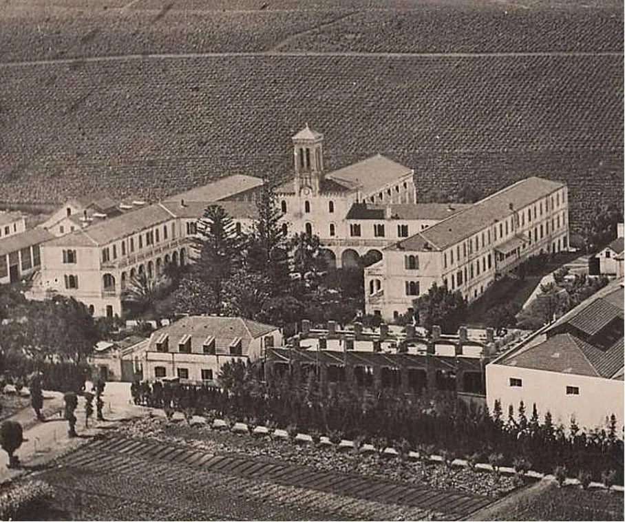

Moederklooster van de Witte Paters van Afrika in Algiers.

Vervolgens studeerde hij filosofie en theologie in Carthago (Tunesië)In Carthago ging het echter mis. Afrika bleek niet zijn bestemming en op medisch advies keerde Bert Timmers terug naar Nederland.

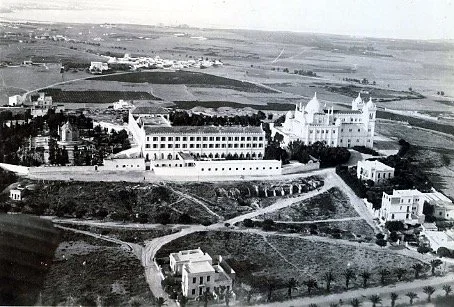

Het semenarie in Carthago, waar Bert Timmers studeerde

Hij voltooide zijn studie aan het grootseminarie van Haaren en werd op 20 december 1930 tot priester gewijd. Daarmee kwam een einde aan zijn missie­droom, maar niet aan zijn roeping, die een nieuwe richting kreeg.

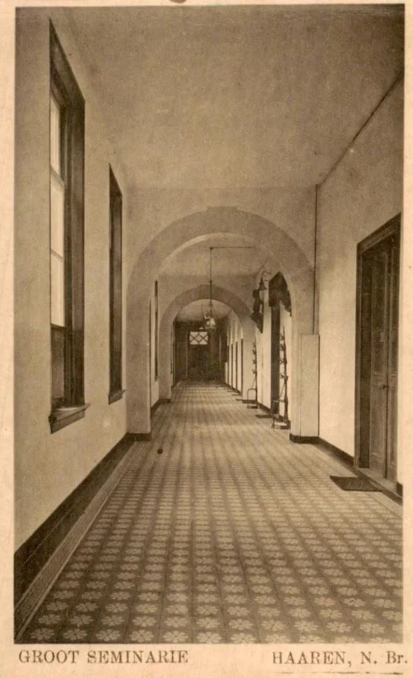

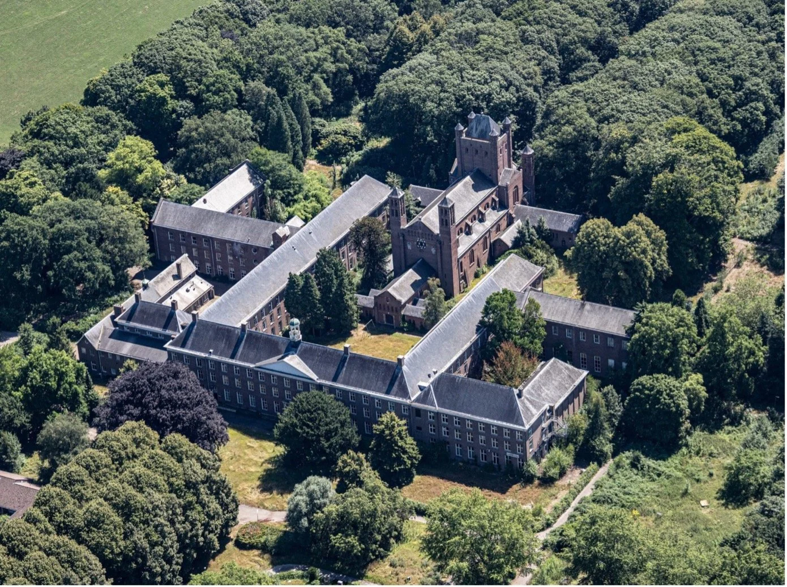

Het groot semenarie in Haaren voor opleiding van priesters in bisdom 'sHertogenbosch

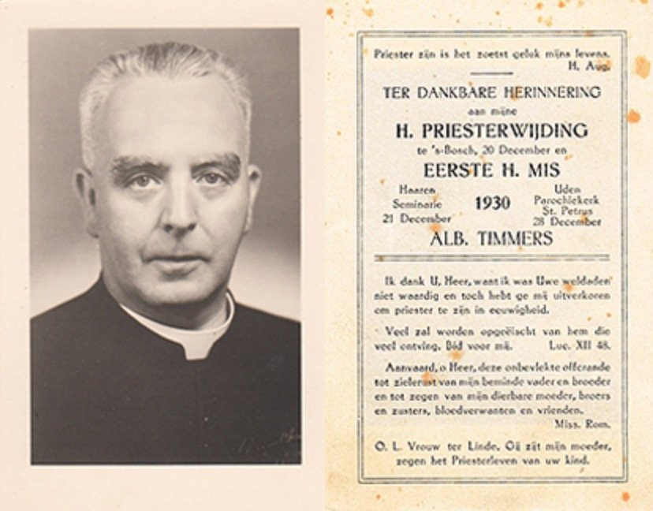

Coll A.V.

Na zijn priesterwijding begon hij zijn loopbaan als tweede kapelaan in Budel/Gastel, waarna hij kapelaan werd in Leende. Van 1938 tot 1943 werkte hij in Geffen. In 1948 volgde zijn benoeming tot pastoor van Helenaveen, een dorp dat op dat moment nog zwaar getekend was door de Tweede Wereldoorlog. De kerk was verwoest, de school verdwenen en ook het klooster lag in puin.

In Helenaveen groeide pastoor Timmers uit tot de bouwpastoor van de naoorlogse wederopbouw. Na de verwoesting van kerk, pastorie en klooster in november 1944 had de parochie tijdelijk onderdak gevonden in een noodkerk, gevestigd in de lagere school. Vastberaden begon hij kort na zijn komst, in 1948, met de voorbereidingen voor de bouw van een nieuwe kerk. Architect Jos Deltrap tekende het ontwerp. Op 1 oktober 1951 werd de kerk plechtig geconsacreerd door bisschop Mgr. Mutsaerts van ’s-Hertogenbosch, met pastoor Timmers zelf aan zijn zijde.

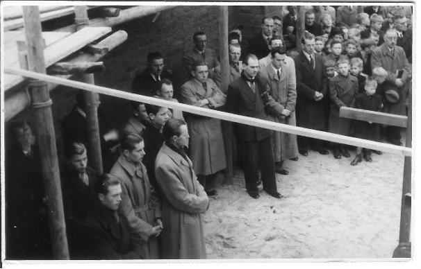

Foto eerste steen legging Kerk met de klas van meester Theelen

Diezelfde dag verhuisde de pastoor samen met zijn zus Anneke vanuit de noodpastorie, slechts een deur verder, naar zijn nieuwe onderkomen. Helenaveen was in die jaren nog een overwegend agrarisch dorp, bevolkt door tuinders en boeren. Hier kwam Timmers’ eigen boerenafkomst weer duidelijk naar voren.

De oude kloostertuin werd door hem opgeruimd en opnieuw ingericht. Hij plantte er appelbomen en liet paden aanleggen, zodat hij er dagelijks kon brevieren. Twee houten open theehuisjes, ooit gebruikt door de nonnen, bleven nog tot in de jaren zestig staan tegen de westelijke schutting. In een ervan hield de pastoor zijn bijen. De noodkerk aan de Oude Peelstraat kreeg intussen een nieuwe bestemming als parochiehuis.

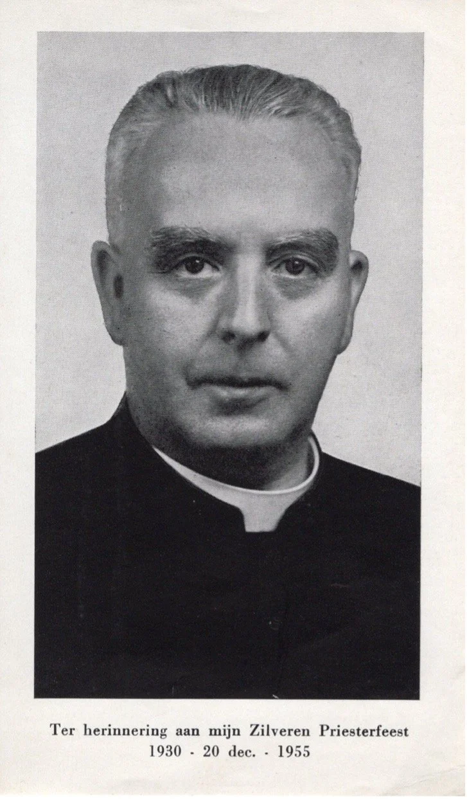

Pastoor Timmers gebruikte steeds de foto van zijn wijding in 1930

In 1960 ging pastoor Timmers nog rigoureuzer te werk. De Engelse landschapstuin liet hij omploegen, de vijver werd gedempt en het terrein werd ingeplant met zwarte bessenstruiken. Coniferen, rododendrons en andere struiken verdwenen op de brandstapel. De grond moest immers geld opbrengen. Voor een gulden per middag liet hij schoolkinderen helpen met schoffelen en met het plukken van kersen en bessen. Gekleed in zijn zwarte, opgeknoopte pij hanteerde Timmers zelf ook de schoffel en de hak.

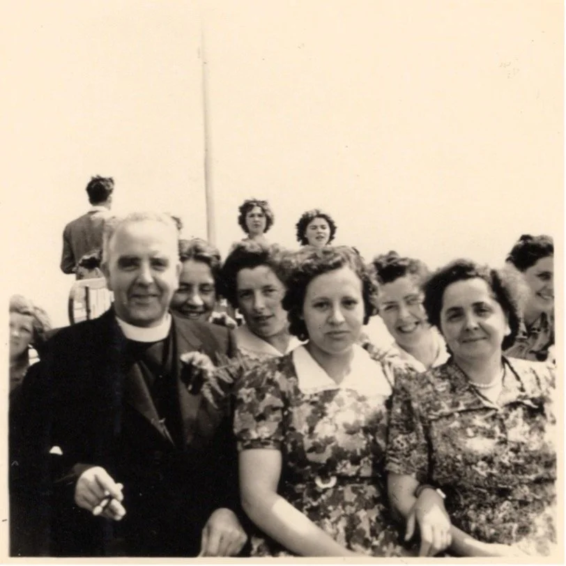

UItje met de poetsters van de kerk.

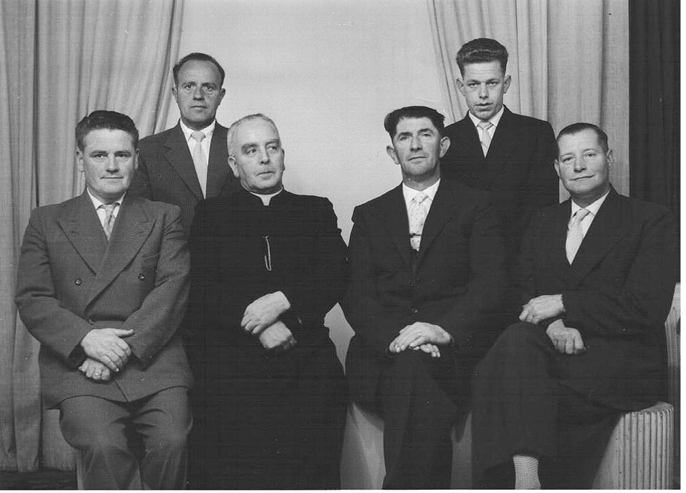

Geestelijk adviseur van de voetbalvereniging

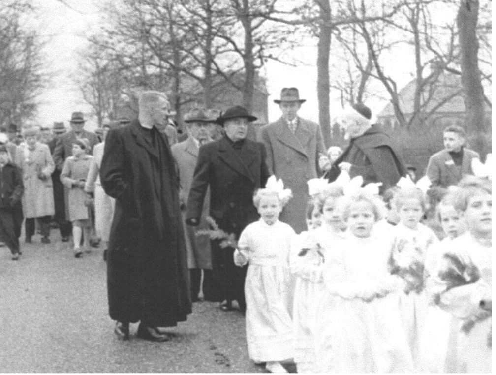

Processie met meisjes als bruidje

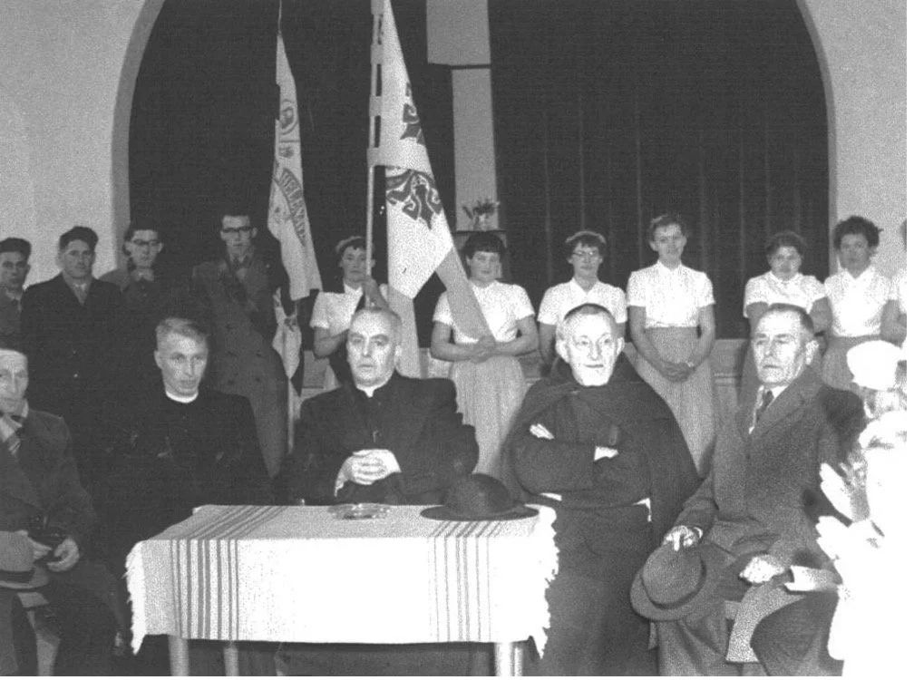

Feest in het parochiehuis nu de Gouden Helm

Boerenzoon, Bert Timmers was voorbestemd tot iets groots, maar hij eindigde als een eenvoudige pastoor in Helenaveen waar hij zo goed mogelijk zijn best heeft gedaan, getuige zijn woorden op zijn gedachtenisprentje.

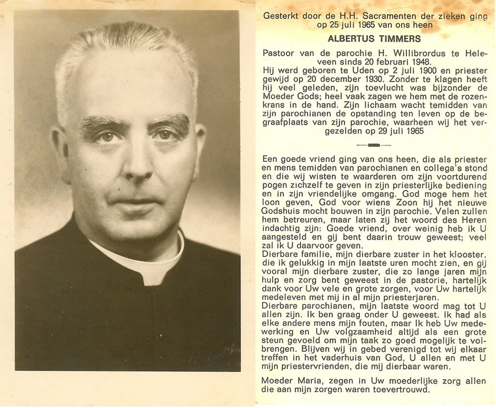

coll A.V.

Pastoor Timmers overleed na een langdurig ziekbed op 25 juli 1965 in het ziekenhuis van Venlo.

Bronnen:DeurnewikiCollectie Gerard VeldhuizenCollectie André Vervuurt

Jvw 26-12-2025
