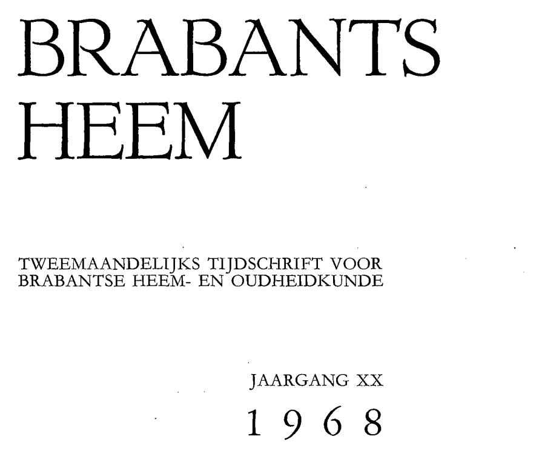
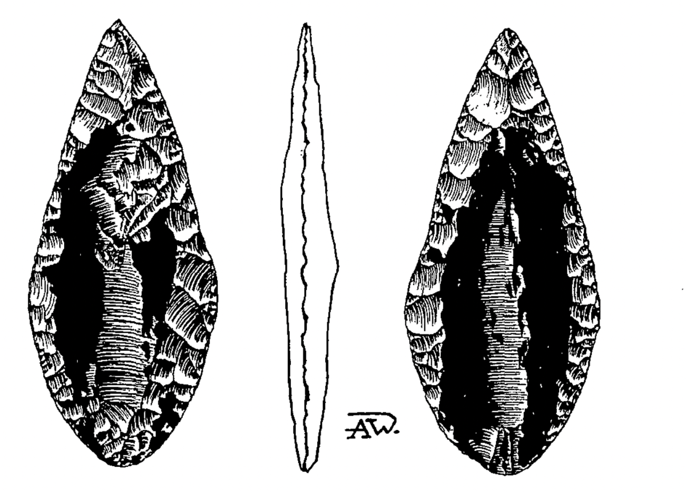

# pijlpunt

> Bron: helenaveenvantoen.nl

EEN VUURSTENEN PIJLPUNT MET BITUMINEUZE SCHACHTINGSSPOREN UIT DE PEEL

Bij het graven van een visvijver tussen Griendtsveen en Helenaveen, ongeveer 500 meter ten westen van de Helenavaart werd in 1957 een Neolithische pijlpunt gevonden, die aan beide zijden nog zeer duidelijke schachtingsporen vertoonde in de vorm van een zwarte pekachtige kittingsstof. (Op de tekening zwart aangegeven)

De heer Bellernakers uit St. Anthonis, die het artefakt kon verwerven en het bereidwillig geruime tijd ter studie aan ons afstond, gaf de volgende bijzonderheden:

De pijlpunt werd aangetroffen in het terzijde van de vijver gestorte zand. Dit zand was bedekt met een herhaaldelijk vergraven hoogveenpakket van ongeveer anderhalve meter dikte. Het is dus niet met zekerheid te zeggen op welke diepte het artefakt in de oorspronkelijke zandbodem heeft gelegen.

Wel is het zeker dat de zandgrond ter plaatse, nadat de pijlpunt er in terecht gekomen is, onberoerd is gebleven tot het moment dat de vijver gegraven werd. De vijver is uiteraard steeds met water gevuld geweest, zodat het nooit mogelijk was een nader onderzoek in te stellen.

Overduidelijk is - vooral op de rechts afgebeelde zijde van de punt – de vorm van de houten pijlschacht nog te zien. Vroegere experimenten hadden ons al geleerd dat bij dergelijke brede bladvormige pijlbewapeningen een fixatie van de stenen punt door insnoering vrijwel onmogelijk was. De praehistorische mens heeft dus een of ander kittingsmateriaal moeten gebruiken. Proeven met hars en ingedikt berkensap gaven toen geen bruikbare resultaten. Het idee dat in deze streken bitumineuze stoffen gebruikt zouden zijn, leek ons toen problematisch.

Om meer zekerheid te krijgen over de aard van het gebruikte materiaal liet Dr. J. Bakker op een der Philips laboratoria te Eindhoven een infrarood absorptiespectrum opnemen, dat een eerste aanwijzing gaf met een bitumineuze substantie te doen te hebben. De zwavelbepaling die Dr. Claassen daarna nam, staafde deze veronderstelling.

De vraag die daarna onmiddellijk opkwam was deze: Hoe kwam de Neolithische- of bronstijdmens in deze streken aan dergelijke asfaltachtige produkten ?

Als mogelijkheden zien wij slechts:

1. Kalkschalies

Deze kalkschalies, die in tal van streken in Europa overvloedig voorkomen, o.a. in Westfalen, geven bij verhitting een minerale olie (shale-oil) af, die blootgesteld aan de lucht, vrij spoedig overgaat in een pek-achtige substantie. Het zou interessant zijn na te gaan hoe het absorptiespectrum van deze „shale-oils" uit zou vallen na een versneld verouderingsproces onder invloed van zuurstof.

2. Asfalt

Asfalt komt onder allerlei omstandigheden tot stand. De samenstellende componenten, in hoofdzaak: koolstof, waterstof en zuurstof in allerlei verhoudingen, kunnen overal waar planten voorkomen asfalt vormen, ingeschakeld in zand, klei, veen of kalk. Bekend zijn deze vormingen vooral in Trinidad, het Dode Zee-gebied, Albanië enz. Maar ook dichter bij huis zijn asfaltafzettingen bekend in zand- en kalkgesteenten; o.a. in Bentheim (Gasselt) en Munster (Darfeld). De Heer P. van der Lijn uit Bennebroek is van mening dat, alhoewel asfalt als zwerfsteen nog niet is aangetroffen, het in-een blok niet onmogelijk is, al zal het als zodanig niet zo vlug worden opgemerkt.

Doppleriet

Doppleriet (Potonie spreekt van Saprokol) is een kolloïdale gel, ontstaan door humuszurenbinding van o.a. C, H en O, die opdroogt als een harde, zwarte, glanzende massa met een schelpvormige breuk. Zelf trof ik deze stof eens aan in de Peel venen, terwijl van der Lijn doppleriet meer alen in de Drentse venen heeft verzameld. (Mondelinge mededeling)

Gezien de plaats van herkomst, temidden van de uitgestrekte Peelvenen, waarvan een gedeelte reeds zeer oud is, zou het gebruik van doppleriet het meest aannemelijk zijn. Toch zijn de mogelijkheden van shale-oils en asfalt niet uit te schakelen. De pijlpunt in kwestie is als type zowel uit het Neolithicum in diverse cultuurfasen, als uit de bronstijd bekend. Oostelijke relaties - met inbegrip van handelsbetrekkingen - zijn namelijk reeds

jarenlang een bekend gegeven.

Experimenten met een pijlpunt van gelijk type toonden aan dat met onze in overvloed aanwezige asfaltbitumen voor wegenbouw op een zeer eenvoudige en snelle manier een goede schachting in een houten pijl te maken is.

Lent. OB. A.M.Wouters
