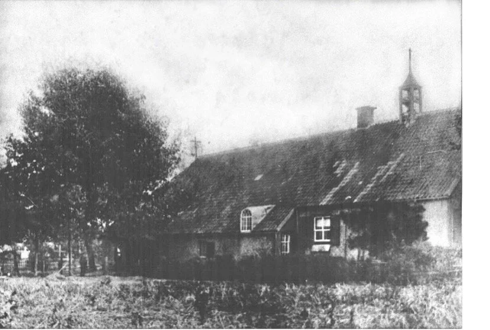
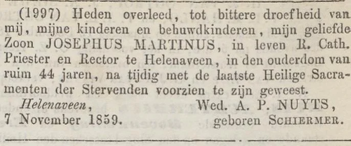
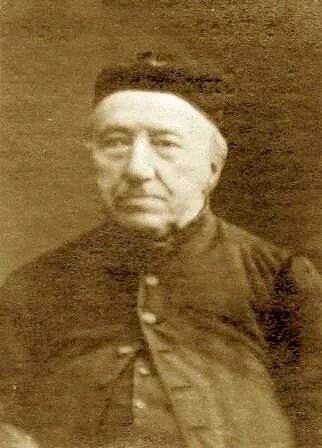
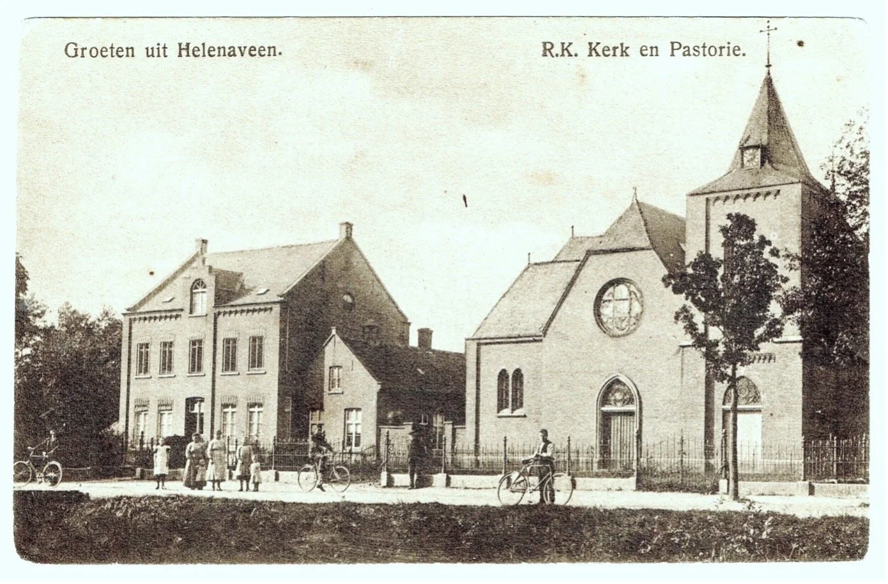
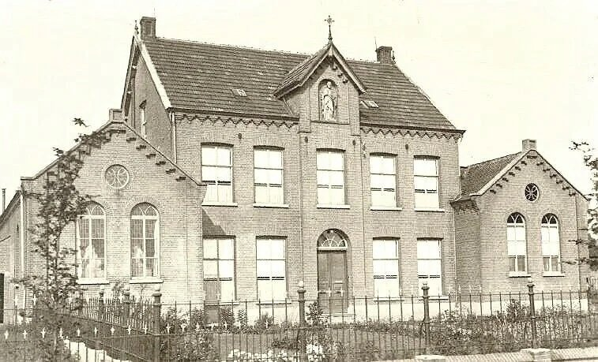
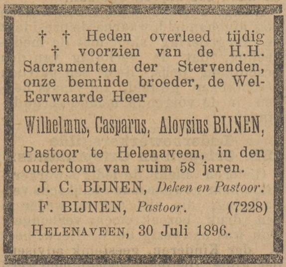

# rectoraat

> Bron: helenaveenvantoen.nl

### Het begin van de Katholieke Kerk in Helenaveen

Van Rectoraat naar zelfstandige parochie

Helenaveen had vanaf het begin een gemengde bevolking. Mensen kwamen uit allerlei delen van Nederland. Naast een kleine vaste groep plaatselijke werknemers, kwamen er elk voorjaar extra arbeiders naar de “Oude Peel”. Dat waren vooral turfstekers uit de omgeving van Hannover (toen “Poepen” genoemd) en later ook uit Drenthe (“Oliekonten” genoemd). Zij woonden in eenvoudige houten keten.

De oprichters van “De Maatschappij” bekommerden zich om de problemen van deze pioniers. Er kwam al snel medische zorg: twee keer per week hield een arts spreekuur in de nieuwe kolonie.

Na een paar jaar kwam er ook onderwijs. In 1859 werd de eerste school gebouwd, en meester Clemens de Haere begon er als eerste onderwijzer van Helenaveen.

Ook de geestelijke verzorging kreeg aandacht. De bevolking bestond deels uit vaste bewoners, maar werd elk jaar aangevuld met vele seizoensarbeiders.

De ongeveer twintig protestantse bewoners vielen onder de dominee van Deurne. Hij kreeg een kamer in een van de weinige stenen huizen en hield daar bijna elke zondag een dienst. In 1859 werd een houten kerkje gebouwd. De protestantse gemeenschap groeide tot zo’n 25 vaste leden. In 1863 kregen zij een eigen predikant, en vijf jaar later konden ze dankzij collectes, loterijen in het hele land en een stuk grond van “De Maatschappij” een nieuwe kerk en pastorie in gebruik nemen.

De katholieke inwoners hoorden officieel bij de parochie van Liessel, maar velen gingen liever naar de dichterbij gelegen parochies van Meijel of later Koningslust. Daar werkte pater Deerman, die zich bijzonder inzette voor de katholieken in Helenaveen en daardoor erg geliefd werd.

Toch was het door de grote afstanden niet vol te houden om de snel groeiende katholieke gemeenschap van buitenaf te verzorgen. Veel mannen woonden bovendien ver van hun gezin en hadden extra behoefte aan sociale en religieuze steun.

Daarom ontstond de wens voor een eigen kerk in Helenaveen. In 1857 kwam die wens uit: op 15 september kreeg pastoor Bijnen van Liessel bericht van de bisschop van ’s-Hertogenbosch dat Helenaveen een eigen rectoraat werd, onder de parochie Liessel. Het rectoraat werd gewijd aan Sint-Willibrordus.

Rond die tijd bestond Helenaveen uit enkele stenen huizen en zo’n veertig keten, waarvan ongeveer de helft door katholieken werd bewoond.

### Rector Josephus Martinus Nuijts (1857–1859)

### Met de oprichting van het rectoraat in 1857 kreeg Helenaveen ook zijn eerste rector

Josephus Martinus Nuijts werd op 10 september 1857 benoemd tot de eerste rector van het nieuwe rectoraat Helenaveen, dat toen nog onder de parochie Liessel viel. Zijn salaris bestond uit 1% van de arbeiderslonen.

In een brief aan bisschop Zwijsen beschreef rector Nuijts zijn eerste indrukken van het dorp en de mensen in de Peel:

“Het volk in de Peel is totaal verwaarloosd. Ik wandelde twee en een half uur van Liessel naar het Veen, zag de hutten en werd als door een donderslag getroffen. (…) De morgen erna waren alle hutten versierd met groen en bloemen, alsof koning Willem III zelf zijn intocht deed.”

De rector was diep geraakt door de armoede, maar ook door de hartelijkheid van de bewoners. Hij bezocht de mensen in hun hutten om hun vertrouwen te winnen en sprak hen moed in tijdens hun zware werk op het veld.

Op 15 oktober 1857 zegende rector Nuijts de eerste noodkerk in en droeg daar de eerste Heilige Mis op. In een brief aan zijn bisschop schreef hij:“Tien uren sloeg de klok van het veen, Monseigneur! En alles was herschapen; al de hutten waren opgesierd en uitgedost met groen en bloemen alsof Willem III zijn intrede zou doen... In de kerk werden wij verrast: alles was prachtig versierd, de chraniums (kronen) sierden de wanden, en bewondering en ontroering vervulden alle harten. Een diepe stilte hing in de kerk toen voor het eerst het onbloedig offer op dit verlaten oord aan God werd opgedragen.”

De kerk bevond zich aan de huidige Fruitweg (toen adres H.137). Het gebouw was afgestaan door veenbaas Brouwer. Het voorhuis diende als woning voor de rector, het achterhuis was ingericht als kerkruimte.

Zijn laatste jaren

Na de feestelijke start voelde rector Nuijts steeds sterker de eenzaamheid van zijn werkplek in de Peel. Slechts twee jaar na zijn komst, op 7 november 1859, overleed hij op 45-jarige leeftijd aan wat toen werd genoemd “de zenuwe zinkenkoorts”, vermoedelijk buiktyfus.

Ter nagedachtenis aan deze pionier kreeg Helenaveen later een straat die zijn naam draagt: de Rector Nuijtsstraat — opmerkelijk genoeg gelegen naast de protestantse kerk en pastorie.

### Rector Theodorus Ludovicus van den Eynde (1859–1873)

Na het overlijden van rector Nuijts in 1859 werd Theodorus Ludovicus van den Eynde benoemd tot zijn opvolger. Onder zijn leiding groeide de katholieke gemeenschap in Helenaveen verder en kreeg ze stap voor stap meer zelfstandigheid.

Vanaf maart 1861 mochten de inwoners van Helenaveen voor het eerst Pasen vieren in hun eigen kerk. Voor trouwerijen moesten ze echter nog altijd naar Liessel, want daar hoorde het rectoraat officieel nog bij.

Een groeiende gemeenschap

De kleine noodkerk die onder Nuijts was gebouwd, bleek al snel te klein voor de snel groeiende bevolking. Rector Van den Eynde en zijn kerkmeesters wilden graag een nieuwe, grotere kerk bouwen, maar dat bleek financieel moeilijk.

De arbeiders droegen nog steeds 1% van hun loon af om de kerk te ondersteunen, maar dat geld ging vooral naar het salaris van de rector. Slechts een bescheiden reserve van ongeveer 2.000 gulden was beschikbaar voor de bouw.

Onenigheid over de bouw

Er ontstond bovendien onenigheid met “De Maatschappij”, de organisatie die de veenkolonie beheerde. De vraag was: wat moest eerst gebouwd worden — de kerk of de pastorie?Rector Van den Eynde wilde beide tegelijk aanpakken, maar dat bleek niet haalbaar. De Maatschappij vond dat de bouw van de pastorie nog wel even kon wachten.

Hoewel de bouwplaats rond 1868 al was uitgegraven en met zand opgehoogd, bleef de bouw verder stil liggen. Het zou nog jaren duren voordat er opnieuw beweging in kwam.

Rector Van den Eynde

### Rector Franciscus Cornelius van der Heyden (1873–1878)

In 1873 volgde Franciscus Cornelius van der Heyden rector Van den Eynde op. Ook hij vond dat er eerst een pastorie moest worden gebouwd voordat men met de kerk verder kon. Daardoor liep de bouw opnieuw vertraging op.

Toch kwam er onder zijn leiding langzaam vooruitgang in de financiering. De Maatschappij Helenaveen beloofde een renteloze lening van 10.000 gulden.

In maart 1876 schreef Van der Heyden hoopvol aan het bisdom dat “de stenen morgen of overmorgen zullen komen”. En inderdaad: op 16 juni 1876 werd de eerste steen gelegd. Later dat jaar was het metselwerk al tot halverwege de ramen opgetrokken.

Toch verliep de bouw moeizaam. Er bleven meningsverschillen over geld en eigendomsrechten, waardoor de werkzaamheden regelmatig stil kwamen te liggen.

In 1878 vertrok Van der Heyden naar Macharen, zonder de voltooiing van de kerk nog mee te maken.

### Rector Petrus van Beek (1878–1880)

Na het vertrek van Van der Heyden werd Petrus van Beek benoemd tot nieuwe rector. Hij leidde het rectoraat slechts twee jaar, maar probeerde de bouw van de kerk toch gaande te houden.

Er werd gewerkt wanneer er geld beschikbaar was, en Van Beek deed zijn best om via inzamelingsacties en circulaires extra steun van de parochianen te krijgen.

Hoewel hij geen grote stappen kon zetten, legde hij wel de basis voor de latere voltooiing van de kerk onder zijn opvolger.

### Rector Wilhelmus Caspar Aloysius Bijnen (1880–1896)

In 1880 kwam Wilhelmus C. A. Bijnen – een neef van pastoor Bijnen uit Liessel – naar Helenaveen. Hij moest verder bouwen op het moeizame werk van zijn voorgangers, maar slaagde er uiteindelijk in om hun plannen te voltooien.

In 1882 werden zowel de nieuwe kerk als de pastorie voltooid en officieel in gebruik genomen. Daarmee kwam, na veertien jaar bouwen, eindelijk een einde aan een periode vol vertragingen en tegenslagen.

De gemeenschap groeide daarna gestaag verder. In 1884 verrees er een zusterklooster met een meisjesschool. Al in 1889 zaten er zo’n 60 meisjes op school — een teken dat Helenaveen zich begon te ontwikkelen tot een hechte gemeenschap.

RK Klooster met links de kapel van de zusters en rechts de kleuterschool (foto). Rechts achter het klooster lag de RK meisjesschool.

In datzelfde jaar vond Bijnen dat de tijd rijp was om Helenaveen tot een zelfstandige parochie te verheffen. In zijn brieven aan de bisschop van ’s-Hertogenbosch wees hij erop dat het dat een eigen parochie ook belangrijk was voor het zelfvertrouwen van de katholieke gemeenschap, zeker naast de protestanten.

### Rector bijnen wordt de eerste pastoor van 1891 tot 1896

De bisschop stemde in met zijn verzoek. Op 1 maart 1891 werd Helenaveen officieel een zelfstandige parochie, en rector Bijnen werd haar eerste pastoor.

Hij bleef tot zijn dood in 1896, op 58-jarige leeftijd, in Helenaveen.Sinds de komst van Jan van de Griendt en zijn pioniers waren toen 38 jaar verstreken. Het rectoraat had 34 jaar bestaan voordat Helenaveen eindelijk kerkelijk zelfstandig werd.

jvw 9-11-2025

Bronnen

Kroniek van Liessel, Mr. G.A. EngelsAndré VervuurtDeurneWikiDelpher
