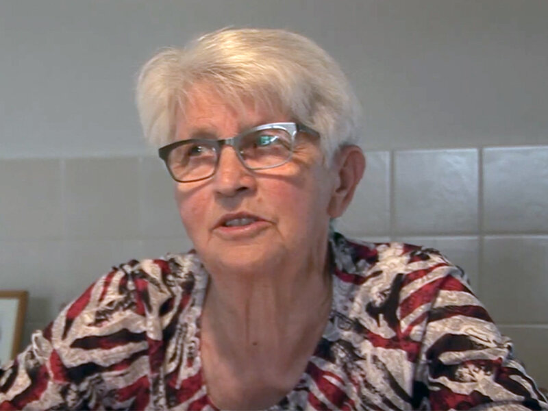

# riki-bakker

> Bron: helenaveenvantoen.nl

# Riki bakker

## Riki Bakker

75 jaar geleden moesten mensen in Helenaveen op stel en sprong evacueren op 28 september 1944. Bij Riki Bakker kwamen Duitse soldaten ’s avonds aanzeggen dat ze onmiddellijk moesten vertrekken. Kijk hier haar verhaal of lees het artikel in het ED: Aangrijpend en huiveringwekkend: de evacuatie van de familie Bakker uit Helenaveen.
