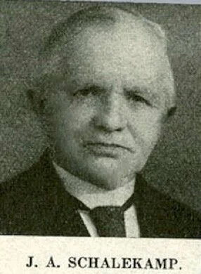

# schalekamp-kermis

> Bron: helenaveenvantoen.nl

### Dominee Schalekamp vertelt over Helenaveen kermis.

(Hoe hij de protestantse jongens en meisjes bij de kermis weg probeerde te houden)

Toen ik al eenige maanden in Helenaveen was, vernam ik dat tegen Koninginne-verjaardag (2 augustus) altijd kermis werd gehouden. Die kermis was echter meer 'n eetkermis met dansgelegenheden, dan een dronkemanspret. Men zag in die dagen niet meer dronken lieden Ioopen dan op een gewonen Zondag. In Noord Brabant en Limburg kan men bij elke Roomsche kerk of kapel, eene of meer kroegen vinden.

Ook in Helenaveen was dat zoo, en zag men Zondags, lang na kerktijd, nogal eens verschillende Roomsche kerkgangers met onvasten tred huiswaarts keeren. Eene ongelooflijke hoeveelheid rund- en varkerisvleesch werd in die kermisdagen verslonden.

Twee groote danstenten werden dan, op 20 minuten gaans van elkander, ieder bij eene kroeg opgeslagen. 's Morgens om 9 uur werden ze opengesteld, en aan het eerste danslustige paar dat binnenkwam werd dan als prijs, gratis een glas wijn aangeboden, zoodat men op dat uur zich al verdrong bij zoo'n tent, om 't eerst binnen te zijn.

De pastoor hield Zondags te voren een sermoen over die kermis, met allerlei vermaningen. 's Avonds na 7 uur mochten geen vrouwen of meisjes zich meer in de danstent of langs den weg bevinden. Roomsche jongens mochten geen protestantsche meisjes, en roomsche meisjes geen protestantsche jongens nemen, om kermis mede te houden, enz. enz. en 't slot van de sermoen was gewoonlijk, naar een roomsche mij eens 25 verzekerde: „En nu wensch ik jelui verder 'n pleizierige kermis toe."

Toen ik vernam dat ook vele protestanten gewoon waren om meé kermis te vieren, nam ik mij vast voor, dat geen enkel lid mijner gemeente ditmaal ongewaarschuwd ter kermis zou gaan. Ik bezocht tevoren al de gezinnen, hoe ver verspreid ze ook woonden.

De Heere gaf mij genade om ze met den ernst der liefde te wijzen op 't verkeerde, 't zondige en onheilige van dat kermisgedoe, en tot eer van mijne Drentsche gemeenteleden mag ik verklaren, dat de ouderen zich wel lieten gezeggen — al waren er booze tongen die zeiden, dat verschillenden dan toch wel naar naburige kermissen gingen.

Maar de jongeren? Dat ging niet zoo gemakkelijk. Nu had ik echter een chr. jongelingsvereeniging opgericht. En nu wist ik de jongelui te bewegen, 's Maandags, den eersten kermisdag, naar Rotterdam te gaan, en Dinsdagsavonds jaarfeest te vieren, op voorwaarde echter dat zij dan Zaterdags niet ter kermis zouden gaan. (Die kermis werd gehouden Zaterdags, Maandags en Dinsdags.) Zoo hadden dus de protestantsche meisjes geen jongens om mede uit te gaan, en konden hare ouders hen dus gemakkelijk thuis houden.

't Volgend jaar voelden de jongens er niet veel voor, om weer naar Rotterdam te gaan; we zouden op den laatsten dag der kermis echter wel weer jaarfeest houden, en zij beloofden mij, niet naar de kermis te zullen gaan. Om hen evenwel alle aantrekkelijkheid daartoe te ontnemen, noodigden mijne vrouw en ik al de protestantsche meisjes van boven de 16 jaar, Maandags van de kermis, uit om een dag bij ons op visite te komen; zij mochten zich dan vermaken met schommel en wipplank, wat ik voor mijne kinderen had laten maken. Ook had ik in tuin en boomgaard ruim zeventig vruchthoornen, waarvan zij naar hartelust mochten genieten, terwijl zij 's avonds onthaald werden op chocolademelk enz. Natuurlijk kon ik niet elk jaar zoo iets doen, — wel jaarfeest houden — doch dat behoefde ook niet meer; zij hadden kermishouden in mijne gemeente afgeleerd, en ik dankte er den Heere voor. Hoogstens twee of drie protestantsche jongens, die onverschillig waren, gingen nog wel, doch als zij van de eene danstent naar de andere gingen, maakten zij, om niet langs mijne pastorie te komen, een grooten omweg.

De moeder van een zoo'n jongen vertelde, dat haar zoon vijf keer per dag kwam om droog goed aan te trekken, omdat hij doornat was van 't zweeten door het dansen. 't Was ook maar eens per jaar kermis! „Zoo'n jongen moet toch wat hebben." Toch is ook dat gezin later nog veel ten goede veranderd, ook hun danslustige zoon. Ja, de Heere sterkte mij genadiglijk, en zegende kennelijk mijn arbeid, wat ook in de gemeente zeer werd gewaardeerd.

JvW
